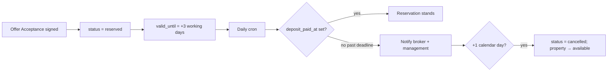

# Reservation lifecycle (stage-side, CY Sales Automation)

> **Scope**: Sharp SIR Cyprus opportunity pipeline in
> `matrix-qobrix-sales-automation-v1-0` (app DB `rpoeezssicpzexarmwqq`).
> This document describes the **stage-side** reservation model. It does
> **not** write RESO `StandardStatus → Active Under Contract` yet —
> that remains the future refinement in
> [`ADR-029`](../../../architecture/decisions/ADR-029.md).

## Divergence from ADR-029 (explicit)

ADR-029 D1 lists "Reservation + deposit" as a *future, optional*
canonical write (`Active Under Contract`). Until `cdl-listing-lifecycle`
gains a `reserveListing` action, reservation **lives stage-side only**:

| Concern | Lives where | Notes |
|---|---|---|
| Opportunity reservation form / checkboxes | App DB `public.reservations` | Stage gate `viewing→contracting` |
| Unit lock (one active reserve per property) | Partial unique index on `reservations(property_id) WHERE status='reserved'` | Complements per-opportunity unique index |
| Mirrored listing status | App DB `properties.status = 'reserved'` | Ops email still asks a human to set Qobrix Under Offer |
| Canonical CDL listing status | Unchanged | No `Active Under Contract` write |

When the CDL action lands, this doc's stage-side rules remain the UX
contract; the CDL write becomes an additional side-effect.

## Visibility (colleagues vs client)

| Surface | Behaviour |
|---|---|
| Matching / Properties / Listings (brokers) | Reserved units **stay visible** next to Available. Badge = Reserved. Overlay uses `reserved_unit_ids` when Qobrix still says `available`. |
| Client shortlist (`collection_items`) | Cannot add a reserved unit (`listing_reserved`). |
| Public share link | Reserved units stripped at create time and again on `collection-share-read` / `item-read`. |
| Public marketing website | Out of band for this app. Stage-side sets `properties.status = 'reserved'`; website/Qobrix Under Offer still need the existing ops path until CDL `Active Under Contract` lands. |

Cancel / deposit-deadline lift restores `properties.status = 'available'`.

## Document trail (replaces buyer/seller agreed)

| Checkbox | Column | Effect |
|---|---|---|
| Offer Acceptance signed | `offer_acceptance_signed_at` | Locks the unit (`status='reserved'`); starts the deposit clock |
| Reservation Agreement signed | `reservation_agreement_signed_at` | Required for Contracting |
| Reservation Deposit Paid | `deposit_paid_at` | Required for Contracting; clears the deposit deadline |
| Reservation price | `opportunity_value` | Required for Contracting |
| Signed Offer Acceptance Form | `offer_acceptance_document_path` (bucket `reservation-documents`) | Upload |

Legacy `client_confirmed_at` / `seller_confirmed_at` are backfilled into
the new columns and kept in sync for one release; new UI writes the new
columns.

## Three-working-day deposit deadline

- Working days skip Sat/Sun (`public.add_working_days`). Cyprus public
  holidays are out of scope unless asked.
- Scanner: Edge Function `reservation-deposit-deadline`, scheduled daily
  via `pg_cron` → `pg_net`.
- Notifications: `public.notifications` rows for the opportunity's
  assigned broker and optional management SSO ids
  (`RESERVATION_MANAGEMENT_USER_IDS`). The legacy hardcoded ops email
  (`reservation-status-email` → `slobov@…`) remains and also writes an
  in-app notification to the broker.

## Stage gate

`evaluate_stage_readiness(..., 'viewing->contracting')` requires an
active reservation with:

- `offer_acceptance_signed_at`
- `reservation_agreement_signed_at`
- `deposit_paid_at`
- `reserved_on`
- `opportunity_value`

Miss code remains `reservation.confirmed`.

## Source of truth / migrations

Owned by the Sales Automation app repo:

- `supabase/migrations/20260806140000_reservation_document_trail.sql`
- UI: `ViewingOutcomesDialog.tsx`, `ReservationCard.tsx`
- EFs: `reservation-deposit-deadline`, `reservation-status-email`
