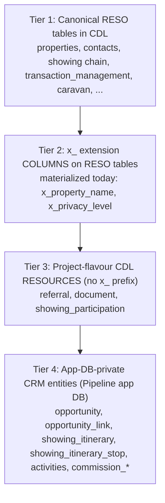
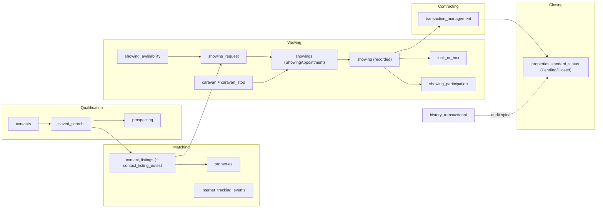
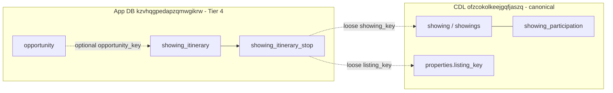

# RESO DD 2.0 → CRM Opportunity Lifecycle: Existing Model, Target Model & Modification Plan

**Version**: 1.1  
**Date**: 19 June 2026  
**Context**: Multitenant real-estate CRM (`matrix-pipeline`) on the Sharp Matrix platform.  
**Purpose**: Verify that the RESO Data Dictionary 2.0 → Opportunity-lifecycle mapping is canonically correct against what is **actually built** in the CDL, reconcile a proposed 24-resource model against reality, and provide an **actionable modification plan** (add / change / skip per resource).

This is a **planning/decision document**. It specifies what to modify *if needed*; it does not itself apply schema changes. Any change executes separately and lands in the owning repo per the `cursor-git-handoff` rule (CDL → `matrix-platform-foundation/supabase-cdl/`, app → `matrix-pipeline-2-0`).

---

## 1. Executive Summary

A proposed "final model" selected **24 resources** for the Opportunity lifecycle (Qualification → Matching → Viewing → Contracting → Closing): 1 multitenant foundation (OUID), 20 core RESO DD 2.0 resources, plus 2 extensions (`Opportunity`, `ShowingItinerary`). This document verifies that proposal against the as-built platform.

**Verdict: the canonical mapping is sound, but four assumptions in the proposal diverge from how Sharp Matrix is actually built.**

1. **Storage is snake_case canonical, not PascalCase.** RESO `ListingKey` → `listing_key`, `ContactKey` → `contact_key`. RESO PascalCase is the *interop* name (RESO Web API / syndication), not the column name. See [reso-dd-kb canonical DBML](reso-dd-kb/wiki/dbml/canonical.dbml).
2. **`Opportunity` is not a CDL extension resource.** It is an **App-DB-private super-resource** (`opportunity` + `opportunity_link`) in the Pipeline app DB (`kzvhqgpedapzqmwgikrw`), and its **funnel stage is calculated, never stored** ([ADR-035](../architecture/decisions/ADR-035.md), [opportunity-model.md](opportunity-model.md)).
3. **`ShowingItinerary` is not a RESO/CDL resource — it is modeled as an App-DB-private (Tier 4) resource, exactly like `Opportunity`.** RESO DD 2.0 has no itinerary concept, and the canonical CDL already carries the **5-resource Showing chain** plus **`Caravan`/`CaravanStop`** (broker/network curated tours) with buyer linkage via **`showing_participation`** ([ADR-033](../architecture/decisions/ADR-033.md)). The CRM-specific buyer **viewing itinerary** (an agent grouping a single client's own showings into one outing) is a CRM-only construct with no canonical-sharing need, so it lives in the Pipeline app DB (`kzvhqgpedapzqmwgikrw`) as `showing_itinerary` (+ `showing_itinerary_stop`), accessed with the app `supabase` client under SSO-claim RLS — never via `cdl-write`/`cdl-read`. See §4 and §8.1.
4. **Five proposed resources are not implemented as CDL tables:** `OUID`, `Teams` (created then dropped), `TeamMembers`, `SocialMedia`, `InternetTrackingSummary`. Of these, **`SocialMedia` and `InternetTrackingSummary` are now scoped to be built** as canonical CDL (Tier 1) resources; **`OUID`, `Teams`, and `TeamMembers` are deferred (out of scope for now)**.

**Net finding: the lifecycle data model is substantially complete.** Of the 24 proposed resources, **19 are live in the CDL** and **`Opportunity` already exists at Tier 4**. The recommended build set is now **three resources**: `ShowingItinerary` (Tier 4, app DB — `matrix-pipeline-2-0`), plus `SocialMedia` and `InternetTrackingSummary` (Tier 1, canonical CDL — `matrix-platform-foundation/supabase-cdl/`). `OUID`, `Teams`, and `TeamMembers` are explicitly deferred.

The platform models "beyond RESO" needs through a **4-tier governance model** (§4), which the proposal collapsed into a single "extension" bucket.

A per-resource **PK/FK canonical verification** against the live CDL (§3) confirms the schema is RESO-aligned, with three **systematic, deliberate** deviations (surrogate `id` PKs, key-only FKs enforced in the app layer, non-RESO housekeeping columns) and a short list of **resource-specific deviations** worth review — notably `contacts.special_listing_conditions` (a stray Property field), `members.member_photo_url` (missing `x_` prefix), and `internet_tracking_events` field naming vs canonical `InternetTracking`. Full catalogue in §3.10.

---

## 2. Verification Methodology & Sources

The proposal was checked against three sources of truth, in order:

| Layer | Source of truth |
|---|---|
| Canonical RESO names / fields | [reso-dd-kb/USAGE.md](reso-dd-kb/USAGE.md) (41 resources, 1,745 fields) + [canonical.dbml](reso-dd-kb/wiki/dbml/canonical.dbml) |
| As-built CDL schema | [cdl-schema.md](cdl-schema.md) + `matrix-platform-foundation/supabase-cdl/migrations/` |
| Live CDL PK/FK/columns | `information_schema` + `pg_constraint` catalog queried on the CDL project `ofzcokolkeejgqfjaszq` (basis for §3 PK/FK verification + §3.10 deviations) |
| CRM lifecycle / Opportunity | [matrix-pipeline overview](../product-specs/matrix-pipeline/wiki/overview.md), [entities](../product-specs/matrix-pipeline/wiki/entities.md), [cdl-crud-contract.md](../product-specs/matrix-pipeline/cdl-crud-contract.md), [opportunity-model.md](opportunity-model.md) |
| Extensions & non-RESO entities | [platform-extensions.md](platform-extensions.md) + ADRs |
| Canonical process semantics | [canonical-processes/USAGE.md](../business-processes/canonical-processes/USAGE.md) |

Supabase projects referenced: CDL `ofzcokolkeejgqfjaszq`, Pipeline app DB `kzvhqgpedapzqmwgikrw`.

---

## 3. Part A — Existing Model: Per-Resource Canonical Verification (PK / FK + deviations)

Each live resource is verified against its RESO DD 2.0 canonical spec (`reso-dd-kb`) using the **actual** CDL schema (queried from the CDL project `ofzcokolkeejgqfjaszq`). The tables below show **only the PK and FK in detail**; the full canonical field list per resource is in §3.9 (comma-separated). Deviations are recorded in the **Verdict**.

Status legend: **Live** = table exists in CDL · **App-DB** = Tier 4 (Pipeline app DB) · **Dropped** = created then removed · **Not built** = never created.

### 3.0 Systematic deviations (apply to ALL live CDL tables)

These three patterns are platform-wide and deliberate; per-resource Verdicts below list **only deviations beyond these**.

- **G1 — Surrogate PK.** Every CDL table's PRIMARY KEY is a surrogate `id uuid`, **not** the canonical RESO business key. The RESO key (`contact_key`, `listing_key`, `member_key`, …) is retained as a regular (uniquely-indexed) column. Standard Supabase convention; safe for RESO interop because the business key is still present and unique.
- **G2 — Surrogate / unenforced FK.** Relational integrity is enforced only via surrogate columns (`contact_id → contacts.id`, `property_id → properties.id`, `office_id → offices.id`, `*_member_id → members.id`). Canonical key-based references that have **no** surrogate column (e.g. `showing_agent_key`, `caravan_key`, `prospecting.contact_key`/`saved_search_key`, `lock_or_box.showing_office_id`, `history_transactional.changed_by_member_key`) are carried as plain columns and are **application-enforced, not DB-FK-enforced**.
- **G3 — Platform housekeeping columns.** Most tables carry non-RESO ingestion/stewardship columns: `source_id`, `source_<resource>_key`, `content_hash`, `is_visible`, `is_deleted`, `deleted_at`, `locked_fields`, `raw`, `created_at`, `updated_at`. Governed infrastructure, not RESO DD fields (expected, not a defect).

### 3.1 Multitenant foundation

| # | Resource → CDL | Canonical PK · FKs | CDL PK · FKs | Verdict (beyond G1–G3) |
|---|---|---|---|---|
| 1 | OUID → — | `organization_unique_id_key`; — | none | **Not built.** Multitenancy via SSO JWT claims + `tenant_id` RLS ([ADR-012](../architecture/decisions/ADR-012.md)), not an OUID table. The missing OUID table is why every `*_system_id → ouid` canonical FK is unenforced platform-wide. |

### 3.2 Core RESO resources — all stages

| # | Resource → CDL | Canonical PK · FKs | CDL PK · FKs | Verdict (beyond G1–G3) |
|---|---|---|---|---|
| 2 | [Contacts](reso-dd-kb/wiki/agent-docs/resources/contacts.md) → `contacts` | PK `contact_key`; FK `owner_member_key→member`, `*_system_id→ouid` | PK `id`; FK none | **Deviation:** non-canonical column `special_listing_conditions` (a Property field — review/remove); `x_privacy_level` (governed extension, [ADR-023](../architecture/decisions/ADR-023.md)). Materialized subset (~36 of 84 canonical cols). |
| 3 | [Member](reso-dd-kb/wiki/agent-docs/resources/member.md) → `members` | PK `member_key`; FK `office_key→office`, `*_system_id→ouid` | PK `id`; FK `office_id→offices` | **Deviation:** non-canonical `member_photo_url` (no `x_` prefix — should be `x_member_photo_url` or dropped). `office_name` is canonical (`Member.OfficeName`). |
| 4 | [Office](reso-dd-kb/wiki/agent-docs/resources/office.md) → `offices` | PK `office_key`; FK `office_broker_key`/`office_manager_key`/`main_office_key→office/member`, `*_system_id→ouid` | PK `id`; FK none | No deviation beyond G1–G3 (broker/manager/main-office refs carried as keys, unenforced — G2). |
| 5 | Teams → `teams` (dropped) | PK `team_key` | — | **Dropped** (`20260504080000`). Deferred (§7). |
| 6 | TeamMembers → — | PK `team_member_key`; FK `team_key→teams`, `member_key→member` | — | **Not built.** Deferred (§7). |
| 7 | [HistoryTransactional](reso-dd-kb/wiki/agent-docs/resources/history_transactional.md) → `history_transactional` | PK `history_transactional_key`; FK `changed_by_member_key→member`, `*_system_id→ouid` | PK `id`; FK none | **Deviation:** extra surrogate `changed_by_member_id` (canonical uses `changed_by_member_key`, here unenforced — G2). |

### 3.3 Qualification → Matching

| # | Resource → CDL | Canonical PK · FKs | CDL PK · FKs | Verdict (beyond G1–G3) |
|---|---|---|---|---|
| 8 | [SavedSearch](reso-dd-kb/wiki/agent-docs/resources/saved_search.md) → `saved_search` | PK `saved_search_key`; FK `member_key→member` | PK `id`; FK none | No deviation beyond G1–G3 (`member_key` unenforced — G2). |
| 9 | [Prospecting](reso-dd-kb/wiki/agent-docs/resources/prospecting.md) → `prospecting` | PK `prospecting_key`; FK `contact_key→contacts`, `saved_search_key→saved_search`, `owner_member_key→member` | PK `id`; FK none | **Deviation:** extra surrogate `owner_member_id`. All three canonical links carried as keys, unenforced (G2). |
| 10 | [SocialMedia](reso-dd-kb/wiki/agent-docs/resources/social_media.md) → — (planned `social_media`) | PK `social_media_key`; FK none (polymorphic `resource_record_key`) | — | **Not built → build (Tier 1).** Promoted to a recommended CDL build (§7/§8). |

### 3.4 Matching → Viewing

| # | Resource → CDL | Canonical PK · FKs | CDL PK · FKs | Verdict (beyond G1–G3) |
|---|---|---|---|---|
| 11 | [Property](reso-dd-kb/wiki/agent-docs/resources/property.md) → `properties` / `properties_published` | PK `listing_key`; FK `list_agent_key`/`buyer_agent_key`/`co_*_agent_key→member`, `list_office_key`/`buyer_office_key`/`co_*_office_key→office`, `list_team_key`/`buyer_team_key→teams`, `*_system_id→ouid` | PK `id`; FK `list_agent_member_id`/`co_list_agent_member_id`/`created_by_member_id`/`modified_by_member_id→members`, `list_office_id→offices` | **Deviation:** non-canonical platform-audit FKs `created_by_member_id`, `modified_by_member_id`; **buyer/co-buyer agent+office and team FKs not present** (Teams dropped); `x_property_name` extension. Materialized subset of 512 canonical cols. |
| 12 | [ContactListings](reso-dd-kb/wiki/agent-docs/resources/contact_listings.md) → `contact_listings` | PK `contact_listings_key`; FK `contact_key→contacts`, `listing_key→property` | PK `id`; FK `contact_id→contacts`, `property_id→properties` | **Deviation:** non-canonical columns `relationship`, `notes` (not in RESO ContactListings). Canonical keys retained as columns. |
| 13 | [Media](reso-dd-kb/wiki/agent-docs/resources/media.md) → `property_media` | PK `media_key`; FK `changed_by_member_key→member`, `source_system_id→ouid`; polymorphic `resource_record_key` | PK `id`; FK `property_id→properties` | **Major (intentional) deviation:** `property_media` is a minimal **Property-scoped child**, not the canonical polymorphic Media resource — no `media_key`, no `resource_name`/`resource_record_key`; `media_order` vs canonical `order`; 7 cols vs ~37. Cannot attach to Member/Office/Contact. |
| 14 | [ContactListingNotes](reso-dd-kb/wiki/agent-docs/resources/contact_listing_notes.md) → `contact_listing_notes` | PK `contact_listing_notes_key`; FK `contact_key→contacts`, `listing_key→property` | PK `id`; FK `contact_listing_id→contact_listings` | **Deviation:** notes re-parented to `contact_listings.id` (canonical attaches via `contact_key`+`listing_key`, both still present); legacy non-canonical `note`, `created_by_member_key` duplicate canonical `note_contents`/`noted_by`. |
| 15 | [InternetTracking](reso-dd-kb/wiki/agent-docs/resources/internet_tracking.md) → `internet_tracking_events` | PK `event_key`; FK none | PK `id`; FK none | **Deviation:** business key is `internet_tracking_key` (canonical PK is `event_key`); several non-canonical/renamed fields — `event_type_other`, `actor_user_name`, `actor_ip_address`, `actor_user_agent`, `actor_is_anonymous_yn`, `object_mls_id` (vs canonical `actor_email`/`actor_ip`/`actor_id`/`user_agent`/`session_id`/`object_id`). Reduced set (~23 of 53). |
| 16 | [InternetTrackingSummary](reso-dd-kb/wiki/agent-docs/resources/internet_tracking_summary.md) → — (planned `internet_tracking_summary`) | PK `internet_tracking_summary_key`; FK none | — | **Not built → build (Tier 1).** Home for per-listing engagement counts; promoted (§7/§8). |

### 3.5 Viewing

| # | Resource → CDL | Canonical PK · FKs | CDL PK · FKs | Verdict (beyond G1–G3) |
|---|---|---|---|---|
| 17 | [ShowingRequest](reso-dd-kb/wiki/agent-docs/resources/showing_request.md) → `showing_request` | PK `showing_request_key`; FK `showing_agent_key→member` | PK `id`; FK none | No deviation beyond G1–G3 (`showing_key`, `showing_agent_key` unenforced — G2). |
| 18 | [Showing](reso-dd-kb/wiki/agent-docs/resources/showing.md) → `showing` | PK `showing_key`; FK `showing_agent_key→member` | PK `id`; FK none | **Deviation:** non-canonical `caravan_key` (Showing→Caravan link not in RESO Showing). |
| 19 | [ShowingAppointment](reso-dd-kb/wiki/agent-docs/resources/showing_appointment.md) → `showings` | PK `showing_appointment_key`; FK `showing_agent_key→member` (parent `showing_key`) | PK `id`; FK `property_id→properties`, `showing_agent_member_id→members` | **Deviation:** extra `listing_key`/`listing_id` + surrogate `property_id` (canonical appointment links to the listing via its parent `showing_key`, not directly). Table name is `showings` (plural). |
| 20 | [ShowingAvailability](reso-dd-kb/wiki/agent-docs/resources/showing_availability.md) → `showing_availability` | PK `showing_availability_key`; FK none | PK `id`; FK none | **Deviation:** extra `listing_key`/`listing_id` (canonical identifies the listing via `universal_property_id`/`unique_organization_identifier`). |
| 21 | [LockOrBox](reso-dd-kb/wiki/agent-docs/resources/lock_or_box.md) → `lock_or_box` | PK `lock_or_box_key`; FK `showing_office_id→office` | PK `id`; FK none | **Deviation:** canonical `showing_office_id→office` not enforced (G2). Reduced listing-address subset. |

### 3.6 Contracting → Closing

| # | Resource → CDL | Canonical PK · FKs | CDL PK · FKs | Verdict (beyond G1–G3) |
|---|---|---|---|---|
| 22 | [TransactionManagement](reso-dd-kb/wiki/agent-docs/resources/transaction_management.md) → `transaction_management` | PK `transaction_key`; FK none | PK `id`; FK none | No deviation beyond G1/G3 (canonical 4 fields exact: `transaction_key`, `transaction_id`, `transaction_type`, `modification_timestamp`). Offer economics stay app-private ([ADR-025](../architecture/decisions/ADR-025.md)). |

### 3.7 Proposed extensions (Tier 4, App-DB)

| # | Resource → store | PK · FKs | Verdict |
|---|---|---|---|
| 23 | Opportunity → app DB `opportunity` + `opportunity_link` | PK `id`; loose text refs `opportunity_link.resource_key → CDL key` (no FK by design) | **Correct as-is.** Not a CDL resource; stage calculated ([ADR-035](../architecture/decisions/ADR-035.md)). |
| 24 | ShowingItinerary → app DB `showing_itinerary` + `showing_itinerary_stop` | PK `id`; loose text refs `showing_itinerary_stop.showing_key → CDL showing` (no FK by design) | **Build at Tier 4** (§8.1), app-private like `Opportunity`. Distinct from canonical `Caravan`. |

### 3.8 Present in the platform but omitted by the proposal

| Resource → CDL | Canonical PK · FKs | CDL PK · FKs | Verdict (beyond G1–G3) |
|---|---|---|---|
| [Caravan](reso-dd-kb/wiki/agent-docs/resources/caravan.md) → `caravan` | PK `caravan_key`; FK none | PK `id`; FK none | No deviation beyond G1/G3. Broker/network curated tour (distinct from a buyer's `showing_itinerary`). |
| [CaravanStop](reso-dd-kb/wiki/agent-docs/resources/caravan_stop.md) → `caravan_stop` | PK `caravan_stop_key`; FK `caravan_key→caravan`, `stop_showing_agent_key→member` | PK `id`; FK none | **Deviation:** canonical `caravan_key→caravan` (and `stop_showing_agent_key→member`) not DB-enforced (G2). |
| ShowingParticipation → `showing_participation` | project-flavour ([ADR-033](../architecture/decisions/ADR-033.md)) — no RESO canonical | PK `id`; FK none | N/A (project-flavour). Buyer↔showing link via `showing_key`+`contact_key`, `participant_role`. |
| Referral → `referral` | project-flavour ([ADR-025](../architecture/decisions/ADR-025.md)) — no RESO canonical | PK `id`; FK none | N/A (project-flavour). |
| Document → `document` | project-flavour ([ADR-025](../architecture/decisions/ADR-025.md)) — no RESO canonical | PK `id`; FK none | N/A (project-flavour). |
| [OpenHouse](reso-dd-kb/wiki/agent-docs/resources/open_house.md) → `open_houses` | PK `open_house_key`; FK `showing_agent_key→member`; polymorphic `listing_key` | PK `id`; FK `property_id→properties`, `list_agent_member_id`/`showing_agent_member_id→members` | **Deviation:** extra `list_agent_key`/`list_office_key` (canonical OpenHouse carries only a showing agent). Excluded from CRM scope but present. |

**Tally:** 19 of 24 proposed resources are live in the CDL; `Opportunity` is live at Tier 4 (app DB). Recommended builds: `ShowingItinerary` (Tier 4, app DB), `SocialMedia` + `InternetTrackingSummary` (Tier 1, CDL). Deferred: `OUID`, `Teams`, `TeamMembers`. Plus 6 live resources the proposal omitted. **Deviations found are catalogued per-resource above and summarized in §3.10.**

### 3.9 Canonical field inventory (RESO DD 2.0, comma-separated)

The canonical (RESO DD 2.0) scalar field list per resource, for field-level diffing against the CDL. PK in **bold**; FK columns *italic*. Source: [reso-dd-kb canonical DBML](reso-dd-kb/wiki/dbml/canonical.dbml) + per-resource agent-docs.

- **contacts** (84): **contact_key**, *owner_member_key*, *owner_member_id*, *originating_system_id*, *source_system_id*, first_name, middle_name, last_name, full_name, nickname, name_prefix, name_suffix, email, email2, email3, mobile_phone, home_phone, direct_phone, office_phone, office_phone_ext, business_fax, home_fax, pager, toll_free_phone, voice_mail, contact_type, contact_status, lead_source, referred_by, company, job_title, department, notes, language, birthdate, anniversary, spouse_partner_name, children, assistant_name, assistant_email, assistant_phone, contact_login_id, contact_password, reverse_prospecting_enabled_yn, preferred_phone, preferred_address, home_address1, home_address2, home_city, home_state_or_province, home_postal_code, home_country, work_address1, work_city, work_state_or_province, work_postal_code, other_address1, other_city, social_media_type, modification_timestamp, original_entry_timestamp, originating_system_contact_key, originating_system_name, source_system_contact_key, source_system_name, … (full list in `contacts.md`)
- **member** (78): **member_key**, *office_key*, *originating_system_id*, *source_system_id*, member_mls_id, member_first_name, member_middle_name, member_last_name, member_full_name, member_nickname, member_email, member_preferred_phone, member_direct_phone, member_office_phone, member_mobile_phone, member_type, member_status, member_designation, job_title, member_address1, member_city, member_state_or_province, member_postal_code, member_country, member_languages, member_state_license, member_state_license_state, member_national_association_id, member_alternate_id, office_national_association_id, last_login_timestamp, modification_timestamp, original_entry_timestamp, … (full list in `member.md`)
- **office** (65): **office_key**, *office_broker_key*, *office_manager_key*, *main_office_key*, *originating_system_id*, *source_system_id*, office_mls_id, office_name, office_type, office_status, office_branch_type, office_corporate_license, office_email, office_phone, office_fax, office_address1, office_city, office_state_or_province, office_postal_code, office_country, franchise_affiliation, number_of_branches, modification_timestamp, … (full list in `office.md`)
- **history_transactional** (20): **history_transactional_key**, *changed_by_member_key*, changed_by_member_id, *originating_system_id*, *source_system_id*, resource_name, resource_record_key, resource_record_id, class_name, field_name, field_key, entity_event_sequence, change_type, previous_value, new_value, modification_timestamp, originating_system_history_key, originating_system_name, source_system_history_key, source_system_name
- **saved_search** (22): **saved_search_key**, *member_key*, saved_search_name, saved_search_type, saved_search_description, resource_name, class_name, search_query, search_query_human_readable, search_query_type, search_query_exceptions, search_query_exception_details, modification_timestamp, original_entry_timestamp, originating_system_id, originating_system_key, originating_system_member_key, originating_system_member_name, originating_system_name, source_system_id, source_system_key, source_system_name
- **prospecting** (26): **prospecting_key**, *contact_key*, *saved_search_key*, *owner_member_key*, owner_member_id, active_yn, client_activated_yn, concierge_yn, concierge_notifications_yn, bcc_me_yn, schedule_type, daily_schedule, next_send_timestamp, last_new_changed_timestamp, last_viewed_timestamp, reason_active_or_disabled, language, subject, message_new, message_update, message_revise, to_email_list, cc_email_list, bcc_email_list, display_template_id, modification_timestamp
- **property** (512): **listing_key**, listing_id, *list_agent_key*, *buyer_agent_key*, *co_list_agent_key*, *co_buyer_agent_key*, *list_office_key*, *buyer_office_key*, *co_list_office_key*, *co_buyer_office_key*, *list_team_key*, *buyer_team_key*, *originating_system_id*, *source_system_id*, standard_status, mls_status, property_type, property_sub_type, list_price, original_list_price, close_price, close_date, purchase_contract_date, on_market_date, pending_timestamp, expiration_date, city, state_or_province, postal_code, country, latitude, longitude, public_remarks, modification_timestamp, … (512 canonical; see `property.md`)
- **contact_listings** (17): **contact_listings_key**, *contact_key*, *listing_key*, listing_id, contact_listing_preference, listing_sent_timestamp, listing_viewed_yn, portal_last_visited_timestamp, direct_email_yn, last_agent_note_timestamp, last_contact_note_timestamp, agent_notes_unread_yn, contact_notes_unread_yn, listing_modification_timestamp, modification_timestamp, resource_name, class_name
- **media** (37): **media_key**, *changed_by_member_key*, changed_by_member_id, *source_system_id*, resource_name, resource_record_key, resource_record_id, media_url, media_type, media_category, media_object_id, media_status, media_html, order, preferred_photo_yn, permission, short_description, long_description, image_height, image_width, image_of, image_size_description, media_modification_timestamp, modification_timestamp, originating_system_media_key, originating_system_name, source_system_media_key, source_system_name, …
- **contact_listing_notes** (7): **contact_listing_notes_key**, *contact_key*, *listing_key*, listing_id, note_contents, noted_by, modification_timestamp
- **internet_tracking** (53): **event_key**, event_type, event_target, event_source, event_label, event_description, event_timestamp, event_reported_timestamp, actor_type, actor_key, actor_id, actor_email, actor_ip, actor_city, actor_region, actor_state_or_province, actor_postal_code, actor_latitude, actor_longitude, object_type, object_key, object_id, object_id_type, object_url, device_type, user_agent, referring_url, screen_height, screen_width, color_depth, session_id, time_zone_offset, …
- **internet_tracking_summary** (27): **internet_tracking_summary_key**, listing_id, tracking_type, tracking_values, tracking_date, start_timestamp, end_timestamp, view_count, impression_count, favorited_count, shared_count, inquiry_count, showing_requested_count, showing_completed_count, listings_emailed_count, cma_created_count, cma_emailed_count, cma_ran_count, cma_shared_count, mobile_app_view_count, mobile_app_impression_count, total_logins, unique_logins, mobile_logins, response_type, modification_timestamp, originating_system_name
- **showing_request** (17): **showing_request_key**, showing_request_id, showing_key, showing_id, *showing_agent_key*, showing_agent_mls_id, showing_request_date, showing_requested_date, showing_requested_timestamp, showing_request_start_time, showing_request_end_time, showing_request_duration, showing_method_request, showing_request_type, showing_requestor, showing_request_notes, modification_timestamp
- **showing** (32): **showing_key**, showing_id, listing_key, listing_id, *showing_agent_key*, showing_status, showing_allowed, showing_start_timestamp, showing_end_timestamp, showing_requested_timestamp, showing_time_zone, showing_url, original_entry_timestamp, originating_system_showing_key, originating_system_id, originating_system_name, source_system_showing_key, source_system_id, source_system_name, …
- **showing_appointment** (12): **showing_appointment_key**, showing_appointment_id, showing_key, showing_id, *showing_agent_key*, showing_agent_mls_id, showing_appointment_date, showing_appointment_start_time, showing_appointment_end_time, showing_appointment_status, showing_appointment_method, modification_timestamp
- **showing_availability** (12): **showing_availability_key**, showing_key, showing_id, showing_date, showing_available_start_time, showing_available_end_time, showing_minimum_duration, showing_maximum_duration, showing_method, universal_property_id, unique_organization_identifier, modification_timestamp
- **lock_or_box** (39): **lock_or_box_key**, lock_or_box_id, key_or_credential_id, listing_key, listing_id, lock_or_box_access_type, lock_or_box_access_timestamp, lock_or_box_installed_timestamp, *showing_office_id*, showing_office_name, showing_office_phone, showing_agent_key, showing_agent_full_name, showing_agent_email, showing_agent_phone, listing_address1, listing_city, listing_state_or_province, listing_postal_code, listing_country, notes, modification_timestamp, …
- **transaction_management** (4): **transaction_key**, transaction_id, transaction_type, modification_timestamp
- **caravan** (33): **caravan_key**, caravan_name, caravan_status, caravan_type, caravan_date, caravan_start_time, caravan_end_time, caravan_days_recurring, caravan_blackout_dates, caravan_organizer_key, caravan_organizer_name, caravan_organizer_resource_name, caravan_allowed_class_names, caravan_allowed_statuses, caravan_area_description, caravan_remarks, caravan_start_location, caravan_policy_url, cancellation_policy_url, modification_timestamp, original_entry_timestamp, …
- **caravan_stop** (24): **caravan_stop_key**, *caravan_key*, *stop_showing_agent_key*, stop_order, stop_date, stop_start_time, stop_end_time, stop_resource_name, stop_class_name, stop_key, stop_id, stop_attended_by, stop_refreshments, stop_remarks, stop_showing_agent_first_name, stop_showing_agent_last_name, modification_timestamp, …
- **social_media** (9): **social_media_key**, resource_name, resource_record_key, resource_record_id, social_media_type, social_media_url_or_id, display_name, class_name, modification_timestamp
- **open_house** (23): **open_house_key**, open_house_id, listing_key, listing_id, *showing_agent_key*, open_house_date, open_house_start_time, open_house_end_time, open_house_status, open_house_type, open_house_attended_by, open_house_remarks, livestream_open_house_url, appointment_required_yn, refreshments, modification_timestamp, original_entry_timestamp, …

### 3.10 Deviation summary

| Class | Deviation | Resources | Disposition |
|---|---|---|---|
| Structural (platform-wide) | Surrogate `id` PK; canonical key kept as unique column (G1) | all | Accepted convention |
| Structural (platform-wide) | Key-only canonical FKs unenforced at DB level (G2) | all key-only refs | Accepted (app-enforced) |
| Infra | Housekeeping columns not in RESO (G3) | most | Accepted (governed) |
| Resource — review | `contacts.special_listing_conditions` (a Property field) | contacts | **Review / remove** |
| Resource — review | `members.member_photo_url` lacks `x_` prefix | members | **Rename `x_member_photo_url` or drop** |
| Resource — review | `internet_tracking_events` business key `internet_tracking_key` ≠ canonical `event_key`; renamed actor/object fields | internet_tracking | **Align to RESO `InternetTracking` names** |
| Resource — note | `contact_listings.relationship`/`notes` non-canonical | contact_listings | Document or migrate to `x_` |
| Resource — note | `contact_listing_notes` legacy `note`/`created_by_member_key` alongside canonical | contact_listing_notes | Consolidate onto `note_contents`/`noted_by` |
| Resource — note | `showing.caravan_key`, `showings.listing_*`+`property_id`, `showing_availability.listing_*`, `open_houses.list_agent_*` non-canonical link columns | showings/showing chain/open_houses | Accepted (convenience denorm) |
| Resource — by design | `property_media` is a Property-scoped child, not the polymorphic `Media` resource | media | Accepted; revisit if non-Property media needed |
| Resource — by design | platform-audit FKs `properties.created_by_member_id`/`modified_by_member_id` | properties | Accepted (platform stewardship) |

---

## 4. The 4-Tier "Beyond RESO" Model

The proposal collapsed everything non-pure-RESO into one "extension" bucket. The platform actually uses four distinct, governed tiers ([platform-extensions.md](platform-extensions.md)):

- **Tier 2 (`x_` columns)**: a gap on an *existing* RESO resource. Local-only, never exported to RESO/Dash/IDX. `x_sm_` is retired ([ADR-023](../architecture/decisions/ADR-023.md)); the prefix is now `x_`. Only `properties.x_property_name` and `contacts.x_privacy_level` are materialized today.
- **Tier 3 (project-flavour resources)**: RESO has *no* resource at all → a new plain snake_case table, **not** an `x_` column. Examples: `referral`, `document`, `showing_participation`.
- **Tier 4 (App-DB-private)**: CRM-only constructs with no canonical-data sharing need → live in the Pipeline app DB, accessed with the app `supabase` client under SSO-claim RLS, never via `cdl-write`/`cdl-read`. Both `Opportunity` **and `ShowingItinerary`** belong here: each is an app-private anchor that *references* canonical CDL rows by loose text key rather than owning them.

`Opportunity` was briefly added to the CDL then removed (migrations `20260617120000` → `20260618130000`) when [ADR-035](../architecture/decisions/ADR-035.md) superseded [ADR-034](../architecture/decisions/ADR-034.md) and relocated it to Tier 4. `ShowingItinerary` follows the same precedent: it is a buyer's personal viewing tour (grouping that client's own CDL showings for one outing), which is CRM-only and therefore App-DB-private — distinct from the canonical CDL `Caravan` (a broker/network curated tour). See §8.1 for the design.

---

## 5. Lifecycle → Canonical Mapping

The Opportunity **anchor** lives in the app DB; its **stage is derived on read** from linked canonical CDL sub-resources (`deriveOpportunityStage`, [opportunity-model.md](opportunity-model.md), [overview.md](../product-specs/matrix-pipeline/wiki/overview.md)).

| Stage | Canonical signal (derived, never stored) |
|---|---|
| Qualification | `contacts.contact_type ∈ {Lead, Prospect}`, anchor + contact only |
| Matching | ≥1 `saved_search`, or `contact_listings.listing_sent_timestamp` set |
| Viewing | ≥1 linked `showings`/`showing` (appointment or recorded) |
| Contracting | a linked `transaction_management` offer, or target `properties.standard_status = Active Under Contract` |
| Closing | `properties.standard_status = Pending` (deal won) then `Closed` (settled) — deal-won vs settled per [ADR-029](../architecture/decisions/ADR-029.md) |

**Corrections to legacy structures in the proposal:**

| Proposed structure | Canonical equivalent |
|---|---|
| `matched_properties[]` | `contact_listings` rows (one per Contact × Listing) |
| `matched_properties[].notes` | `contact_listing_notes` |
| `matched_properties[].engagement_metrics` | per-contact engagement via `contact_listings` timestamps/preference + `showing_participation` + `history_transactional`; **per-listing aggregate counts via the planned `internet_tracking_summary`** (§8) |
| `OpportunityStatus` enum (`qualification`…`won`/`lost`) | split: calculated **stage** (qualification/matching/viewing/contract/closed) + stored anchor **`opportunity_status`** (`open`/`won`/`lost`/`archived`) |

---

## 6. Divergences from the Proposal (with rationale)

| Proposed | Reality | Governing decision | Why |
|---|---|---|---|
| OUID as a core resource | No table; SSO-claim + `tenant_id` RLS | [ADR-012](../architecture/decisions/ADR-012.md) | Tenant isolation is an auth/RLS concern, not a RESO data table |
| Opportunity = CDL extension | App-DB super-resource (Tier 4) | [ADR-035](../architecture/decisions/ADR-035.md) | RESO has no Opportunity; CRM-only data does not belong in the shared CDL |
| Opportunity stage stored (`OpportunityStatus`) | Stage calculated; only `opportunity_status` anchor stored | [overview.md](../product-specs/matrix-pipeline/wiki/overview.md), [ADR-029](../architecture/decisions/ADR-029.md) | Pipeline gate forbids a materialized stage |
| ShowingItinerary as a CDL extension | App-DB-private (Tier 4) `showing_itinerary` + `showing_itinerary_stop` | [ADR-035](../architecture/decisions/ADR-035.md) precedent | RESO has no itinerary; a buyer's personal viewing tour is CRM-only data → app-private, like `Opportunity`. It references canonical CDL showings by loose key; it does not replace the Showing chain or `Caravan` |
| PascalCase field names | snake_case canonical columns | [canonical.dbml](reso-dd-kb/wiki/dbml/canonical.dbml) | PascalCase is the interop projection, not storage |
| InternetTrackingSummary table | Derived aggregates over `internet_tracking_events` | [cdl-schema.md](cdl-schema.md) | Summary metrics are computed, not a system-of-record table |

---

## 7. Part B — Target Model & Gap Analysis

For each unbuilt/divergent item, a decision: **Required** (build now, this revision) or **Deferred** (explicitly out of scope for now, with the precondition that would reopen it).

| Gap | Decision | Rationale |
|---|---|---|
| ShowingItinerary | **Required (Tier 4, app DB)** | Build `showing_itinerary` + `showing_itinerary_stop` in the Pipeline app DB, mirroring the `Opportunity`/`opportunity_link` pattern (anchor + loose refs to canonical CDL showings). NOT a CDL table; does not duplicate `Caravan` (broker tour) — this is the buyer's personal viewing tour. Design in §8.1. |
| SocialMedia | **Required (Tier 1, CDL)** | Build `public.social_media` as the canonical RESO resource — a polymorphic attach (`resource_name` + `resource_record_key`) to `contacts`/`members`. Used in Qualification to capture client/agent social profiles + engagement. Canonical: [social_media.md](reso-dd-kb/wiki/agent-docs/resources/social_media.md). |
| InternetTrackingSummary | **Required (Tier 1, CDL)** | Build `public.internet_tracking_summary` as the canonical RESO resource — periodised per-listing aggregate counts (views, impressions, favorited, shared, inquiries, showing-requested/completed, CMA counts) computed from `internet_tracking_events`. This is the home for the proposal's `engagement_metrics`. Canonical: [internet_tracking_summary.md](reso-dd-kb/wiki/agent-docs/resources/internet_tracking_summary.md). |
| OUID table | **Deferred (out of scope)** | Multitenancy handled by SSO claims + RLS. Reconsider only if RESO Web API org-identity export is required. |
| Teams + TeamMembers | **Deferred (out of scope)** | Build (paired) only when team-based / luxury team deals enter CRM scope. Teams was dropped in `20260504080000`; restoring it without TeamMembers would be incomplete. |
| Opportunity / matched_properties / engagement_metrics | **No change** | Already correctly modeled (Tier 4 anchor; `contact_listings`; per-listing aggregates land in the new `internet_tracking_summary`). |

**Target model = current live model + three additions:** `ShowingItinerary` (Tier 4, app DB) and `SocialMedia` + `InternetTrackingSummary` (Tier 1, canonical CDL). `OUID`, `Teams`, and `TeamMembers` are deferred.

---

## 8. Part C — Modification Plan (actionable)

| Gap | Decision | Concrete change | Owning repo + artifact | Trigger / precondition |
|---|---|---|---|---|
| ShowingItinerary | Required (Tier 4, app DB) | Add `showing_itinerary` + `showing_itinerary_stop` tables (Pattern B + SSO-claim RLS), mirroring `opportunity`/`opportunity_link`; app hook reads linked CDL showings via existing CDL read EFs | `matrix-pipeline-2-0/supabase/migrations/` (+ app `src` hook); update `opportunity-model.md`/wiki entities + this doc | Approved (this revision) |
| SocialMedia | Required (Tier 1, CDL) | Add `public.social_media` (canonical RESO: `social_media_key` PK, polymorphic `resource_name`/`resource_record_key`/`resource_record_id`, `social_media_type`, `social_media_url_or_id`, `display_name`) + RLS; wire into `cdl-read`/`cdl-write` resource dispatch | `matrix-platform-foundation/supabase-cdl/migrations/` + EF update; update [cdl-schema.md](cdl-schema.md) | Approved (this revision) |
| InternetTrackingSummary | Required (Tier 1, CDL) | Add `public.internet_tracking_summary` (canonical RESO: `internet_tracking_summary_key` PK, period `start_timestamp`/`end_timestamp`/`tracking_date`, `listing_id`, aggregate counts) populated from `internet_tracking_events`; wire into `cdl-read`/`cdl-engagement-read` | `matrix-platform-foundation/supabase-cdl/migrations/` (+ aggregation job/RPC); update [cdl-schema.md](cdl-schema.md) | Approved (this revision) |
| OUID | Deferred (no-op) | None — document the SSO/RLS rationale | — | Revisit only for RESO Web API org export |
| Teams | Deferred (no-op) | None now — would re-create `public.teams` canonical table + RLS | `matrix-platform-foundation/supabase-cdl/migrations/` + new ADR | Team-based deal workflow approved for CRM |
| TeamMembers | Deferred (no-op) | None now — would add `public.team_members` join | `matrix-platform-foundation/supabase-cdl/migrations/` + same ADR | Paired with Teams above |

**Required changes: three** — `ShowingItinerary` (Tier 4, app DB; no CDL impact) plus `SocialMedia` and `InternetTrackingSummary` (Tier 1, canonical CDL tables). `OUID`, `Teams`, and `TeamMembers` are deferred. Both CDL additions are canonical RESO resources (no `x_` extension), so they follow the standard `reso-dd-kb` field names and land via foundation migrations.

**Handoff:** per the `cursor-git-handoff` rule, any CDL schema change lands as a committed migration in `matrix-platform-foundation/supabase-cdl/migrations/` (CDL is not linked to Lovable); any app-side change lands in `matrix-pipeline-2-0`. This document is the plan; execution is a separate, explicitly-requested step.

### 8.1 ShowingItinerary — App-DB-private design (new)

A **ShowingItinerary** is the explicit anchor for **one client's agent-led viewing outing**: it groups several of that buyer's own CDL showings into a single scheduled trip. It is CRM-only data with no canonical-sharing need, so — exactly like `Opportunity` ([opportunity-model.md](opportunity-model.md), [ADR-035](../architecture/decisions/ADR-035.md)) — it lives in the **Pipeline app DB** (`kzvhqgpedapzqmwgikrw`), uses App-DB **Pattern B** columns + SSO-claim RLS, is read/written **only with the app `supabase` client** (never `cdl-write`/`cdl-read`), and **references canonical CDL rows by loose text key** rather than owning them.

It is **distinct from the canonical `Caravan`** (a broker/network curated tour in the CDL): a `Caravan` is organizer-driven and shareable; a `ShowingItinerary` is a single buyer's private schedule owned by their agent.

**`public.showing_itinerary`** (anchor; mirrors `public.opportunity`):

| Column | Type | Notes |
|---|---|---|
| `id` | uuid PK | `gen_random_uuid()` |
| `tenant_id` | uuid | `get_current_tenant_id()` default; RLS scope |
| `owner_id` | uuid | `get_my_record_id_v2()` default; RLS self/team scope |
| `showing_itinerary_key` | text UNIQUE | stable correlation id; used by stops |
| `opportunity_key` | text | optional parent opportunity (loose ref → `opportunity.opportunity_key`); **nullable** |
| `contact_key` | text | buyer (loose ref → CDL `contacts.contact_key`) |
| `owner_member_key` | text | agent (CDL `members.member_key`) for display/assignment — NOT the RLS owner |
| `title` | text | human label |
| `itinerary_date` | date | day of the outing |
| `start_time` / `end_time` | time | planned window |
| `itinerary_status` | text | `planned` \| `confirmed` \| `in_progress` \| `completed` \| `cancelled` |
| `notes` | text | free text |
| `modification_timestamp` / `created_at` / `updated_at` | timestamptz | trigger-maintained |

**`public.showing_itinerary_stop`** (ordered stops; mirrors `public.opportunity_link` — loose text refs, **no FK**):

| Column | Type | Notes |
|---|---|---|
| `id` | uuid PK | surrogate |
| `tenant_id` | uuid | RLS scope |
| `owner_id` | uuid | RLS self/team scope |
| `showing_itinerary_stop_key` | text UNIQUE | deterministic `<showing_itinerary_key>:<showing_key>` (idempotent) |
| `showing_itinerary_key` | text | parent (loose ref → `showing_itinerary.showing_itinerary_key`) |
| `showing_key` | text | the linked CDL `showing`/`showings` row (loose ref) |
| `listing_key` | text | denormalized listing being viewed (loose ref → CDL `properties.listing_key`) |
| `stop_order` | int | order within the outing |
| `stop_status` | text | `planned` \| `confirmed` \| `done` \| `skipped` \| `cancelled` |
| `notes` | text | per-stop feedback (canonical feedback still lands in CDL `contact_listing_notes`) |
| `modification_timestamp` / `created_at` / `updated_at` | timestamptz | |

**Access path & boundaries:**

- Read + write via the app `supabase` client under SSO-claim RLS (Pattern B). **Not** a `cdl-write`/`cdl-read` resource; never routed through `invokeCdl`.
- Each stop's CDL showing is **resolved app-side** via the existing CDL read EFs (`cdl-read`) — no cross-project SQL join.
- Buyer↔showing linkage remains the canonical CDL `showing_participation` ([ADR-033](../architecture/decisions/ADR-033.md)); the itinerary is purely the CRM grouping/scheduling layer on top.
- An itinerary may optionally hang off an `Opportunity` via `opportunity_key`, but is independent (a buyer can have showings before any opportunity exists).

> Follow-on (separate, explicitly-requested step): land the two tables as a migration in `matrix-pipeline-2-0/supabase/migrations/`, add the app hook + UI, and update [opportunity-model.md](opportunity-model.md) / the matrix-pipeline wiki entities page to register `ShowingItinerary` alongside `Opportunity`.

---

## 9. KB Sources Consulted

- [reso-dd-kb/USAGE.md](reso-dd-kb/USAGE.md) + [canonical.dbml](reso-dd-kb/wiki/dbml/canonical.dbml) — canonical RESO DD 2.0 (41 resources)
- [cdl-schema.md](cdl-schema.md), [platform-extensions.md](platform-extensions.md), [opportunity-model.md](opportunity-model.md), [index.md](index.md)
- [matrix-pipeline overview](../product-specs/matrix-pipeline/wiki/overview.md), [entities](../product-specs/matrix-pipeline/wiki/entities.md), [cdl-crud-contract.md](../product-specs/matrix-pipeline/cdl-crud-contract.md)
- [canonical-processes/USAGE.md](../business-processes/canonical-processes/USAGE.md)
- ADRs: [012](../architecture/decisions/ADR-012.md), [016](../architecture/decisions/ADR-016.md), [023](../architecture/decisions/ADR-023.md), [025](../architecture/decisions/ADR-025.md), [026](../architecture/decisions/ADR-026.md), [029](../architecture/decisions/ADR-029.md), [033](../architecture/decisions/ADR-033.md), [034](../architecture/decisions/ADR-034.md), [035](../architecture/decisions/ADR-035.md)
- As-built CDL migrations under `matrix-platform-foundation/supabase-cdl/migrations/`; app code under `matrix-pipeline-2-0/src` + `supabase/migrations/`

**KB divergence:** none. This document records the as-built model and reconciles the supplied proposal against it; it introduces no new pattern.
