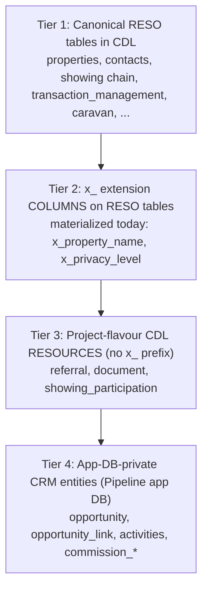
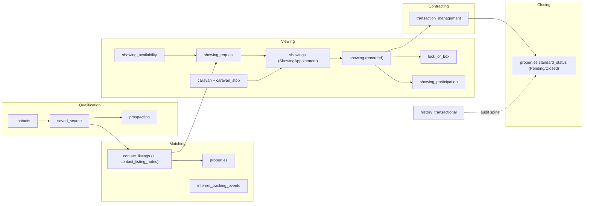

# RESO DD 2.0 → CRM Opportunity Lifecycle: Existing Model, Target Model & Modification Plan

**Version**: 1.0  
**Date**: 19 June 2026  
**Context**: Multitenant real-estate CRM (`matrix-pipeline`) on the Sharp Matrix platform.  
**Purpose**: Verify that the RESO Data Dictionary 2.0 → Opportunity-lifecycle mapping is canonically correct against what is **actually built** in the CDL, reconcile a proposed 24-resource model against reality, and provide an **actionable modification plan** (add / change / skip per resource).

This is a **planning/decision document**. It specifies what to modify *if needed*; it does not itself apply schema changes. Any change executes separately and lands in the owning repo per the `cursor-git-handoff` rule (CDL → `matrix-platform-foundation/supabase-cdl/`, app → `matrix-pipeline-2-0`).

---

## 1. Executive Summary

A proposed "final model" selected **24 resources** for the Opportunity lifecycle (Qualification → Matching → Viewing → Contracting → Closing): 1 multitenant foundation (OUID), 20 core RESO DD 2.0 resources, plus 2 extensions (`Opportunity`, `ShowingItinerary`). This document verifies that proposal against the as-built platform.

**Verdict: the canonical mapping is sound, but four assumptions in the proposal diverge from how Sharp Matrix is actually built.**

1. **Storage is snake_case canonical, not PascalCase.** RESO `ListingKey` → `listing_key`, `ContactKey` → `contact_key`. RESO PascalCase is the *interop* name (RESO Web API / syndication), not the column name. See [reso-dd-kb canonical DBML](reso-dd-kb/wiki/dbml/canonical.dbml).
2. **`Opportunity` is not a CDL extension resource.** It is an **App-DB-private super-resource** (`opportunity` + `opportunity_link`) in the Pipeline app DB (`kzvhqgpedapzqmwgikrw`), and its **funnel stage is calculated, never stored** ([ADR-035](../architecture/decisions/ADR-035.md), [opportunity-model.md](opportunity-model.md)).
3. **`ShowingItinerary` does not exist** anywhere — not in RESO DD 2.0, the KB, or the CDL. Multi-property viewing is already covered by the canonical **5-resource Showing chain** plus **`Caravan`/`CaravanStop`**, with buyer linkage via the project-flavour **`showing_participation`** resource ([ADR-033](../architecture/decisions/ADR-033.md)).
4. **Five proposed resources are not implemented as CDL tables:** `OUID`, `Teams` (created then dropped), `TeamMembers`, `SocialMedia`, `InternetTrackingSummary`. Most are deliberate (multitenancy is handled differently; aggregations are derived).

**Net finding: the lifecycle data model is substantially complete.** Of the 24 proposed resources, **19 are live**, **2 exist in a different (correct) tier**, and **the recommended modification set is small and mostly conditional** — there are no *required* net-new tables for the core lifecycle.

The platform models "beyond RESO" needs through a **4-tier governance model** (§4), which the proposal collapsed into a single "extension" bucket.

---

## 2. Verification Methodology & Sources

The proposal was checked against three sources of truth, in order:

| Layer | Source of truth |
|---|---|
| Canonical RESO names / fields | [reso-dd-kb/USAGE.md](reso-dd-kb/USAGE.md) (41 resources, 1,745 fields) + [canonical.dbml](reso-dd-kb/wiki/dbml/canonical.dbml) |
| As-built CDL schema | [cdl-schema.md](cdl-schema.md) + `matrix-platform-foundation/supabase-cdl/migrations/` |
| CRM lifecycle / Opportunity | [matrix-pipeline overview](../product-specs/matrix-pipeline/wiki/overview.md), [entities](../product-specs/matrix-pipeline/wiki/entities.md), [cdl-crud-contract.md](../product-specs/matrix-pipeline/cdl-crud-contract.md), [opportunity-model.md](opportunity-model.md) |
| Extensions & non-RESO entities | [platform-extensions.md](platform-extensions.md) + ADRs |
| Canonical process semantics | [canonical-processes/USAGE.md](../business-processes/canonical-processes/USAGE.md) |

Supabase projects referenced: CDL `ofzcokolkeejgqfjaszq`, Pipeline app DB `kzvhqgpedapzqmwgikrw`.

---

## 3. Part A — Existing Model: Resource Verification Matrix

Each proposed resource is mapped to its canonical RESO source, the **actual** CDL table (snake_case) or App-DB location, its status, and the verdict against the proposal.

Status legend: **Live** = table exists in CDL today · **App-DB** = exists in Pipeline app DB (Tier 4) · **Dropped** = was created then removed · **Not built** = never created · **Derived** = represented without a dedicated table.

### 3.1 Multitenant foundation

| # | Proposed | RESO source | Actual location | Status | Verdict |
|---|---|---|---|---|---|
| 1 | OUID | OUID | — (no table) | Not built | **Diverges.** Multitenant isolation is enforced via SSO JWT claims + `tenant_id` RLS ([ADR-012](../architecture/decisions/ADR-012.md)), not an OUID resource table. |

### 3.2 Core RESO resources — all stages

| # | Proposed | RESO source | CDL table | Status | Verdict |
|---|---|---|---|---|---|
| 2 | Contacts | Contacts | `public.contacts` | Live | Correct |
| 3 | Member | Member | `public.members` | Live | Correct |
| 4 | Office | Office | `public.offices` | Live | Correct |
| 5 | Teams | Teams | `public.teams` | Dropped (`20260504080000`) | Diverges — removed; restore only on team-deal scope |
| 6 | TeamMembers | TeamMembers | — | Not built | Diverges — never created |
| 7 | HistoryTransactional | HistoryTransactional | `public.history_transactional` | Live | Correct (audit spine) |

### 3.3 Qualification → Matching

| # | Proposed | RESO source | CDL table | Status | Verdict |
|---|---|---|---|---|---|
| 8 | SavedSearch | SavedSearch | `public.saved_search` | Live | Correct |
| 9 | Prospecting | Prospecting | `public.prospecting` | Live | Correct |
| 10 | SocialMedia | SocialMedia | — | Not built | Diverges — no standalone table |

### 3.4 Matching → Viewing

| # | Proposed | RESO source | CDL table | Status | Verdict |
|---|---|---|---|---|---|
| 11 | Property | Property | `public.properties` / `public.properties_published` | Live | Correct (read-only for CRM) |
| 12 | ContactListings | ContactListings | `public.contact_listings` | Live | Correct (the real "matched_properties") |
| 13 | Media | Media | `public.property_media` | Live | Correct (Property-child Media) |
| 14 | ContactListingNotes | ContactListingNotes | `public.contact_listing_notes` | Live | Correct (replaces `matched_properties[].notes`) |
| 15 | InternetTracking | InternetTracking | `public.internet_tracking_events` | Live | Correct |
| 16 | InternetTrackingSummary | InternetTrackingSummary | — | Derived | Diverges — aggregates derived in BI/views, not stored |

### 3.5 Viewing

| # | Proposed | RESO source | CDL table | Status | Verdict |
|---|---|---|---|---|---|
| 17 | ShowingRequest | ShowingRequest | `public.showing_request` | Live | Correct |
| 18 | Showing | Showing | `public.showing` | Live | Correct (recorded fact) |
| 19 | ShowingAppointment | ShowingAppointment | `public.showings` | Live | Correct (note table name `showings`) |
| 20 | ShowingAvailability | ShowingAvailability | `public.showing_availability` | Live | Correct |
| 21 | LockOrBox | LockOrBox | `public.lock_or_box` | Live | Correct |

### 3.6 Contracting → Closing

| # | Proposed | RESO source | CDL table | Status | Verdict |
|---|---|---|---|---|---|
| 22 | TransactionManagement | TransactionManagement | `public.transaction_management` | Live | Correct (4-field canonical envelope; offer economics stay app-private per [ADR-025](../architecture/decisions/ADR-025.md)) |

### 3.7 Proposed extensions

| # | Proposed | Proposed type | Actual | Verdict |
|---|---|---|---|---|
| 23 | Opportunity | Extension | App-DB super-resource `opportunity` + `opportunity_link` (Tier 4) | **Diverges (correct as-is).** Not a CDL resource; stage calculated ([ADR-035](../architecture/decisions/ADR-035.md)) |
| 24 | ShowingItinerary | Extension | Does not exist | **Diverges.** Covered by Showing chain + `Caravan`/`CaravanStop` + `showing_participation` |

### 3.8 Present in the platform but omitted by the proposal

These canonical/project-flavour resources are part of the live lifecycle and should be in any "final model":

| Resource | CDL table | Role |
|---|---|---|
| Caravan | `public.caravan` | Multi-property curated tour (the real "itinerary") |
| CaravanStop | `public.caravan_stop` | Ordered stop within a tour |
| ShowingParticipation | `public.showing_participation` | Buyer↔showing link — RESO has no Showing→Contact FK ([ADR-033](../architecture/decisions/ADR-033.md)) |
| Referral | `public.referral` | CRM referral ([ADR-025](../architecture/decisions/ADR-025.md)) |
| Document | `public.document` | CRM document ([ADR-025](../architecture/decisions/ADR-025.md)) |
| OpenHouse | `public.open_houses` | Public viewings (excluded from CRM scope, but exists) |

**Tally:** 19 of 24 proposed resources are live in the CDL; 2 (`Opportunity`, `ShowingItinerary`) resolve to a different/correct construct; 5 are unbuilt (OUID, Teams, TeamMembers, SocialMedia, InternetTrackingSummary); plus 6 live resources the proposal omitted.

---

## 4. The 4-Tier "Beyond RESO" Model

The proposal collapsed everything non-pure-RESO into one "extension" bucket. The platform actually uses four distinct, governed tiers ([platform-extensions.md](platform-extensions.md)):

- **Tier 2 (`x_` columns)**: a gap on an *existing* RESO resource. Local-only, never exported to RESO/Dash/IDX. `x_sm_` is retired ([ADR-023](../architecture/decisions/ADR-023.md)); the prefix is now `x_`. Only `properties.x_property_name` and `contacts.x_privacy_level` are materialized today.
- **Tier 3 (project-flavour resources)**: RESO has *no* resource at all → a new plain snake_case table, **not** an `x_` column. Examples: `referral`, `document`, `showing_participation`.
- **Tier 4 (App-DB-private)**: CRM-only constructs with no canonical-data sharing need → live in the Pipeline app DB, accessed with the app `supabase` client under SSO-claim RLS, never via `cdl-write`/`cdl-read`. `Opportunity` belongs here.

`Opportunity` was briefly added to the CDL then removed (migrations `20260617120000` → `20260618130000`) when [ADR-035](../architecture/decisions/ADR-035.md) superseded [ADR-034](../architecture/decisions/ADR-034.md) and relocated it to Tier 4.

---

## 5. Lifecycle → Canonical Mapping

The Opportunity **anchor** lives in the app DB; its **stage is derived on read** from linked canonical CDL sub-resources (`deriveOpportunityStage`, [opportunity-model.md](opportunity-model.md), [overview.md](../product-specs/matrix-pipeline/wiki/overview.md)).

| Stage | Canonical signal (derived, never stored) |
|---|---|
| Qualification | `contacts.contact_type ∈ {Lead, Prospect}`, anchor + contact only |
| Matching | ≥1 `saved_search`, or `contact_listings.listing_sent_timestamp` set |
| Viewing | ≥1 linked `showings`/`showing` (appointment or recorded) |
| Contracting | a linked `transaction_management` offer, or target `properties.standard_status = Active Under Contract` |
| Closing | `properties.standard_status = Pending` (deal won) then `Closed` (settled) — deal-won vs settled per [ADR-029](../architecture/decisions/ADR-029.md) |

**Corrections to legacy structures in the proposal:**

| Proposed structure | Canonical equivalent |
|---|---|
| `matched_properties[]` | `contact_listings` rows (one per Contact × Listing) |
| `matched_properties[].notes` | `contact_listing_notes` |
| `matched_properties[].engagement_metrics` | `contact_listings` timestamps/preference + `showing_participation` + `history_transactional` (no `internet_tracking_summary` table) |
| `OpportunityStatus` enum (`qualification`…`won`/`lost`) | split: calculated **stage** (qualification/matching/viewing/contract/closed) + stored anchor **`opportunity_status`** (`open`/`won`/`lost`/`archived`) |

---

## 6. Divergences from the Proposal (with rationale)

| Proposed | Reality | Governing decision | Why |
|---|---|---|---|
| OUID as a core resource | No table; SSO-claim + `tenant_id` RLS | [ADR-012](../architecture/decisions/ADR-012.md) | Tenant isolation is an auth/RLS concern, not a RESO data table |
| Opportunity = CDL extension | App-DB super-resource (Tier 4) | [ADR-035](../architecture/decisions/ADR-035.md) | RESO has no Opportunity; CRM-only data does not belong in the shared CDL |
| Opportunity stage stored (`OpportunityStatus`) | Stage calculated; only `opportunity_status` anchor stored | [overview.md](../product-specs/matrix-pipeline/wiki/overview.md), [ADR-029](../architecture/decisions/ADR-029.md) | Pipeline gate forbids a materialized stage |
| ShowingItinerary extension | Showing chain + Caravan/CaravanStop + showing_participation | [ADR-033](../architecture/decisions/ADR-033.md) | Multi-stop viewing already canonical; buyer link is a resource, not a column |
| PascalCase field names | snake_case canonical columns | [canonical.dbml](reso-dd-kb/wiki/dbml/canonical.dbml) | PascalCase is the interop projection, not storage |
| InternetTrackingSummary table | Derived aggregates over `internet_tracking_events` | [cdl-schema.md](cdl-schema.md) | Summary metrics are computed, not a system-of-record table |

---

## 7. Part B — Target Model & Gap Analysis

For each unbuilt/divergent item, a decision: **Required** (build now), **Conditional** (build only when a named precondition is met), or **Skip** (deliberate no-op with rationale).

| Gap | Decision | Rationale |
|---|---|---|
| OUID table | **Skip** | Multitenancy handled by SSO claims + RLS. Reconsider only if RESO Web API org-identity export is required. |
| Teams + TeamMembers | **Conditional** | Build (paired) only when team-based / luxury team deals enter CRM scope. Teams was dropped in `20260504080000`; restoring it without TeamMembers would be incomplete. |
| SocialMedia | **Skip / defer** | Low lifecycle value. If needed, model as nested attributes on `contacts`/`members` rather than a standalone resource. |
| InternetTrackingSummary | **Skip → derive** | Aggregations belong in BI / SQL views over `internet_tracking_events`, not a stored RESO table. |
| ShowingItinerary | **Skip** | Fully covered by Showing chain + `Caravan`/`CaravanStop` + `showing_participation`. Adding it would duplicate canonical structure. |
| Opportunity / matched_properties / engagement_metrics | **No change** | Already correctly modeled (Tier 4 anchor; `contact_listings`; derived engagement). |

**Target model = current live model**, unchanged for the core lifecycle, with `Teams`/`TeamMembers` held as the only conditional addition.

---

## 8. Part C — Modification Plan (actionable)

| Gap | Decision | Concrete change | Owning repo + artifact | Trigger / precondition |
|---|---|---|---|---|
| Teams | Conditional | Re-create `public.teams` canonical table + RLS | `matrix-platform-foundation/supabase-cdl/migrations/` + new ADR | Team-based deal workflow approved for CRM |
| TeamMembers | Conditional | Add `public.team_members` join (`team_key`, `member_key`, `team_member_type`) | `matrix-platform-foundation/supabase-cdl/migrations/` + same ADR | Paired with Teams above |
| OUID | Skip (no-op) | None — document the SSO/RLS rationale | — | Revisit only for RESO Web API org export |
| SocialMedia | Skip (no-op) | None | — | Revisit if social engagement enters qualification scope |
| InternetTrackingSummary | Skip → derive | If reporting needs it, add a SQL view, not a table | `matrix-platform-foundation/supabase-cdl/migrations/` (view only) | BI reporting requirement |
| ShowingItinerary | Skip (no-op) | None — use Caravan | — | — |

**Required changes: none.** The lifecycle model is complete as built; the only open item is the conditional `Teams`/`TeamMembers` pair, gated on a business decision.

**Handoff:** per the `cursor-git-handoff` rule, any CDL schema change lands as a committed migration in `matrix-platform-foundation/supabase-cdl/migrations/` (CDL is not linked to Lovable); any app-side change lands in `matrix-pipeline-2-0`. This document is the plan; execution is a separate, explicitly-requested step.

---

## 9. KB Sources Consulted

- [reso-dd-kb/USAGE.md](reso-dd-kb/USAGE.md) + [canonical.dbml](reso-dd-kb/wiki/dbml/canonical.dbml) — canonical RESO DD 2.0 (41 resources)
- [cdl-schema.md](cdl-schema.md), [platform-extensions.md](platform-extensions.md), [opportunity-model.md](opportunity-model.md), [index.md](index.md)
- [matrix-pipeline overview](../product-specs/matrix-pipeline/wiki/overview.md), [entities](../product-specs/matrix-pipeline/wiki/entities.md), [cdl-crud-contract.md](../product-specs/matrix-pipeline/cdl-crud-contract.md)
- [canonical-processes/USAGE.md](../business-processes/canonical-processes/USAGE.md)
- ADRs: [012](../architecture/decisions/ADR-012.md), [016](../architecture/decisions/ADR-016.md), [023](../architecture/decisions/ADR-023.md), [025](../architecture/decisions/ADR-025.md), [026](../architecture/decisions/ADR-026.md), [029](../architecture/decisions/ADR-029.md), [033](../architecture/decisions/ADR-033.md), [034](../architecture/decisions/ADR-034.md), [035](../architecture/decisions/ADR-035.md)
- As-built CDL migrations under `matrix-platform-foundation/supabase-cdl/migrations/`; app code under `matrix-pipeline-2-0/src` + `supabase/migrations/`

**KB divergence:** none. This document records the as-built model and reconciles the supplied proposal against it; it introduces no new pattern.
