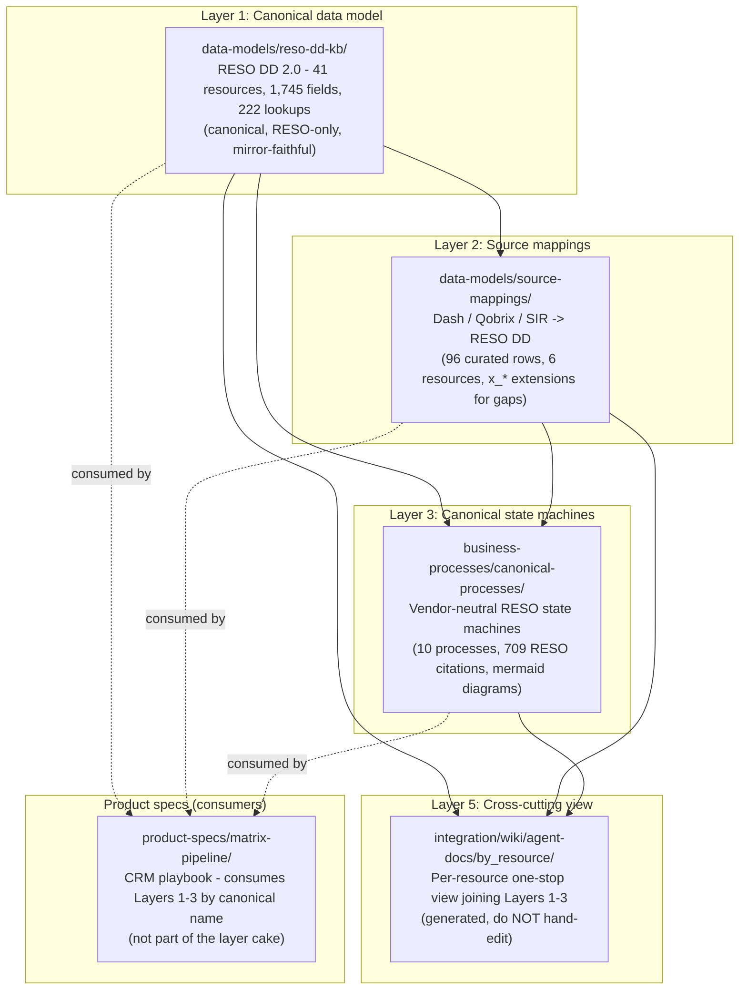

# How the KB layers compose — integrated stack

> A single integrated KB. This page explains how the three
> RESO-aligned chapters fit together into one stack, so an LLM
> agent can pick the right layer for the task at hand.

This is a navigation aid, not a system-of-record. The
system of record for each layer is its own chapter.

Project-flavour CRM behaviour (Sharp-SIR luxury sales playbook,
BRD-derived) is NOT a layer in this stack. It lives in
[`../product-specs/matrix-pipeline/`](../product-specs/matrix-pipeline/INDEX.md)
and consumes Layers 1-3 by canonical-name reference.

## The three layers

## What each layer answers

| Layer | Answers the question | System of record |
|---|---|---|
| 1. Canonical data model | "What does RESO say about `Property.StandardStatus`?" | [`data-models/reso-dd-kb/`](../data-models/reso-dd-kb/USAGE.md) |
| 2. Source mappings | "Which Dash / Qobrix / SIR field IS `Property.StandardStatus`?" | [`data-models/source-mappings/`](../data-models/source-mappings/USAGE.md) |
| 3. Canonical state machines | "What transitions in or out of `StandardStatus = Pending`?" | [`business-processes/canonical-processes/`](../business-processes/canonical-processes/USAGE.md) |
| 5. Cross-cutting view | "Show me everything about `Property` across Layers 1-3." | [`integration/`](USAGE.md) |
| (not a layer) Product specs | "How does the Sharp-SIR CRM materialise these in broker UI?" | [`product-specs/matrix-pipeline/`](../product-specs/matrix-pipeline/INDEX.md) |

## Picking the right layer

Use this decision table when navigating the KB:

| Task | Start at |
|---|---|
| Looking up a RESO field name / lookup value | Layer 1 — `data-models/reso-dd-kb/USAGE.md` |
| Finding which Dash field becomes which RESO field | Layer 2 — `data-models/source-mappings/USAGE.md` |
| Designing an `x_*` extension | Layer 2 — `data-models/source-mappings/USAGE.md` + [`platform-extensions.md`](../data-models/platform-extensions.md) |
| Implementing state-machine logic in Atlas / CDL | Layer 3 — `business-processes/canonical-processes/USAGE.md` |
| Designing CRM UI / forms / pipeline projections | Not a layer — `product-specs/matrix-pipeline/INDEX.md` |
| One-stop "everything about resource X" lookup | Layer 5 — `integration/USAGE.md` |

## Example: tracing one fact across the stack

Take the fact "the listing went under contract".

- **Layer 1** says the canonical state is
  `Property.StandardStatus = "Pending"` (with `MlsStatus` mirroring,
  `PendingTimestamp` / `PurchaseContractDate` /
  `ContractStatusChangeDate` / `StatusChangeTimestamp` updated).
- **Layer 2** says the Dash field that drives this is
  `propertyStatus = "PEND"` (or its equivalent) and the Qobrix path
  is `Property.transaction_state`. Mismatches go to `x_*`.
- **Layer 3** says the transition is
  `Active -> Pending` (or `Active -> Active Under Contract ->
  Pending`), driven by an "offer accepted" trigger, and emits a
  `HistoryTransactional` row with `ChangeType = Pending`. See
  [`canonical-processes/processes/listing-lifecycle.md`](../business-processes/canonical-processes/processes/listing-lifecycle.md).
- **Layer 5** is the integrated per-resource page that surfaces
  all of the above on one screen. See
  [`integration/wiki/agent-docs/by_resource/property.md`](wiki/agent-docs/by_resource/property.md).
- **Product spec** (not a layer): the CRM calls this a `TransactionManagement.status = "Accepted"` event in the Offer-to-Closing flow. See [`product-specs/matrix-pipeline/wiki/processes.md#offer-to-closing`](../product-specs/matrix-pipeline/wiki/processes.md#offer-to-closing).

## Boundaries the layers MUST respect

These are the harness-engineering invariants that keep the layers
composable:

- **Layer 1 is RESO-only.** It NEVER imports Dash, Qobrix, or
  SIR concepts. Mirror is regenerated, never hand-edited.
- **Layer 2 NEVER writes back into Layer 1.** It consults the RESO
  CSVs and curates a mapping side-by-side.
- **Layer 3 NEVER writes back into Layer 1 or Layer 2.** It
  consults the RESO CSVs to validate citations and pins state
  transitions to canonical names.
- **Layer 5 is purely derived.** Every byte is generated from
  Layers 1-3; the chapter has no hand-edited content under
  `wiki/agent-docs/`. Re-runs produce zero-byte diffs.
- **Product specs NEVER edit the layers.** Project-flavour CRM mappings live entirely within `product-specs/matrix-pipeline/` and map ONTO the canonical states by canonical name. New states / transitions specific to the CRM go through `x_*` extensions in Layer 2 (data fields) or through the escape-hatch ADRs (entities like `Referral`).

## Phase-gated pipelines per layer

Each generative chapter follows the same Author -> Validate -> Emit
pipeline pattern:

| Layer | Phase 1 (Mirror / Author) | Phase 2 (Validate / Curate) | Phase 3 (Emit) |
|---|---|---|---|
| 1. reso-dd-kb | Mirror RESO XML → CSVs | (built-in to Phase 1) | DBML + per-resource markdown + `_index.md` |
| 2. source-mappings | Inventory Dash / Qobrix / SIR | Curate `mapping_curated.csv` + join with RESO + 5 hard-fail gates | per-source + per-resource markdown + `_index.md` |
| 3. canonical-processes | Hand-write `processes/*.md` | Validate citations + mermaid (5 hard-fail gates) | `wiki/agent-docs/_index.md` + `state_machines.md` + `coverage.csv` |
| 5. integration | (no author phase) | (no validate phase) | `wiki/agent-docs/by_resource/<res>.md` joining Layers 1-3 |

The `product-specs/matrix-pipeline/` subtree is hand-edited product documentation (BRD + wiki + phases + CDL contract) and does not have a generative pipeline; it consumes Layers 1-3 by linking out, never by transforming.

## Mechanical enforcement

[`scripts/validate-kb.sh`](../../scripts/validate-kb.sh) enforces the
following cross-chapter invariants in addition to per-chapter
freshness:

- Check 1 — every `AGENTS.md` file reference resolves
- Check 2 — every markdown cross-link resolves (chapter to chapter)
- Check 5 — `reso-dd-kb` generated artifacts at least as fresh as raw CSVs
- Check 6 — `source-mappings` generated artifacts at least as fresh as inventories and curated rows
- Check 7 — `canonical-processes` generated artifacts at least as fresh as `processes/*.md`
- Check 8 — `integration/` generated artifacts at least as fresh as every Layer 1-3 `_index.md` (cross-chapter freshness)

A green `validate-kb.sh` is therefore a guarantee that the three
layers are mutually consistent.

## Where to add new content

| New content | Add it to |
|---|---|
| A new RESO resource that RESO has now standardised | Re-mirror Layer 1 (`reso-dd-kb`); do NOT hand-edit |
| A new `x_*` field Sharp-SIR needs | Layer 2 (`source-mappings/raw/mapping_curated.csv` + `platform-extensions.md`) |
| A new RESO-aligned business process not in the 10 canonical ones | Layer 3 (`canonical-processes/processes/<new>.md`) — also bump README's in-scope table and re-run pipeline |
| A new CRM workflow / FR / UI affordance | `product-specs/matrix-pipeline/wiki/` (not part of the layer cake) — anchor every state name to canonical RESO via Layers 1-3 |
| A new cross-cutting per-resource summary | NEVER hand-edit Layer 5 — extend `integration/scripts/01_emit_resource_views.py` instead |

## Anchored in harness engineering

This entire stack mirrors the OpenAI harness-engineering principles
the project follows:

- **Repository as system of record.** Every fact is anchored in a
  CSV, a markdown file, or a generated artifact under git.
- **Progressive disclosure.** `AGENTS.md` is short; deep documents
  are linked from per-chapter `USAGE.md` and consumed only when
  needed.
- **Mechanical enforcement.** `validate-kb.sh` is the single point
  of "is the KB self-consistent?" — green means the layers compose.
- **Phase-gated pipelines.** Each generative chapter has the same
  Author / Validate / Emit shape; later phases never write to
  earlier-phase outputs.
- **Generated outputs are zero-byte-diff.** Re-running any emit
  script with no input changes produces identical bytes.
