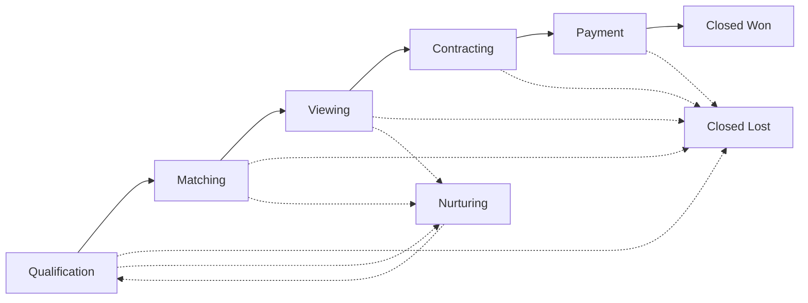
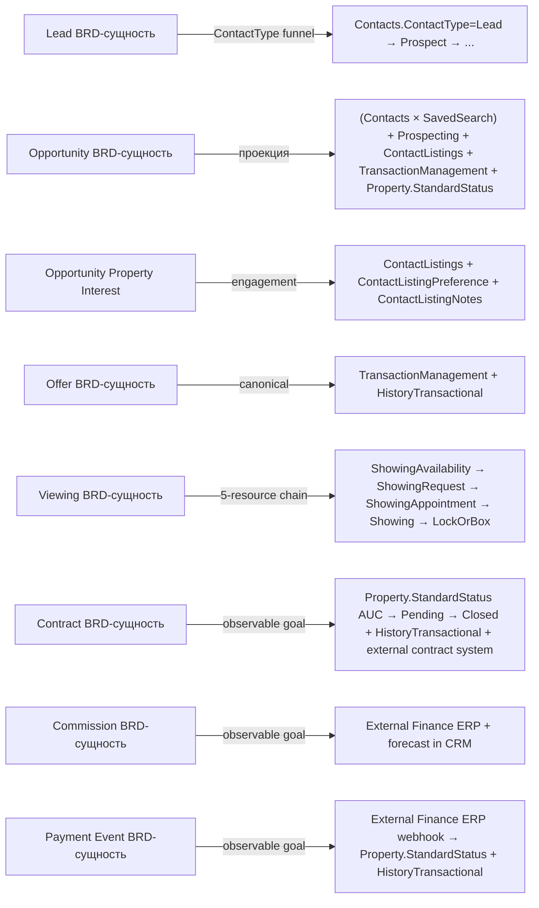

# Бизнес- и функциональные требования

## Система управления продажами и контактами для агентства элитной недвижимости

Версия: 0.1 / рабочий документ

Язык документа: русский

Назначение: документ для дальнейшей проработки бизнес-требований, функциональных требований, MVP scope, интеграций и будущей постановки задач на разработку.

# 1. Каноническая основа

CRM построена строго на каноническом RESO DD 2.0 без проектных расширений. Все бизнес-сущности — канонические RESO-ресурсы. Концепции, которых нет в каноническом RESO (контракты, комиссии, платежи), реализуются через переходы `Property.StandardStatus`, события `HistoryTransactional` и интеграцию с внешними системами (см. § 10), но **не** хранятся в CRM как самостоятельные data model entities.

Канонические RESO-ресурсы физически хранятся в **Matrix CDL (Common Data Layer)** — отдельном Supabase-проекте `ofzcokolkeejgqfjaszq`, который является system-of-record для shared business data платформы Sharp Matrix и управляется платформенным разработчиком (`matrix-platform-foundation/supabase-cdl/`); CDL **не управляется из Lovable**. CRM `matrix-pipeline` разрабатывается в **Lovable**, который управляет **собственным Supabase-проектом приложения** (app DB для app-private state — черновики, workflow, UI cache). CRM выступает **клиентом** CDL и получает полные права CRUD на канонические данные через канонические access mechanisms (`cdlClient` + dedicated CDL EFs под SSO JWT с проверкой scope). Подробности по as-built состоянию CDL, three-project архитектуре, RLS и identity — см. § 5a и KB (`docs/data-models/cdl-schema.md`, `docs/platform/app-template.md`, `docs/platform/security-model.md`, ADR-012 / ADR-013 / ADR-014).

Для процессинга сделок и расчёта комиссионного вознаграждения sales-брокеров CRM содержит **собственную ERP-lite подсистему** — Deal Commercialization, GCI и Commission Engine (см. § 9.15). Она ведёт per-deal cost attribution, GCI forecasting и broker commission rule engine; её данные хранятся в **CRM app DB** как app-private (DealCostEvent / CostRateCard / CommissionRule + computed views DealPnL / BrokerCompensation), вне канонического RESO. Это **явное project-flavour отклонение** от RESO DD 2.0, документированное в escape hatch § 11.6, обоснование: каноническая RESO модель не содержит deal-level P&L / commission ledger ресурсов (см. transaction-lifecycle Non-goals), а `matrix-fm` покрывает entity-level reporting, не deal-level forecast. **Actual money flow** (юридически значимый ledger комиссий и платёжных событий) остаётся за внешней Finance ERP (§ 10.9, § 10.10); CRM и внешняя ERP связаны reconciliation pattern (§ 9.15).

# 2. Принципы проектирования

- **CRM продает, Listing Module управляет объектами.**
  CRM использует данные листингов, но не редактирует мастер-данные объектов.
- **Каждый активный клиент должен иметь следующий шаг.**
  Для активных лидов и сделок система должна требовать next action и дату следующего действия.
- **История отношений важнее разовой транзакции.**
  Система должна хранить не только сделки, но и интересы клиента, коммуникации, предпочтения и долгосрочный потенциал.
- **Конфиденциальность — часть продукта.**
  Для luxury real estate важны private clients, off-market deals, NDA, restricted access и audit log.
- **Данные должны помогать управлять продажами.**
  В системе должны быть отчеты по pipeline, активности брокеров, источникам лидов, показам, офферам, lost reasons и прогнозу комиссии.

# 3. Scope системы

## 3.1. In Scope

В рамках Sales & Contact Management System должны быть реализованы следующие направления (все на каноническом RESO DD 2.0):

- Управление `Contacts` (личность + личные предпочтения, `ContactType` funnel).
- Управление организационной моделью: `Member`, `Office`, `OUID`, `Teams`, `TeamMembers`.
- Контактный funnel: `Contacts.ContactType` graduation (Lead → Prospect → Ready to Buy → Buyer / Seller / …).
- Управление коммерческими намерениями: `SavedSearch` + `Prospecting` (несколько параллельных намерений на одного `Contacts`).
- 5-стадийная воронка (Qualification / Matching / Viewing / Contracting / Payment) как UI/UX-проекция канонического состояния (§ 7).
- Управление активностями, задачами и follow-up (`Activity`).
- Управление показами через каноническую 5-resource Showing chain (`ShowingAvailability` → `ShowingRequest` → `ShowingAppointment` → `Showing` → `LockOrBox`).
- `Caravan` + `CaravanStop` для luxury-сценариев курируемых туров и invitation-only показов.
- Управление engagement клиента с объектами через `ContactListings` + `ContactListingPreference` + `ContactListingNotes`.
- Управление офферами и транзакциями через канонический `TransactionManagement` + `HistoryTransactional`.
- Подсистема Deal Commercialization, GCI и Commission Engine (см. § 9.15): per-deal cost attribution через Activity tagging, GCI forecasting на каждой стадии воронки, broker commission rule engine (PercentOfGCI / TierBased / SplitBased / BaseAndBonus / TeamOverride / Composite) и per-deal P&L для информированного решения sales-брокера «pursue / drop / escalate». Хранение app-private в CRM app DB; reconciliation с внешней Finance ERP — § 9.15 / § 10.9 / § 10.10. Project-flavour отклонение от RESO — см. § 11.6.
- Управление коммуникациями.
- Базовое хранение sales-документов (`Document`).
- Отчеты и дашборды по продажам (на каноническом состоянии).
- Роли, права доступа и конфиденциальность.
- Интеграция с Listing Management Module (`Property` + `Property.StandardStatus` + push events, см. § 10).
- Интеграция с внешними системами: контрактная система, финансовая ERP (§ 10.8–10.10).
- Интеграция с сайтом, email, calendar, WhatsApp и marketing tools.
- Импорт и экспорт данных.
- Audit log через `HistoryTransactional` (§ 10.7) по всем ключевым state transitions.

## 3.2. Out of Scope

Следующие функции находятся вне scope данной системы и должны быть реализованы в отдельном Listing Management Module или других специализированных системах:

- Создание и редактирование объектов недвижимости.
- Управление полными карточками листингов.
- Управление фото, видео, floor plans и медиа-библиотекой объектов.
- Управление техническими характеристиками объектов.
- Управление описаниями объектов для сайта и порталов.
- SEO-описания листингов.
- Управление публикацией объектов на сайте и внешних порталах.
- Управление статусами публикации листингов.
- Управление полной юридической документацией объекта как мастер-данными.
- Управление ценой объекта как мастер-данными.
- Управление владельцем объекта как частью листинга.

## 3.3. Граница ответственности CRM и Listing Module

Listing Management Module отвечает за то, что представляет собой объект.

Например: цена, описание, медиа, характеристики, доступность, публикация, статус листинга.

Sales & Contact Management System отвечает за то, что происходит с объектом в процессе продажи клиенту.

Например: объект предложен клиенту, отправлен по WhatsApp, показан, понравился, отклонен, по нему сделан оффер, начались переговоры.

## 3.4. Измеримые цели (outcomes / KPIs)

Каждая цель ниже сформулирована как наблюдаемый исход, к которому можно прикрепить метрику и измерять прогресс.

**Контактный funnel и реакция на лиды:**

- Увеличить конверсию лидов в сделки (graduation `Contacts.ContactType` Lead → Prospect → Buyer / Seller).
- Сократить потери лидов из-за отсутствия follow-up (Stale Funnels report, см. § 9.12).
- Повысить скорость реакции брокеров на входящие обращения (SLA на Lead-state `Contacts`).

**Pipeline и forecast:**

- Создать прозрачный pipeline для руководства агентства на основании UI/UX-проекции канонического состояния (§ 7).
- Улучшить прогнозирование комиссионного дохода (forecasted commission = price × rate × probability по стадии, см. § 9.15, § 10.9, FR-FNL-12).
- Обеспечить per-deal GCI forecasting на каждой стадии воронки и прозрачность структуры комиссионных выплат для каждого sales-брокера (см. § 9.15: forecast GCI, forecast net margin, forecast BrokerCompensation на TM card).
- Снизить variance forecast vs actual GCI до целевого уровня по итогам reconciliation с внешней Finance ERP (см. § 9.15 / § 10.9).
- Повысить прозрачность broker compensation: цель — 100% сделок имеют явный расчёт по published `CommissionRule` (PercentOfGCI / TierBased / SplitBased / BaseAndBonus / TeamOverride / Composite), без скрытых рук-handle override-ов.

**Контракты, комиссии и платежи (см. § 10.8–10.10):**

- Автоматизировать сопровождение жизненного цикла контракта за счёт webhook-интеграции с внешней контрактной системой и автоматических `Activity` reminders по ключевым датам.
- Снизить ручной труд при расчёте, начислении и сверке комиссионных сборов: forecasted commission рассчитывается в CRM, actual ledger мирорится из внешней финансовой ERP.
- Обеспечить near-real-time оповещения брокеров о факте оплаты (`deposit_received` / `partial_payment` / `full_payment` / `refund`) с автоматическим обновлением `Property.StandardStatus` и `HistoryTransactional`.

**Клиентский сервис и privacy:**

- Повысить качество работы с VIP / private / HNWI / UHNWI клиентами (privacy level на `Contacts`, RLS, NDA-уровни на `Document`).
- Обеспечить сохранность клиентской базы при изменениях в команде (канонический `OwnerMemberKey → Member`, единая история через `HistoryTransactional`).
- Унифицировать управление показами, офферами и переговорами через каноническую Showing chain и `TransactionManagement`.

**Аналитика и платформенные возможности:**

- Обеспечить единый стандарт ведения `Contacts`, `SavedSearch`, `ContactListings` и связанных канонических ресурсов.
- Улучшить аналитику по `Contacts.LeadSource`, активности брокеров, показам, офферам и lost reasons (см. § 9.12).
- Сформировать основу для дальнейшей автоматизации, AI matching, AI Broker Co-Pilot и предиктивных моделей (см. § 9.13, § 9.14).

# 4. Пользователи и роли

Роли, права доступа и группы пользователей **управляются в SSO** (отдельный платформенный проект `xgubaguglsnokjyudgvc`, см. § 5a.1 / § 5a.2 / ADR-011 / ADR-012). CRM `matrix-pipeline` выступает **клиентом** SSO: получает authenticated user через SSO JWT (ES256), читает `roles` / `groups` / `scope` claims и применяет их для UI gating + RLS на CRM app DB / CDL access. CRM **не управляет** определением ролей, прав или группового членства — это делает платформенный администратор через SSO Console. Таблица ниже — **функциональная таксономия** ролей, которые продукт CRM ожидает увидеть в SSO claims; конкретный mapping `SSO group → CRM role` задаётся в admin-config платформы (`role_configurations` на стороне CRM app DB + SSO Console на стороне SSO).

| Роль | Основные задачи в системе |
|---|---|
| Broker / Agent | Ведение клиентов, лидов, сделок, активностей, показов, офферов и follow-up |
| Senior Broker / Team Lead | Контроль сделок команды, помощь в переговорах, контроль качества данных |
| Head of Sales / Sales Manager | Управление pipeline, прогнозом комиссии, активностью брокеров и SLA |
| Marketing Manager | Анализ источников лидов, сегменты клиентов, кампании, nurturing |
| Listing Manager | Управляет объектами в отдельном Listing Module, взаимодействует с CRM через интеграцию |
| Operations / Admin | Контроль данных, прав доступа, справочников, импорта/экспорта |
| Managing Partner / Owner | Стратегическая аналитика, выручка, прогноз комиссии, эффективность команды |
| Client Service / Concierge | VIP-сервис, релокация, lifestyle-запросы, сопровождение клиента |
| Compliance / Legal | KYC/AML, документы, договоры, юридические стадии сделки, audit trail |

# 5. Основные бизнес-сущности

Базовая каноническая посылка зафиксирована в § 1. Ниже — логика модели данных, перечень сущностей с источниками правды и список концепций, которые **не** являются самостоятельными сущностями CRM data model.

Логика модели данных:

- **Contact** — физическое лицо + личные предпочтения (язык, канал, lifestyle, family profile, privacy level). Не хранит коммерческие параметры запроса.
- **SavedSearch** — каноническое хранилище коммерческого намерения клиента (бюджет, цель, target-локации, тип объекта, сроки) в виде RESO OData filter + human-readable формы. Один Contact может иметь несколько параллельных SavedSearch — это и есть «несколько параллельных намерений» (residence vs. investment vs. relocation).
- **Prospecting** — каноническое расписание outreach по связке `(Contact, SavedSearch, Member)`. В Sharp SIR Prospecting драйвит **два сценария одновременно**: (a) auto-delivery подборки новых/обновлённых листингов клиенту через email/WhatsApp; (b) reminder-`Activity` rows для брокера на регулярный contact-touchpoint с purchaser (relationship maintenance), даже если новых matched листингов нет.
- **ContactListings** — per-listing engagement клиента: что отправлено, что просмотрено, что в Favorite/Possibility/Discard.
- **Showing chain** (5 ресурсов) — полный жизненный цикл показа объекта.
- **TransactionManagement** — каноническая сущность оффера/транзакции (TransactionType: PurchaseOffer / LeaseOffer / ListingForSale / ListingForLease / Other).
- **Property** — объект из Listing Module; `Property.StandardStatus` — основной state machine жизненного цикла листинга (Active → Active Under Contract → Pending → Closed).
- **HistoryTransactional** — универсальный append-only audit log всех state transitions.

| Сущность (RESO DD 2.0) | Описание | Где является мастер-данными |
|---|---|---|
| **Contacts** | Физическое лицо: клиент, представитель, партнер, юрист, family office representative. Хранит личность и личные предпочтения (язык, preferred channel, lifestyle, family profile, privacy level, decision maker role, теги, связи), `ContactType` (multi-lookup: Lead / Prospect / Ready to Buy / Buyer / Seller / Landlord / Tenant / Past Client / …), `ContactStatus` (Active / On Vacation / Inactive / Deleted), `LeadSource`, `OwnerMemberKey → Member`. | CRM |
| **ContactListings** | Per-listing engagement Contact ↔ объект: `ContactListingPreference` (Favorite / Possibility / Discard), `ListingViewedYN`, `ListingSentTimestamp`, `PortalLastVisitedTimestamp`, unread-флаги, channel. Несколько ContactListings одного Contact = взаимодействия по разным объектам, в т.ч. в контексте параллельных намерений (разных SavedSearch). | CRM |
| **ContactListingNotes** | Заметки по паре Contact × Listing: содержимое, автор (Agent / Contact), timestamps. | CRM |
| **SavedSearch** | Каноническое хранилище коммерческого намерения: `SearchQuery` (OData filter), `SearchQueryHumanReadable`, `ResourceName` (Property / Caravan / …), `ClassName`, `MemberKey` (owning broker), `SavedSearchType`. Один Contact → N SavedSearch (несколько параллельных намерений). | CRM |
| **Prospecting** | Каноническое расписание outreach по `(Contact, SavedSearch, Member)`. Поля: `ActiveYN`, `ClientActivatedYN`, `ConciergeYN`, `ScheduleType`, `DailySchedule`, `NextSendTimestamp`, шаблоны сообщений, language, email lists. Привязка `ContactKey → Contacts`, `SavedSearchKey → SavedSearch`, `OwnerMemberKey → Member`. **В Sharp SIR Prospecting драйвит два сценария одновременно**: (a) auto-delivery подборки новых/обновлённых листингов клиенту через email/WhatsApp (canonical SavedSearch delivery); (b) reminder-`Activity` rows для брокера (см. § 9.6, FR-ACT-11) на регулярный contact-touchpoint с purchaser (relationship maintenance) — даже если новых matched листингов нет. Брокер обязан реагировать на reminder (выполнить call/meeting/WhatsApp/note) или явно деактивировать Prospecting. | CRM |
| **Member** | Брокер, агент, ассистент, менеджер. `MemberType`, `MemberStatus`, `OfficeKey → Office`. Канонический RESO business roster: licensee identity, лицензирование, MLS membership. **Идентичность user (логин, роли, permissions)** — отдельно в SSO; связь через `Member.MemberKey ↔ SSO user_id` (через канонический `Member.MemberAlternateId` либо явный mapping в SSO Console). | **CDL** (Phase 1) |
| **Office** | Офис, бранч, головной офис. `OfficeBrokerKey`, `OfficeManagerKey → Member`, `MainOfficeKey → Office`, OUID-провенанс. | **CDL** (Phase 1) |
| **OUID** | Organization Unique Identifier (MLS / партнерская организация). `OrganizationName`, `OrganizationType`, `OrganizationStatus`. | **CDL** (Phase 2+, см. § 5a.5) |
| **Teams** | Команда брокеров: `TeamName`, `TeamLeadKey → Member`, `TeamStatus`. SSO groups (permission domain) **не дублируют** canonical Teams; mapping SSO group ↔ `Teams.TeamKey` задаётся в SSO Console. | **CDL** (Phase 2+, см. § 5a.5) |
| **TeamMembers** | Состав команды: `TeamKey → Teams`, `MemberKey → Member`, `TeamMemberType`. | **CDL** (Phase 2+, см. § 5a.5) |
| **ShowingAvailability** | Каноническая posture листинга для будущих запросов на показ. | CRM / Listing Module |
| **ShowingRequest** | Запрос на показ (от покупателя/инспектора). | CRM |
| **ShowingAppointment** | Назначенная встреча показа со статусом `ShowingAppointmentStatus` (Pending / Confirmed / Denied / Cancelled). | CRM |
| **Showing** | Зафиксированный факт показа (после события). `ShowingAgentKey → Member`. | CRM |
| **LockOrBox** | Аудит доступа (lockbox / smart-key) при показе. | CRM |
| **Caravan** | Курируемый многообъектный тур: `CaravanStatus` (Active / Canceled / Ended), `CaravanType` (Broker / AOR / Other), `CaravanOrganizerKey`, `CaravanAllowedStatuses`. | CRM |
| **CaravanStop** | Упорядоченная остановка в Caravan, связана с `Property`. | CRM |
| **TransactionManagement** | Канонический ресурс для офферов и транзакций: `TransactionType` (PurchaseOffer / LeaseOffer / ListingForSale / ListingForLease / Other). Жизненный цикл оффера (Draft → Submitted → Countered → Accepted → Rejected / Withdrawn / Expired) выражается через `HistoryTransactional` rows + переходы `Property.StandardStatus`. | CRM |
| **HistoryTransactional** | Универсальный append-only audit log всех state transitions: `ResourceName` + `ResourceRecordKey` + `MajorChangeType` + `ChangeType` + `EntityEventSequence`. Эмитируется на каждый переход стадии воронки, изменение оффера, изменение `Property.StandardStatus`, события из внешних систем (контракты, платежи). | CRM |
| **Property** | Объект недвижимости — мастер-данные в Listing Module. CRM использует через интеграцию (см. § 10); ключевой state machine — `Property.StandardStatus` (Coming Soon / Active / Hold / Active Under Contract / Pending / Closed / Withdrawn / Canceled / Expired). | Listing Module |
| Activity | Звонок, задача, встреча, письмо, WhatsApp, follow-up. Связана с Contacts, ContactListings, TransactionManagement, Showing chain, Caravan и/или объектом. | CRM |
| Document | Документ, связанный с Contacts, TransactionManagement, Showing chain или активностью. Контракты хранятся в внешней контрактной системе; CRM держит ссылки. | CRM / внешние хранилища |
| Campaign | Кампания или источник маркетингового обращения. Связан с `Contacts.LeadSource`. | Marketing system / CRM |
| Referral | Рекомендация от клиента, партнера, брокера или агента. Связь между `Contacts` (referrer ↔ referee). `Contacts.LeadSource = Referral` для рекомендованного контакта. См. § 9.11a. | CRM |

> **Note (column semantics)**: Столбец «Где является мастер-данными» отражает **write authority** (какое приложение инициирует CRUD-операции), не обязательно физическое хранилище. Для `Contacts`, `ContactListings`, `ContactListingNotes`, `HistoryTransactional`, `ShowingAppointment` — CRM является write authority, но физически данные хранятся в **CDL** (см. § 5a.4 live state); CRM пишет через dedicated CDL EFs с проверкой SSO JWT scope (см. § 11.5 CDL access gate). Для `SavedSearch`, `Prospecting`, `Caravan`, `CaravanStop`, `ShowingAvailability`, `ShowingRequest`, `Showing` (как отдельный ресурс), `LockOrBox`, `TransactionManagement` — CRM является write authority И физически хранит данные в **CRM app DB** (Lovable-managed) до Phase 2+ миграции в CDL (см. § 5a.5). Для `Member`, `Office` — CDL является как write authority, так и physical store (canonical RESO business roster, Phase 1 live — см. § 5a.4). Для `OUID`, `Teams`, `TeamMembers` — CDL является write authority **в target state** (canonical RESO business roster), но физически на 2026-05-18 эти таблицы в live CDL **отсутствуют**: до Phase 2+ миграции (см. § 5a.5) данные ведутся в **CRM app DB** (для `Teams`, `TeamMembers`) либо TBD (`OUID`); по факту реализации Roster gate (§ 11.5) применяется к target state, не к текущему physical placement. Для `Property` — Listing Module является write authority, CDL — physical store (см. § 5a.4); CRM использует только через интеграцию (см. § 10). Для `Activity`, `Document` (метаданные; сами файлы — во внешних хранилищах), `Campaign` (CRM-side), `Referral` — CRM является и write authority, и physical store (CRM app DB, Lovable-managed); миграция в CDL **не планируется** (project-flavour app-private / non-canonical state, см. § 5a.6 + § 11.6 escape hatch для `Referral`).

> **Note (identity boundary)**: канонический RESO business roster (`Member` / `Office` / `OUID` / `Teams` / `TeamMembers`) — **в CDL** (Phase 1 для Member/Office, Phase 2+ для остальных). Идентичность пользователя (SSO account, roles, groups, scope claims, permissions) — **отдельно в SSO** (`xgubaguglsnokjyudgvc`). Связь: SSO user_id ↔ `Member.MemberKey` (через канонический `Member.MemberAlternateId` либо явный mapping-механизм в SSO Console). CRM consumes both: SSO для permission-gating, CDL Member для канонических FK ссылок (`OwnerMemberKey`, `ListAgentKey`, `BuyerAgentKey`) и business display (имя брокера, брокераж, команда, офис). См. § 5a.2.

**Что НЕ является самостоятельной сущностью CRM data model (по сравнению с предыдущей версией BRD):**

| Концепт | Где реализован вместо отдельной сущности |
|---|---|
| `Lead` | `Contacts.ContactType = Lead` (воронка ContactType: Lead → Prospect → Ready to Buy → Buyer / Seller / …). |
| `Opportunity` | Проекция поверх (`Contacts.ContactType` + N×`SavedSearch` + N×`Prospecting` + N×`ContactListings` + опциональный `TransactionManagement` + `Property.StandardStatus`). 5-стадийный pipeline сохраняется как UI/UX-проекция (см. § 7), не как хранимая сущность. |
| `Opportunity Property Interest` | `ContactListings` + `ContactListingPreference` (Favorite / Possibility / Discard) + Showing chain rows + `TransactionManagement` rows. |
| `Offer` | `TransactionManagement` (TransactionType: PurchaseOffer / LeaseOffer) + `HistoryTransactional` для lifecycle статусов + push `Property.StandardStatus`. |
| `Viewing` (как одна сущность) | Каноническая 5-resource Showing chain (`ShowingAvailability` → `ShowingRequest` → `ShowingAppointment` → `Showing` → `LockOrBox`). |
| `Contract` | Бизнес-цель (см. § 10.8), реализуется через переходы `Property.StandardStatus` (`Active Under Contract` → `Pending` → `Closed`) + `HistoryTransactional` + внешняя контрактная система (e-sign, версии, документы). |
| `Commission` | Бизнес-цель (см. § 10.9), реализуется во внешней финансовой ERP. CRM делает forecast по цене × commission rate, но не ведёт commission ledger. |
| `Payment Event` | Бизнес-цель (см. § 10.10), реализуется через webhook из финансовой ERP → переходы `Property.StandardStatus` + `HistoryTransactional`. |
| `Organization` (как отдельная сущность) | Канонические `Office` / `OUID` (для брокеражей и MLS-организаций) + `Contacts.Company` / `Contacts.JobTitle` (для family office, банков, девелоперов, юрфирм в роли контрагентов). |

# 5a. Хранилище данных: три Supabase-проекта и роль CRM как клиента CDL

## 5a.1. Три Supabase-проекта и границы владения

| Проект | ID | Владелец | Управляется из Lovable? | Назначение |
|---|---|---|---|---|
| **SSO** | `xgubaguglsnokjyudgvc` | `matrix-platform-foundation/supabase/` | Нет | Идентичность, JWT (ES256), роли, permissions, tenants, SSO admin EFs |
| **CDL** | `ofzcokolkeejgqfjaszq` | `matrix-platform-foundation/supabase-cdl/` | **Нет** | System-of-record для канонических RESO-ресурсов (shared business data платформы) |
| **CRM app DB** | per-app (matrix-pipeline собственный) | команда CRM через Lovable | **Да** | App-private state CRM: workflow, drafts, UI cache, app-local lookup-ы, role_configurations |

CDL и SSO принадлежат платформенной команде и эволюционируют через `matrix-platform-foundation`; CRM app DB принадлежит команде CRM и эволюционирует через Lovable. CRM **никогда** не держит CDL service-role key и не модифицирует CDL-схему — все изменения CDL проходят через `matrix-platform-foundation/supabase-cdl/`.

## 5a.2. Identity boundary

- SSO-проект выпускает все JWT (ES256, ADR-011).
- CDL верифицирует SSO-токены через **Supabase Third-Party Auth** (JWKS URL + issuer от SSO; см. ADR-012).
- CRM app DB верифицирует те же SSO JWT под обычной RLS (`auth.jwt()` helpers).
- Единая identity-цепочка: пользователь авторизуется в SSO → получает SSO JWT → этот же токен предъявляется ко всем трём проектам.
- **Identity-permissions (SSO) vs. business roster (CDL) — разные концепции**:
  - **SSO** хранит пользовательскую identity (account, email, password), роли, группы, scope claims, permissions — всё, что отвечает на вопрос «может ли user логиниться и что ему разрешено». CRM = клиент SSO (см. § 4).
  - **CDL** хранит канонический RESO business roster (`Member` / `Office` / `OUID` / `Teams` / `TeamMembers`) — кто лицензированный broker, в каком офисе/команде/OUID, для канонических FK ссылок (`OwnerMemberKey`, `ListAgentKey`, `BuyerAgentKey`). Отвечает на вопрос «кто this user в business roster брокерства».
  - **Связь**: SSO user_id ↔ `Member.MemberKey` (либо через канонический `Member.MemberAlternateId` как mapping-атрибут). SSO group ↔ canonical `Teams.TeamKey` (mapping в SSO Console). Никаких параллельных org-tables (см. § 11.5 Roster gate).
  - CRM consumes both: SSO для permission-gating и UI access control, CDL Member/Teams для канонических FK и business display (имя брокера, брокераж, команда, офис).

## 5a.3. CRM как клиент CDL — access pattern

CRM получает все необходимые права и полномочия для CRUD данных в CDL **как клиентское приложение** через канонические access mechanisms. CRM не имеет прямого доступа к CDL service-role key; вместо этого:

- **`ssoClient`** (`xgubaguglsnokjyudgvc`) — auth, роли, permissions, tenants, SSO admin EFs.
- **`cdlClient`** (`ofzcokolkeejgqfjaszq`) — чтение CDL под SSO-токеном через Third-Party Auth + invocation CDL EFs для записей.
- **`supabase`** (CRM app DB, Lovable-managed) — app-private данные `matrix-pipeline` под обычной RLS на JWT.
- **Чтения CDL**: для отфильтрованных листингов — `cdlClient.functions.invoke('listings-search', …)`; для snapshot — anon `.from('properties_published').select(...)` под RLS; для PII-таблиц (`contacts`, `showings`) — только через CDL EFs с проверкой scope (service-role-only на уровне RLS).
- **Записи в CDL**: проходят через **dedicated EFs** на CDL-проекте (deployed в `matrix-platform-foundation/supabase-cdl/functions/`). Каждая такая EF: `verify_jwt = false`, верифицирует SSO JWT сама, проверяет scope ∈ `SSO_ALLOWED_SCOPES`. Generic `cdl-write` EF в шаблоне платформы пока не построен; CRM-специфичные write-EFs добавляются по мере необходимости.
- **User display names**: только через SSO `resolve-users` EF + React hook `useUserDisplay`. **Не** SQL-join CDL ↔ `sso_users`.
- **`mls_sources.kind`** для CRM `matrix-pipeline`: `internal` (`matrix-internal` — target state для всех рынков Sharp SIR).

## 5a.4. CDL as-built (live state на 2026-05-18, verified via MCP)

Канонические RESO-ресурсы и инфраструктурные таблицы, которые уже в CDL и доступны CRM как клиенту.

**Канонические RESO-ресурсы (с активными данными):**

| Канонический RESO ресурс | CDL-таблица | Rows (live) | RLS |
|---|---|---|---|
| Property | `public.properties` | 16 014 | ⚠️ disabled |
| Property media | `public.property_media` | 264 095 | ⚠️ disabled |
| Property (anon snapshot) | `public.properties_published` | 13 916 | ✓ enabled |
| PropertyRooms | `public.property_rooms` | 0 | ✓ enabled |
| PropertyUnitTypes | `public.property_unit_types` | 0 | ✓ enabled |
| Member | `public.members` | 129 | ✓ enabled |
| Office | `public.offices` | 59 | ✓ enabled |
| Contacts | `public.contacts` (PII) | 45 073 | ✓ enabled |
| ContactListings | `public.contact_listings` (junction Contacts × Property) | **24 979** | ⚠️ disabled |
| ContactListingNotes | `public.contact_listing_notes` | 0 | ⚠️ disabled |
| HistoryTransactional | `public.history_transactional` (append-only) | 0 | ✓ enabled |
| OpenHouse | `public.open_houses` (см. § 11.6 в блоке KB divergence) | 0 | ✓ enabled |
| ShowingAppointment | `public.showings` | 0 | ✓ enabled |
| InternetTracking | `public.internet_tracking_events` | 0 | ✓ enabled |

**RESO DD metadata (served to FE for tooltips / dropdowns):**

| Таблица | Назначение | Rows |
|---|---|---|
| `public.reso_field_descriptions` | RESO DD field descriptions, served Atlas FE for help tooltips; seeded from official RESO DD CSV | 2 010 |
| `public.reso_lookup_value_descriptions` | RESO DD lookup values, served alongside field_descriptions for dropdowns / option-level tooltips | 3 683 |

**Stewardship / extensions:**

| Таблица | Назначение |
|---|---|
| `public.property_extension_kv` | RESO / OData extension values без хранения jsonb на `properties`; populated via `cdl_property_kv_sync_from_json_text()` |
| `public.entity_field_locks` | Row-level field locks (companion to `locked_fields` jsonb during migration) |
| `public.property_field_overrides` | Per-field overrides на уровне записи |
| `public.property_lifecycle_events` | Append-only audit lifecycle переходов `Property` |

**Control plane / ingestion:**

| Таблица | Назначение | Rows |
|---|---|---|
| `public.mls_sources` | Реестр источников (`internal` / `legacy-internal` / `brand-network` / `external`) | 3 |
| `public.mls_settings` | MLS sync settings | 1 |
| `public.mls_sync_jobs` | История заданий sync | 50 |
| `public.mls_sync_state` | State per source | 6 |
| `public.mls_orchestrator_runs` | История прогонов orchestrator | 187 |
| `public.field_mappings` | Field mappings (configuration) | 0 |
| `public.ingest_audit` | Ingestion audit log | 548 |
| `cdl_staging.listings_raw` | Raw staging | 490 754 |
| `cdl_staging.listings_mapped` | Mapped staging | 254 916 |
| `cdl_staging.media_staging` | Media staging | 0 |

Источники: live state via `user-supabase-cdl` MCP (`list_tables` + introspection 2026-05-18); `docs/data-models/cdl-schema.md`.

> **Расхождение с KB (Teams)**: `cdl-schema.md` (266–283) перечисляет `public.teams` как часть Phase 1 8-таблиц. На 2026-05-18 в live CDL таблица `public.teams` **отсутствует**; см. Phase 2+ ниже. KB-документ требует обновления.

> **Расхождение с KB (контактные таблицы)**: `cdl-schema.md` Phase 1 expansion (Apr 2026) **не перечисляет** `public.contact_listings` и `public.contact_listing_notes`. На 2026-05-18 в live CDL обе таблицы присутствуют (`contact_listings` — 24 979 строк, `contact_listing_notes` — 0 строк) с RLS disabled. KB-документ требует обновления для актуализации Phase 1 CDL schema.

> **Security advisory (MCP critical)**: 14 таблиц в `public.*` + 3 в `cdl_staging.*` имеют **RLS disabled** — anon-ключ имеет полный read/write доступ. Среди них критичные с точки зрения данных: `public.properties`, `public.property_media`, `public.contact_listings`, `public.contact_listing_notes`, `public.property_field_overrides`, `public.mls_*`, `public.ingest_audit`. PII-таблица `public.contacts` — RLS включена. **Особое внимание**: `public.contact_listings` (24 979 строк) и `public.contact_listing_notes` содержат engagement-данные клиента по объектам (preference, sent/viewed timestamps, notes) — по архитектуре платформы (`security-model.md` Pattern B) эти таблицы должны иметь RLS с tenant isolation и scope-aware filtering. RLS disabled на этих таблицах означает, что anon-ключ имеет полный read/write доступ к engagement-истории всех клиентов всех брокеров. Включение RLS по Pattern B — **S1 backlog платформенной команды** с высоким приоритетом (см. KB `security-model.md`). До включения CRM как клиент CDL **обязан** ходить через канонические access mechanisms (CDL EFs с проверкой scope) ко всем таблицам без table-level RLS — это часть контракта `matrix-platform-foundation/supabase-cdl/` (см. также § 11.5 CDL access gate).

> **Naming drift advisory (three-layer mismatch)**: Канонический RESO DD 2.0 ресурс называется `ShowingAppointment`; KB-документ `cdl-schema.md` планировал таблицу как `public.showing_appointments`; live CDL содержит таблицу `public.showings`. Все три слоя расходятся в именовании одного ресурса. При разработке CRM необходимо использовать `public.showings` как фактическую CDL-таблицу для `ShowingAppointment`. Отдельный RESO-ресурс `Showing` (зафиксированный факт показа, в отличие от `ShowingAppointment` — назначенной встречи) запланирован как отдельная таблица в CDL Phase 2+ (см. § 5a.5). До миграции различие между `ShowingAppointment` и `Showing` реализуется на уровне CRM app DB. KB-документ `cdl-schema.md` требует обновления: исправить `public.showing_appointments` → `public.showings` в Phase 1 expansion таблице. Передать платформенной команде.

## 5a.5. Planned for CDL migration (Phase 2+)

Канонические RESO-ресурсы, которых **нет в live CDL на 2026-05-18**; BRD рассматривает их как **подлежащие миграции в CDL** как канонический home. До миграции CRM ведёт их в собственной Lovable-managed app DB.

| Канонический RESO ресурс | Цель миграции | Где сейчас (до миграции) |
|---|---|---|
| Teams | CDL Phase 2+ | CRM app DB (Lovable-managed) |
| TeamMembers | CDL Phase 2+ | CRM app DB (Lovable-managed) |
| OUID | CDL Phase 2+ | TBD |
| SavedSearch | CDL Phase 2+ | CRM app DB (Lovable-managed) |
| Prospecting | CDL Phase 2+ | CRM app DB (Lovable-managed) |
| ShowingAvailability | CDL Phase 2+ | CRM app DB (Lovable-managed) |
| ShowingRequest | CDL Phase 2+ | CRM app DB (Lovable-managed) |
| Showing (отдельно от ShowingAppointment) | CDL Phase 2+ | CRM app DB (Lovable-managed) |
| LockOrBox | CDL Phase 2+ | CRM app DB (Lovable-managed) |
| Caravan, CaravanStop | CDL Phase 2+ | CRM app DB (Lovable-managed) |
| TransactionManagement | CDL Phase 2+ | CRM app DB (Lovable-managed) |

Источник: live MCP state vs canonical RESO entity list § 5. Точный график миграции и порядок добавления таблиц — вне scope BRD; см. KB roadmap (ADR-014). По мере выполнения миграции соответствующие FR/BR будут переключаться с CRM app DB на CDL без изменения семантики.

## 5a.6. App-private state (всегда на CRM app DB, никогда не CDL)

Эти данные не являются каноническими RESO-ресурсами и не имеют межприложенческой потребности:

- `Activity` (звонки, задачи, follow-up — workflow state CRM; расширенная разметка для cost attribution — см. § 9.6, FR-ACT-10).
- `Document` references (метаданные документов; сами файлы — во внешних системах).
- Pipeline-state UI cache (5-стадийная воронка как UI/UX projection — см. § 7).
- Drafts, app-specific lookup tables, role_configurations.
- Любые UI preferences, view configs, кэши.
- **Состояние подсистемы Deal Commercialization, GCI и Commission Engine** (см. § 9.15) — операционные затраты на сделку, ставки и правила расчёта комиссий, вычисляемые per-deal P&L и broker compensation. Детальная app-private data model (включая DealCostEvent / CostRateCard / CommissionRule / DealPnL / BrokerCompensation), формулы и FRs проектируются в Lovable; project-flavour отклонение от RESO DD 2.0 зафиксировано в § 11.6 escape hatch.
- **`Referral`** (см. § 9.11a) — связь `Contacts` (referrer) ↔ `Contacts` (referee) + `OwnerMemberKey` + тип рекомендации + outcome + дата закрытия. Project-flavour сущность вне канонического RESO DD 2.0 (см. § 11.6 escape hatch). Хранится app-private в CRM app DB; ссылается на канонические `Contacts.ContactKey` в CDL через CRM app DB → CDL FK reference (не canonical relationship).

## 5a.7. KB sources of truth

- Схема CDL: [`matrix-platform-kb/docs/data-models/cdl-schema.md`](/home/bitnami/matrix-platform-kb/docs/data-models/cdl-schema.md).
- Three-project архитектура + EF контракты: [`matrix-platform-kb/docs/platform/app-template.md`](/home/bitnami/matrix-platform-kb/docs/platform/app-template.md).
- RLS / identity / Third-Party Auth: [`matrix-platform-kb/docs/platform/security-model.md`](/home/bitnami/matrix-platform-kb/docs/platform/security-model.md).
- ADRs: [`ADR-011`](/home/bitnami/matrix-platform-kb/docs/architecture/decisions/ADR-011.md) (ES256), [`ADR-012`](/home/bitnami/matrix-platform-kb/docs/architecture/decisions/ADR-012.md) (CDL Third-Party Auth), [`ADR-013`](/home/bitnami/matrix-platform-kb/docs/architecture/decisions/ADR-013.md) (CDL/SSO ownership; CDL не linked to Lovable), [`ADR-014`](/home/bitnami/matrix-platform-kb/docs/architecture/decisions/ADR-014.md) (CDL as-built vs original 18-table design).
- Stewardship / source taxonomy: [`matrix-platform-kb/docs/architecture/data-distribution-and-stewardship.md`](/home/bitnami/matrix-platform-kb/docs/architecture/data-distribution-and-stewardship.md).

# 6. Бизнес-процессы верхнего уровня

Все процессы строятся на канонических ресурсах RESO DD 2.0. Lead, Opportunity, Offer, Contract, Commission и Payment Event **не являются** сущностями CRM data model — они либо растворены в каноническую модель, либо реализованы через переходы канонического `Property.StandardStatus` + `HistoryTransactional` + внешнюю интеграцию (см. § 10.8–10.10, § 11).

## 6.1. Contact funnel — от обращения до закрытия

- Входящее обращение из сайта, referral, кампании, события, партнёра или вручную.
- Система создаёт запись `Contacts` (или находит существующую по email/телефону/имени) и устанавливает:
  - `Contacts.ContactType = Lead` (multi-value RESO lookup);
  - `Contacts.LeadSource` (канонический RESO lookup);
  - `Contacts.OwnerMemberKey` → `Member` (ответственный брокер);
  - `Contacts.ContactStatus = Active`.
- Запускается SLA на первичный контакт по правилу: `Contacts.ContactType=Lead AND нет активного SavedSearch+Prospecting`.
- Брокер связывается с клиентом и проводит discovery.
- При квалификации:
  - `Contacts.ContactType` повышается в воронке: Lead → Prospect → Ready to Buy → Buyer / Seller / Landlord / Tenant;
  - Создаются один или несколько `SavedSearch` с коммерческими параметрами (бюджет / цель / target-локации / тип / сроки) в виде `SearchQuery` (OData filter) + `SearchQueryHumanReadable`;
  - При необходимости активируется `Prospecting` (расписание автоматической рассылки по SavedSearch).
- Подбор и отправка объектов реализуются через `ContactListings` (см. § 6.3).
- Показы — через каноническую Showing chain (см. § 6.4); опционально группируются в `Caravan`.
- Оффер фиксируется как `TransactionManagement` (TransactionType: PurchaseOffer / LeaseOffer); жизненный цикл оффера — через `HistoryTransactional` rows и переходы `Property.StandardStatus`.
- Контракт — внешняя система (см. § 10.8); CRM реагирует на webhook → переход `Property.StandardStatus` (Active Under Contract → Pending → Closed) + `HistoryTransactional`.
- Платежи — внешняя финансовая ERP (см. § 10.10); CRM реагирует на webhook → переход `Property.StandardStatus = Closed` + `HistoryTransactional`.
- Closed Won = `Property.StandardStatus = Closed` + связанный `TransactionManagement` row + полностью завершённый цикл оплаты.
- Closed Lost = терминальный отказ: `Prospecting.ActiveYN=false` для всех SavedSearch контакта, причина в `ContactListingNotes` или `HistoryTransactional`.
- Nurturing = `Prospecting.ActiveYN=false`, но `Contacts.ContactStatus=Active`; долгосрочное re-engagement.

## 6.2. Contact relationship процесс

- Запись `Contacts` создаётся из входящего обращения, вручную или импортом.
- На `Contacts` фиксируются только личные данные и предпочтения: имя, контакты, язык, `PreferredCommunicationMethod`, lifestyle interests, family profile, privacy level, decision maker role, теги, связи с другими `Contacts` (spouse, advisor, family office, assistant).
- Коммерческие параметры запроса (бюджет, цель, target-локации, тип, сроки, decision criteria) на `Contacts` **не** хранятся — они принадлежат `SavedSearch`.
- Все коммуникации и активности привязываются к `Contacts` и при необходимости — к конкретному `SavedSearch` или `ContactListings` (если коммерческий контекст).
- Один Contact может иметь несколько параллельных активных `SavedSearch` (residence + investment + relocation) — это и есть «несколько параллельных намерений».
- После закрытия активного намерения (`Property.StandardStatus=Closed` для целевого объекта) Contact продолжает жить как long-term relationship: post-transaction follow-up, повторные сделки, referrals.

## 6.3. Property matching процесс

- Брокер открывает конкретный `SavedSearch` контакта (а не Contact в целом).
- CRM использует параметры `SavedSearch.SearchQuery` (бюджет / цель / target-локации / тип / спальни / сроки / decision criteria), дополненные lifestyle/family-предпочтениями из `Contacts`.
- CRM запрашивает релевантные объекты из Listing Module через OData filter с учётом прав доступа (включая off-market/private).
- Подбор сохраняется как набор `ContactListings` rows:
  - брокерский подбор → `ContactListingPreference = Possibility` (или без установки preference, ожидая реакции клиента);
  - клиент сохраняет в избранное → `ContactListingPreference = Favorite`;
  - клиент отклоняет → `ContactListingPreference = Discard`.
- Отправка подборки клиенту фиксируется через `ContactListings.ListingSentTimestamp` + канал (email / WhatsApp / portal); опционально стартует `Prospecting` для автоматической периодической рассылки.
- `Prospecting` запускается по расписанию (`NextSendTimestamp` + `ScheduleType`) и порождает **два эффекта параллельно**:
  1. Если есть новые/обновлённые листинги, попадающие в `SavedSearch.SearchQuery` — формируется подборка и эмитируются `ContactListings` rows + (по `ConciergeYN`) auto-send клиенту или review брокером перед отправкой.
  2. **Независимо от наличия новых листингов** — создаётся `Activity` row для `OwnerMemberKey → Member` (broker) с типом touchpoint reminder, чтобы поддерживать регулярный contact-rhythm с purchaser (relationship maintenance). См. § 9.5a FR-PROS-09..12 и § 9.6 FR-ACT-11.
- Открытие объекта клиентом онлайн → `ContactListings.ListingViewedYN=true` + `PortalLastVisitedTimestamp`.
- Заметки брокера / клиента по объекту — `ContactListingNotes`.

## 6.4. Showing процесс (5-resource chain)

Каноническая последовательность из 5 ресурсов:

1. **ShowingAvailability** — listing-side posture: владелец / listing agent публикует доступные слоты и правила.
2. **ShowingRequest** — buyer-side запрос: `Member` (showing agent) или `Contacts` запрашивает показ.
3. **ShowingAppointment** — назначенная встреча, `ShowingAppointmentStatus` (Pending / Confirmed / Denied / Cancelled), `ShowingAgentKey → Member`.
4. **Showing** — фактическое событие показа, фиксируется после встречи. `ShowingStartTimestamp`, `ShowingEndTimestamp`, `ShowingAgentKey`, `ListingKey → Property`.
5. **LockOrBox** — credential audit: фиксация использования lockbox / smart-key при показе.

Гейтинг: `Property.ShowingStatus` (Accepting Requests / On Hold / No Showings / Restricted Showings) и `Property.StandardStatus` (показ возможен только при Active / Active Under Contract в зависимости от политики).

Опциональная группировка: показы могут быть частью `Caravan` (курируемый многообъектный тур, см. § 9.7a).

После показа: feedback клиента фиксируется в `ContactListingNotes` для соответствующей пары Contact × Listing; preference обновляется (Favorite / Possibility / Discard). При высоком интересе создаётся `TransactionManagement` row (PurchaseOffer / LeaseOffer).

## 6.5. Offer-to-Closing процесс

- Брокер создаёт `TransactionManagement` row с `TransactionType = PurchaseOffer` (или `LeaseOffer`), привязанный к `Contacts` и целевому `Property`.
- Сумма предложения, валюта, условия (deposit, payment terms, contingencies, validity period) фиксируются в `TransactionManagement` + связанных `Document` rows.
- Жизненный цикл оффера выражается через последовательность `HistoryTransactional` rows на TransactionManagement-записи: Draft → Submitted → Countered → Accepted / Rejected / Withdrawn / Expired.
- При статусе Accepted CRM пушит в Listing Module: `Property.StandardStatus = Active Under Contract`.
- Готовится и подписывается контракт во внешней контрактной системе (см. § 10.8). Webhook signed → `Property.StandardStatus = Pending` + `HistoryTransactional` (`ChangeType = Pending`).
- Платёжные события поступают через webhook из финансовой ERP (см. § 10.10) → переходы `Property.StandardStatus` (deposit / partial → Pending; full → Closed) + `HistoryTransactional`.
- Closed Won = `Property.StandardStatus = Closed`, `CloseDate`, `ClosePrice`, `HistoryTransactional` (`ChangeType = Closed`).
- На любой стадии возможен Closed Lost — отдельные строки в `HistoryTransactional` фиксируют причину (lost reason); `Property.StandardStatus` возвращается в Active или переходит в Withdrawn в зависимости от ситуации.

# 7. Pipeline как UI/UX-проекция поверх канонического состояния

В CRM data model **нет** хранимой сущности `Opportunity` и нет отдельной таблицы pipeline-стадий. 5-стадийный pipeline существует только как **UI/UX-проекция** поверх канонического состояния RESO-ресурсов. Каждое намерение клиента (которое в традиционных CRM было бы «opportunity») представлено в данных как пара `(Contacts × SavedSearch)` + связанные `Prospecting` / `ContactListings` / Showing chain rows / `TransactionManagement` / целевой `Property.StandardStatus`.

Один Contact может иметь **несколько параллельных SavedSearch** — это и есть «несколько параллельных намерений» (residence + investment + relocation), каждое со своей собственной проекционной стадией.

## 7.1. Стадии воронки (canonical-state projection)

Стадия — это **выводимое состояние**, не хранимое поле. Алгоритм вывода:

| Стадия | Деривация из канонического RESO state |
|---|---|
| **Qualification** | `Contacts.ContactType ∈ {Lead, Prospect}` AND нет активного `SavedSearch+Prospecting` для этого направления. |
| **Matching** | Выполняется **одно из двух условий** по данному `SavedSearch`-направлению: **(a)** существует ≥1 `SavedSearch` с `Prospecting.ActiveYN=true` AND есть ≥1 `ContactListings.ListingSentTimestamp`; **(b)** существует ≥1 `ContactListings.ListingSentTimestamp` для объектов, связанных с данным `SavedSearch`, без активного `Prospecting` (ручная отправка брокером). **Связь `ContactListings ↔ SavedSearch`** устанавливается одним из двух способов (определяется при реализации): (i) явный `SavedSearchKey` reference на `ContactListings` (attribute), фиксирующий, в контексте какого намерения объект был отправлен; (ii) heuristic match — `ContactListings.Property` попадает в результат `SavedSearch.SearchQuery` filter на момент `ListingSentTimestamp`. Способ (i) предпочтителен; при отсутствии явного reference используется (ii) как fallback. При выполнении условия (b) без активного `Prospecting` — система ДОЛЖНА предложить брокеру создать `Prospecting` row для данного `(Contacts, SavedSearch)` (soft prompt, не блокирующий; см. § 9.5a FR-PROS-13). |
| **Viewing** | Существует ≥1 `ShowingAppointment` (Pending / Confirmed) или зафиксированный `Showing` для одного из `ContactListings` контакта. |
| **Contracting** | Существует `TransactionManagement` row (TransactionType: PurchaseOffer / LeaseOffer) для контакта по целевому объекту И/ИЛИ `Property.StandardStatus ∈ {Active Under Contract}` для целевого объекта. |
| **Payment** | `Property.StandardStatus = Pending` для целевого объекта (контракт подписан, ожидается полная оплата). |
| **Closed Won** | `Property.StandardStatus = Closed` для целевого объекта + соответствующий `HistoryTransactional` row (`ChangeType = Closed`). |
| **Closed Lost** | Терминальный отказ: `Prospecting.ActiveYN=false` AND нет активного перехода в Contracting/Payment AND зафиксирована причина в `ContactListingNotes` или `HistoryTransactional`. |
| **Nurturing** | `Prospecting.ActiveYN=false` AND `Contacts.ContactStatus=Active` AND `Contacts.ContactType ∈ {Prospect, Past Client, …}` AND нет активной воронки в Contracting/Payment. |

Под-статусы каждой стадии (например, в Matching: Searching / Shortlist Sent / Reviewed; в Contracting: Offer Preparation / Submitted / Countered / Accepted / Signed) тоже выводятся: они являются комбинациями состояний `ContactListings.*Timestamp`, `ContactListingPreference`, наличия и `HistoryTransactional` строк на связанном `TransactionManagement`, и состояния `Property.StandardStatus`.

## 7.2. Обязательные правила воронки

- У каждого активного `Contacts` с `ContactType ∈ {Lead, Prospect, Ready to Buy, Buyer, Seller, ...}` должен быть `OwnerMemberKey → Member` (ответственный брокер).
- У каждой активной комбинации `(Contacts × SavedSearch)` должен быть next action — реализуется как открытая `Activity` (task) с `DueDate`.
- При попадании в стадию Matching через условие (b) (ручная отправка без `Prospecting`) система ДОЛЖНА создавать `Activity` reminder для `OwnerMemberKey → Member` с предложением активировать `Prospecting` для данной пары `(Contacts, SavedSearch)`, чтобы обеспечить регулярный contact-rhythm (см. § 9.5a FR-PROS-13).
- Переход в каждую новую стадию (по правилам § 7.1) ОБЯЗАН эмитировать `HistoryTransactional` row с:
  - `ResourceName` = ресурс, чьё состояние стало триггером (например, `Property`, `TransactionManagement`, `Contacts`);
  - `ResourceRecordKey` = соответствующий ключ;
  - `MajorChangeType` = название новой стадии (Qualification / Matching / Viewing / Contracting / Payment / Closed Won / Closed Lost / Nurturing);
  - `ChangeType` = детализация под-статуса где применимо;
  - `EntityEventSequence` = последовательный номер.
- При переходе в Closed Lost обязательно фиксируется причина: `HistoryTransactional.ChangeType = Closed Lost` + текстовое поле с reason (либо отдельный `ContactListingNotes`).
- Переход в **Closed Won** требует выполнения трёх канонических условий одновременно:
  - `Property.StandardStatus = Closed` для целевого объекта;
  - связанный `TransactionManagement` row существует;
  - получено webhook-подтверждение полной оплаты из внешней финансовой ERP (см. § 10.10) → эмитирована `HistoryTransactional` row с `ChangeType = Closed`.
- Переход в стадию **Payment** возможен только при `Property.StandardStatus = Pending`, что в свою очередь требует webhook-подтверждения «contract signed» из внешней контрактной системы (см. § 10.8).
- Под-статус `Offer Submitted` в стадии Contracting требует наличия как минимум одной `TransactionManagement` row с `TransactionType = PurchaseOffer` или `LeaseOffer` и соответствующей `HistoryTransactional` row (`ChangeType = Submitted`).
- Контакт без активности (никаких новых `Activity`, `ContactListings`, `HistoryTransactional` rows) более заданного периода попадает в отчёт Stale Contacts / Stale Funnels.
- В Nurturing воронка не учитывается в pipeline forecast и SLA-метриках, но участвует в long-term relationship отчётах.
- Один Contact может иметь несколько параллельных `SavedSearch` (= параллельных намерений), каждое со своей собственной проекционной стадией. Метрики и forecast агрегируются по парам `(Contacts × SavedSearch)`, а не по Contact в целом.

# 8. Бизнес-требования

| ID | Бизнес-требование | Приоритет |
|---|---|---|
| BR-01 | Система должна обеспечивать единую базу `Contacts`, `Member`, `Office`, `Teams`, `SavedSearch`, `Prospecting`, `ContactListings`, `TransactionManagement` и связанных канонических ресурсов RESO DD 2.0 | High |
| BR-02 | Система должна позволять отслеживать полный жизненный цикл клиента через воронку `Contacts.ContactType` (Lead → Prospect → Ready to Buy → Buyer / Seller / Past Client / …) и множественные параллельные `SavedSearch` — от первого контакта до повторных сделок и рекомендаций | High |
| BR-03 | Система должна обеспечивать прозрачный pipeline по брокерам, офисам, регионам и стадиям воронки (см. § 7), выводимым из канонического состояния (`ContactType`, `ContactListings`, `Prospecting`, `TransactionManagement`, `Property.StandardStatus`) | High |
| BR-04 | Система должна позволять руководству видеть forecast комиссионного дохода на основе цены × commission rate × вероятности по стадии; commission ledger ведётся во внешней финансовой ERP (см. § 10.9) | High |
| BR-05 | Система должна помогать брокерам не терять follow-up и автоматически подсвечивать просроченные `Activity` и неотвеченные `ContactListings.ListingSentTimestamp` | High |
| BR-06 | Система должна фиксировать `Contacts.LeadSource` (канонический RESO lookup) и позволять анализировать эффективность каналов привлечения | High |
| BR-07 | Система должна поддерживать работу с HNWI/UHNWI-клиентами, включая высокий уровень конфиденциальности (privacy level на `Contacts`) | High |
| BR-08 | Система должна поддерживать разграничение доступа к VIP/private `Contacts`, `SavedSearch`, `ContactListings`, `Showing` и связанным ресурсам | High |
| BR-09 | Система должна поддерживать сегментацию по бюджету, целям, локациям, типу недвижимости и срокам через параметры `SavedSearch.SearchQuery` (OData filter) | High |
| BR-10 | Система должна позволять фиксировать историю коммуникаций с клиентом через `Activity` и `ContactListingNotes` | High |
| BR-11 | Система должна поддерживать управление активностями брокеров: звонки, встречи, показы, задачи, follow-up — как `Activity` связанные с `Contacts` / `ContactListings` / Showing chain / `TransactionManagement` | High |
| BR-12 | Система должна позволять организовывать показы объектов через каноническую Showing chain (`ShowingAvailability` → `ShowingRequest` → `ShowingAppointment` → `Showing` → `LockOrBox`) с интеграцией с Listing Module | High |
| BR-13 | Система должна позволять фиксировать интерес клиента к объектам через `ContactListings` + `ContactListingPreference`, не изменяя мастер-данные объектов | High |
| BR-14 | Система должна поддерживать создание и историю офферов через канонический `TransactionManagement` (TransactionType: PurchaseOffer / LeaseOffer / ListingForSale / ListingForLease / Other) + `HistoryTransactional` rows для статусов оффера | High |
| BR-15 | Система должна поддерживать многострановую структуру агентства: разные рынки, валюты, `Office`, `Teams`, `OUID` | Medium |
| BR-16 | Система должна соответствовать требованиям защиты персональных данных и управления согласиями на коммуникации (`Contacts` consent fields) | High |
| BR-17 | Система должна быть основой для дальнейшего внедрения AI matching, contact funnel scoring и automated nurturing на канонических ресурсах | Medium |
| BR-18 | Один `Contacts` может иметь несколько параллельных активных `SavedSearch` + `Prospecting` + `ContactListings` + `TransactionManagement` rows; это и есть параллельные коммерческие намерения. Метрики и forecast агрегируются по парам `(Contacts × SavedSearch)`, а не по `Contacts` в целом | High |
| BR-19 | Коммерческие параметры запроса (бюджет, цель покупки, target-локации, тип недвижимости, сроки, decision criteria) хранятся на `SavedSearch.SearchQuery` (OData filter) + `SearchQueryHumanReadable`, а не на `Contacts`. `Contacts` хранит только личные данные и предпочтения (lifestyle, family, privacy, preferred channel) | High |
| BR-20 | Воронка не может быть закрыта в Closed Won без выполнения трёх канонических условий одновременно: `Property.StandardStatus = Closed` для целевого объекта; связанный `TransactionManagement` row существует; получено webhook-подтверждение полной оплаты из внешней финансовой ERP с эмиссией `HistoryTransactional` (`ChangeType = Closed`) | High |
| BR-21 | Каждый CRM-side state transition ОБЯЗАН эмитировать `HistoryTransactional` row с `ResourceName`, `ResourceRecordKey`, `MajorChangeType`, `ChangeType`, `EntityEventSequence` согласно каноническому контракту [`history-and-audit-log.md`](/home/bitnami/matrix-platform-kb/docs/business-processes/canonical-processes/processes/history-and-audit-log.md) | High |
| BR-22 | CRM использует канонические RESO-ресурсы `Member`, `Office`, `OUID`, `Teams`, `TeamMembers` как единственный roster и организационную модель; никакого параллельного org-model не вводится | High |
| BR-23 | Contact ↔ Listing engagement персистится исключительно как канонический `ContactListings` + `ContactListingNotes`. Множественные параллельные намерения одного контакта представлены как множественные `SavedSearch` rows и связанные с ними множественные `ContactListings` rows | High |
| BR-24 | Контракты, комиссии и платежи являются бизнес-целями, реализуемыми через канонические `Property.StandardStatus` transitions + `HistoryTransactional` + внешние системы (контрактная система, финансовая ERP); они НЕ являются first-class CRM data model entities | High |

# 9. Функциональные требования

## 9.1. Contacts (canonical RESO)

`Contacts` хранит личность и личные предпочтения. Коммерческие параметры запроса (бюджет, цель покупки, target-локации, тип, сроки, decision criteria) **не хранятся на `Contacts`** — они принадлежат `SavedSearch.SearchQuery` (см. § 9.5a).

| ID | Требование | Приоритет |
|---|---|---|
| FR-CON-01 | Система должна позволять создавать запись `Contacts` вручную | High |
| FR-CON-02 | Система должна позволять импортировать `Contacts` из CSV/Excel | High |
| FR-CON-03 | Система должна хранить имя, фамилию, телефон, email, страну, город, язык общения и `Contacts.LeadSource` | High |
| FR-CON-04 | Система должна позволять указывать тип контакта через `Contacts.ContactType` (multi-value RESO lookup) | High |
| FR-CON-05 | Система должна позволять назначать ответственного брокера через `Contacts.OwnerMemberKey → Member` | High |
| FR-CON-06 | Система должна хранить историю коммуникаций и активностей (`Activity`, `ContactListingNotes`, `HistoryTransactional`) по контакту | High |
| FR-CON-07 | Система должна позволять добавлять теги к контактам | Medium |
| FR-CON-08 | Система должна определять возможные дубликаты по email, телефону и имени | High |
| FR-CON-09 | Система должна поддерживать VIP/private отметку для конфиденциальных контактов и privacy level (Standard / Private / Ultra-confidential) | High |
| FR-CON-10 | Система должна хранить согласия на маркетинговые коммуникации (`Contacts` consent fields) | High |
| FR-CON-11 | Система должна поддерживать `Contacts.PreferredCommunicationMethod`: WhatsApp, phone, email, assistant, in-person | High |
| FR-CON-12 | Система должна позволять указать связь контакта с другими `Contacts`: spouse, assistant, advisor, lawyer, family office, company representative | Medium |
| FR-CON-13 | Система должна хранить lifestyle interests контакта: golf, yachting, schools, wellness, privacy, marina, airport access, gated community и т.п. | Medium |
| FR-CON-14 | Система должна хранить family profile контакта: family with children, single, corporate buyer, и т.п. | Medium |
| FR-CON-15 | Система должна хранить общую decision maker role контакта в рамках его круга (client / spouse / advisor / family office / assistant). Роль в конкретной транзакции указывается на уровне `TransactionManagement`. | Medium |
| FR-CON-16 | Система должна показывать на карточке `Contacts` список всех связанных `SavedSearch`, `Prospecting`, `ContactListings`, `ShowingAppointment`, `Showing`, `TransactionManagement` с их каноническими статусами | High |
| FR-CON-17 | Система должна запрещать хранение коммерческих параметров запроса (бюджет, цель покупки, target-локации, тип, сроки, decision criteria) непосредственно на `Contacts` — эти поля принадлежат `SavedSearch.SearchQuery` (§ 9.5a) | High |
| FR-CON-18 | Система должна хранить `Contacts.ContactType` как multi-value RESO lookup: Lead / Prospect / Ready to Buy / Buyer / Seller / Landlord / Tenant / Investor / Past Client / Partner / Referral / Personal Acquaintance / Vendor / Other | High |
| FR-CON-19 | Система должна хранить `Contacts.ContactStatus` (Active / On Vacation / Inactive / Deleted) | High |
| FR-CON-20 | Система должна хранить `Contacts.LeadSource` как канонический RESO lookup (Website / Referral / Campaign / Event / Partner / Cold Outreach / Past Client / Walk-in / Other) | High |
| FR-CON-21 | Система должна персистить `OwnerMemberKey → Member`; SLA, route-to-broker и assignment-правила работают через эту связь | High |
| FR-CON-22 | Система должна стартовать SLA-таймер на первичный контакт при состоянии `Contacts.ContactType содержит Lead AND нет активного SavedSearch+Prospecting`; SLA не действует, как только Contact получает первый активный `SavedSearch` или повышается в воронке (Prospect и далее) | High |

## 9.2. Personal vs commercial split — каноническое распределение

`Contacts` хранит **личность и личные предпочтения**. `SavedSearch.SearchQuery` хранит **коммерческие параметры запроса** в форме RESO OData filter. Никаких custom-сущностей.

| Категория поля | Канонический ресурс | Канонический атрибут |
|---|---|---|
| Privacy level (Standard / Private / Ultra-confidential) | `Contacts` | privacy-level extension lookup (locale) |
| Preferred communication channel | `Contacts` | `PreferredCommunicationMethod` |
| Связи (spouse, advisor, lawyer, family office, assistant) | `Contacts` ↔ `Contacts` | (canonical relationship-родства) |
| Lifestyle interests (golf, yachting, schools, wellness, marina) | `Contacts` | lifestyle multi-lookup |
| Family profile (family with children / single / corporate buyer) | `Contacts` | family-profile lookup |
| Общая decision maker role контакта | `Contacts` | decision-maker-role lookup |
| Contact type (Lead / Prospect / Buyer / Seller / Investor / …) | `Contacts` | `ContactType` (multi-value RESO lookup) |
| Contact status (Active / On Vacation / Inactive / Deleted) | `Contacts` | `ContactStatus` |
| Lead source (Website / Referral / Campaign / …) | `Contacts` | `LeadSource` |
| Engagement preference (Favorite / Possibility / Discard) | `ContactListings` | `ContactListingPreference` |
| Showing status (Pending / Confirmed / Denied / Cancelled) | `ShowingAppointment` | `ShowingAppointmentStatus` |
| Caravan status (Active / Canceled / Ended) | `Caravan` | `CaravanStatus` |
| Listing status (Active / AUC / Pending / Closed / …) | `Property` | `StandardStatus` |
| **Бюджет и валюта** | **`SavedSearch`** | **`SearchQuery` (OData) + `SearchQueryHumanReadable`** |
| **Цель покупки** (residence / investment / relocation / golden visa / lifestyle / rental income / capital preservation) | **`SavedSearch`** | `SearchQuery` параметры |
| **Target-локации (страны, города, районы)** | **`SavedSearch`** | `SearchQuery` параметры |
| **Тип недвижимости** | **`SavedSearch`** | `SearchQuery` параметры (на ресурсе `Property`) |
| **Требования по спальням, площади, виду, инфраструктуре** | **`SavedSearch`** | `SearchQuery` параметры |
| **Сроки принятия решения** | **`SavedSearch`** | `SearchQuery` параметры + timestamp-поля |
| **Decision maker / influencing parties в рамках конкретной транзакции** | `TransactionManagement` | связанные `Contacts` rows |
| **Инвестиционные критерии (yield, appreciation, exit horizon, risk profile)** | **`SavedSearch`** | `SearchQuery` параметры |
| **Decision criteria запроса** | **`SavedSearch`** | `SearchQueryHumanReadable` |

Логика: один и тот же `Contacts` может одновременно искать residence в Limassol и инвестицию в Будапеште — это **две разные `SavedSearch`** rows для одного `Contacts`, с разными `SearchQuery`, но общими личными предпочтениями (`PreferredCommunicationMethod`, lifestyle, family profile).

## 9.3. Организации — Member / Office / OUID / external

В каноническом RESO DD 2.0 для организаций используются ресурсы `Member`, `Office`, `OUID`, `Teams`, `TeamMembers` (для брокеража, MLS-организаций, команд). Внешние контрагенты-организации (family office, developer, law firm, bank, corporate buyer, partner agency, relocation company, property management company) представлены через `Contacts.Company` + `Contacts.JobTitle` + связи `Contacts ↔ Contacts` без отдельной самостоятельной сущности `Organization`.

| ID | Требование | Приоритет |
|---|---|---|
| FR-ORG-01 | Внутренняя организационная модель агентства реализуется через канонический `Member` (брокер / агент / ассистент), `Office` (офис / бранч), `OUID` (MLS / партнёрская организация), `Teams` + `TeamMembers` | High |
| FR-ORG-02 | Внешние организации-контрагенты (family office, developer, law firm, bank, corporate buyer, partner agency, relocation company, property management company) представлены через `Contacts` с заполненными `Contacts.Company` (название организации) и `Contacts.JobTitle` (роль) | High |
| FR-ORG-03 | Связи между `Contacts` (например, family office representative ↔ владелец, юрист ↔ корпоративный покупатель) выражаются через канонические `Contacts ↔ Contacts` отношения | High |
| FR-ORG-04 | Связь организации с транзакцией реализуется через `TransactionManagement` row + связанные `Contacts` (представитель организации) | Medium |
| FR-ORG-05 | Атрибуты внешней организации (страна, город, сайт, индустрия, комментарии) хранятся в полях `Contacts` представителя (`Country`, `City`, `Website`, `Notes`) или в `ContactListingNotes` | Medium |

## 9.4. Contact funnel lifecycle (ContactType graduation)

Отдельная сущность `Lead` упразднена. Воронка реализуется как **graduation `Contacts.ContactType`** в каноническом RESO (multi-value lookup): Lead → Prospect → Ready to Buy → Buyer / Seller / Landlord / Tenant / Past Client / …. Это соответствует [`lead-contact-lifecycle.md`](/home/bitnami/matrix-platform-kb/docs/business-processes/canonical-processes/processes/lead-contact-lifecycle.md).

| ID | Требование | Приоритет |
|---|---|---|
| FR-CFL-01 | Система должна создавать запись `Contacts` из формы на сайте (входящий inquiry) с `Contacts.ContactType` содержащим `Lead` | High |
| FR-CFL-02 | Система должна позволять создавать `Contacts` вручную с любым валидным `ContactType` | High |
| FR-CFL-03 | Система должна фиксировать `Contacts.LeadSource` (Website / Referral / Event / Social Media / Partner / Walk-in / Campaign / Portal / Direct Call / Other) — канонический RESO lookup | High |
| FR-CFL-04 | Система должна назначать `Contacts.OwnerMemberKey → Member` вручную или автоматически по правилам routing | High |
| FR-CFL-05 | Система должна стартовать SLA-таймер на первичный контакт при состоянии `Contacts.ContactType содержит Lead AND нет активного SavedSearch+Prospecting`. SLA снимается, как только Contact получает первый активный `SavedSearch` или повышается в воронке (Prospect и далее). | High |
| FR-CFL-06 | Система должна показывать просроченные «Lead-state» контакты в специальном отчёте (Stale Leads) — фильтр по `ContactType` + SLA-таймер | High |
| FR-CFL-07 | Система должна поддерживать переходы `ContactType`: Lead → Prospect (брокер сделал первичный контакт), Prospect → Ready to Buy (зафиксирован хотя бы один активный `SavedSearch`), Ready to Buy → Buyer / Seller / Landlord / Tenant (по типу транзакции при появлении `TransactionManagement` или `Property` ownership), Closed → Past Client | High |
| FR-CFL-08 | Система должна на квалификации создавать один или несколько `SavedSearch` (по каждому параллельному коммерческому намерению) с `SearchQuery` (бюджет / цель / target-локации / тип / сроки) и привязывать их к `Contacts` | High |
| FR-CFL-09 | Система должна хранить первичный запрос клиента (raw inquiry, free text) в `ContactListingNotes` (для general note) или в `SavedSearch.SearchQueryHumanReadable` | High |
| FR-CFL-10 | Система должна хранить UTM-метки и campaign data в полях `Contacts` (или связанной кампании) и связывать их с `LeadSource` | Medium |
| FR-CFL-11 | Система должна позволять указывать причину дисквалификации (lead → unqualified): эмитируется `HistoryTransactional` row с `ChangeType = Unqualified`, `Contacts.ContactType` снимается с `Lead`, `Contacts.ContactStatus` переходит в `Inactive` | High |
| FR-CFL-12 | Система должна при создании входящего inquiry проверять дубликаты по email/телефону/имени; найденный `Contacts` row повторно используется (добавляется новый `Lead` ContactType-вход, новые `SavedSearch`), а не создаётся новый Contact | High |
| FR-CFL-13 | Воронка стадий (Qualification → Matching → Viewing → Contracting → Payment → Closed Won / Closed Lost / Nurturing) есть **UI/UX-проекция** канонического состояния — не отдельная storage-сущность. Стадия выводится по правилам § 7.1. | High |
| FR-CFL-14 | Каждый переход `Contacts.ContactType` ОБЯЗАН эмитировать `HistoryTransactional` row (`ResourceName=Contacts`, `MajorChangeType=ContactType change`, `ChangeType=<new ContactType>`) | High |

## 9.5. Funnel from Contact to Closing — canonical projection

Сущность `Opportunity` упразднена. Коммерческое намерение клиента представлено в данных как комбинация канонических RESO-ресурсов:

- `Contacts.ContactType` (Lead → Prospect → Ready to Buy → Buyer / Seller / …) — стадия квалификации;
- один или несколько `SavedSearch` rows с `SearchQuery` (бюджет / цель / target-локации / тип / сроки) — параметры запроса (= «параллельные намерения»);
- `Prospecting` row на каждый активный SavedSearch — автоматизация рассылки;
- множественные `ContactListings` rows — per-listing engagement;
- опциональные `ShowingAppointment` / `Showing` — показы;
- опциональный `TransactionManagement` row (PurchaseOffer / LeaseOffer) — оффер;
- целевой `Property.StandardStatus` — состояние объекта по pipeline.

Стадия «opportunity» = выводимое состояние воронки (см. § 7.1). Forecast / conversion / SLA-метрики агрегируются по парам `(Contacts × SavedSearch)`.

| ID | Требование | Приоритет |
|---|---|---|
| FR-FNL-01 | Система должна позволять представлять параллельные коммерческие намерения одного Contact как несколько `SavedSearch` rows; одна `(Contacts, SavedSearch)` пара = одна «опционность» в воронке | High |
| FR-FNL-02 | Тип транзакции (purchase / sale / rental / investment / off-market acquisition) хранится на `TransactionManagement.TransactionType` (PurchaseOffer / LeaseOffer / ListingForSale / ListingForLease / Other); в воронке до появления оффера тип выводится из `SavedSearch.SearchQuery` (resource Property + class) и `Contacts.ContactType` (Buyer vs Tenant vs Landlord vs Seller) | High |
| FR-FNL-03 | Бюджет и валюта хранятся в `SavedSearch.SearchQuery` (как OData filter, например `ListPrice ge 1000000 and ListPrice le 3000000 and Currency eq 'EUR'`) + дублируются в `SearchQueryHumanReadable` для UI | High |
| FR-FNL-04 | Цель покупки (residence / investment / relocation / holiday home / citizenship-residency / rental income / capital preservation / lifestyle) хранится в параметре `SavedSearch.SearchQuery` (например, через custom attribute `Purpose`) и в `SearchQueryHumanReadable` | High |
| FR-FNL-05 | Target-локации (страны, города, районы) хранятся в `SavedSearch.SearchQuery` (StateOrProvince / City / SubdivisionName / PostalCode) | High |
| FR-FNL-06 | Предпочитаемый тип недвижимости (villa / penthouse / apartment / estate / plot) хранится в `SavedSearch.SearchQuery` (PropertyType / PropertySubType) | High |
| FR-FNL-07 | Требования по спальням, площади, виду, инфраструктуре хранятся в `SavedSearch.SearchQuery` (BedroomsTotal / LivingArea / View / Amenities) | Medium |
| FR-FNL-08 | Сроки принятия решения (urgent / 0–3 / 3–6 / 6+ / monitoring market) хранятся в `SavedSearch` (custom timeframe attribute) или выводятся из `Prospecting.ScheduleType` + `NextSendTimestamp` | High |
| FR-FNL-09 | Decision maker и influencing parties в рамках конкретной транзакции хранятся как связанные `Contacts` rows на `TransactionManagement` (canonical role attribution в момент появления оффера) | High |
| FR-FNL-10 | Инвестиционные критерии (yield / appreciation / exit horizon / risk profile) хранятся в `SavedSearch.SearchQuery` (custom investment attributes) и в `SearchQueryHumanReadable` | Medium |
| FR-FNL-11 | Decision criteria запроса хранятся в `SavedSearch.SearchQueryHumanReadable` (free text) | High |
| FR-FNL-12 | Forecast commission рассчитывается по следующему правилу с приоритетом: **(a) если для данного `(Contacts × SavedSearch)` существует `TransactionManagement` row с `OfferAmount` заполненным** — forecast base = `TransactionManagement.OfferAmount`; **(b) если `TransactionManagement` отсутствует или `OfferAmount` не заполнен** — forecast base = `SavedSearch` budget mid-point. В обоих случаях: forecast commission = base × configured commission rate × probability по стадии воронки (§ 7.1). Commission ledger в CRM не ведётся (см. § 10.9, BR-04, BR-24). Переключение с (b) на (a) происходит автоматически при создании `TransactionManagement` row с `OfferAmount`; система эмитирует `HistoryTransactional` row (`MajorChangeType = Forecast base change`, `ChangeType = SavedSearch budget → OfferAmount`) для audit trail. | High |
| FR-FNL-13 | Actual commission приходит из внешней финансовой ERP через webhook (см. § 10.9); CRM хранит зеркало через `HistoryTransactional` rows на связанном `Property` / `TransactionManagement` | Medium |
| FR-FNL-14 | Система должна поддерживать 5-стадийную воронку как UI/UX-проекцию канонического состояния (см. § 7.1): Qualification / Matching / Viewing / Contracting / Payment, плюс терминалы Closed Won / Closed Lost / Nurturing | High |
| FR-FNL-15 | Система должна выводить под-статусы стадии из канонических признаков (см. § 7.1) и фиксировать каждый переход через `HistoryTransactional` rows | High |
| FR-FNL-16 | Probability закрытия выводится по стадии (preset per stage) или может быть переопределена брокером через атрибут на `SavedSearch` / `TransactionManagement` | Medium |
| FR-FNL-17 | Expected closing date выводится из `SavedSearch` timeframe и состояния воронки или задаётся вручную на `TransactionManagement` (`ExpectedClosingDate`) | High |
| FR-FNL-18 | У каждой активной воронки `(Contacts, SavedSearch)` должен быть открытый `Activity` (task) с `DueDate` (next action / next action date) | High |
| FR-FNL-19 | Stale Funnels report = `(Contacts, SavedSearch)` без новых `Activity`, `ContactListings`, `HistoryTransactional` rows более N дней | High |
| FR-FNL-20 | Переход в Nurturing = `Prospecting.ActiveYN=false` AND `Contacts.ContactStatus=Active`; возврат = реактивация `Prospecting` или создание нового `SavedSearch` | Medium |
| FR-FNL-21 | Closed Lost фиксируется через `HistoryTransactional` row с `ChangeType=Closed Lost` + текстовая причина в `ContactListingNotes` или на `HistoryTransactional` | High |
| FR-FNL-22 | Воронка связана с одним или несколькими объектами через `ContactListings` rows (per-listing engagement) и опционально `TransactionManagement` rows; primary target object выводится как `Property` с наибольшим engagement (Favorite + Showing + offer) или указывается явно в `TransactionManagement` | High |
| FR-FNL-23 | Контракт по транзакции — внешняя система (см. § 10.8); связь — через `Property.StandardStatus` (Active Under Contract / Pending / Closed) + `Document` references | High |
| FR-FNL-24 | Commission / payment events — внешние системы (см. § 10.9, § 10.10); связь — через `HistoryTransactional` rows и переходы `Property.StandardStatus` | High |
| FR-FNL-25 | Закрытие в Closed Won требует выполнения трёх канонических условий одновременно: `Property.StandardStatus = Closed`, связанный `TransactionManagement` row существует, webhook о полной оплате получен (см. § 7.2 и BR-20) | High |
| FR-FNL-26 | На карточке `Contacts` должна быть видна сводка по всем `SavedSearch`, активным воронкам, `ContactListings`, `ShowingAppointment`, `TransactionManagement` контакта; коммерческие данные не дублируются на `Contacts` | Medium |

## 9.5a. SavedSearch + Prospecting

`SavedSearch` — каноническое хранилище коммерческого намерения клиента в виде RESO OData filter. `Prospecting` — автоматизация рассылки объектов по этому SavedSearch. Один Contact → N SavedSearch (несколько параллельных намерений). См. [`saved_search.md`](/home/bitnami/matrix-platform-kb/docs/data-models/reso-dd-kb/wiki/agent-docs/resources/saved_search.md) и [`prospecting.md`](/home/bitnami/matrix-platform-kb/docs/data-models/reso-dd-kb/wiki/agent-docs/resources/prospecting.md), а также [`prospecting-and-saved-search-delivery.md`](/home/bitnami/matrix-platform-kb/docs/business-processes/canonical-processes/processes/prospecting-and-saved-search-delivery.md).

| ID | Требование | Приоритет |
|---|---|---|
| FR-SS-01 | Система должна позволять создавать `SavedSearch` с обязательными полями: `SavedSearchName`, `SavedSearchType` (Buyer / Seller / Investor / Tenant / Landlord / Past Client / Other), `MemberKey → Member` (owner), `ResourceName` (Property / Caravan / …), `ClassName`, `SearchQuery` (OData filter), `SearchQueryHumanReadable` | High |
| FR-SS-02 | Система должна привязывать `SavedSearch` к `Contacts` через каноническое отношение (один Contact ↔ N SavedSearch); удаление Contact не должно приводить к каскадному удалению SavedSearch без явного user action | High |
| FR-SS-03 | Система должна валидировать `SearchQuery` как корректный RESO OData filter и предоставлять UI builder для непрограммирующих брокеров | High |
| FR-SS-04 | Система должна показывать список `SavedSearch` в карточке `Contacts` со статусом каждого (active / paused / closed) — статус выводится из связанного `Prospecting.ActiveYN` | High |
| FR-SS-05 | Система должна позволять копировать `SavedSearch` для создания нового намерения (например, расширить локации / поднять бюджет) | Medium |
| FR-PROS-01 | Система должна позволять создавать `Prospecting` row, привязанный к `SavedSearchKey → SavedSearch`, `ContactKey → Contacts`, `OwnerMemberKey → Member` | High |
| FR-PROS-02 | Система должна поддерживать поля `Prospecting`: `ActiveYN`, `ClientActivatedYN`, `ConciergeYN`, `ScheduleType` (Daily / Weekly / Monthly / OnNewMatch / Custom), `DailySchedule`, `NextSendTimestamp`, шаблоны (`Greeting`, `Salutation`, `Signature`, `Body`), language, email lists (`EmailTo`, `EmailCc`, `EmailBcc`) | High |
| FR-PROS-03 | Система должна при каждом запуске Prospecting исполнять связанный `SavedSearch.SearchQuery`, формировать список новых/обновлённых объектов и эмитировать `ContactListings` rows с `ListingSentTimestamp` + канал | High |
| FR-PROS-04 | Система должна поддерживать `ConciergeYN=true` режим: брокер ревьюит подборку перед отправкой клиенту; `ConciergeYN=false` — авто-отправка по расписанию | High |
| FR-PROS-05 | Система должна поддерживать `ClientActivatedYN`-флаг для рассылок, которые клиент сам активировал через portal | Medium |
| FR-PROS-06 | Система должна эмитировать `HistoryTransactional` row на создание / активацию / деактивацию / отправку Prospecting | High |
| FR-PROS-07 | Stale Prospecting report = `Prospecting.ActiveYN=true` без отправок более N дней | Medium |
| FR-PROS-08 | Система должна позволять остановить `Prospecting` (set `ActiveYN=false`) с указанием причины (closed / nurturing / unresponsive); это и есть переход воронки в Nurturing или Closed Lost | High |
| FR-PROS-09 | При срабатывании `Prospecting.NextSendTimestamp` система должна создавать `Activity` row (тип `follow-up` / `task` с пометкой touchpoint reminder) для `OwnerMemberKey → Member` (broker), **даже если новых matched листингов в данном цикле нет** — для поддержания регулярного contact-rhythm с purchaser (relationship maintenance). Activity линкуется к `Prospecting` row через `Prospecting.ProspectingKey` (см. FR-ACT-11) | High |
| FR-PROS-10 | `Prospecting.ScheduleType` (Daily / Weekly / Monthly / OnNewMatch / Custom) должен определять как ритм auto-delivery подборки клиенту, так и ритм touchpoint reminder Activity для брокера. При необходимости брокер может задать разные ритмы для delivery и для touchpoint через дополнительный `Prospecting` row на ту же пару `(Contact, SavedSearch)` с другим `ScheduleType` | Medium |
| FR-PROS-11 | При `ConciergeYN = true` touchpoint Activity для брокера должен включать ссылку на сформированную подборку (если она есть в этом цикле) с действиями: review and send / edit / skip / pause Prospecting. При `ConciergeYN = false` Activity создаётся как пост-факт уведомление об отправленной подборке + reminder на personal touchpoint | High |
| FR-PROS-12 | Stale Prospecting report (см. FR-PROS-07) должен дополнительно включать `Prospecting` rows, где `OwnerMemberKey` не выполнил touchpoint Activity более N дней (broker не реагирует на reminders) — отдельная метрика broker-side stale | Medium |
| FR-PROS-13 | При появлении `ContactListings.ListingSentTimestamp` для пары `(Contacts, SavedSearch)` БЕЗ существующего активного `Prospecting` row (ручная отправка брокером, см. § 7.1 Matching condition (b)) система ДОЛЖНА создать `Activity` row для `OwnerMemberKey → Member` с типом `task` / `follow-up` и пометкой «soft prompt: activate Prospecting» — чтобы обеспечить регулярный contact-rhythm с purchaser. Reminder **не блокирует** workflow; брокер может dismiss-нуть с обоснованием (`dismiss reason` фиксируется в `Activity.Result` для аналитики). Activity линкуется к `SavedSearch.SavedSearchKey` (а не к `Prospecting`, т.к. последний отсутствует) | High |

## 9.6. Активности, задачи и follow-up

| ID | Требование | Приоритет |
|---|---|---|
| FR-ACT-01 | Система должна позволять создавать активности: call, email, WhatsApp, meeting, viewing, task, note, follow-up | High |
| FR-ACT-02 | `Activity` должна быть связана с `Contacts`, `SavedSearch`, `Prospecting`, `ContactListings`, `ShowingAppointment`, `Showing`, `TransactionManagement`, `Caravan` и/или `Property`. Для коммерческого контекста активность привязывается как минимум к паре `(Contacts, SavedSearch)` или к `TransactionManagement` row. | High |
| FR-ACT-03 | Система должна поддерживать напоминания по задачам | High |
| FR-ACT-04 | Система должна показывать список задач брокера на сегодня | High |
| FR-ACT-05 | Система должна показывать просроченные задачи | High |
| FR-ACT-06 | Система должна хранить результат активности | High |
| FR-ACT-07 | Система должна позволять создавать follow-up после звонка, встречи или показа | High |
| FR-ACT-08 | Система должна позволять менеджеру видеть активность брокеров | High |
| FR-ACT-09 | Система должна поддерживать приватные заметки и командные заметки | Medium |
| FR-ACT-10 | `Activity` МОЖЕТ нести метаданные для **cost attribution и broker contribution tracking** (категория работы, broker contributor, длительность, контекст сделки) — для интеграции с подсистемой Deal Commercialization, GCI и Commission Engine (§ 9.15). Конкретный набор полей, lookup-ов и валидаций проектируется в Lovable | Medium |
| FR-ACT-11 | `Activity` row МОЖЕТ быть **авто-сгенерирована из `Prospecting` срабатывания** (touchpoint reminder для broker, см. § 9.5a FR-PROS-09..12) с явной FK на `Prospecting.ProspectingKey` для аудита, фильтрации и отчётности (broker stale Prospecting report — FR-PROS-12). Тип такой Activity: `follow-up` или `task` с пометкой touchpoint reminder | High |

## 9.7. Показы — canonical 5-resource Showing chain

Канонический RESO моделирует показ как цепочку из 5 ресурсов: `ShowingAvailability` → `ShowingRequest` → `ShowingAppointment` → `Showing` → `LockOrBox`. См. [`showing-lifecycle.md`](/home/bitnami/matrix-platform-kb/docs/business-processes/canonical-processes/processes/showing-lifecycle.md). Гейтинг через `Property.ShowingStatus` (Accepting Requests / On Hold / No Showings / Restricted Showings) и `Property.StandardStatus`.

Связь с воронкой: показ привязывается к `ListingKey → Property` и к `Member` (showing agent). Связь с контактом — через `ContactListings` пары `(Contacts, Property)` контекст; конкретный `ShowingRequest` может также напрямую ссылаться на `Contacts` (purchaser / requester).

### 9.7.1. ShowingAvailability — listing-side posture

| ID | Требование | Приоритет |
|---|---|---|
| FR-SHA-01 | Система должна позволять управлять `ShowingAvailability` для каждого `Property` (windows, blackout, requirements) | High |
| FR-SHA-02 | Система должна синхронизировать posture с Listing Module (мастер-данные `ShowingAvailability` обычно живут на стороне Listing Module / listing agent) | High |
| FR-SHA-03 | Система должна учитывать `Property.ShowingStatus` (Accepting Requests / On Hold / No Showings / Restricted Showings) при создании ShowingRequest | High |

### 9.7.2. ShowingRequest — buyer-side запрос

| ID | Требование | Приоритет |
|---|---|---|
| FR-SHR-01 | Система должна позволять создать `ShowingRequest` от `Member` (showing agent) или от `Contacts` (через portal) | High |
| FR-SHR-02 | `ShowingRequest` должен содержать `ListingKey → Property`, requested timeslot, `RequesterMemberKey → Member` (если показ запрашивается агентом) и/или связанный `Contacts` (покупатель/арендатор) | High |
| FR-SHR-03 | Система должна валидировать запрос против `ShowingAvailability` и `Property.ShowingStatus`; отказ фиксируется через `ShowingAppointment.ShowingAppointmentStatus = Denied` | High |
| FR-SHR-04 | Каждый ShowingRequest должен эмитировать `HistoryTransactional` row (`ResourceName=ShowingRequest`, `ChangeType=Submitted`) | High |

### 9.7.3. ShowingAppointment — назначенная встреча

| ID | Требование | Приоритет |
|---|---|---|
| FR-SHAP-01 | Система должна позволять создать `ShowingAppointment` со статусом `ShowingAppointmentStatus`: Pending / Confirmed / Denied / Cancelled | High |
| FR-SHAP-02 | `ShowingAppointment` должен ссылаться на `ListingKey → Property`, `ShowingAgentKey → Member`, scheduled timeslot, и опционально на связанный `ShowingRequestKey`, `Contacts`, `Caravan` (если показ часть тура) | High |
| FR-SHAP-03 | Каждый переход `ShowingAppointmentStatus` обязан эмитировать `HistoryTransactional` row | High |
| FR-SHAP-04 | Система должна поддерживать confirmation / decline уведомления для всех сторон (listing agent / showing agent / buyer) | High |

### 9.7.4. Showing — зафиксированный факт показа

| ID | Требование | Приоритет |
|---|---|---|
| FR-SH-01 | Система должна позволять создать `Showing` row после фактического показа: `ListingKey`, `ShowingAgentKey → Member`, `ShowingStartTimestamp`, `ShowingEndTimestamp` | High |
| FR-SH-02 | Система должна позволять зафиксировать feedback клиента в `ContactListingNotes` (привязанных к паре `(Contacts, Property)`) | High |
| FR-SH-03 | Система должна позволять обновить `ContactListings.ContactListingPreference` (Favorite / Possibility / Discard) на основании feedback клиента | High |
| FR-SH-04 | Система должна предлагать создать follow-up `Activity` после показа | High |
| FR-SH-05 | Система должна показывать историю `Showing` rows по `Contacts` (агрегировано через ContactListings) | Medium |
| FR-SH-06 | Система должна показывать историю `Showing` rows по конкретному `Property` | Medium |
| FR-SH-07 | Каждый созданный `Showing` row эмитирует `HistoryTransactional` row | High |

### 9.7.5. LockOrBox — credential audit

| ID | Требование | Приоритет |
|---|---|---|
| FR-LBX-01 | Система должна фиксировать использование lockbox / smart-key при показе через `LockOrBox` row | Medium |
| FR-LBX-02 | `LockOrBox` должен содержать credential identifier, время использования, привязку к `ShowingKey → Showing` и `ListingKey → Property` | Medium |
| FR-LBX-03 | Доступ к LockOrBox audit должен быть ограничен ролями listing agent / managing partner / compliance | Medium |

### 9.7.6. Property.ShowingStatus — gating

`Property.ShowingStatus` управляет допустимостью новых запросов:

| Значение | Поведение |
|---|---|
| Accepting Requests | Новые ShowingRequest принимаются и могут конвертироваться в ShowingAppointment |
| On Hold | Новые запросы временно не принимаются; уведомление возвращается покупателю / showing agent |
| No Showings | Показы не разрешены (например, off-market, listing в paused-режиме) |
| Restricted Showings | Только vetted показы (требуется approval listing agent) |

Дополнительно гейтинг по `Property.StandardStatus`: показы обычно возможны при `Active`; для `Active Under Contract` / `Pending` зависит от политики листинга.

## 9.7a. Caravan + CaravanStop — курируемый многообъектный тур

Канонический ресурс `Caravan` моделирует курируемый тур по нескольким объектам (для luxury — типичный сценарий: ассистент / GR-консультант ведёт UHNWI-клиента / family office representative по 3–7 объектам в одном городе за один день). Связь с объектами — через упорядоченные `CaravanStop` rows, каждая указывает на `Property`. См. [`caravan.md`](/home/bitnami/matrix-platform-kb/docs/data-models/reso-dd-kb/wiki/agent-docs/resources/caravan.md) и [`caravan-lifecycle.md`](/home/bitnami/matrix-platform-kb/docs/business-processes/canonical-processes/processes/caravan-lifecycle.md).

| ID | Требование | Приоритет |
|---|---|---|
| FR-CAR-01 | Система должна позволять создать `Caravan` с полями: `CaravanName`, `CaravanDate`, `CaravanStartTime`, `CaravanEndTime`, `CaravanStatus`, `CaravanType`, `CaravanOrganizerKey → Member`, `CaravanAllowedStatuses` (какие `Property.StandardStatus` разрешены в туре) | High |
| FR-CAR-02 | Система должна поддерживать `CaravanStatus`: Active / Canceled / Ended | High |
| FR-CAR-03 | Система должна поддерживать `CaravanType`: Broker (внутри одного брокера) / AOR (Association of Realtors) / Other (для luxury — Curated Buyer Tour / Office Sneak Peek / Private VIP Tour) | High |
| FR-CAR-04 | Система должна позволять добавлять упорядоченные `CaravanStop` rows: `StopOrder`, `Property`, `ScheduledArrival`, `ScheduledDeparture`, заметки по логистике | High |
| FR-CAR-05 | Система должна валидировать, что `Property.StandardStatus` каждого стопа соответствует `Caravan.CaravanAllowedStatuses` | High |
| FR-CAR-06 | Система должна позволять привязать `Contacts` (VIP клиент / family office representative) как участника тура | High |
| FR-CAR-07 | Каждый показ во время Caravan может быть зафиксирован как `Showing` row с `ShowingAgentKey → Member` (organizer); опционально привязка `Showing.CaravanKey → Caravan` | High |
| FR-CAR-08 | Каждый переход `CaravanStatus` обязан эмитировать `HistoryTransactional` row | High |
| FR-CAR-09 | Система должна позволять отправлять Caravan brief / итог тура клиенту (с `ContactListings.ContactListingPreference` пометками для каждого объекта тура) | Medium |
| FR-CAR-10 | Для luxury: Caravan может включать дополнительные сервисы (lunch, transfer, lifestyle activities) — фиксируются как заметки в `CaravanStop` или связанных `Activity` | Low |

## 9.8. ContactListings — engagement клиента с объектами

Сущность `Opportunity Property Interest` упразднена. Engagement клиента с объектами реализуется через канонический `ContactListings` + `ContactListingPreference` + `ContactListingNotes`, дополненный жизненным циклом через Showing chain (см. § 9.7) и `TransactionManagement` (см. § 9.9). См. [`contact_listings.md`](/home/bitnami/matrix-platform-kb/docs/data-models/reso-dd-kb/wiki/agent-docs/resources/contact_listings.md).

| ID | Требование | Приоритет |
|---|---|---|
| FR-CL-01 | Система должна хранить связь `Contacts` ↔ `Property` как `ContactListings` row | High |
| FR-CL-02 | Система должна поддерживать `ContactListings.ContactListingPreference`: Favorite / Possibility / Discard (канонический enum). Никаких custom rich-статусов; жизненный цикл оффера выражается через `TransactionManagement` + `HistoryTransactional`, а не через ContactListings status. | High |
| FR-CL-03 | Система должна хранить `ContactListings.ListingSentTimestamp` (дата, когда объект был отправлен клиенту) | High |
| FR-CL-04 | Система должна хранить канал отправки в attribute `ContactListings` (Channel: email / WhatsApp / Manual / Portal / SMS) | Medium |
| FR-CL-05 | Система должна хранить `ContactListings.ListingViewedYN` и `PortalLastVisitedTimestamp` для отслеживания, что клиент открыл объект | Medium |
| FR-CL-06 | Система должна хранить заметки клиента / брокера по паре `(Contacts, Property)` через `ContactListingNotes` rows (multiple notes; автор: Agent / Contact; timestamps) | High |
| FR-CL-07 | Система должна позволять пометить объект как Discard с указанием причины (текст в `ContactListingNotes` или короткий reason attribute на ContactListings) | High |
| FR-CL-08 | Система должна позволять пометить объект как Favorite (top short-list) или Possibility (рассматриваемый, но не подтверждённый) | High |
| FR-CL-09 | Один `Property` может одновременно быть в `ContactListings` rows у нескольких `Contacts`; preference и engagement ведутся независимо для каждой пары | High |
| FR-CL-10 | Система должна эмитировать `HistoryTransactional` row на каждое изменение `ContactListingPreference` и на каждый `ListingSentTimestamp` / `ListingViewedYN` переход | High |

### 9.8.1. Mapping старых OPI-статусов → канонические RESO resources

Старые rich-статусы OPI (Matched / Suggested / Sent / Opened / Viewing Scheduled / Viewing Completed / Interested / Rejected / Offer Planned / Offer Submitted / Negotiation / Closed Won / Closed Lost) больше не хранятся как enum на ContactListings. Они выражаются через канонические combinations:

| Старый OPI-статус | Каноническое представление |
|---|---|
| Matched | Существование `ContactListings` row (создана брокером/системой), `ContactListingPreference` ещё не установлен |
| Suggested | То же, что Matched, + `ContactListings` row добавлена в подборку (Prospecting bundle) |
| Sent | `ContactListings.ListingSentTimestamp != null` |
| Opened / Viewed Online | `ContactListings.ListingViewedYN = true` AND `PortalLastVisitedTimestamp != null` |
| Viewing Scheduled | Существует `ShowingAppointment` row (`ShowingAppointmentStatus=Pending/Confirmed`) для этой пары `(Contacts, Property)` |
| Viewing Completed | Существует `Showing` row для этой пары |
| Interested | `ContactListings.ContactListingPreference = Favorite` (+ опциональный `ContactListingNotes` с подтверждением интереса) |
| Rejected | `ContactListings.ContactListingPreference = Discard` (+ причина в `ContactListingNotes`) |
| Offer Planned | Создан draft `TransactionManagement` row (TransactionType: PurchaseOffer / LeaseOffer) с `HistoryTransactional` row (`ChangeType=Draft`) |
| Offer Submitted | `TransactionManagement` row + `HistoryTransactional` row (`ChangeType=Submitted`) |
| Negotiation | `TransactionManagement` row + `HistoryTransactional` rows (`ChangeType=Countered`) |
| Closed Won | `Property.StandardStatus = Closed` для этого объекта + связанный `TransactionManagement` row + `HistoryTransactional` (`ChangeType=Closed`) |
| Closed Lost | `TransactionManagement` row с `HistoryTransactional` (`ChangeType=Withdrawn` / `Rejected` / `Expired`) ИЛИ `ContactListings.ContactListingPreference=Discard` + reason |

## 9.9. TransactionManagement — offers and transactions

Сущность `Offer` упразднена. Оффер моделируется как канонический `TransactionManagement` row с `TransactionType` (PurchaseOffer / LeaseOffer / ListingForSale / ListingForLease / Other). Жизненный цикл оффера (Draft → Submitted → Countered → Accepted → Rejected / Withdrawn / Expired) выражается через последовательность `HistoryTransactional` rows на TransactionManagement-записи, а не через хранимый status enum. См. также [`transaction-lifecycle.md`](/home/bitnami/matrix-platform-kb/docs/business-processes/canonical-processes/processes/transaction-lifecycle.md).

| ID | Требование | Приоритет |
|---|---|---|
| FR-TM-01 | Система должна позволять создать `TransactionManagement` row, привязанный к `Contacts` (buyer / seller / tenant / landlord по типу), `Property` (через ListingKey), `MemberKey → Member` (responsible broker), с `TransactionType` (PurchaseOffer / LeaseOffer / ListingForSale / ListingForLease / Other) | High |
| FR-TM-02 | TransactionManagement должен содержать `OfferAmount`, `Currency`, `OfferDate`, `ExpectedClosingDate`, attribute полей условий (deposit, payment terms, contingencies, validity period), `Document` references на офферный пакет | High |
| FR-TM-03 | Система должна показывать актуальную `Property.ListPrice` (asking price) из Listing Module при создании оффера | High |
| FR-TM-04 | Система должна фиксировать историю TransactionManagement rows по `Contacts` (агрегировано), по `Property`, по `Member` | High |
| FR-TM-05 | Система должна предупреждать, если `Property.StandardStatus ∈ {Active Under Contract, Pending, Closed, Withdrawn, Canceled, Expired}` — создание нового PurchaseOffer / LeaseOffer в этом случае возможно только с явным confirmation брокера | High |
| FR-TM-06 | Lifecycle оффера выражается через `HistoryTransactional` rows с `ChangeType`: Draft / Submitted / Countered / Accepted / Rejected / Withdrawn / Expired. Текущий статус оффера = последняя `HistoryTransactional` row (latest `EntityEventSequence`) | High |
| FR-TM-07 | Принятие оффера (`HistoryTransactional.ChangeType = Accepted`) должно автоматически инициировать push в Listing Module: `Property.StandardStatus = Active Under Contract` | High |
| FR-TM-08 | Webhook о подписании контракта из внешней контрактной системы (см. § 10.8) должен переводить `Property.StandardStatus = Pending` + эмитировать `HistoryTransactional` row | High |
| FR-TM-09 | Создание TransactionManagement автоматически продвигает воронку (UI/UX-проекция § 7.1): стадия Contracting (под-статус Offer Submitted / Countered / …) выводится из существования row и из `HistoryTransactional` rows | Medium |
| FR-TM-10 | Система должна поддерживать связь TransactionManagement ↔ `Document` (offer packet, signed contract, addenda, addressed counter-offers) | High |
| FR-TM-11 | Система должна позволять помечать TransactionManagement как ListingForSale / ListingForLease (sell-side представительство) и связывать его с listing agreement (контракт во внешней системе) | High |
| FR-TM-12 | Каждое создание / изменение TransactionManagement обязано эмитировать `HistoryTransactional` row | High |
| FR-TM-13 | TransactionManagement card должна отображать **forecast P&L блок** из подсистемы Deal Commercialization, GCI и Commission Engine (§ 9.15) — forecast GCI, attributed costs, net margin, per-broker compensation — и, после deal close, **variance** (actual − forecast) на основе reconciliation с внешней Finance ERP (см. § 10.9 / § 10.10). Конкретный layout, набор полей, события пересчёта и UX-детали проектируются в Lovable. Forecast GCI на TM card использует OfferAmount как base (см. FR-FNL-12, приоритет (a)); при изменении `OfferAmount` (counter-offer, amended offer) подсистема § 9.15 пересчитывает forecast автоматически и эмитирует `HistoryTransactional` row. | High |

## 9.10. Коммуникации

| ID | Требование | Приоритет |
|---|---|---|
| FR-COM-01 | Система должна хранить историю email-коммуникаций, если настроена email-интеграция | High |
| FR-COM-02 | Система должна позволять логировать звонки | High |
| FR-COM-03 | Система должна позволять логировать WhatsApp-коммуникации вручную или через интеграцию | High |
| FR-COM-04 | Система должна позволять связывать коммуникацию с `Contacts`, `SavedSearch`, `ContactListings`, `Property`, `TransactionManagement`, `ShowingAppointment` и/или другим каноническим ресурсом. Для коммерческого контекста коммуникация привязывается к конкретной паре `(Contacts, SavedSearch)` или `TransactionManagement` row. | High |
| FR-COM-05 | Система должна позволять создавать шаблоны сообщений | Medium |
| FR-COM-06 | Система должна фиксировать факт отправки подборки объектов клиенту через `ContactListings.ListingSentTimestamp` (+ канал) и `Prospecting` send history | High |
| FR-COM-07 | Система должна поддерживать разные уровни видимости заметок: public, private, sensitive | High |

## 9.11. Документы

| ID | Требование | Приоритет |
|---|---|---|
| FR-DOC-01 | Система должна позволять прикреплять документы к контакту, организации, сделке или офферу | Medium |
| FR-DOC-02 | Система должна поддерживать категории документов: KYC, agreement, offer, brochure, NDA, legal, financial, internal note | Medium |
| FR-DOC-03 | Система должна хранить ссылку на документ во внешнем хранилище, если документы хранятся вне CRM | Medium |
| FR-DOC-04 | Система должна ограничивать доступ к confidential documents | High |
| FR-DOC-05 | Система должна фиксировать дату загрузки, автора и версию документа | Medium |

## 9.11a. Referral — управление рекомендациями

`Referral` фиксирует факт рекомендации клиента, партнёра, брокера или другого агента. Связывает два `Contacts` (кто рекомендовал → кому рекомендовали) и опционально `Member` (ответственный брокер, получивший рекомендацию). Источник рекомендации отражается в `Contacts.LeadSource = Referral` для рекомендованного контакта.

| ID | Требование | Приоритет |
|---|---|---|
| FR-REF-01 | Система должна позволять создать `Referral` row, связывающий `Contacts` (referrer — тот, кто рекомендовал) с `Contacts` (referee — тот, кого рекомендовали), с указанием даты и типа рекомендации (Client / Partner / Broker / Internal) | High |
| FR-REF-02 | При создании `Referral` система должна автоматически устанавливать `Contacts.LeadSource = Referral` для referee-контакта, если LeadSource ещё не задан | High |
| FR-REF-03 | `Referral` должен быть связан с `OwnerMemberKey → Member` (брокер, получивший рекомендацию) | High |
| FR-REF-04 | Система должна показывать список входящих рекомендаций на карточке `Contacts` (referrer): кого и когда порекомендовал, какой статус у рекомендованного контакта (через `Contacts.ContactType` graduation) | Medium |
| FR-REF-05 | Система должна показывать источник рекомендации на карточке referee-`Contacts`: от кого пришла рекомендация, через какого брокера | Medium |
| FR-REF-06 | Система должна поддерживать отчёт по рекомендациям: кто из клиентов и партнёров приносит наибольшее количество рекомендаций, конверсия рекомендованных лидов в сделки | Medium |
| FR-REF-07 | Каждое создание `Referral` row ОБЯЗАНО эмитировать `HistoryTransactional` row (`ResourceName = Referral`, `ResourceRecordKey = <ReferralKey>`, `MajorChangeType = Referral created`, `ChangeType = <тип рекомендации>`) для audit trail. См. § 10.7 emission contract | High |
| FR-REF-08 | При эмиссии `HistoryTransactional` row с `MajorChangeType = Stage transition` / `ChangeType = Closed Won` для `TransactionManagement`, у которого buyer/tenant `Contacts` имеет связанный `Referral` row (referee = этот Contact), система ДОЛЖНА автоматически: (a) обновить `Referral.Outcome = Closed Won` и `Referral.CloseDate = <ChangeTimestamp>`; (b) эмитировать `HistoryTransactional` row на `Referral` (`ResourceName = Referral`, `MajorChangeType = Referral outcome`, `ChangeType = Closed Won`); (c) создать `Activity` notification для `OwnerMemberKey` referrer-`Contacts` (для возможного thank-you / referral-fee follow-up) и для `OwnerMemberKey` referee-`Contacts` (брокер, получивший рекомендацию). Аналогичная обработка для `Closed Lost` с `Referral.Outcome = Closed Lost` (без notification для thank-you, но с фиксацией в отчётности FR-REF-06) | Medium |

## 9.12. Отчеты и дашборды

| ID | Требование | Приоритет |
|---|---|---|
| FR-REP-01 | Система должна показывать Sales Pipeline по стадиям (UI/UX-проекция § 7.1), `Member`, `Office`, регионам — агрегация по парам `(Contacts × SavedSearch)` и `TransactionManagement` rows | High |
| FR-REP-02 | Система должна показывать Commission Forecast на основе forecasted commission из `(SavedSearch budget × commission rate × probability)`; actual commission приходит из внешней финансовой ERP | High |
| FR-REP-03 | Система должна показывать Broker Activity Dashboard (`Activity`, `ShowingAppointment`, `Showing`, `TransactionManagement` rows + connected `HistoryTransactional`) по `Member` | High |
| FR-REP-04 | Система должна показывать Lead Sources Report (агрегация по `Contacts.LeadSource`) | High |
| FR-REP-05 | Система должна показывать Lost Funnels Report (`(Contacts, SavedSearch)` с `Prospecting.ActiveYN=false` + `HistoryTransactional.ChangeType=Closed Lost` + reason) | High |
| FR-REP-06 | Система должна показывать Stale Funnels Report (`(Contacts, SavedSearch)` без новых `Activity`, `ContactListings`, `HistoryTransactional` rows более N дней) | High |
| FR-REP-07 | Система должна показывать SLA Report по реакции на Lead-state `Contacts` (`Contacts.ContactType=Lead AND no active SavedSearch+Prospecting AND превышен SLA-таймер`) | High |
| FR-REP-08 | Система должна показывать Property Sales Performance на основе данных CRM: `ContactListings` (отправки / просмотры), `Showing`, `TransactionManagement` offers по `Property` | Medium |
| FR-REP-09 | Система должна показывать Client Segmentation Report | Medium |
| FR-REP-10 | Система должна позволять экспортировать отчеты в Excel/CSV | Medium |

## 9.13. AI Broker Co-Pilot и интеллектуальные инструменты помощи брокеру

ИИ в данной системе должен использоваться не как замена брокера, а как Broker Co-Pilot — интеллектуальный помощник, который снижает административную нагрузку, повышает скорость реакции, помогает лучше понимать клиента, подбирать объекты, готовить коммуникации, вести follow-up и двигать сделку к закрытию.

Для агентства элитной недвижимости особенно важно, чтобы ИИ усиливал человеческую экспертизу и высокий уровень персонального сервиса, а не создавал ощущение массовой автоматизации. В luxury-сегменте клиент покупает не только объект, но и доверие, конфиденциальность, статус, экспертность и качество сопровождения.

### 9.13.1. Принципы использования ИИ

| Принцип | Описание |
|---|---|
| Human-in-the-loop | ИИ предлагает, брокер принимает финальное решение. Клиентские сообщения, офферы, юридически значимые тексты и sensitive-коммуникации не должны отправляться без подтверждения брокера. |
| Broker-first | ИИ должен помогать брокеру продавать, а не создавать дополнительные административные действия. |
| Explainable recommendations | Рекомендации ИИ должны объяснять, почему клиент, объект или действие приоритизированы. |
| Trusted data only | ИИ должен использовать только проверенные данные из CRM, Listing Module, approved market data sources и внутренних документов. |
| No hallucinated property facts | ИИ не должен придумывать характеристики объектов, цены, юридические статусы, виды, расстояния, инфраструктуру или доходность. |
| Privacy by design | Данные VIP/private клиентов, sensitive notes, NDA-объекты и off-market opportunities должны обрабатываться с учетом прав доступа и privacy rules. |
| Luxury tone of voice | Тексты и подсказки должны соответствовать premium/luxury-стилю агентства: персонально, спокойно, точно, без агрессивного sales pressure. |
| Compliance-aware | ИИ должен учитывать ограничения по персональным данным, рекламным заявлениям, fair housing / anti-discrimination, AI transparency и локальным требованиям. |
| Action-oriented | ИИ должен не просто давать insight, а помогать брокеру выполнить следующее действие: подготовить звонок, отправить подборку, назначить показ, создать follow-up. |

### 9.13.2. AI Daily Sales Assistant

ИИ должен помогать брокеру начинать день с правильных приоритетов.

| ID | Требование | Приоритет |
|---|---|---|
| FR-AI-DSA-01 | Система должна формировать AI-powered daily agenda для брокера на уровне пар `(Contacts × SavedSearch)` и связанных `TransactionManagement` rows: какие воронки требуют внимания сегодня (по стадии § 7.1), какие `Activity` follow-up просрочены, какие `ContactListings.ListingSentTimestamp` без реакции | High |
| FR-AI-DSA-02 | Система должна ранжировать воронки по срочности (`Contacts.ContactType=Lead AND no active SavedSearch+Prospecting` AND breached SLA), потенциалу forecast-commission (по `SavedSearch` budget × commission rate), стадии воронки (Contracting/Payment приоритетнее Matching), активности связанного `Contacts` (`ContactListings.ListingViewedYN`, `PortalLastVisitedTimestamp`) и риску потери (Stale Funnel) | High |
| FR-AI-DSA-03 | Система должна объяснять причину приоритизации со ссылкой на канонический ресурс: новый Lead-state Contact (`Contacts.ContactType=Lead`), Contact открыл подборку (`ContactListings.PortalLastVisitedTimestamp`), оффер без ответа (`TransactionManagement` row с устаревшей последней `HistoryTransactional`), Stale Funnel (`(Contacts, SavedSearch)` без активности), объект изменил статус (`Property.StandardStatus` transition) | High |
| FR-AI-DSA-04 | Система должна предлагать next best action по каждой воронке: создать `Activity`, обновить `Prospecting`, эскалировать в `ShowingRequest`, инициировать `TransactionManagement` row | High |
| FR-AI-DSA-05 | Брокер должен иметь возможность принять, изменить или отклонить AI-рекомендацию | High |
| FR-AI-DSA-06 | Система должна обучаться на результате действий: ответил ли `Contacts` (через `ContactListings.PortalLastVisitedTimestamp` / новые `ContactListingNotes`), назначен ли `ShowingAppointment`, создан ли `TransactionManagement` row, продвинулась ли воронка по стадиям § 7.1 (новые `HistoryTransactional` rows) | Medium/High |

### 9.13.3. AI Contact & Funnel Briefing

Перед звонком, встречей, показом или переговорами ИИ должен быстро готовить брокера к коммуникации. Briefing формируется на двух уровнях: Contact-уровень (личные предпочтения из `Contacts`, lifestyle, family, история отношений в целом) и Funnel-уровень (коммерческие параметры конкретного `SavedSearch` + связанный `Prospecting` / `ContactListings` / `ShowingAppointment` / `TransactionManagement`).

| ID | Требование | Приоритет |
|---|---|---|
| FR-AI-BRF-01 | Система должна генерировать краткий Contact briefing из `Contacts`: личные данные, lifestyle, family profile, privacy level, `PreferredCommunicationMethod`, decision maker role, связи (spouse, advisor, family office через `Contacts ↔ Contacts`), история отношений (`Activity`, `HistoryTransactional`) и список всех связанных `SavedSearch` / активных воронок | High |
| FR-AI-BRF-02 | Система должна генерировать Funnel briefing для конкретного `SavedSearch`: цель покупки, бюджет, target-локации, тип, сроки, decision criteria (из `SavedSearch.SearchQuery` + `SearchQueryHumanReadable`), стадия и под-статус (по § 7.1), объекты в работе (`ContactListings` rows + `ContactListingPreference`), последние коммуникации, открытые вопросы и следующий шаг | High |
| FR-AI-BRF-03 | Если у `Contacts` несколько активных `SavedSearch`, briefing должен явно выделять, по какой воронке (паре `(Contacts, SavedSearch)`) готовится встреча/звонок | High |
| FR-AI-BRF-04 | Funnel briefing должен включать: текущая стадия § 7.1 (Qualification/Matching/Viewing/Contracting/Payment), под-статус, риски, вероятность закрытия, pending `Activity`, открытые `TransactionManagement` rows, признаки юридических/финансовых блокеров (`Property.StandardStatus`, webhook-сигналы) | High |
| FR-AI-BRF-05 | Система должна подсвечивать missing information на уровне `Contacts` (личные предпочтения) и `SavedSearch.SearchQuery` (коммерческие параметры), которую брокеру нужно уточнить у клиента | High |
| FR-AI-BRF-06 | Система должна предлагать вопросы для discovery в зависимости от `Contacts.ContactType` (Buyer / Seller / Investor / Tenant / …) и `SavedSearchType` (relocation, family office, corporate buyer, investor, …) | Medium/High |
| FR-AI-BRF-07 | Система должна позволять брокеру сформировать meeting preparation note за один клик | Medium/High |

### 9.13.4. AI Contact Funnel Qualification & Routing

ИИ должен помогать быстро оценивать новые входящие обращения (Lead-state Contacts) и квалифицировать их в воронке `Contacts.ContactType`. При квалификации AI извлекает данные, которые делятся между `Contacts` (личные предпочтения) и `SavedSearch.SearchQuery` (коммерческие параметры запроса).

| ID | Требование | Приоритет |
|---|---|---|
| FR-AI-LQ-01 | Система должна анализировать входящий inquiry (создающий `Contacts` row с `ContactType = Lead`) и извлекать из сообщения: на уровне `Contacts` — `PreferredCommunicationMethod`, язык, lifestyle hints, family signals; для будущего `SavedSearch.SearchQuery` — бюджет, target-локацию, тип объекта, сроки, цель покупки | High |
| FR-AI-LQ-02 | Система должна присваивать AI Lead Score Contact-у в Lead-состоянии на основе extracted бюджета, срочности, полноты данных, `Contacts.LeadSource`, соответствия целевому рынку/ICP и предполагаемой вероятности конверсии в активный `SavedSearch+Prospecting` | Medium/High |
| FR-AI-LQ-03 | Система должна предлагать routing Contact к `Member` (брокеру) на основе языка, специализации, локации, загрузки и опыта работы с похожими клиентами — устанавливает `Contacts.OwnerMemberKey` после подтверждения брокером/sales manager | Medium/High |
| FR-AI-LQ-04 | Система должна выделять VIP/high-potential Lead-state контакты для ускоренной реакции (signal на стороне `Contacts` — VIP/private флаг, family office signals) | High |
| FR-AI-LQ-05 | Система должна предлагать брокеру первое сообщение клиенту, но не отправлять его без подтверждения, если сообщение идет от имени брокера | High |
| FR-AI-LQ-06 | Система должна фиксировать уровень уверенности AI-оценки и отправлять Contact в Lead-состоянии на ручную проверку при низкой уверенности | High |
| FR-AI-LQ-07 | При квалификации (graduation `Contacts.ContactType`: Lead → Prospect → Ready to Buy) AI должен формировать предложение по созданию `SavedSearch` + `Prospecting` с предзаполненной `SearchQuery` (бюджет / цель / target-локации / тип / сроки). Финальное создание подтверждает брокер. При найденном Contact-дубликате AI предлагает повторно использовать существующий `Contacts` row. | High |

### 9.13.5. AI Property Matching Assistant

ИИ должен помогать брокеру находить объекты не только по фильтрам, но и по реальным мотивам клиента. Matching работает в контексте конкретного `SavedSearch` и комбинирует параметры `SearchQuery` с личными предпочтениями `Contacts`.

| ID | Требование | Приоритет |
|---|---|---|
| FR-AI-PM-01 | Система должна рекомендовать объекты из Listing Module на основе параметров `SavedSearch.SearchQuery` (бюджет, цель покупки, target-локации, тип, сроки, decision criteria) и личных предпочтений связанного `Contacts` (lifestyle, family profile, privacy level). Matching всегда выполняется в контексте конкретного `SavedSearch`. | High |
| FR-AI-PM-02 | Система должна поддерживать natural language search и преобразовывать его в `SavedSearch.SearchQuery` (OData filter): «тихая вилла у моря с приватностью, 4+ спальни, рядом с хорошей школой» → корректный RESO filter | Medium/High |
| FR-AI-PM-03 | Система должна объяснять, почему конкретный объект подходит клиенту в контексте параметров `SavedSearch` и lifestyle/family `Contacts` | High |
| FR-AI-PM-04 | Система должна показывать не только совпадения, но и trade-offs: цена выше бюджета, дальше от школы, меньше участок, но лучше вид или приватность | High |
| FR-AI-PM-05 | Система должна предлагать альтернативные объекты, если выбранный объект сменил `Property.StandardStatus` на Active Under Contract / Pending / Closed / Withdrawn | High |
| FR-AI-PM-06 | Система должна учитывать отрицательные предпочтения через `ContactListings.ContactListingPreference = Discard` (и связанные `ContactListingNotes` с причиной): что клиент уже отклонил в рамках этой воронки и почему | High |
| FR-AI-PM-07 | Система должна сравнивать объекты по критериям, важным для конкретного `SavedSearch` | Medium/High |
| FR-AI-PM-08 | Система не должна рекомендовать private/off-market объекты без учета прав доступа, NDA и privacy level | High |
| FR-AI-PM-09 | Если у одного `Contacts` несколько активных `SavedSearch`, AI должен явно показывать, по какой воронке ведется matching, и не смешивать критерии разных `SavedSearch` | High |

### 9.13.6. AI Proposal & Presentation Assistant

ИИ должен помогать брокеру создавать персонализированные подборки и презентации объектов.

| ID | Требование | Приоритет |
|---|---|---|
| FR-AI-PROP-01 | Система должна помогать создать персонализированную подборку объектов для конкретного `SavedSearch` на основе выбранных листингов, параметров `SearchQuery` и личных предпочтений `Contacts`; подборка фиксируется как набор `ContactListings` rows с `ListingSentTimestamp` | High |
| FR-AI-PROP-02 | Система должна генерировать персональное вступление к подборке в luxury tone of voice (для встроенного `Prospecting.Greeting` / `Body`) | Medium/High |
| FR-AI-PROP-03 | Для каждого объекта система должна предлагать краткое объяснение релевантности: почему объект подходит именно по этой воронке (`SavedSearch`) | High |
| FR-AI-PROP-04 | Система должна поддерживать разные версии подборки для разных участников decision-making unit (клиент, супруг/супруга, family office representative, юрист, investment advisor) — через связанные `Contacts ↔ Contacts` rows | Medium |
| FR-AI-PROP-05 | Система должна помогать адаптировать подборку под канал: email, WhatsApp, PDF, client portal | Medium/High |
| FR-AI-PROP-06 | Система должна проверять, что AI-generated текст не содержит неподтвержденных фактов об объекте | High |
| FR-AI-PROP-07 | Система должна сохранять версию отправленной подборки через `Prospecting` history + `ContactListings.ListingSentTimestamp` + `HistoryTransactional` rows | High |

### 9.13.7. AI Communication & Follow-up Assistant

ИИ должен помогать брокеру поддерживать быстрый, персональный и качественный follow-up.

| ID | Требование | Приоритет |
|---|---|---|
| FR-AI-COM-01 | Система должна предлагать черновики сообщений для email, WhatsApp и call scripts на основе контекста `Contacts` и конкретной воронки (`SavedSearch` + связанные `ContactListings` / `TransactionManagement`) | High |
| FR-AI-COM-02 | Система должна помогать готовить follow-up после звонка, встречи, показа, отправки подборки или переговоров | High |
| FR-AI-COM-03 | Система должна предлагать разные варианты тона: formal, warm, concise, luxury, investor-focused, relocation-focused | Medium |
| FR-AI-COM-04 | Система должна автоматически суммировать коммуникацию и предлагать next step | High |
| FR-AI-COM-05 | Система должна помогать вернуть в работу cold/warm clients через персонализированные поводы для контакта | Medium/High |
| FR-AI-COM-06 | Система должна напоминать брокеру, если клиент не ответил в заданный срок, и предлагать корректный follow-up | High |
| FR-AI-COM-07 | Система должна поддерживать multilingual drafts с учетом языка клиента | Medium/High |
| FR-AI-COM-08 | Система должна позволять брокеру редактировать AI-generated текст перед отправкой | High |
| FR-AI-COM-09 | Система должна запрещать автоматическую отправку sensitive-коммуникаций без подтверждения брокера | High |

### 9.13.8. AI Viewing Assistant

ИИ должен помогать брокеру готовиться к показу и грамотно фиксировать результат.

| ID | Требование | Приоритет |
|---|---|---|
| FR-AI-VIEW-01 | Система должна генерировать preparation note перед `ShowingAppointment`: профиль `Contacts`, параметры активного `SavedSearch`, целевой `Property`, ключевые selling points, возможные возражения, вопросы для клиента | High |
| FR-AI-VIEW-02 | Система должна предлагать брокеру, какие особенности объекта подчеркнуть с учетом мотивов `SavedSearch.SearchQuery` и lifestyle `Contacts` | High |
| FR-AI-VIEW-03 | После `Showing` row система должна помогать быстро зафиксировать feedback клиента в `ContactListingNotes` в структурированном виде | High |
| FR-AI-VIEW-04 | Система должна извлекать из заметок брокера ключевые сигналы: заинтересованность, возражения, блокеры, следующий шаг | Medium/High |
| FR-AI-VIEW-05 | Система должна предлагать follow-up `Activity` после показа и альтернативные объекты в рамках текущего `SavedSearch`, если объект не подошел | High |
| FR-AI-VIEW-06 | Система должна обновлять `ContactListings.ContactListingPreference` (Favorite / Possibility / Discard) на основе результата показа после подтверждения брокером | High |

### 9.13.9. AI Negotiation & Offer Support

ИИ должен помогать брокеру готовиться к переговорам, но не заменять коммерческое решение брокера или руководителя.

| ID | Требование | Приоритет |
|---|---|---|
| FR-AI-NEG-01 | Система должна помогать брокеру подготовить negotiation brief: интересы покупателя, позиция продавца, история офферов (через `TransactionManagement` + `HistoryTransactional` rows), риски, возможные уступки | Medium/High |
| FR-AI-NEG-02 | Система должна предлагать аргументы для переговоров на основе фактов из `SavedSearch.SearchQuery`, `Property`, `Contacts` | Medium/High |
| FR-AI-NEG-03 | Система должна помогать сформулировать offer letter или counteroffer message для конкретного `TransactionManagement` row | Medium/High |
| FR-AI-NEG-04 | Система должна подсвечивать коммерческие и юридические вопросы, которые требуют проверки руководителем, legal или compliance | High |
| FR-AI-NEG-05 | Система не должна самостоятельно принимать решения о цене, скидке, комиссии или условиях сделки | High |
| FR-AI-NEG-06 | Система должна сохранять AI-generated negotiation materials через `Document` references на `TransactionManagement` row с отметкой через `HistoryTransactional`, кто их утвердил | Medium |

### 9.13.9a. AI Deal Margin Coach

ИИ должен помогать sales-брокеру понимать экономику конкретной сделки и принимать решение «pursue / drop / escalate», работая поверх ERP-lite подсистемы § 9.15.

| ID | Требование | Приоритет |
|---|---|---|
| FR-AI-MAR-01 | Система должна помогать брокеру **понимать deal P&L и структуру комиссионных выплат**: суммировать forecast GCI, attributed costs, net margin и forecast broker compensation для конкретного `TransactionManagement` на основании подсистемы § 9.15; объяснять на естественном языке, какое правило расчёта комиссии применено и из чего складывается итоговая выплата брокера | Medium/High |
| FR-AI-MAR-02 | Система должна **подсвечивать аномалии** deal P&L: cost overrun относительно forecast GCI, отклонение forecast margin от broker-level / office-level медианы, post-close variance forecast vs actual GCI после reconciliation с внешней Finance ERP (§ 10.9 / § 10.10) — и предлагать действие «pursue / drop / escalate / root cause analysis» | Medium |
| FR-AI-MAR-03 | Система **не должна самостоятельно изменять** правила расчёта комиссий или ставки затрат (`CommissionRule`, `CostRateCard` или их эквиваленты в реализации); все изменения rules — только через admin UI с правами `managing_partner` / `compliance` / `finance_admin` | High |

### 9.13.10. AI Relationship Intelligence

ИИ должен помогать брокеру развивать долгосрочные отношения, особенно с HNWI/UHNWI клиентами.

| ID | Требование | Приоритет |
|---|---|---|
| FR-AI-RI-01 | Система должна помогать строить relationship map на уровне `Contacts`: decision maker, spouse, assistant, lawyer, family office, investment advisor, influencer — через канонические `Contacts ↔ Contacts` связи. Эта карта используется для всех `SavedSearch` данного `Contacts`. | Medium/High |
| FR-AI-RI-02 | Система должна выявлять из коммуникаций роли участников decision-making unit после подтверждения брокером; роли в конкретной транзакции фиксируются на связанных `Contacts` rows у `TransactionManagement` (FR-FNL-09) | Medium |
| FR-AI-RI-03 | Система должна предлагать поводы для персонального контакта: годовщина закрытой транзакции (`Property.StandardStatus = Closed` + `HistoryTransactional`), релевантный новый объект под один из активных `SavedSearch`, изменение рынка, lifestyle event, referral opportunity | Medium/High |
| FR-AI-RI-04 | Система должна помогать вести long-term nurturing для `Contacts` без активного `Prospecting+SavedSearch` и для воронок в Nurturing-состоянии (см. § 7.1) | Medium/High |
| FR-AI-RI-05 | Система должна учитывать privacy preferences `Contacts` и не использовать sensitive personal details без необходимости | High |

### 9.13.11. AI Market & Investment Intelligence

Для инвестиционных клиентов ИИ должен помогать брокеру готовить market context, но с обязательной проверкой источников.

| ID | Требование | Приоритет |
|---|---|---|
| FR-AI-MKT-01 | Система должна помогать брокеру готовить краткие market notes по локациям, сегментам и типам объектов | Medium |
| FR-AI-MKT-02 | Система должна помогать сравнивать объекты с точки зрения инвестиционных критериев: yield, appreciation potential, liquidity, exit horizon, rental demand | Medium |
| FR-AI-MKT-03 | Система должна указывать источники данных для market insights, если такие данные используются | High |
| FR-AI-MKT-04 | Система должна явно маркировать оценки и прогнозы как estimates, а не как гарантированные результаты | High |
| FR-AI-MKT-05 | Система не должна генерировать финансовые обещания, гарантии доходности или юридические утверждения без утвержденного источника | High |

### 9.13.12. AI Knowledge Assistant для брокеров

ИИ должен помогать брокерам быстро находить внутренние знания и стандарты работы.

| ID | Требование | Приоритет |
|---|---|---|
| FR-AI-KB-01 | Система должна позволять брокеру задавать вопросы по внутренним правилам, sales playbooks, процессам, шаблонам, объектам и FAQ | Medium/High |
| FR-AI-KB-02 | Ответы должны строиться на утвержденных внутренних источниках и документах | High |
| FR-AI-KB-03 | Система должна показывать ссылку на источник или документ, на основании которого подготовлен ответ | High |
| FR-AI-KB-04 | Система должна различать утвержденные знания и AI-generated suggestions | High |
| FR-AI-KB-05 | Система должна позволять брокеру отправить feedback по качеству ответа | Medium |

### 9.13.13. AI Data Capture & CRM Hygiene

ИИ должен уменьшать ручной ввод данных и повышать качество CRM.

| ID | Требование | Приоритет |
|---|---|---|
| FR-AI-DATA-01 | Система должна извлекать структурированные данные из заметок, писем и сообщений и распределять их между каноническими ресурсами: на `Contacts` — `PreferredCommunicationMethod`, lifestyle, family signals; на `SavedSearch.SearchQuery` — бюджет, сроки, локации, цель покупки, decision criteria, возражения; на `TransactionManagement` — decision makers конкретной транзакции | High |
| FR-AI-DATA-02 | Система должна предлагать обновления полей `Contacts` (личные предпочтения) и `SavedSearch.SearchQuery` (коммерческие параметры) на основе коммуникаций, но применять их только после подтверждения брокером в один клик | High |
| FR-AI-DATA-03 | Система должна автоматически предлагать next action `Activity` и дату follow-up на уровне воронки `(Contacts, SavedSearch)` на основе результата коммуникации | High |
| FR-AI-DATA-04 | Система должна выявлять дубликаты `Contacts` и предлагать merge с переносом всех связанных `SavedSearch`, `ContactListings`, `ShowingAppointment`, `TransactionManagement` | Medium/High |
| FR-AI-DATA-05 | Система должна подсвечивать неполные карточки `Contacts` и `SavedSearch` отдельно | Medium/High |
| FR-AI-DATA-06 | Система должна вести audit trail AI-suggested и human-approved изменений через `HistoryTransactional` rows с указанием, к какому каноническому ресурсу (`Contacts`, `SavedSearch`, `Prospecting`, `ContactListings`, `TransactionManagement`) относится изменение | High |

### 9.13.14. AI Client Concierge / Website Assistant

Если агентство использует AI Assistant на сайте или в клиентском портале, он должен быть спроектирован как premium concierge, а не как массовый chatbot.

| ID | Требование | Приоритет |
|---|---|---|
| FR-AI-CONC-01 | AI Concierge должен отвечать на базовые вопросы клиента по объектам, районам, процессу покупки и доступным услугам на основе утвержденных данных | Medium/High |
| FR-AI-CONC-02 | AI Concierge должен квалифицировать клиента и собирать данные для будущей записи `Contacts` (personal: язык, `PreferredCommunicationMethod`) и будущего `SavedSearch.SearchQuery` (commercial: бюджет, локация, тип объекта, сроки, цель покупки) | Medium/High |
| FR-AI-CONC-03 | AI Concierge должен уметь предложить релевантные объекты из Listing Module с учетом прав доступа и `Property.StandardStatus` | Medium |
| FR-AI-CONC-04 | AI Concierge должен передавать qualified Lead-state Contact брокеру с кратким summary диалога и предварительной структурой `Contacts` + `SavedSearch` для финальной квалификации | High |
| FR-AI-CONC-05 | Клиент должен быть проинформирован, что взаимодействует с AI Assistant, если это не очевидно | High |
| FR-AI-CONC-06 | AI Concierge не должен раскрывать private/off-market объекты, sensitive client data или внутренние комментарии | High |
| FR-AI-CONC-07 | AI Concierge должен передавать разговор человеку при сложном вопросе, высоком бюджете, конфликте, юридической теме или низкой уверенности ответа | High |

### 9.13.15. AI Governance, Risk & Compliance

Использование ИИ должно быть управляемым, проверяемым и безопасным.

| ID | Требование | Приоритет |
|---|---|---|
| FR-AI-GOV-01 | Система должна хранить audit log AI-generated suggestions, user approvals, edits and final actions | High |
| FR-AI-GOV-02 | Система должна поддерживать права доступа к AI-функциям в зависимости от роли пользователя | High |
| FR-AI-GOV-03 | Система должна запрещать использование данных, к которым пользователь не имеет доступа, даже если AI technically может их найти | High |
| FR-AI-GOV-04 | Система должна маркировать AI-generated content внутри системы | High |
| FR-AI-GOV-05 | Система должна поддерживать human approval для клиентских сообщений, офферов, коммерческих условий, юридических и financial statements | High |
| FR-AI-GOV-06 | Система должна иметь confidence score или warning при низкой уверенности AI-ответа | Medium/High |
| FR-AI-GOV-07 | Система должна предотвращать генерацию неподтвержденных фактов об объектах, рынке, доходности, налогах, визах, юридических условиях и статусах документов | High |
| FR-AI-GOV-08 | Система должна поддерживать AI prompt library и утвержденные шаблоны для ключевых сценариев | Medium/High |
| FR-AI-GOV-09 | Система должна поддерживать feedback loop: брокер может оценить качество рекомендации или текста | Medium |
| FR-AI-GOV-10 | Система должна иметь настройки data retention для AI logs и generated content | Medium/High |
| FR-AI-GOV-11 | Для AI-generated или AI-altered изображений должна быть предусмотрена прозрачная маркировка и запрет на визуальное искажение фактического состояния объекта | High |
| FR-AI-GOV-12 | Система должна поддерживать правила локального compliance, включая GDPR, AI transparency obligations и локальные требования к рекламе недвижимости | High |

### 9.13.16. Недопустимые или ограниченные AI-сценарии

| Сценарий | Правило |
|---|---|
| Автоматическая отправка сообщений VIP/private клиентам | Только после подтверждения брокером |
| Автоматическое принятие коммерческих решений | Запрещено: цена, скидка, комиссия и условия сделки требуют человека |
| Генерация юридических советов | Только как подготовка вопросов для legal/compliance, не как юридическая консультация |
| Гарантии доходности или роста цены | Запрещено без утвержденного источника и disclaimers |
| Раскрытие off-market/private объектов | Только при наличии прав, NDA и бизнес-разрешения |
| AI-generated или AI-altered изображения объектов | Должны быть промаркированы и не должны искажать фактическое состояние объекта |
| Использование sensitive personal data для персонализации | Только если это допустимо, необходимо и соответствует privacy preferences |
| Полностью автономный AI-broker от имени агентства | Не входит в MVP; может рассматриваться только как ограниченный concierge с human escalation |

### 9.13.17. Рекомендуемый AI MVP

В MVP не нужно пытаться построить “AI для всего”. Лучше начать с сценариев, которые быстро дают пользу брокерам и не создают чрезмерный compliance-риск.

| MVP AI-функция | Ценность |
|---|---|
| AI Contact & Funnel Briefing | Быстрая подготовка брокера к звонкам, встречам и показам по конкретной паре `(Contacts × SavedSearch)` |
| AI Follow-up Drafts | Экономия времени и повышение качества follow-up |
| AI Property Matching Explanation | Помощь брокеру лучше презентовать объекты клиенту в контексте `SavedSearch.SearchQuery` + lifestyle `Contacts` |
| AI Data Capture from Notes | Меньше ручного ввода и лучшее качество CRM — извлечение в `Contacts` / `SavedSearch.SearchQuery` / `ContactListings` |
| AI Daily Priorities | Фокус брокера на воронках и клиентах, где нужно действие (через ranking pairs `(Contacts × SavedSearch)`) |
| AI Knowledge Assistant | Быстрый доступ к внутренним стандартам, процессам и playbooks |

### 9.13.18. AI Roadmap

| Этап | AI-возможности |
|---|---|
| Phase 1 | Contact + Funnel briefing (`Contacts` + `SavedSearch`), follow-up drafts, data extraction from notes (с разделением `Contacts` / `SavedSearch.SearchQuery` / `ContactListings`), daily priorities (ranking pairs `(Contacts × SavedSearch)`), property match explanations |
| Phase 2 | Contact funnel scoring (Lead-state ranking), routing к `Member`, advanced property matching через `SavedSearch.SearchQuery`, proposal builder через `Prospecting`, viewing assistant над Showing chain, relationship intelligence через `Contacts ↔ Contacts` |
| Phase 3 | AI concierge on website/client portal, multilingual communication assistant, market intelligence, negotiation support через `TransactionManagement`, automated nurturing journeys через `Prospecting` |
| Phase 4 | Agentic workflows with approvals: schedule `ShowingAppointment`, prepare proposal через `Prospecting`, create follow-up sequence, update `Contacts` / `SavedSearch` / `ContactListings`, route approvals and log outcomes через `HistoryTransactional` |

## 9.14. План внедрения AI Broker Co-Pilot

Этот раздел превращает AI-возможности из общего списка идей в практический план разработки. Цель — начать с сценариев, которые дают брокеру немедленную пользу, не требуют полной перестройки архитектуры и не создают чрезмерных compliance-рисков.

### 9.14.1. Продуктовая гипотеза

AI Broker Co-Pilot должен помочь брокеру выполнять 6 ключевых задач быстрее и качественнее:

- Понять, с кем работать сегодня.
- Быстро восстановить контекст клиента и сделки.
- Подобрать релевантные объекты и объяснить их ценность.
- Подготовить сильное персональное сообщение или follow-up.
- Зафиксировать результат коммуникации без лишнего ручного ввода.
- Не потерять следующий шаг.
Основная продуктовая формула:

ИИ не продает вместо брокера. ИИ помогает брокеру быть более подготовленным, точным, быстрым и персональным.

### 9.14.2. AI MVP — обязательный состав первой версии

В MVP необходимо включить только те AI-сценарии, которые напрямую помогают брокеру в ежедневной продаже.

| Приоритет | AI-функция | Что делает | Почему в MVP |
|---|---|---|---|
| P0 | AI Contact Briefing | Суммирует `Contacts` (личные предпочтения, lifestyle, связи через `Contacts ↔ Contacts`) перед звонком/встречей | Быстро дает брокеру контекст по личности клиента |
| P0 | AI Funnel Briefing | Суммирует конкретную пару `(Contacts × SavedSearch)` (бюджет/цель из `SavedSearch.SearchQuery`, стадия по § 7.1, риски, следующий шаг) | Помогает двигать воронку без дополнительной отчетности |
| P0 | AI Follow-up Draft | Готовит черновик follow-up после звонка, `ShowingAppointment`, `Showing`, send-event `ContactListings` или transition `TransactionManagement` | Экономит время и повышает дисциплину follow-up |
| P0 | AI Data Capture from Notes | Извлекает из заметок: на `Contacts` — `PreferredCommunicationMethod` / lifestyle; на `SavedSearch.SearchQuery` — бюджет, локации, сроки, возражения; на `ContactListings` — preference и feedback; next step как `Activity` | Уменьшает ручной ввод данных |
| P0 | AI Daily Priorities | Показывает, по каким парам `(Contacts × SavedSearch)` и `TransactionManagement` row брокеру нужно действовать сегодня и почему | Делает систему ежедневным рабочим инструментом |
| P1 | AI Property Match Explanation | Объясняет, почему объект подходит под конкретный `SavedSearch` (+ lifestyle `Contacts`) | Помогает брокеру лучше презентовать объект |
| P1 | AI Discovery Questions | Предлагает вопросы для квалификации в контексте `Contacts.ContactType` + `SavedSearchType` | Улучшает качество discovery |
| P1 | AI Knowledge Assistant | Отвечает по внутренним playbooks, процессам, шаблонам и FAQ | Ускоряет обучение и стандартизирует работу |
| P2 | AI Proposal Builder | Создает персонализированную подборку объектов под `SavedSearch`, эмитирует `ContactListings` rows + `Prospecting` send | Требует более зрелой интеграции с Listing Module |
| P2 | AI Contact Funnel Scoring & Routing | Оценивает Contact в Lead-состоянии и распределяет к `Member`; предлагает структуру `Contacts` + `SavedSearch` для квалификации | Нужны исторические данные и правила routing |
| P3 | AI Concierge | Клиентский AI-помощник на сайте/портале; готовит данные для будущих `Contacts` + `SavedSearch` | Нужны сильный governance, эскалация к человеку и контроль качества |

### 9.14.3. MVP User Flows

#### Flow 1. Брокер начинает день

- Брокер открывает Broker Sales Workspace.
- Система показывает блок AI Daily Priorities, ранжированный по парам `(Contacts × SavedSearch)` и активным `TransactionManagement` rows.
- По каждой воронке система показывает:
  - имя связанного `Contacts`;
  - название `SavedSearch` (или `SearchQueryHumanReadable`), её тип и текущую стадию воронки по § 7.1 (Qualification/Matching/Viewing/Contracting/Payment);
  - причину приоритета (со ссылкой на канонический сигнал: Stale Funnel, не отвечен `ContactListings.ListingSentTimestamp`, новый Lead-state `Contacts`, `Property.StandardStatus` transition, …);
  - рекомендованный next best action;
  - дедлайн или urgency;
  - forecast commission (`SavedSearch` budget mid-point × commission rate × probability по стадии).
- Брокер выбирает приоритетную воронку.
- Система открывает совмещенный Contact + Funnel Briefing.
- Брокер выполняет действие: звонок, WhatsApp, email, назначение `ShowingAppointment`, отправка подборки (`Prospecting` send).
- После действия система предлагает summary и next step (на уровне `(Contacts, SavedSearch)`) + создаёт `Activity` и `HistoryTransactional` row.
- Брокер подтверждает или редактирует результат.

#### Flow 2. Подготовка к звонку или встрече

- Брокер открывает `Contacts` или конкретный `SavedSearch`, либо событие в календаре (`ShowingAppointment` / `Activity`).
- Нажимает Prepare with AI.
- AI формирует briefing на двух уровнях:
  - **Contact-уровень**: имя, личные данные, lifestyle, family profile, privacy level, `PreferredCommunicationMethod`, decision maker role, связи (spouse, advisor, family office через `Contacts ↔ Contacts`), все связанные `SavedSearch` и активные воронки;
  - **Funnel-уровень** (по конкретному `SavedSearch`): тип (по `SavedSearchType` + `Contacts.ContactType`), бюджет, цель покупки, target-локации, тип, сроки, decision criteria (из `SearchQuery` + `SearchQueryHumanReadable`), decision makers (через связанные `Contacts` на `TransactionManagement`), стадия + под-статус, последние коммуникации, отправленные объекты (`ContactListings`), возражения (из `ContactListingNotes` + `ContactListings.ContactListingPreference=Discard`), missing information, рекомендуемые вопросы.
- Если у `Contacts` несколько активных `SavedSearch`, AI явно выделяет, по какой воронке ведется встреча/звонок.
- Брокер использует briefing в разговоре.
- После разговора брокер вносит короткую заметку или диктует результат.
- AI предлагает структурированное обновление с явным разделением, что относится к `Contacts` (личные предпочтения), что к `SavedSearch.SearchQuery` (коммерческие параметры) и что к `ContactListings` (per-listing engagement).
- Брокер подтверждает изменения.

#### Flow 3. Follow-up после показа

- Зафиксирован `Showing` row (после `ShowingAppointment`).
- Система просит брокера зафиксировать feedback.
- Брокер вводит короткую заметку, например: «Понравился вид и приватность, но сомневается из-за удаленности от школы. Хочет посмотреть варианты ближе к Limassol.»
- AI извлекает:
  - positive signals (могут пойти в `Contacts` как lifestyle или в `SavedSearch.SearchQuery` как decision criteria);
  - objections (в `ContactListingNotes` для этой пары `(Contacts, Property)`);
  - rejected criteria (обновление параметров `SavedSearch.SearchQuery` или `ContactListings.ContactListingPreference=Discard`);
  - next action как `Activity` на уровне `(Contacts, SavedSearch)`;
  - обновление `ContactListings.ContactListingPreference` (Favorite / Possibility / Discard).
- AI предлагает follow-up message в контексте воронки.
- Брокер редактирует и отправляет сообщение.
- Система создает следующую `Activity`.

#### Flow 4. Подбор объекта под SavedSearch

- Брокер открывает конкретный `SavedSearch` (а не `Contacts` в целом).
- Нажимает Find matching properties.
- Система использует параметры `SavedSearch.SearchQuery`, личные предпочтения связанного `Contacts` (lifestyle, family) и доступные объекты из Listing Module через OData filter с учетом прав доступа.
- AI предлагает shortlist объектов.
- Для каждого объекта система показывает:
  - почему подходит под этот `SavedSearch`;
  - какие критерии совпали;
  - какие есть trade-offs;
  - какие objections могут возникнуть;
  - что подчеркнуть в презентации.
- Брокер выбирает объекты и формирует подборку.
- Система создаёт `ContactListings` rows + триггер `Prospecting` send (`ListingSentTimestamp` + канал) и эмитирует `HistoryTransactional` rows.

#### Flow 5. Быстрое обновление CRM после коммуникации

- Брокер пишет свободную заметку или диктует голосом.
- AI предлагает структурированные изменения с разделением по каноническим ресурсам:
  - **`Contacts`** (личные предпочтения): обновить `PreferredCommunicationMethod`, добавить lifestyle interest, обновить family profile, скорректировать privacy level, добавить `Contacts ↔ Contacts` связи;
  - **`SavedSearch.SearchQuery`** (коммерческие параметры): обновить бюджет, добавить target-локацию, обновить timeline, обновить decision criteria;
  - **`ContactListings`** (per-listing engagement): обновить `ContactListingPreference`, добавить `ContactListingNotes`;
  - **`TransactionManagement`** (оффер): если был discussion по конкретному офферу — обновить условия / эмитировать `HistoryTransactional` row с новым `ChangeType`;
  - **`Activity`**: создать next action с DueDate.
- Брокер видит список изменений до применения, сгруппированный по ресурсам.
- Брокер подтверждает, редактирует или отклоняет каждое изменение.
- Система сохраняет audit log через `HistoryTransactional` rows: AI suggested / broker approved + ссылка на каноническую запись.

### 9.14.4. Требования к данным для AI MVP

AI-функции будут полезны только при наличии качественных данных. Поэтому для MVP необходимо определить минимальный data foundation.

| Данные | Источник | Для чего нужны AI |
|---|---|---|
| Contact identity (имя, контакты, `ContactType`, `ContactStatus`, `LeadSource`, `OwnerMemberKey`) | CRM (`Contacts`) | Contact briefing, communication drafts |
| Contact preferences (язык, `PreferredCommunicationMethod`, lifestyle, family profile, privacy level, decision maker role, связи `Contacts ↔ Contacts`) | CRM (`Contacts`) | Contact briefing, relationship intelligence, тон коммуникаций |
| SavedSearch parameters (`SearchQuery` OData filter: бюджет, цель покупки, target-локации, тип, сроки, decision criteria + `SearchQueryHumanReadable`) | CRM (`SavedSearch`) | Property matching, discovery questions, proposal personalization, Funnel briefing |
| Prospecting state (`ActiveYN`, `ClientActivatedYN`, `ScheduleType`, `NextSendTimestamp`, шаблоны) | CRM (`Prospecting`) | Funnel briefing, next best action, AI proposal builder |
| Funnel stage and history (выводимая стадия по § 7.1 + `HistoryTransactional` rows) | CRM (`HistoryTransactional`) | Funnel briefing, next best action, risk detection, forecast |
| ContactListings (per-listing engagement: `ContactListingPreference`, `ListingSentTimestamp`, `ListingViewedYN`, `PortalLastVisitedTimestamp`) + ContactListingNotes | CRM (`ContactListings`, `ContactListingNotes`) | Viewing follow-up, interest tracking, objection handling, исключение Discard объектов |
| Activities and notes (привязанные к `Contacts`/`SavedSearch`/`ContactListings`/`TransactionManagement`) | CRM | Summaries, data capture, follow-up drafts |
| Communication history | Email/WhatsApp/manual logs | Context, tone, last interaction, follow-up |
| Showing history (`ShowingRequest`, `ShowingAppointment`, `Showing`, `LockOrBox`) | CRM | Viewing follow-up, interest tracking |
| TransactionManagement history (rows + `HistoryTransactional` lifecycle) | CRM (`TransactionManagement`) | Negotiation support, Funnel briefing |
| Contract data (см. § 10.8) | Внешняя контрактная система + `Property.StandardStatus` mirror в CRM | Контроль перехода Active Under Contract → Pending; gating Closed Won |
| Commission data (см. § 10.9) | Внешняя финансовая ERP + forecast в CRM | Forecast, AI risk detection при отсутствии Earned commission |
| Payment events (см. § 10.10) | Финансовая ERP webhook → `Property.StandardStatus` + `HistoryTransactional` mirror | Автоматическое продвижение в Payment / Closed Won |
| Property master data | Listing Module | Property matching и property explanations |
| Property.StandardStatus и `ShowingStatus` | Listing Module | Гейтинг показов, гейтинг офферов, предотвращение неверных рекомендаций |
| Sales playbooks | Knowledge base | AI guidance, discovery questions, stage-specific coaching |
| Approved templates | Knowledge base | Safe client communications |
| Market notes / approved research | Knowledge base / BI | Market context и investment discussion |

#### Минимальные требования к качеству данных

- У **`Contacts`** должны быть заполнены: имя, контакт (телефон или email), `PreferredCommunicationMethod`, язык, privacy level, `OwnerMemberKey`, `ContactType`, `ContactStatus`, `LeadSource`.
- У активной воронки **`SavedSearch`** должны быть заполнены: `SearchQuery` (валидный OData filter), `SearchQueryHumanReadable`, `MemberKey`, `ResourceName`, `ClassName`; связанный `Prospecting` row с `ActiveYN`, расписанием и шаблонами; открытая `Activity` (task) с DueDate.
- Объекты из Listing Module должны иметь актуальный `Property.StandardStatus`, `ListPrice`, локацию и privacy level.
- **`ContactListings`** должна быть привязана к конкретному `(Contacts, Property)`; `ContactListingPreference` должно отражать текущее состояние engagement.
- Коммуникации и `Activity` должны быть связаны с `Contacts` и/или каноническим ресурсом воронки (`SavedSearch`, `ContactListings`, `TransactionManagement`); для коммерческого контекста — обязательно с конкретной воронкой.
- Sensitive notes должны быть размечены отдельно и учитываться правами доступа.
- AI не должен использовать данные, к которым пользователь не имеет доступа.
- AI не должен хранить или предлагать к записи коммерческие параметры (бюджет, цель, локации, сроки) непосредственно на `Contacts` — только на `SavedSearch.SearchQuery` (см. FR-CON-17, BR-19).

### 9.14.5. AI Architecture — рекомендуемая логика

AI Broker Co-Pilot должен строиться как слой поверх CRM, Listing Module и Knowledge Base.

#### Основные компоненты

| Компонент | Назначение |
|---|---|
| CRM Data Layer | Контакты, сделки, активности, показы, офферы, история клиента |
| Listing Data Layer | Объекты, статусы, цены, privacy level, публичные и внутренние ссылки |
| Knowledge Base | Playbooks, шаблоны, процессы, FAQ, approved market notes |
| AI Orchestration Layer | Управляет prompt templates, retrieval, правами доступа, logging и business rules |
| Retrieval Layer | Находит релевантные данные для конкретного AI-запроса |
| AI Output Layer | Генерирует briefing, draft, summary, recommendation или structured update |
| Human Approval Layer | Позволяет брокеру подтвердить, отредактировать или отклонить AI-предложение |
| Audit & Governance Layer | Логирует AI-output, edits, approvals, errors, confidence и источники |

#### Важное архитектурное правило

AI не должен напрямую изменять мастер-данные клиента, сделки или объекта. Он должен предлагать изменения, которые применяются только после подтверждения брокером или пользователя с нужной ролью.

### 9.14.6. Prompt Library и шаблоны AI-сценариев

Для стабильного качества AI-функций необходимо создать управляемую библиотеку prompt templates.

| Prompt Template | Назначение |
|---|---|
| Contact Briefing Prompt | Сформировать краткий профиль `Contacts` (личные предпочтения, lifestyle, связи через `Contacts ↔ Contacts`) перед коммуникацией |
| Funnel Briefing Prompt | Сформировать summary конкретной пары `(Contacts × SavedSearch)`: стадия по § 7.1, риски, next action, параметры из `SavedSearch.SearchQuery` |
| Follow-up Email Prompt | Подготовить email после звонка/встречи/показа |
| WhatsApp Follow-up Prompt | Подготовить короткое WhatsApp-сообщение |
| Viewing Feedback Extraction Prompt | Извлечь structured feedback после показа |
| CRM Data Capture Prompt | Извлечь бюджет, сроки, локации, objections, next step |
| Property Match Explanation Prompt | Объяснить, почему объект подходит клиенту |
| Discovery Questions Prompt | Подготовить вопросы для квалификации клиента |
| Objection Handling Prompt | Подсказать варианты работы с возражением |
| Offer Preparation Prompt | Подготовить negotiation brief или offer message для `TransactionManagement` row |
| Knowledge Base Q&A Prompt | Ответить на вопрос брокера по внутренним материалам |

#### Требования к prompt templates

- Каждый prompt должен иметь владельца.
- Каждый prompt должен иметь версию.
- Каждый prompt должен быть протестирован на типовых сценариях.
- Prompt должен явно запрещать выдумывать факты об объектах, ценах, юридических статусах и доходности.
- Prompt должен учитывать luxury tone of voice.
- Prompt должен возвращать структурированный результат, если он используется для обновления CRM.

### 9.14.7. Human Approval Matrix

| AI Output | Требуется подтверждение брокера | Кто может утвердить |
|---|---|---|
| Contact briefing | Нет, если только для внутреннего использования | Брокер |
| Funnel briefing (`Contacts × SavedSearch`) | Нет, если только для внутреннего использования | Брокер |
| Suggested next action | Да, перед созданием задачи или отправкой сообщения | Брокер |
| Follow-up draft | Да, всегда перед отправкой клиенту | Брокер |
| WhatsApp draft | Да, всегда перед отправкой клиенту | Брокер |
| Property recommendation | Да, перед отправкой клиенту | Брокер |
| CRM field update | Да, перед применением | Брокер / Manager |
| Contact funnel score (Lead-state ranking) | Нет для подсказки, да для routing rules | Broker Manager / Sales Manager |
| Offer letter / negotiation message (`TransactionManagement`) | Да | Брокер + при необходимости Manager/Legal |
| Market note | Да, если отправляется клиенту | Брокер / Marketing / Legal |
| Legal / tax / visa-related text | Да, обязательно Legal/Compliance | Legal / Compliance |
| AI Concierge response | Human escalation для high-value, legal, conflict, low-confidence scenarios | Брокер / Concierge / Manager |

### 9.14.8. AI Governance Checklist для MVP

Перед запуском AI MVP должны быть выполнены следующие условия:

| Контроль | Описание | Статус |
|---|---|---|
| AI use case register | Список всех AI-сценариев, целей, владельцев и рисков | To define |
| Data access rules | AI использует только данные, доступные текущему пользователю | To define |
| Prompt library | Утвержденные prompt templates с версиями | To define |
| Human approval | Клиентские сообщения и изменения CRM требуют подтверждения | To define |
| Audit log | Логируются AI suggestions, edits, approvals и final actions | To define |
| Source grounding | Knowledge answers и market notes должны ссылаться на утвержденные источники | To define |
| AI disclosure | Если клиент взаимодействует с AI Assistant, он должен быть об этом уведомлен | To define |
| Data retention | Определены сроки хранения AI logs и generated content | To define |
| Sensitive data handling | VIP/private/NDA data защищены правами доступа | To define |
| Hallucination prevention | Запрет генерации неподтвержденных фактов об объектах, рынке, доходности, налогах и юридических условиях | To define |
| Escalation rules | Определены случаи обязательной передачи человеку | To define |
| Quality feedback | Брокер может оценить качество AI-ответа или рекомендации | To define |

### 9.14.9. AI Success Metrics

AI Co-Pilot должен оцениваться не количеством сгенерированных текстов, а улучшением работы брокера и продаж.

| Метрика | Что показывает |
|---|---|
| Time to first response | Ускорилась ли реакция на новые лиды |
| Follow-up completion rate | Стали ли брокеры чаще делать follow-up вовремя |
| CRM data completeness | Улучшилось ли качество заполнения карточек клиентов и сделок |
| Time spent on admin | Сократилось ли ручное заполнение CRM |
| Meetings/viewings prepared with briefing | Используют ли брокеры AI briefing перед коммуникациями |
| Property shortlist acceptance rate | Насколько релевантны AI-assisted подборки |
| Viewing-to-offer conversion | Улучшилась ли конверсия после показов |
| Deal stage progression speed | Быстрее ли сделки двигаются по pipeline |
| Broker adoption rate | Сколько брокеров реально используют AI-инструменты |
| AI suggestion acceptance rate | Насколько часто брокеры принимают AI-рекомендации |
| AI edit rate | Насколько сильно брокеры переписывают AI-тексты |
| Client response rate | Улучшилась ли реакция клиентов на follow-up |
| Compliance incidents | Есть ли нарушения privacy, фактические ошибки, неправильные утверждения |

### 9.14.10. AI Backlog для разработки

#### Epic AI-01. AI Daily Priorities

| User Story | Приоритет |
|---|---|
| Как брокер, я хочу видеть список приоритетных воронок `(Contacts × SavedSearch)` на сегодня, чтобы начинать день с правильных действий | P0 |
| Как брокер, я хочу видеть причину приоритета по воронке (со ссылкой на канонический сигнал), чтобы понимать, почему это важно | P0 |
| Как брокер, я хочу видеть recommended next action по воронке, чтобы быстрее перейти к действию | P0 |
| Как брокер, я хочу выполнить действие прямо из workspace, чтобы не прыгать между экранами | P1 |

#### Epic AI-02. AI Contact & Funnel Briefing

| User Story | Приоритет |
|---|---|
| Как брокер, я хочу получить краткое summary `Contacts` + конкретного `SavedSearch` перед звонком, чтобы быстро восстановить контекст | P0 |
| Как брокер, я хочу видеть, по какой воронке готовится встреча, если у `Contacts` несколько `SavedSearch` | P0 |
| Как брокер, я хочу видеть последние коммуникации, отправленные объекты (`ContactListings`) и открытые вопросы | P0 |
| Как брокер, я хочу видеть missing information на уровне `Contacts` и `SavedSearch` отдельно, чтобы знать, что уточнить | P0 |
| Как брокер, я хочу получить suggested discovery questions для конкретного `SavedSearch` (по `Contacts.ContactType` + `SavedSearchType`) | P1 |

#### Epic AI-03. AI Follow-up Assistant

| User Story | Приоритет |
|---|---|
| Как брокер, я хочу получить черновик follow-up после встречи или показа | P0 |
| Как брокер, я хочу выбрать тон сообщения: formal, warm, concise, investor-focused | P1 |
| Как брокер, я хочу редактировать AI draft перед отправкой | P0 |
| Как брокер, я хочу автоматически создать следующий follow-up после отправки сообщения | P0 |

#### Epic AI-04. AI Data Capture

| User Story | Приоритет |
|---|---|
| Как брокер, я хочу написать свободную заметку, а система сама предложит обновления CRM | P0 |
| Как брокер, я хочу подтвердить или отклонить каждое предложенное изменение | P0 |
| Как менеджер, я хочу видеть, какие изменения были предложены AI и утверждены человеком | P0 |

#### Epic AI-05. AI Property Match Explanation

| User Story | Приоритет |
|---|---|
| Как брокер, я хочу видеть, почему объект подходит под конкретный `SavedSearch` | P1 |
| Как брокер, я хочу видеть trade-offs по объекту в контексте `SavedSearch.SearchQuery` + lifestyle `Contacts` | P1 |
| Как брокер, я хочу видеть альтернативы, если объект сменил `Property.StandardStatus` | P1 |
| Как брокер, я хочу учитывать причины прошлых отказов (`ContactListings.ContactListingPreference=Discard` + `ContactListingNotes`) в рамках текущей воронки | P1 |

#### Epic AI-06. AI Knowledge Assistant

| User Story | Приоритет |
|---|---|
| Как брокер, я хочу задать вопрос по процессу, playbook или шаблону и получить быстрый ответ | P1 |
| Как брокер, я хочу видеть источник ответа | P1 |
| Как администратор, я хочу управлять документами, на которых основаны ответы AI | P1 |

### 9.14.11. Фазовый план внедрения AI

#### Phase 0. Foundation

Цель: подготовить данные, безопасность и базовые правила.

- Описать AI use cases.
- Утвердить Human Approval Matrix.
- Настроить права доступа к данным.
- Подготовить prompt library.
- Подготовить approved knowledge base.
- Определить правила работы с VIP/private/NDA data.
- Настроить audit log.
- Определить AI disclosure rules.

#### Phase 1. Broker Productivity MVP

Цель: быстро дать брокеру пользу в ежедневной работе.

- AI Daily Priorities (ranking pairs `(Contacts × SavedSearch)`).
- AI Contact Briefing.
- AI Funnel Briefing.
- AI Follow-up Drafts.
- AI Data Capture from Notes (split: `Contacts` / `SavedSearch.SearchQuery` / `ContactListings`).
- AI next action suggestion.
- Базовый AI feedback loop.

#### Phase 2. Property & Proposal Intelligence

Цель: усилить подбор объектов и презентацию клиенту.

- AI Property Match Explanation.
- Natural language property search.
- Property comparison by client criteria.
- Personalized proposal intro.
- AI-assisted property shortlist.
- AI Viewing Assistant.

#### Phase 3. Sales Intelligence & Relationship Intelligence

Цель: улучшить качество продаж, nurturing и управление отношениями.

- AI Contact funnel scoring (Lead-state ranking).
- AI Contact Routing (suggest `Contacts.OwnerMemberKey`).
- AI Relationship Map (через `Contacts ↔ Contacts`).
- AI Nurturing Suggestions (re-activate `Prospecting` / создание новых `SavedSearch`).
- AI Objection Handling.
- AI Negotiation Brief (для `TransactionManagement`).
- AI Knowledge Assistant в полной версии.

#### Phase 4. Client-Facing AI Concierge

Цель: аккуратно вывести AI во внешний клиентский контур.

- AI Concierge на сайте или client portal.
- Contact qualification (Lead-state) через AI Assistant.
- Передача qualified summary брокеру (структура будущих `Contacts` + `SavedSearch`).
- Human escalation для high-value и sensitive cases.
- Полный monitoring качества ответов.
- Transparency/disclosure клиенту.

### 9.14.12. Что не делать в первой версии

Чтобы не превратить AI-проект в дорогой и рискованный эксперимент, в первой версии не следует делать:

- Полностью автономного AI-брокера, который ведет клиента без человека.
- Автоматическую отправку сообщений VIP-клиентам без подтверждения.
- Автоматическое изменение цены, комиссии или коммерческих условий.
- AI-оценку рыночной стоимости объекта как официальный valuation.
- Генерацию инвестиционных обещаний или гарантий доходности.
- Юридические, налоговые или визовые советы от имени агентства.
- AI-generated изображения объектов без маркировки и контроля фактической достоверности.
- Рекомендации private/off-market объектов без проверки доступа и NDA.
- Сложный AI Concierge до того, как отлажены внутренние AI-инструменты брокера.
- Agentic workflows без audit log, approval и rollback.

### 9.14.13. AI Open Questions

#### Product

- Какие AI-функции должны быть доступны брокеру в MVP?
- Нужен ли AI Co-Pilot как отдельный интерфейс или как встроенные функции в карточке клиента/сделки?
- Какие языки должен поддерживать AI для коммуникаций с клиентами?
- Какой tone of voice должен быть approved для luxury-коммуникаций?
- Какие сообщения AI может готовить, но не отправлять?
- Какие AI-рекомендации брокер может отклонять и почему это нужно логировать?

#### Data

- Какие коммуникации будут доступны AI: email, WhatsApp, звонки, заметки?
- Будет ли использоваться transcription звонков или голосовых заметок?
- Какие данные Listing Module доступны через API для AI matching?
- Где будет храниться approved knowledge base?
- Как будут размечаться sensitive notes?
- Какие данные нельзя передавать внешним AI-провайдерам?

#### Governance

- Кто владелец AI governance внутри компании?
- Кто утверждает prompt templates?
- Кто отвечает за качество AI-generated текстов?
- Какие AI-действия требуют approval manager/legal/compliance?
- Как будет обрабатываться клиентский запрос на удаление данных?
- Как будет реализована прозрачность, если клиент взаимодействует с AI Assistant?

#### Measurement

- Какой baseline по времени follow-up и CRM completeness сейчас?
- Какие KPI должны улучшиться после AI MVP?
- Как измерять качество AI-рекомендаций?
- Как брокеры будут давать feedback на AI?
- Какие метрики будут использоваться для решения о Phase 2?

## 9.15. Подсистема Deal Commercialization, GCI и Commission Engine

**Бизнес-задача.** Sales-брокер должен на каждой стадии воронки (а) понимать структуру своих комиссионных выплат, (б) прогнозировать GCI (Gross Commission Income) на конкретной сделке, (в) видеть per-deal P&L (revenue − attributed costs) для решения «pursue / drop / escalate».

**Архитектурное позиционирование.** Это **CRM-внутренняя ERP-lite подсистема** в `matrix-pipeline`. Состояние подсистемы хранится **app-private в CRM app DB** (Lovable-managed) — не в CDL и не в SSO. Подсистема **не дублирует**:

- `matrix-fm` (платформенный Financial Management) — он работает на entity-level (юрлица, БЕ, годовой план, CORE allocation), не на deal-level.
- Внешнюю Finance ERP (§ 10.9 / § 10.10) — она остаётся **system of record для actual money flow** (юридически значимый ledger комиссий и платежей). Подсистема § 9.15 — операционный advisory tool для брокера.
- Канонический RESO — подсистема **не вводит новых first-class data entities** в RESO-домен; она оперирует на app-private state, ссылающемся на канонические RESO-ключи (`TransactionManagementKey`, `MemberKey`, `Property.ListPrice` и т.д.) в CDL.

**High-level capabilities** (детали реализации проектируются в Lovable):

- Capture операционных затрат на сделку (legal / marketing / conferences / showings / negotiation / client-care / research / other) — через `Activity` tagging (см. § 9.6) и/или manual entry.
- Forecast GCI на каждой стадии воронки на основе ListPrice / OfferAmount × commission rate × stage probability.
- Configurable broker compensation rule engine (% от GCI, тиры, split по contribution, base + bonus, team override и т.п.) — конкретный набор типов правил, формулы, scope и priority определяются при проектировании в Lovable.
- Per-deal P&L и forecast broker compensation видны брокеру и менеджеру на TransactionManagement card (см. § 9.9, FR-TM-13).
- Reconciliation с внешней Finance ERP при close: actual GCI / payment → recompute compensation → variance alert (см. § 10.9 / § 10.10).
- AI Deal Margin Coach (см. § 9.13.9a) — поверх подсистемы.

**Project-flavour отклонение от RESO DD 2.0.** Канонический RESO не содержит ресурсов для deal-level P&L / commission ledger (см. transaction-lifecycle Non-goals). Отклонение зафиксировано в § 11.6 escape hatch; deliverable — новый ADR в `matrix-platform-kb/docs/architecture/decisions/`.

**Pointer.** Подробная data model (DealCostEvent / CostRateCard / CommissionRule / DealPnL / BrokerCompensation), формулы расчёта, набор RuleTypes, БРы и ФРы проектируются в Lovable как часть итеративной разработки подсистемы на CRM app DB. Настоящий раздел фиксирует только бизнес-задачу и архитектурную границу.

# 10. Интеграция с внешними системами

## 10.1. Основная формулировка

Sales & Contact Management System не является мастер-системой ни для объектов недвижимости (управляются в отдельном **Listing Management Module**), ни для контрактов (управляются во **внешней контрактной системе** — e-signature provider), ни для **actual commission ledger / payment events** (управляются во **внешней финансовой ERP** — 1C / Xero / QuickBooks / SAP / Bitrix24 Finance / собственная подсистема — и связанных банковских каналах / payment gateways).

Sales & Contact Management System использует данные этих систем через интеграции для процессов продаж: подбора объектов, ведения сделок, организации показов, коммуникаций с клиентами, управления офферами и аналитики pipeline. Контракты и платёжные события — это **бизнес-цели**, а не самостоятельные сущности CRM data model: в каноническом RESO DD 2.0 commission ledger, escrow milestones и rich contract objects намеренно вне scope (см. [`transaction-lifecycle.md`](/home/bitnami/matrix-platform-kb/docs/business-processes/canonical-processes/processes/transaction-lifecycle.md)).

**Исключение — CRM-внутренняя ERP-lite подсистема Deal Commercialization, GCI и Commission Engine (§ 9.15)**: для прозрачности sales-брокера CRM содержит собственную forecasting / rule engine / per-deal P&L подсистему. Это явное project-flavour отклонение от RESO (см. § 11.6 escape hatch), не дублирующее внешнюю Finance ERP, а связанное с ней через reconciliation pattern (§ 9.15): CRM ведёт **forecast и rules**, внешняя ERP остаётся **system of record для actual money flow и юридического ledger**.

**Общие принципы взаимодействия с внешними системами (применяются к § 10.8–10.10):**

- **Внешние системы — единственный ledger / источник правды** по контрактам (стороны, версии, условия, эксклюзивность, юрисдикция, шаблоны), commission split (валюты, налоги, net/gross, статусы) и платёжным событиям (escrow, банковский перевод, аккредитив, депозит, нотариальный счёт).
- **Канонический RESO mirror в CRM**: `Property.StandardStatus` — основная state machine жизненного цикла объекта/сделки (`Active Under Contract` → `Pending` → `Closed`, с откатом в `Active` / `Withdrawn` при cancel/refund); `TransactionManagement` — тип транзакции (`PurchaseOffer` / `LeaseOffer` / `ListingForSale` / `ListingForLease` / `Other`); `HistoryTransactional` — append-only audit log по каждому webhook-событию; `Document` — ссылки на подписанные контракты, инвойсы и банковские документы; `Activity` — задачи / напоминания / уведомления, порождаемые webhook-событиями.
- **Транспорт**: webhook (преимущественно) или периодическая синхронизация; эндпоинты — на стороне CRM, внешние системы пушат события.
- **Уведомления** ответственному брокеру (`OwnerMemberKey`), sales manager и managing partner — in-app + email + optional WhatsApp; реализуются как `Activity` rows.
- **Разграничение доступа**: уровни confidential / NDA / standard применяются к связанным `Document` и `ContactListingNotes`; финансовая видимость (`ClosePrice`, commission forecast, payment timestamps) ограничивается ролями finance / managing partner / ответственного `Member` через RLS на канонических ресурсах.
- **Audit / reconciliation**: сверка контрактов, комиссий и платежей выполняется во внешних системах как single source of truth; CRM держит зеркальный audit через `HistoryTransactional` для аналитики и UI-таймлайнов.

## 10.2. Интеграционные бизнес-требования

| ID | Бизнес-требование | Приоритет |
|---|---|---|
| BR-LI-01 | CRM должна получать актуальные данные об объектах из Listing Management Module | High |
| BR-LI-02 | Listing Management Module должен быть единственным источником правды по данным объектов недвижимости | High |
| BR-LI-03 | Брокеры должны иметь возможность использовать объекты из Listing Module в сделках, показах, подборках и коммуникациях с клиентами | High |
| BR-LI-04 | CRM не должна позволять редактировать мастер-данные объекта | High |
| BR-LI-05 | CRM должна предотвращать использование недоступных, проданных, архивных или private-объектов без соответствующих прав | High |
| BR-LI-06 | CRM должна позволять отслеживать интерес клиентов к объектам без изменения данных листинга | High |
| BR-LI-07 | Руководство должно видеть аналитику по объектам в разрезе продаж: показы, интерес, офферы, сделки | Medium |
| BR-LI-08 | Система должна поддерживать работу с off-market/private объектами с учетом прав доступа, заданных в Listing Module | High |

## 10.3. Функциональные требования к интеграции

| ID | Требование | Приоритет |
|---|---|---|
| INT-LI-01 | Интеграция должна поддерживать получение объектов из Listing Module через API | High |
| INT-LI-02 | Интеграция должна поддерживать обновление данных по расписанию или near real-time | High |
| INT-LI-03 | Интеграция должна поддерживать webhook-события при изменении статуса, цены или privacy level объекта | Medium/High |
| INT-LI-04 | Интеграция должна поддерживать поиск и фильтрацию объектов по ключевым параметрам | High |
| INT-LI-05 | Интеграция должна передавать в CRM только те объекты, к которым пользователь имеет право доступа | High |
| INT-LI-06 | CRM должна хранить внешний Property ID для связи с Listing Module | High |
| INT-LI-07 | CRM должна логировать ошибки интеграции | High |
| INT-LI-08 | CRM должна показывать пользователю дату последней синхронизации объекта | Medium |
| INT-LI-09 | При недоступности Listing Module CRM должна показывать ранее сохраненные snapshot-данные с пометкой об их возможной неактуальности | Medium |
| INT-LI-10 | Интеграция должна поддерживать передачу обратно в Listing Module данных о просмотрах, показах, интересе и офферах, если это требуется бизнес-процессом | Medium |

## 10.4. Минимальный набор данных из Listing Module

| Поле | Обязательность |
|---|---|
| `ListingKey` (Property ID) | Mandatory |
| `UnparsedAddress` / `StreetName` / `City` / `StateOrProvince` / `PostalCode` / `Country` | Mandatory |
| `PropertyType` / `PropertySubType` | Mandatory |
| `ListPrice` | Mandatory |
| `StandardStatus` | Mandatory |
| `ShowingStatus` | Mandatory |
| Property title/name (`PublicRemarks` / `BrokerRemarks`) | Recommended |
| `BedroomsTotal` / `BathroomsTotalInteger` / `LivingArea` / `LotSizeAcres` | Recommended |
| Media references | Recommended |

## 10.5. Property.StandardStatus reference

CRM использует канонический RESO lookup `Property.StandardStatus` как основной state machine жизненного цикла листинга. Никаких custom enum-ов. См. [`listing-lifecycle.md`](/home/bitnami/matrix-platform-kb/docs/business-processes/canonical-processes/processes/listing-lifecycle.md).

| Значение | Семантика |
|---|---|
| `Coming Soon` | Объект готовится к публикации; запросы и показы пока не принимаются |
| `Active` | Объект активен; принимаются показы и офферы (по `ShowingStatus`) |
| `Hold` | Временная пауза; показы временно не принимаются |
| `Active Under Contract` | Принят оффер; контракт согласовывается / на подписи |
| `Pending` | Контракт подписан; ожидается closing |
| `Closed` | Транзакция закрыта; `CloseDate`, `ClosePrice` зафиксированы |
| `Withdrawn` | Объект снят с продажи без транзакции |
| `Canceled` | Listing agreement отменён |
| `Expired` | Listing agreement истёк |

## 10.6. CRM → Listing Module push events

Push-события от CRM в Listing Module (через каноническую интеграцию):

| Событие | Триггер в CRM | Эффект в Listing Module |
|---|---|---|
| `OfferAccepted` | `TransactionManagement` + `HistoryTransactional` (`ChangeType=Accepted`) | `Property.StandardStatus = Active Under Contract`, эмиссия `HistoryTransactional` row на Property |
| `ContractSigned` | Webhook из внешней контрактной системы (см. § 10.8) | `Property.StandardStatus = Pending`, эмиссия `HistoryTransactional` row |
| `FullPaymentReceived` | Webhook из финансовой ERP (см. § 10.10) | `Property.StandardStatus = Closed`, `CloseDate`, `ClosePrice`, эмиссия `HistoryTransactional` row |
| `OfferWithdrawn` / `ContractCancelled` | `HistoryTransactional` (`ChangeType=Withdrawn`/`Cancelled`) | Возврат `Property.StandardStatus` в `Active` (или `Withdrawn` если listing agreement также прекращён) |
| `ShowingFeedback` | `Showing` row + `ContactListingNotes` | Передача анонимизированного feedback listing agent / owner (optional, по политике) |

## 10.7. HistoryTransactional emission contract

Все state transitions, релевантные RESO canonical processes, ОБЯЗАНЫ эмитировать `HistoryTransactional` rows. Канонический контракт (см. [`history-and-audit-log.md`](/home/bitnami/matrix-platform-kb/docs/business-processes/canonical-processes/processes/history-and-audit-log.md)):

| Поле | Значение |
|---|---|
| `HistoryTransactionalKey` | UUID |
| `ResourceName` | Canonical resource name (`Contacts`, `SavedSearch`, `Prospecting`, `ContactListings`, `ShowingAppointment`, `Showing`, `Caravan`, `TransactionManagement`, `Property`, `Referral`) |
| `ResourceRecordKey` | Primary key изменённой записи |
| `MajorChangeType` | High-level категория (например, `ContactType change`, `Stage transition`, `Offer lifecycle`, `Status change`, `Payment event`, `Forecast base change`, `Referral created`, `Referral outcome`) |
| `ChangeType` | Детализация (например, `Lead → Prospect`, `Matching → Viewing`, `Submitted`, `Active → Pending`, `Partial Payment`, `SavedSearch budget → OfferAmount`, `Closed Won`) |
| `ChangeTimestamp` | Server timestamp |
| `EntityEventSequence` | Sequence number для упорядочивания событий по ресурсу |
| `ChangedByMemberKey` | `Member` (если человек инициировал) или системный actor |
| `ChangeSource` | Manual / AI suggested + approved / External webhook (contract system, finance ERP) |

Эмиссия обязательна для:

- любого `Contacts.ContactType` graduation;
- любого создания / закрытия / реактивации `SavedSearch` или `Prospecting`;
- любого изменения `ContactListings.ContactListingPreference` или `ListingSentTimestamp` / `ListingViewedYN`;
- любого `ShowingAppointmentStatus` перехода и создания `Showing` / `LockOrBox`;
- любого `CaravanStatus` перехода;
- любого `TransactionManagement` lifecycle event (Draft / Submitted / Countered / Accepted / Rejected / Withdrawn / Expired);
- любого `Property.StandardStatus` transition (триггер из push event или webhook);
- любого переключения forecast base в подсистеме § 9.15 (`SavedSearch` budget mid-point ↔ `TransactionManagement.OfferAmount`, см. FR-FNL-12);
- любого создания / изменения outcome `Referral` row (см. § 9.11a, FR-REF-07, FR-REF-08).

## 10.8. Интеграция с внешней контрактной системой

Все детали и версии контрактов хранятся во внешней контрактной системе (e-signature provider) как single source of truth; CRM реагирует на webhook-события и зеркалит state через `Property.StandardStatus` + `HistoryTransactional`. Общие принципы взаимодействия — см. § 10.1.

- **Типы контрактов** (хранятся во внешней контрактной системе как шаблоны): reservation agreement, sales agreement, purchase contract, rental agreement, listing agreement (sole / exclusive / open), buyer representation, NDA, commission agreement, referral agreement.
- **Webhook-события контрактного цикла** и соответствующие переходы в CRM:
  - `signed` → `Property.StandardStatus = Pending` + `HistoryTransactional` (`ChangeType = Pending`);
  - `cancelled` → `Property.StandardStatus = Active` (или `Withdrawn` при прекращении listing agreement) + `HistoryTransactional` row;
  - `amended` / `expired` → `HistoryTransactional` row с соответствующим `ChangeType` без обязательного изменения `Property.StandardStatus`.
- **Триггеры/напоминания о ключевых датах**: signing deadline, expiry, renewal, milestone payments — создаются как `Activity` (task / follow-up) на основании webhook-событий.
- **Версии и подписанные копии** — единственный источник правды — контрактная система; в CRM хранятся только `Document` references с метаданными (тип, статус, дата, стороны).

## 10.9. Интеграция с финансовой ERP — commission ledger (reconciliation с § 9.15)

Commission ledger ведётся во **внешней финансовой ERP** как single source of truth для actual money flow — юридически значимый регистр заработанных и выплаченных комиссий, налогов, валютных конверсий, инвойсов и банковских реквизитов. CRM содержит собственную ERP-lite подсистему § 9.15 (Deal Commercialization, GCI и Commission Engine), которая ведёт **forecast GCI и rule engine как advisory tool** для sales-брокера; обе системы независимы и связаны reconciliation pattern. Общие принципы взаимодействия — см. § 10.1.

**Pattern**: внешняя ERP пушит webhook (например, `commission_recorded`) с actual GCI и финальным commission split; CRM подтягивает actual в подсистему § 9.15, перезапускает compensation derivation, считает variance forecast vs actual и при превышении порога эмитит `HistoryTransactional` row и `Activity` notification для responsible `Member` / `sales_manager`. Конкретный handler (события, payload schema, threshold-ы, ChangeTypes) проектируется в Lovable.

**Gating на Closed Won** (см. § 7.2): `Property.StandardStatus = Closed` + подтверждение полной оплаты из ERP через webhook (§ 10.10) + наличие связанного `TransactionManagement` row + reconciliation в § 9.15 завершён.

**Что CRM НЕ делает**: не ведёт юридически значимый ledger, не выписывает инвойсы, не выплачивает деньги. Forecast и compensation derivation в § 9.15 — операционный advisory tool, не legal record.

## 10.10. Интеграция с финансовой ERP — payment events (reconciliation с § 9.15)

Платёжные события (`deposit_received` / `partial_payment` / `full_payment` / `refund`) поступают в CRM через webhook из внешней финансовой ERP и связанных банковских каналов. CRM реагирует переходом `Property.StandardStatus` (Active Under Contract → Pending → Closed либо откат в Active / Withdrawn при refund), эмитит `HistoryTransactional` row и формирует `Activity` оповещения брокеру / sales manager / managing partner.

`full_payment` дополнительно триггерит **reconciliation в подсистеме § 9.15** (обновление actual GCI → recompute compensation → variance). После reconciliation AI Deal Margin Coach (§ 9.13.9a) подсвечивает variance и предлагает root cause analysis. Конкретные обработчики, payload-схемы и набор `HistoryTransactional` ChangeTypes проектируются в Lovable.

# 11. Соответствие RESO DD 2.0

Данный раздел фиксирует строгое соответствие модели данных и бизнес-процессов CRM каноническому стандарту RESO Data Dictionary 2.0 и каноническим бизнес-процессам платформы Sharp Matrix. Источники истины — `/home/bitnami/matrix-platform-kb/`.

## 11.1. Политика соответствия (no `x_sm_*` + явные project-flavour exceptions)

- CRM использует **только** канонические RESO-ресурсы и канонические RESO lookups для канонических доменов (контакты, листинги, показы, офферы, истории). Никаких проектных расширений с префиксом `x_sm_*`, никаких rich custom enum-ов, никаких custom-сущностей, дублирующих каноническую модель.
- Бизнес-понятия, отсутствующие в каноническом RESO как самостоятельные сущности (`Lead`, `Opportunity`, `Opportunity Property Interest`, `Offer` как стандалон, `Contract`, `Payment Event`), реализуются:
  - **либо** через комбинации канонических ресурсов и lookups (Lead → `Contacts.ContactType=Lead`; Opportunity → `(Contacts, SavedSearch)` projection; Offer → `TransactionManagement`; OPI → `ContactListings`+preference);
  - **либо** через переходы `Property.StandardStatus` + `HistoryTransactional` rows + интеграцию с внешними системами (Contract → contract management система; Payment → финансовая ERP).
- Каноническая 5-resource Showing chain обязательна; любая «упрощённая» сущность Viewing запрещена.
- `Caravan` + `CaravanStop` — first-class канонические сущности для luxury-сценариев курируемых туров и invitation-only показов. `OpenHouse` исключён из scope: формат публичных open houses не используется в практике агентства; invitation-only показы реализуются через Showing chain (опционально сгруппированные в `Caravan`).
- `HistoryTransactional` обязателен для всех state transitions, релевантных канонической модели.
- **Явное project-flavour отклонение: подсистема Deal Commercialization, GCI и Commission Engine (§ 9.15)**. Внутренняя ERP-lite подсистема с app-private сущностями (`DealCostEvent`, `CostRateCard`, `CommissionRule`, computed views `DealPnL` / `BrokerCompensation`) необходима для прозрачности комиссионной структуры sales-брокера; каноническая RESO модель этот use case не покрывает (см. transaction-lifecycle Non-goals), `matrix-fm` остаётся entity-level. Reconciliation с внешней Finance ERP — § 9.15. Подробности и обоснование — § 11.6 escape hatch + новый ADR в `matrix-platform-kb/docs/architecture/decisions/`.
- **Явное project-flavour отклонение: `Referral` как самостоятельная сущность CRM (§ 9.11a)**. Канонический RESO DD 2.0 не содержит ресурса `Referral`; luxury referral economy в HNWI/UHNWI-сегменте требует структурированного учёта (тип, outcome, дата, attribution брокеру), невозможного через только `Contacts.LeadSource=Referral` или канонические `Contacts ↔ Contacts` отношения. Подробности и обоснование — § 11.6 escape hatch + новый ADR в `matrix-platform-kb/docs/architecture/decisions/`.

Допустимая «диверсия» от RESO задокументирована явно в этом разделе (см. § 11.6); скрытая диверсия не допускается.

## 11.2. Карта resource → BRD section

| Канонический RESO ресурс | KB doc | Где используется в этом BRD |
|---|---|---|
| `Contacts` | [`contacts.md`](/home/bitnami/matrix-platform-kb/docs/data-models/reso-dd-kb/wiki/agent-docs/resources/contacts.md) | § 5, § 9.1, § 9.2, § 9.4 |
| `ContactListings` | [`contact_listings.md`](/home/bitnami/matrix-platform-kb/docs/data-models/reso-dd-kb/wiki/agent-docs/resources/contact_listings.md) | § 5, § 9.8 |
| `ContactListingNotes` | [`contact_listing_notes.md`](/home/bitnami/matrix-platform-kb/docs/data-models/reso-dd-kb/wiki/agent-docs/resources/contact_listing_notes.md) | § 5, § 9.8 |
| `SavedSearch` | [`saved_search.md`](/home/bitnami/matrix-platform-kb/docs/data-models/reso-dd-kb/wiki/agent-docs/resources/saved_search.md) | § 5, § 9.5, § 9.5a |
| `Prospecting` | [`prospecting.md`](/home/bitnami/matrix-platform-kb/docs/data-models/reso-dd-kb/wiki/agent-docs/resources/prospecting.md) | § 5, § 9.5a |
| `Member` | [`member.md`](/home/bitnami/matrix-platform-kb/docs/data-models/reso-dd-kb/wiki/agent-docs/resources/member.md) | § 5 |
| `Office` | [`office.md`](/home/bitnami/matrix-platform-kb/docs/data-models/reso-dd-kb/wiki/agent-docs/resources/office.md) | § 5 |
| `OUID` | [`ouid.md`](/home/bitnami/matrix-platform-kb/docs/data-models/reso-dd-kb/wiki/agent-docs/resources/ouid.md) | § 5 |
| `Teams` / `TeamMembers` | [`teams.md`](/home/bitnami/matrix-platform-kb/docs/data-models/reso-dd-kb/wiki/agent-docs/resources/teams.md) | § 5 |
| `ShowingAvailability` / `ShowingRequest` / `ShowingAppointment` / `Showing` / `LockOrBox` | [`showing.md`](/home/bitnami/matrix-platform-kb/docs/data-models/reso-dd-kb/wiki/agent-docs/resources/showing.md) | § 5, § 9.7 |
| `Caravan` / `CaravanStop` | [`caravan.md`](/home/bitnami/matrix-platform-kb/docs/data-models/reso-dd-kb/wiki/agent-docs/resources/caravan.md) | § 5, § 9.7a |
| `TransactionManagement` | [`transaction_management.md`](/home/bitnami/matrix-platform-kb/docs/data-models/reso-dd-kb/wiki/agent-docs/resources/transaction_management.md) | § 5, § 9.9 |
| `HistoryTransactional` | [`history_transactional.md`](/home/bitnami/matrix-platform-kb/docs/data-models/reso-dd-kb/wiki/agent-docs/resources/history_transactional.md) | § 5, § 10.7 |
| `Property` | [`property.md`](/home/bitnami/matrix-platform-kb/docs/data-models/reso-dd-kb/wiki/agent-docs/resources/property.md) | § 5, § 10 |

## 11.3. Карта канонических бизнес-процессов → BRD section

| Канонический процесс | KB doc | Где используется в этом BRD |
|---|---|---|
| Listing lifecycle | [`listing-lifecycle.md`](/home/bitnami/matrix-platform-kb/docs/business-processes/canonical-processes/processes/listing-lifecycle.md) | § 6.5, § 7, § 10 |
| Showing lifecycle | [`showing-lifecycle.md`](/home/bitnami/matrix-platform-kb/docs/business-processes/canonical-processes/processes/showing-lifecycle.md) | § 6.4, § 9.7 |
| Caravan lifecycle | [`caravan-lifecycle.md`](/home/bitnami/matrix-platform-kb/docs/business-processes/canonical-processes/processes/caravan-lifecycle.md) | § 9.7a |
| Lead → Contact lifecycle | [`lead-contact-lifecycle.md`](/home/bitnami/matrix-platform-kb/docs/business-processes/canonical-processes/processes/lead-contact-lifecycle.md) | § 6.1, § 9.4 |
| Prospecting + SavedSearch delivery | [`prospecting-and-saved-search-delivery.md`](/home/bitnami/matrix-platform-kb/docs/business-processes/canonical-processes/processes/prospecting-and-saved-search-delivery.md) | § 6.3, § 9.5a |
| Transaction lifecycle | [`transaction-lifecycle.md`](/home/bitnami/matrix-platform-kb/docs/business-processes/canonical-processes/processes/transaction-lifecycle.md) | § 6.5, § 9.9, § 10.8, § 10.9, § 10.10 |
| History & Audit log | [`history-and-audit-log.md`](/home/bitnami/matrix-platform-kb/docs/business-processes/canonical-processes/processes/history-and-audit-log.md) | § 10.7, § 7.2 |

## 11.4. Crosswalk: предыдущая BRD-модель → канонический RESO

## 11.5. RESO compliance gates

- **Schema gate**: ни одна миграция CRM не должна вводить таблицу/поле без соответствия RESO DD 2.0 (canonical resource + canonical attribute). Любое отклонение требует ADR в `matrix-platform-kb/docs/architecture/decisions/` и явного pin'а в § 11.6.
- **Status gate**: ни один state machine в CRM не должен дублировать `Property.StandardStatus`, `ShowingAppointmentStatus`, `CaravanStatus`, `ContactType`, `ContactStatus`, `ContactListingPreference` собственным enum-ом — используются только канонические RESO lookups.
- **Audit gate**: любое state transition обязано эмитировать `HistoryTransactional` row (см. § 10.7).
- **Roster gate**: business roster и org-model (canonical RESO `Member` / `Office` / `OUID` / `Teams` / `TeamMembers`) берутся **только из CDL**; никаких параллельных org-tables в CRM app DB. Идентичность пользователя (SSO account, roles, groups, scope claims, permissions) — **отдельный домен в SSO** (`xgubaguglsnokjyudgvc`), не дублирующий canonical roster: SSO отвечает за «может ли user логиниться и что ему разрешено», CDL — за «кто this user в business roster брокерства» (canonical FK targets `OwnerMemberKey` / `ListAgentKey` / `BuyerAgentKey` и т.д.). Mapping: SSO user_id ↔ `Member.MemberKey` через канонический `Member.MemberAlternateId` либо явный mapping-механизм в SSO Console; SSO group ↔ `Teams.TeamKey` (mapping в SSO Console). См. § 4, § 5a.2.
- **Integration gate**: контракты и **actual** платежи / commission ledger **не** хранятся как first-class CRM data entities. Внешние системы (contract management + Finance ERP) — единственный источник правды для юридически значимых записей; CRM наблюдает их через webhook и зеркалит через `Property.StandardStatus` + `HistoryTransactional`. Допустимое отклонение: forecast GCI, commission rule engine и per-deal P&L хранятся в CRM app-private таблицах подсистемы § 9.15 как advisory tool для sales-брокера, с явным reconciliation pattern (§ 9.15) против actual ledger во внешней Finance ERP. См. § 11.6 escape hatch.
- **AI gate**: AI-функции читают и обновляют исключительно канонические ресурсы. Запрещено вводить «AI-only» поля, не отображённые в RESO DD 2.0.
- **CDL access gate**: для любой CDL-таблицы с RLS disabled CRM **обязан** проходить через dedicated CDL EFs с проверкой SSO JWT scope — не через прямой anon/authenticated PostgREST на CDL. До включения table-level RLS по Pattern B (`security-model.md`) CDL EF является единственным механизмом контроля доступа. Прямой PostgREST доступ к таким таблицам из CRM app layer запрещён. Правило применяется ко всем 17 RLS-disabled таблицам (см. § 5a.4 Security advisory): `public.properties`, `public.property_media`, `public.contact_listings`, `public.contact_listing_notes`, `public.property_field_overrides`, `public.mls_*`, `public.ingest_audit`, `cdl_staging.*`. **Особо контролируемые** таблицы с engagement / PII-данными: `public.contact_listings` (24 979 строк) и `public.contact_listing_notes` — engagement-история клиентов; нарушение gate приводит к утечке всей клиентской базы агентства.
- **Pipeline gate**: 5-стадийный pipeline хранится **не** как таблица. Стадия выводится из канонического состояния (§ 7.1). Любая реализация, материализующая `pipeline_stages` как самостоятельную таблицу, нарушает compliance.

## 11.6. Явные допустимые отклонения (escape hatch)

На момент издания BRD зафиксированы следующие явные отклонения от канонической RESO DD 2.0 модели:

| Отклонение | Канонический ресурс / альтернатива | Причина | Статус |
|---|---|---|---|
| `OpenHouse` исключён из CRM scope | `OpenHouse` (RESO DD 2.0) | Формат публичных open houses не используется в практике агентства; invitation-only показы реализуются через Showing chain, опционально сгруппированные в `Caravan` | Принято (см. § 9.7, § 9.7a) |
| **CRM-внутренняя ERP-lite подсистема Deal Commercialization, GCI и Commission Engine (§ 9.15)** — app-private state в CRM app DB для forecast GCI, attribution затрат и расчёта broker compensation | Канонический `TransactionManagement` + `HistoryTransactional` + внешняя Finance ERP (§ 10.9 / § 10.10) | Канонический RESO не содержит deal-level P&L / commission ledger ресурсов (см. [`transaction-lifecycle.md`](/home/bitnami/matrix-platform-kb/docs/business-processes/canonical-processes/processes/transaction-lifecycle.md) Non-goals); `matrix-fm` покрывает entity-level reporting; внешняя Finance ERP остаётся system of record для actual money flow. Подсистема § 9.15 — forecast и rule engine advisory tool для sales-брокера | Принято в этой ревизии (см. § 12.13). Deliverable: новый ADR `ADR-XXX: CRM Internal Commission Engine for Sales Brokers` в `matrix-platform-kb/docs/architecture/decisions/` (статус TODO) |
| **`Referral` как самостоятельная сущность CRM** (§ 9.11a) — связь `Contacts` (referrer) ↔ `Contacts` (referee) + `OwnerMemberKey` + тип рекомендации + outcome + дата | Канонический RESO DD 2.0 не содержит ресурса `Referral`. Альтернатива через `Contacts ↔ Contacts` relationship + `Contacts.LeadSource=Referral` рассмотрена и отклонена | Luxury referral economy в HNWI/UHNWI-сегменте требует структурированного учёта (тип рекомендации, outcome, дата закрытия, attribution комиссии referrer'у) — невозможно через только `LeadSource` lookup или канонические `Contacts ↔ Contacts` отношения, которые не несут типизированных полей для referral attribution и outcome tracking | Принято в этой ревизии (см. § 12.16). Deliverable: новый ADR `ADR-XXX: CRM Referral Entity for Luxury Segment` в `matrix-platform-kb/docs/architecture/decisions/` (статус TODO); политика § 11.1 явно исключает `Referral` из «no custom-сущностей» правила |

Если в дальнейшем появятся новые отклонения (например, добавление атрибута, отсутствующего в RESO DD 2.0, но критичного для luxury-сегмента), они должны быть:

1. Обоснованы в ADR в `matrix-platform-kb/docs/architecture/decisions/`.
2. Зафиксированы в `matrix-platform-kb/docs/data-models/platform-extensions.md` (с префиксом `x_sm_` и причиной).
3. Перечислены здесь в § 11.6 со ссылкой на ADR и краткой формулировкой.
4. Сопровождаться планом по обратной отмене (если/когда RESO DD добавит соответствующий канонический атрибут).

# 12. Changelog: изменения с последней сборки плана

Данный раздел фиксирует структурные изменения BRD, выполненные в рамках двух последовательных проходов рефакторинга:

- **Проход 1** — рефакторинг pipeline и data model (`refactor-pipeline-data-model_965d2ed6.plan.md`): переход от 18 стадий к 5, введение `Opportunity`, удаление `Client Profile`.
- **Проход 2** — приведение к строгому соответствию RESO DD 2.0 (`reso-compliance-context-md_9834c787.plan.md`): растворение custom-сущностей в канонические RESO-ресурсы, политика no `x_sm_*`.
- **Точечная правка** — удаление `OpenHouse` из scope как не используемого в практике агентства.

## 12.1. Изменения в модели данных

### 12.1.1. Удалённые BRD-сущности

| Сущность | Чем заменена | Где описано |
|---|---|---|
| `Lead` | `Contacts.ContactType=Lead` (multi-value RESO lookup), graduation по воронке `ContactType` | § 5, § 9.4 |
| `Opportunity` | Проекция `(Contacts × SavedSearch) + Prospecting + ContactListings + TransactionManagement + Property.StandardStatus` | § 5, § 9.5 |
| `Opportunity Property Interest` (OPI) | Канонический `ContactListings` + `ContactListingPreference` (Favorite / Possibility / Discard) + `ContactListingNotes` + Showing chain rows + `TransactionManagement` rows | § 5, § 9.8 |
| `Offer` | Канонический `TransactionManagement` (TransactionType: PurchaseOffer / LeaseOffer / ListingForSale / ListingForLease / Other) + lifecycle через `HistoryTransactional` rows | § 5, § 9.9 |
| `Viewing` (как одна сущность) | Каноническая 5-resource Showing chain: `ShowingAvailability` → `ShowingRequest` → `ShowingAppointment` → `Showing` → `LockOrBox` | § 5, § 9.7 |
| `Contract` (как first-class CRM entity) | Бизнес-цель: переходы `Property.StandardStatus` (`Active Under Contract` → `Pending` → `Closed`) + `HistoryTransactional` + внешняя контрактная система | § 10.8, § 5 |
| `Commission` (как first-class CRM entity) | Бизнес-цель: forecast в CRM + actual ledger во внешней финансовой ERP | § 10.9, § 5 |
| `Payment Event` (как first-class CRM entity) | Бизнес-цель: webhook из финансовой ERP → переход `Property.StandardStatus` + `HistoryTransactional` | § 10.10, § 5 |
| `Organization` (как отдельная сущность) | Канонические `Office` / `OUID` (внутренняя org-model) + `Contacts.Company` / `Contacts.JobTitle` + `Contacts ↔ Contacts` (внешние контрагенты) | § 5, § 9.3 |
| `Client Profile` | Личные предпочтения перенесены на `Contacts`; коммерческие параметры — на `SavedSearch.SearchQuery` | § 9.1, § 9.2 |

### 12.1.2. Добавленные / задействованные канонические RESO-ресурсы

| Канонический ресурс | Назначение в BRD |
|---|---|
| `Contacts` | Личность + личные предпочтения + `ContactType` funnel + `LeadSource` + `OwnerMemberKey` |
| `ContactListings` | Per-listing engagement: preference, sent/viewed timestamps, channel |
| `ContactListingNotes` | Заметки по паре Contact × Listing |
| `SavedSearch` | Каноническое хранилище коммерческого намерения (OData filter) |
| `Prospecting` | Автоматизация рассылки по `SavedSearch` |
| `Member`, `Office`, `OUID`, `Teams`, `TeamMembers` | Канонический roster и org-model |
| `ShowingAvailability`, `ShowingRequest`, `ShowingAppointment`, `Showing`, `LockOrBox` | Полная 5-resource Showing chain |
| `Caravan`, `CaravanStop` | Курируемые многообъектные туры (luxury-сценарий) |
| `TransactionManagement` | Канонический оффер / транзакция |
| `HistoryTransactional` | Универсальный append-only audit log всех state transitions |
| `Property` | Через интеграцию с Listing Module; `Property.StandardStatus` — основной state machine |

### 12.1.3. Исключённые из scope канонические ресурсы

| Ресурс | Причина исключения | Где зафиксировано |
|---|---|---|
| `OpenHouse` | Формат публичных open houses не используется в практике агентства; invitation-only показы покрываются Showing chain + `Caravan` | § 11.6 (escape hatch) |

## 12.2. Изменения в бизнес-процессах (§ 6)

- **§ 6.1** переписан как Contact funnel — graduation `Contacts.ContactType` (Lead → Prospect → Ready to Buy → Buyer / Seller / …) вместо «Lead-to-Opportunity-to-Closing».
- **§ 6.2** Contact Relationship процесс — личные предпочтения хранятся на `Contacts`, коммерческие параметры — на `SavedSearch`.
- **§ 6.3** Property Matching — открывается конкретный `SavedSearch` (не `Contacts` в целом); подбор сохраняется как набор `ContactListings` rows с `ContactListingPreference`.
- **§ 6.4** Showing процесс переписан вокруг канонической 5-resource Showing chain с гейтингом по `Property.ShowingStatus` и `Property.StandardStatus`.
- **§ 6.5** Offer-to-Closing процесс выражен через `TransactionManagement` lifecycle + `HistoryTransactional` rows + переходы `Property.StandardStatus` (Active Under Contract → Pending → Closed) + webhook-события из внешних систем.

## 12.3. Изменения в Pipeline (§ 7)

- 18 стадий сокращены до **5 канонических**: Qualification → Matching → Viewing → Contracting → Payment, плюс терминальные Closed Won / Closed Lost / Nurturing.
- Pipeline теперь **UI/UX-проекция** поверх канонического состояния RESO-ресурсов; **нет** хранимой таблицы `pipeline_stages` и хранимой сущности `Opportunity`.
- Стадия выводится из комбинации `Contacts.ContactType` + наличия `SavedSearch+Prospecting` + `ContactListings.*Timestamp` + `ShowingAppointment`/`Showing` rows + `TransactionManagement` rows + `Property.StandardStatus`.
- Каждый переход стадии обязан эмитировать `HistoryTransactional` row.
- Closed Won требует одновременного выполнения трёх условий: `Property.StandardStatus = Closed`, связанный `TransactionManagement` row, webhook о полной оплате из финансовой ERP.

## 12.4. Изменения в Business Requirements (§ 8)

- BR-01 .. BR-17 переформулированы в терминах канонических ресурсов.
- BR-18 переопределён: один `Contacts` ↔ N параллельных `SavedSearch` (заменяет «один Contact ↔ N Opportunity»).
- BR-19 переопределён: коммерческие параметры на `SavedSearch.SearchQuery`, не на `Contacts`.
- BR-20 переопределён: Closed Won = `Property.StandardStatus=Closed` + `TransactionManagement` + webhook о полной оплате.
- **Добавлены BR-21 .. BR-24:**
  - BR-21 — обязательная эмиссия `HistoryTransactional` на каждое state transition.
  - BR-22 — канонические `Member` / `Office` / `OUID` / `Teams` как единственный roster.
  - BR-23 — Contact ↔ Listing engagement через `ContactListings` + `ContactListingNotes`.
  - BR-24 — контракты / комиссии / платежи — бизнес-цели, реализуемые через `Property.StandardStatus` + `HistoryTransactional` + внешние системы.

## 12.5. Изменения в функциональных требованиях (§ 9)

| Раздел | Что изменилось |
|---|---|
| § 9.1 Contacts | FR-CON-01..17 актуализированы; добавлены FR-CON-18 (ContactType multi-lookup), FR-CON-19 (ContactStatus), FR-CON-20 (LeadSource RESO lookup), FR-CON-21 (OwnerMemberKey), FR-CON-22 (SLA на Lead-state) |
| § 9.2 Personal vs commercial split | Полностью переписан как mapping-таблица: личные предпочтения → `Contacts`; коммерческие параметры → `SavedSearch.SearchQuery` |
| § 9.3 Организации | Переписан: внутренняя org-model — `Member`/`Office`/`OUID`/`Teams`; внешние контрагенты — `Contacts.Company` + `Contacts ↔ Contacts` |
| § 9.4 Contact funnel | Заменены FR-LEAD-* на FR-CFL-* (Contact Funnel Lifecycle); описана graduation `ContactType` без отдельной сущности Lead |
| § 9.5 Funnel from Contact to Closing | Заменены FR-OPP-* на FR-FNL-* (canonical projection поверх `(Contacts × SavedSearch)` + Prospecting + ContactListings + TransactionManagement) |
| § 9.5a SavedSearch + Prospecting (НОВОЕ) | Добавлены FR-SS-* и FR-PROS-* |
| § 9.6 Activities | FR-ACT-02 обновлён под канонические ресурсы |
| § 9.7 Showings | Переписан вокруг 5-resource Showing chain: FR-SHA-* / FR-SHR-* / FR-SHAP-* / FR-SH-* / FR-LBX-* + Property.ShowingStatus gating |
| § 9.7a Caravan + CaravanStop (НОВОЕ) | Добавлены FR-CAR-* для luxury курируемых туров |
| § 9.8 ContactListings | Заменены FR-OPI-* на FR-CL-*; rich-статусы OPI заменены на канонический `ContactListingPreference` (Favorite/Possibility/Discard) + Showing chain + `TransactionManagement`; добавлена mapping-таблица OPI-статусов → канонические resources |
| § 9.9 TransactionManagement | Заменены FR-OFF-* на FR-TM-*; lifecycle оффера через `HistoryTransactional`, а не через хранимый status enum |
| § 9.10 Коммуникации | FR-COM-04, FR-COM-06 обновлены под канонические ресурсы |
| § 9.12 Отчёты | FR-REP-* переформулированы под канонические агрегаты (Stale Funnels, Lost Funnels, Lead-state SLA) |
| § 9.13 AI Broker Co-Pilot | Терминологический пасс по всем подразделам (DSA, BRF, LQ, PM, PROP, COM, VIEW, NEG, RI, MKT, KB, DATA, CONC, GOV); AI работает над каноническими ресурсами |
| § 9.14 AI Roadmap & Plan | MVP, User Flows, Data Requirements, Prompt Library, Human Approval Matrix, Backlog обновлены на канонические ресурсы |

## 12.6. Изменения в Executive Summary (§ 1) и в Целях / Принципах (§ 2)

- **§ 1 Executive Summary** — сокращён до краткого narrative + одной формулировки основной цели (вобрала в себя бывший § 2.1). Удалён прежний bullet-список из 11 пунктов, который дублировался с § 2.2. Дополнен ссылками на §§ 1.1–1.3 (контракты / комиссии / платежи) и § 2 (KPI и принципы).
- **§ 1.1 Управление контрактами** — переписан как бизнес-цель: контрактный жизненный цикл реализуется через `Property.StandardStatus` (Active Under Contract → Pending → Closed) + внешняя контрактная система + `HistoryTransactional` + `Document` references. Введён общий шаблон для §§ 1.1–1.3, в который вынесены повторяющиеся аспекты (внешние системы как ledger, канонический RESO mirror, транспорт, уведомления, RLS, audit).
- **§ 1.2 Комиссионные сборы** — переписан как бизнес-цель: forecast в CRM, actual ledger во внешней финансовой ERP; CRM зеркалит статусы через `HistoryTransactional`. Сохранена только специфика комиссий поверх общего шаблона.
- **§ 1.3 Интеграция с финансовыми системами** — переписан как бизнес-цель: CRM наблюдает webhook-события (`deposit_received` / `partial_payment` / `full_payment` / `refund`) и переводит `Property.StandardStatus` соответственно. Сохранена только специфика платежей поверх общего шаблона.
- **§ 2 Цели системы** переименован в **«Цели и принципы»** и перенумерован:
  - **бывший § 2.1 «Основная цель»** растворён в narrative § 1 Executive Summary;
  - **§ 2.1 «Измеримые бизнес-цели (outcomes / KPIs)»** (бывший § 2.2) сгруппирован по доменам (Контактный funnel, Pipeline и forecast, Контракты / Комиссии / Платежи, Клиентский сервис и privacy, Аналитика и платформенные возможности); каждая цель сформулирована как наблюдаемый исход с указанием канонического измерителя или ссылки на § документа;
  - **§ 2.2 «Принципы проектирования»** (бывший § 2.3) сохранён без изменений.

## 12.7. Изменения в Scope (§ 3)

§ 3.1 In Scope переписан в терминах канонических ресурсов: вместо «управление контактами / клиентскими профилями / лидами / сделками / интересами / офферами» теперь явно перечислены канонические RESO-ресурсы (Contacts, Member/Office/OUID/Teams, SavedSearch/Prospecting, Showing chain, Caravan, ContactListings, TransactionManagement, HistoryTransactional) и их назначение.

## 12.8. Изменения в интеграции с Listing Module (§ 10)

- **§ 10.4** — минимальный набор данных переписан в канонические RESO-имена полей (`ListingKey`, `UnparsedAddress`, `PropertyType`/`PropertySubType`, `ListPrice`, `StandardStatus`, `ShowingStatus`, …).
- **§ 10.5 (НОВОЕ)** — reference table `Property.StandardStatus` (Coming Soon / Active / Hold / Active Under Contract / Pending / Closed / Withdrawn / Canceled / Expired).
- **§ 10.6 (НОВОЕ)** — push events CRM → Listing Module: `OfferAccepted`, `ContractSigned`, `FullPaymentReceived`, `OfferWithdrawn` / `ContractCancelled`, `ShowingFeedback`.
- **§ 10.7 (НОВОЕ)** — `HistoryTransactional` emission contract: обязательные поля (`HistoryTransactionalKey`, `ResourceName`, `ResourceRecordKey`, `MajorChangeType`, `ChangeType`, `ChangeTimestamp`, `EntityEventSequence`, `ChangedByMemberKey`, `ChangeSource`) и перечень триггеров обязательной эмиссии.

## 12.9. Новый раздел: § 11 «Соответствие RESO DD 2.0»

Добавлен новый верхнеуровневый раздел, фиксирующий compliance:

- **§ 11.1** политика «no `x_sm_*`».
- **§ 11.2** карта resource → BRD section (с ссылками на каноническую KB).
- **§ 11.3** карта канонических бизнес-процессов → BRD section.
- **§ 11.4** crosswalk-диаграмма «предыдущая BRD-модель → канонический RESO».
- **§ 11.5** compliance gates (schema / status / audit / roster / integration / AI / pipeline).
- **§ 11.6** явные допустимые отклонения (escape hatch) — на момент издания зафиксировано одно: исключение `OpenHouse` из scope.

## 12.10. Точечные правки после второго прохода

- Удалена сущность `OpenHouse`: убран § 9.7a OpenHouse целиком, перенумерован Caravan в § 9.7a, очищены все упоминания из § 5, § 9.2, § 9.5a, § 9.6, § 9.7b (CaravanStop теперь ссылается только на `Property`), § 10.7, § 11.2, § 11.3, § 11.5. В § 11.6 зафиксирована причина исключения.

## 12.11. Slim front matter: каноническая преамбула + миграция §§ 1.1–1.3 в § 10

Реструктуризация front matter и интеграционного раздела (от начала документа до § 5 + § 10):

- **§ 1** переименован из «Executive Summary» в **«Каноническая основа»** и сокращён до одного канонического тезиса (3 предложения): CRM построена строго на каноническом RESO DD 2.0; концепции, которых нет в каноническом RESO (контракты, комиссии, платежи), реализуются через переходы `Property.StandardStatus`, `HistoryTransactional` и интеграцию с внешними системами (см. § 10), но не хранятся в CRM как самостоятельные data model entities.
- **§§ 1.1, 1.2, 1.3** (Управление контрактами / Комиссионные сборы / Интеграция с финансовыми системами) **удалены как подсекции Executive Summary**; их содержание мигрировано в новые **§§ 10.8, 10.9, 10.10**. «Общий шаблон» (внешние системы как ledger, канонический RESO mirror, транспорт, уведомления, RLS, audit reconciliation) перенесён в расширенный § 10.1.
- **§ 2** переименован из «Цели и принципы» в **«Принципы проектирования»** и уплощён: бывший § 2.1 «Измеримые бизнес-цели (KPIs)» удалён как отдельная секция и перенесён в новый **§ 3.4 «Измеримые цели (outcomes / KPIs)»**; бывший § 2.2 «Принципы проектирования» поднят на уровень § 2 без подсекций.
- **§ 3**: в § 3.1 cross-ref «§ 1.1–1.3» → «§ 10.8–10.10»; добавлен § 3.4 с KPI-списком, сгруппированным по доменам (Контактный funnel / Pipeline и forecast / Контракты, комиссии и платежи / Клиентский сервис и privacy / Аналитика и платформенные возможности).
- **§ 5**: удалён первый абзац (дублировал новую преамбулу § 1); в таблице «Что НЕ является сущностью CRM data model» cross-refs `Contract → § 1.1`, `Commission → § 1.2`, `Payment Event → § 1.3` перепривязаны на § 10.8 / § 10.9 / § 10.10.
- **§ 10** переименован из «Интеграция с Listing Management Module» в **«Интеграция с внешними системами»**; § 10.1 расширен (CRM не мастер ни для объектов, ни для контрактов, ни для commission ledger / payment events) + добавлен блок общих принципов взаимодействия с внешними системами (применяется к § 10.8–10.10). Добавлены три новые подсекции:
  - **§ 10.8 Интеграция с внешней контрактной системой** — типы контрактов, webhook-события (`signed` / `cancelled` / `amended` / `expired`), триггеры/напоминания, версии и подписанные копии.
  - **§ 10.9 Интеграция с финансовой ERP — commission ledger** — forecasted commission в CRM, actual ledger во внешней ERP, статусы, gating на Closed Won.
  - **§ 10.10 Интеграция с финансовой ERP — payment events** — типы наблюдаемых событий (`deposit_received` / `partial_payment` / `full_payment` / `refund`), эффект на `Property.StandardStatus`, оповещения.
- **Cross-references**: 21 cross-ref к §§ 1.1 / 1.2 / 1.3 перепривязан на §§ 10.8 / 10.9 / 10.10 в §§ 3.1, 5, 6, 6.5, 7.2, 8 (BR-04), 9.5 (FR-FNL-12/13/23/24), 9.9 (FR-TM-08), 9.14 (Data Requirements), 10.6 (Push events), 11.5 (Compliance map), 11.6 (Escape hatch). Cross-refs внутри § 12 (исторические записи changelog) оставлены без изменений как снимки прошлых состояний документа.
- **Нумерация**: append-only — новая запись добавлена как § 12.11, существующие § 12.1–12.10 сохранены без сдвига.

## 12.12. Хранилище данных: триплет Supabase-проектов и роль CRM как клиента CDL

Зафиксирована архитектура хранения данных и live-state CDL (verified via MCP 2026-05-18):

- **§ 1 «Каноническая основа»** расширен 2-м абзацем: канонические RESO-ресурсы хранятся в **Matrix CDL** (Supabase-проект `ofzcokolkeejgqfjaszq`) — system-of-record для shared business data платформы Sharp Matrix; CDL управляется платформенным разработчиком (`matrix-platform-foundation/supabase-cdl/`) и **не управляется из Lovable**. CRM `matrix-pipeline` разрабатывается в Lovable, который управляет собственным Supabase-проектом приложения (для app-private state). CRM — **клиент** CDL с полными правами CRUD через канонические access mechanisms (`cdlClient` + dedicated CDL EFs под SSO JWT с проверкой scope).
- **Добавлена новая секция § 5a «Хранилище данных: три Supabase-проекта и роль CRM как клиента CDL»** (7 подсекций):
  - § 5a.1 — таблица трёх проектов (SSO + CDL + CRM app DB) с владельцами и Lovable-management статусом.
  - § 5a.2 — identity boundary: SSO выпускает JWT, CDL верифицирует через Third-Party Auth, единая цепочка.
  - § 5a.3 — CRM как клиент CDL: `ssoClient` / `cdlClient` / app `supabase`; чтения через `listings-search` EF / anon snapshot / EFs для PII; записи через dedicated EFs (`verify_jwt = false`, scope check); user display names через `resolve-users` + `useUserDisplay`; `mls_sources.kind = internal`.
  - § 5a.4 — CDL as-built (live на 2026-05-18, verified via MCP): таблицы канонических RESO-ресурсов (Property, PropertyRooms, PropertyUnitTypes, Member, Office, Contacts, ContactListings, ContactListingNotes, HistoryTransactional, OpenHouse, ShowingAppointment, InternetTracking), RESO DD metadata (`reso_field_descriptions`, `reso_lookup_value_descriptions`), stewardship (`property_extension_kv`, `entity_field_locks`, `property_field_overrides`, `property_lifecycle_events`), control plane (`mls_*`, `field_mappings`, `ingest_audit`, `cdl_staging.*`). Зафиксированы live row counts (16K Property, 45K Contacts, 25K ContactListings и др.).
  - § 5a.5 — Planned for CDL migration (Phase 2+): Teams, TeamMembers, OUID, SavedSearch, Prospecting, ShowingAvailability, ShowingRequest, Showing (отдельно), LockOrBox, Caravan, CaravanStop, TransactionManagement — пока ведутся в CRM app DB (Lovable-managed) до миграции.
  - § 5a.6 — App-private state (всегда на CRM app DB, никогда не CDL): `Activity`, `Document` references, pipeline UI cache, drafts, role_configurations, UI preferences.
  - § 5a.7 — KB sources of truth: ссылки на `cdl-schema.md`, `app-template.md`, `security-model.md`, ADR-011/012/013/014, `data-distribution-and-stewardship.md`.
- **§ 5 / FR / BR / § 10** не затрагиваются (минимальный scope). Семантика FR/BR остаётся валидной независимо от того, где физически живёт сущность (CDL или CRM app DB).

**Two known divergences BRD ↔ CDL canonical (вне scope этой правки, требуют отдельного решения):**

- **§ 11.1 `no x_sm_*` политика** vs CDL использует `x_sm_*` platform extensions (`cdl-schema.md` 322–333, `property_extension_kv` на live CDL). BRD требует отдельного решения: либо переформулировать политику (разрешить платформенные `x_sm_*`), либо оставить как осознанное расхождение CRM UI vs CDL storage.
- **§ 11.6 OpenHouse исключён** из CRM scope vs `public.open_houses` есть в live CDL (RLS enabled). BRD требует отдельного решения: либо вернуть OpenHouse в scope, либо явно зафиксировать «CDL хранит, CRM не использует продуктово».

**Two platform observations (вне scope BRD, передать платформенной команде):**

- **KB drift**: `cdl-schema.md` (266–283) перечисляет `public.teams` как Phase 1 — таблица в live CDL **отсутствует**. KB-документ требует обновления.
- **RLS advisory** (MCP critical): 14 таблиц `public.*` + 3 таблицы `cdl_staging.*` имеют RLS disabled, включая `properties`, `property_media`, `contact_listings`, `contact_listing_notes`, `property_field_overrides`, `mls_*`, `ingest_audit`. PII-таблица `contacts` — RLS включена. Это известная задача (S1 backlog в KB `security-model.md`); CRM как клиент CDL обязан ходить через канонические access mechanisms (CDL EFs со scope-проверкой), независимо от наличия table-level RLS.

## 12.13. Подсистема Deal Commercialization, GCI и Commission Engine (§ 9.15)

Добавлен новый раздел § 9.15 — высокоуровневое описание CRM-внутренней ERP-lite подсистемы для cost attribution, GCI forecasting и broker commission rule engine. Цель — sales-брокер видит экономику каждой сделки (forecast GCI, per-deal P&L, forecast broker compensation) и принимает информированное решение «pursue / drop / escalate».

**Что внесено в BRD:**

- § 9.15 — бизнес-задача + архитектурное позиционирование подсистемы (без data-model и FR-таблиц).
- Связанные точечные расширения: § 1, § 3.1, § 3.4 (KPIs); § 5a.6 (app-private state pointer); § 9.6 (FR-ACT-10 cost attribution metadata, FR-ACT-11 renumbering); § 9.9 (FR-TM-13 forecast P&L блок + variance на TM card); § 9.13.9a AI Deal Margin Coach (3 FR).
- § 10.9 / § 10.10 переформулированы как **reconciliation partner**: внешняя Finance ERP = system of record для actual money flow, CRM § 9.15 = forecast + rule engine advisory tool; конкретный handler — за Lovable.
- § 11.6 escape hatch — фиксирует project-flavour отклонение от RESO DD 2.0 (канонический RESO не содержит deal-level P&L / commission ledger ресурсов; `matrix-fm` остаётся entity-level).

**Реализация** (детальная data model, формулы, набор RuleTypes, BR и FR таблицы) проектируется в Lovable на CRM app DB как часть итеративной разработки подсистемы — намеренно вне scope этого BRD.

**Pending deliverable (KB update):** новый ADR `ADR-XXX: CRM Internal Commission Engine for Sales Brokers` в `matrix-platform-kb/docs/architecture/decisions/` (статус TODO).

**Нумерация:** append-only — запись добавлена как § 12.13; § 12.1–12.12 сохранены без сдвига.

## 12.14. Identity boundary clarification + Prospecting расширение семантики

Два уточнения BRD по итогам обсуждения с пользователем.

**Часть A — Identity boundary (Option A: KB-conformant, без архитектурных переносов):**

- **§ 4 «Пользователи и роли»** дополнен преамбулой: roles / permissions / groups **управляются в SSO** (платформенный проект `xgubaguglsnokjyudgvc`); CRM `matrix-pipeline` выступает **клиентом** SSO, получает authenticated user через SSO JWT (ES256) с `roles` / `groups` / `scope` claims, применяет их для UI gating + RLS. CRM **не управляет** определением ролей и прав — это делает платформенный администратор через SSO Console. Таблица ролей § 4 = функциональная таксономия product roles, не каталог SSO групп; mapping `SSO group → CRM role` задаётся в admin-config (`role_configurations` на CRM app DB + SSO Console).
- **§ 5 таблица сущностей**: исправлена колонка «Где является мастер-данными» для канонического RESO business roster:
  - `Member` → **CDL** (Phase 1, как в § 5a.4); добавлено пояснение про identity-side mapping (`Member.MemberKey ↔ SSO user_id` через канонический `Member.MemberAlternateId`).
  - `Office` → **CDL** (Phase 1).
  - `OUID` / `Teams` / `TeamMembers` → **CDL** (Phase 2+, см. § 5a.5).
  - Для `Teams` добавлено пояснение: SSO groups (permission domain) **не дублируют** canonical Teams; mapping задаётся в SSO Console.
- **§ 5 entity table**: добавлен note под таблицей про identity boundary (SSO для permissions vs. CDL для canonical business roster, связь через `MemberAlternateId` / mapping-механизм).
- **§ 5a.2 «Identity boundary»**: добавлен явный буллет «Identity-permissions (SSO) vs. business roster (CDL) — разные концепции» с детализацией: SSO отвечает «может ли user логиниться и что разрешено», CDL отвечает «кто this user в business roster»; связь SSO user_id ↔ `Member.MemberKey`; SSO group ↔ `Teams.TeamKey`.
- **§ 11.5 Roster gate** расширен: явное разделение SSO permission domain vs. CDL canonical roster + указание mapping-механизма; ссылка на § 4 и § 5a.2.

**Часть B — Prospecting расширение семантики (без schema-extension):**

- **§ 5 (логика модели + entity table)** Prospecting описание расширено: каноническое расписание outreach по `(Contact, SavedSearch, Member)` в Sharp SIR драйвит **два сценария одновременно**:
  - (a) auto-delivery подборки новых/обновлённых листингов клиенту через email/WhatsApp (canonical SavedSearch delivery);
  - (b) reminder-`Activity` rows для **брокера** на регулярный contact-touchpoint с purchaser (relationship maintenance), **даже если новых matched листингов нет**. Брокер обязан реагировать на reminder (выполнить call/meeting/WhatsApp/note) или явно деактивировать Prospecting.
- **§ 6.3 Property matching процесс** дополнен абзацем про двойной эффект Prospecting (delivery to client + Activity reminder for broker), с явным разделением «if new listings» / «независимо от новых листингов».
- **§ 9.5a SavedSearch + Prospecting** добавлены FR-PROS-09..12:
  - **FR-PROS-09** (High): `Prospecting.NextSendTimestamp` srabatывание создаёт `Activity` row touchpoint reminder для broker даже без новых matched листингов.
  - **FR-PROS-10** (Medium): `ScheduleType` определяет как ритм delivery клиенту, так и ритм touchpoint reminder для broker; возможны разные `Prospecting` rows на одну пару `(Contact, SavedSearch)` с разными ритмами.
  - **FR-PROS-11** (High): `ConciergeYN = true` режим — touchpoint Activity содержит подборку (если есть) с actions review/send/edit/skip/pause.
  - **FR-PROS-12** (Medium): stale Prospecting report включает также broker-side stale (broker не реагирует на reminders).
- **§ 9.6 Активности** добавлен **FR-ACT-11** (High): `Activity` row может быть авто-сгенерирована из `Prospecting` срабатывания с FK на `Prospecting.ProspectingKey` для аудита и broker stale-report отчётности.

**KB sources consulted:**

- [`cdl-schema.md`](/home/bitnami/matrix-platform-kb/docs/data-models/cdl-schema.md) — CDL canonical RESO roster scope.
- [`security-model.md`](/home/bitnami/matrix-platform-kb/docs/platform/security-model.md) — SSO group/scope/permission domain.
- ADR-011 (ES256 JWT) / ADR-012 (Third-Party Auth) — identity-цепочка SSO ↔ CDL ↔ CRM app DB.
- [`prospecting.md`](/home/bitnami/matrix-platform-kb/docs/data-models/reso-dd-kb/wiki/agent-docs/resources/prospecting.md) — канонические поля Prospecting.
- [`prospecting-and-saved-search-delivery.md`](/home/bitnami/matrix-platform-kb/docs/business-processes/canonical-processes/processes/prospecting-and-saved-search-delivery.md) — канонический процесс.

**KB divergence:** нет. Identity boundary полностью следует каноническому Sharp Matrix паттерну (Option A); канонический RESO roster остаётся в CDL согласно `kb-first.mdc` + § 11.5 Roster gate; identity-permissions остаются в SSO согласно § 5a.1 / ADR-011 / ADR-012. Prospecting расширение — без schema-extension, использует канонические поля (`OwnerMemberKey`, `ScheduleType`, `ConciergeYN`, `NextSendTimestamp`) + project-flavour интерпретацию (Prospecting как «scheduled broker outreach planning», что соответствует широкому смыслу канонического RESO `Prospecting` как outreach automation).

**Нумерация:** append-only — новая запись добавлена как § 12.14; § 12.1–12.13 сохранены без сдвига.

## 12.15. BRD inconsistency fixes (Prompts 1–6)

Шесть точечных правок, устраняющих типографические ошибки, naming drift и пробелы в покрытии BRD по итогам сверки с KB и live CDL.

**Что внесено в BRD:**

- **Prompt 1 — § 3.4**: опечатка `(см. § 9.15 / § 9.15)` → `(см. § 9.15 / § 10.9)`. Первая ссылка — CRM-внутренняя ERP-lite подсистема, вторая — внешняя Finance ERP commission ledger.
- **Prompt 2 — § 5a.4**: добавлен **Naming drift advisory (three-layer mismatch)** для `ShowingAppointment`: канонический RESO ресурс `ShowingAppointment` ↔ KB-plan `public.showing_appointments` ↔ live CDL `public.showings`. CRM использует `public.showings`; отдельный `Showing` (зафиксированный факт показа) — в CDL Phase 2+.
- **Prompt 3 — § 7.1 / § 7.2**: derivation rule стадии Matching расширен на **два условия**: (a) classic Prospecting+ContactListings; (b) ручная отправка ContactListings без активного Prospecting. При (b) система ДОЛЖНА предлагать активировать Prospecting (soft prompt) и создавать `Activity` reminder (см. § 9.5a FR-PROS-09). Закрывает реальный workflow ручного shortlist через WhatsApp/email до формализации Prospecting.
- **Prompt 4 — FR-FNL-12 / FR-TM-13**: добавлено **explicit precedence rule** для forecast base: (a) `TransactionManagement.OfferAmount` если есть, иначе (b) `SavedSearch` budget mid-point. Переключение base эмитирует `HistoryTransactional` row (`MajorChangeType = Forecast base change`) для audit trail. FR-TM-13 получил cross-reference на FR-FNL-12 приоритет (a).
- **Prompt 5 — новый § 9.11a Referral** + cross-reference в § 5: канонический `Referral` ресурс ранее упоминался в § 5, но не имел FR-секции. Добавлены **FR-REF-01..08**: создание Referral, авто-установка `Contacts.LeadSource = Referral`, связь с `OwnerMemberKey → Member`, входящие/исходящие списки на карточках Contact, отчёт по рекомендациям, эмиссия `HistoryTransactional`, outcome-маркировка при закрытой сделке.
- **Prompt 6 — § 5a.4 + § 11.5**: security advisory в § 5a.4 расширен явным предупреждением про `public.contact_listings` (24 979 строк) и `public.contact_listing_notes` — engagement-данные клиента без table-level RLS; платформенный паттерн Pattern B обязателен. В § 11.5 добавлен новый **ContactListings access gate**: любой read/write CRM к этим таблицам обязан проходить через dedicated CDL EFs с проверкой SSO JWT scope — не через прямой PostgREST.

**Цель**: убрать ambiguity + cover real-world manual-send workflow + provide explicit forecast precedence + close the FR-REF gap + harden engagement-data access pattern.

**Pending deliverables (KB / platform team):**

- `cdl-schema.md` — добавить `public.contact_listings` и `public.contact_listing_notes` как Phase 1 CDL tables (см. § 5a.4 KB drift note).
- `cdl-schema.md` — переименовать `public.showing_appointments` → `public.showings` в Phase 1 expansion таблице (см. § 5a.4 Naming drift advisory).
- `security-model.md` Pattern B rollout — включить RLS с tenant isolation и scope-aware filtering на `public.contact_listings` / `public.contact_listing_notes` (S1 backlog).

**Нумерация:** append-only — новая запись добавлена как § 12.15; § 12.1–12.14 сохранены без сдвига.

## 12.16. BRD second-pass fixes (consolidating N1–N11 secondary findings)

Одиннадцать точечных правок, устраняющих побочные эффекты предыдущего прохода § 12.15 (Prompts 1–6): дедупликацию текста, недостающие FR/cross-references, compliance gap по `Referral`, ambiguity связей `ContactListings ↔ SavedSearch`, обобщение access gate и precision документации.

**Что внесено в BRD:**

- **N1 + N9 — § 5a.4 Security advisory deduplication + KB drift note для контактных таблиц**: устранены дублирующиеся предложения про «CRM обязан использовать CDL EFs» и про «S1 backlog»; добавлен второй блок «Расхождение с KB (контактные таблицы)», документирующий, что `cdl-schema.md` Phase 1 expansion не перечисляет `public.contact_listings` и `public.contact_listing_notes`, несмотря на их live-присутствие.
- **N2 — § 11.6 + § 11.1**: `Referral` добавлен как **третья позиция** в escape hatch таблице (project-flavour отклонение от RESO DD 2.0) с указанием причины (luxury referral economy в HNWI/UHNWI требует структурированного учёта типа/outcome/attribution, невозможного через `LeadSource` lookup или `Contacts ↔ Contacts`). § 11.1 policy расширен явным указанием на `Referral` отклонение. Deliverable: новый ADR `ADR-XXX: CRM Referral Entity for Luxury Segment`.
- **N3 — § 7.1 Matching condition (b) clarification**: добавлено явное определение связи `ContactListings ↔ SavedSearch`: (i) предпочтительный — явный `SavedSearchKey` reference на `ContactListings`; (ii) fallback — heuristic match (Property попадает в результат `SavedSearch.SearchQuery` filter на момент `ListingSentTimestamp`). Закрывает spec ambiguity.
- **N4 — § 10.7 HistoryTransactional emission contract расширен**: к `MajorChangeType` examples добавлены `Forecast base change`, `Referral created`, `Referral outcome`; к `ChangeType` examples добавлены `SavedSearch budget → OfferAmount`, `Closed Won`. К `ResourceName` списку добавлен `Referral`. К списку обязательных триггеров эмиссии добавлены: переключение forecast base (FR-FNL-12) и создание / изменение outcome `Referral` (FR-REF-07, FR-REF-08).
- **N5 — новый § 9.5a FR-PROS-13** (High): покрывает auto-creation `Activity` soft-prompt reminder при появлении `ContactListings.ListingSentTimestamp` для пары `(Contacts, SavedSearch)` без существующего `Prospecting` row (Matching condition (b) из § 7.1). Закрывает FR-gap, на который ссылался § 7.2.
- **N6 — § 9.11a FR-REF-07 ResourceName correction**: `ResourceName = Contacts` → `ResourceName = Referral` (с явным `ResourceRecordKey = <ReferralKey>`). Соответствует § 10.7 emission contract.
- **N7 — § 11.5 ContactListings access gate generalization**: переименован в **CDL access gate**; распространён на все 17 RLS-disabled таблиц CDL, не только `public.contact_listings` / `public.contact_listing_notes` (которые остаются в списке «особо контролируемых»).
- **N8 — § 9.11a FR-REF-08 traversal logic specification**: добавлена точная цепочка traversal от `TransactionManagement` Closed Won → buyer/tenant `Contacts` → связанный `Referral` row → обновление `Referral.Outcome` + `Referral.CloseDate` + эмиссия `HistoryTransactional` на `Referral` + `Activity` notifications для обоих брокеров (referrer-side и referee-side). Симметричная обработка для `Closed Lost`.
- **N10 — § 5 column-semantics note**: добавлен note под entity table, поясняющий, что столбец «Где является мастер-данными» отражает **write authority**, а не физическое хранилище. Явный mapping для каждой группы ресурсов: (1) CRM = write authority, CDL = physical store (`Contacts`, `ContactListings`, `ContactListingNotes`, `HistoryTransactional`, `ShowingAppointment`); (2) CRM = и write authority, и physical store до Phase 2+ (`SavedSearch`, `Prospecting`, etc.); (3) CDL = и write authority, и physical store (`Member`, `Office`, etc.); (4) Listing Module = write authority, CDL = physical store (`Property`).
- **N11 — § 5a.6 Referral entity placement**: `Referral` добавлен в список app-private state ресурсов (CRM app DB, never CDL) с указанием FK-pattern (ссылка на CDL `Contacts.ContactKey` через CRM app DB → CDL reference, не canonical relationship) и cross-ref на § 11.6 escape hatch.

**Цель**: устранить inconsistency, введённые в § 12.15 (Prompts 1–6); закрыть compliance gap по `Referral`; устранить ambiguity в derivation rules и cross-references; обеспечить точность RESO-compliance assertions.

**Pending deliverables (KB / platform team / Lovable):**

- Новый ADR `ADR-XXX: CRM Referral Entity for Luxury Segment` в `matrix-platform-kb/docs/architecture/decisions/` — обоснование project-flavour отклонения от канонического RESO DD 2.0.
- Реализация `ContactListings.SavedSearchKey` attribute (предпочтительный способ связи (i) из § 7.1 Matching (b)) — проектируется в Lovable.
- Реализация `Referral` data model (referrer/referee `ContactKey`, `OwnerMemberKey`, `ReferralType`, `Outcome`, `CloseDate`, `CreatedAt`) — проектируется в Lovable как app-private CRM app DB сущность.

**Нумерация:** append-only — новая запись добавлена как § 12.16; § 12.1–12.15 сохранены без сдвига.

## 12.17. BRD third-pass fixes (B1–B3 после QA-прохода по § 12.16)

Три точечных правки, устраняющих остаточные inconsistency после § 12.16 (N1–N11): один orphan cross-reference и две неточности в column-semantics note § 5 (введённой в N10).

**Что внесено в BRD:**

- **B1 — § 6.4 orphan cross-reference fix**: `см. § 9.7b` → `см. § 9.7a` в описании опциональной группировки показов в `Caravan`. Секция `§ 9.7b` не существует (Caravan + CaravanStop — это `§ 9.7a` после удаления `OpenHouse`, см. § 12.10). Историческая ссылка на `§ 9.7b` в § 12.10 changelog сохранена без изменений (snapshot pre-rename state).
- **B2 — § 5 column-semantics note: разделение Member/Office vs OUID/Teams/TeamMembers**: исходный N10 note утверждал, что для всех пяти ресурсов canonical RESO business roster «CDL является как write authority, так и physical store». Это противоречит § 5a.4 (live state): только `Member` (129 строк) и `Office` (59 строк) физически в CDL; `OUID`, `Teams`, `TeamMembers` — Phase 2+ (см. § 5a.5), фактически в CRM app DB / TBD. Note разделён: (a) `Member`, `Office` — CDL write authority + physical store (Phase 1 live); (b) `OUID`, `Teams`, `TeamMembers` — CDL write authority в **target state**, physically в CRM app DB / TBD до Phase 2+. Roster gate (§ 11.5) применяется к target state, не к текущему physical placement.
- **B3 — § 5 column-semantics note: добавлена категория для `Activity`, `Document`, `Campaign`, `Referral`**: исходный N10 note имел 4 категории и не покрывал project-flavour app-private сущности из § 5 entity table. Особенно критично для `Referral` — попадание в группу (2) «до Phase 2+ миграции в CDL» было бы некорректным, поскольку `Referral` — project-flavour отклонение от RESO DD 2.0 (§ 11.6 escape hatch) без планируемой миграции. Добавлена пятая категория: CRM как write authority И physical store, без планируемой миграции; cross-ref на § 5a.6 + § 11.6.

**Цель:** закрыть последние inconsistency, выявленные QA-проходом после § 12.16; обеспечить, что column-semantics note § 5 точно отражает live CDL state (§ 5a.4) и app-private list (§ 5a.6).

**Нумерация:** append-only — новая запись добавлена как § 12.17; § 12.1–12.16 сохранены без сдвига.
