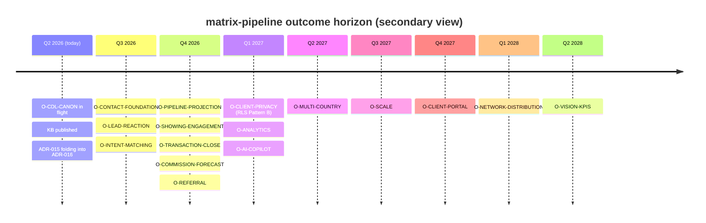

# matrix-pipeline CRM roadmap (outcome-based)

> **TL;DR — where we are / where we are going.** This is the single
> **coordination surface** for the matrix-pipeline 2.0 CRM. It is **outcome-keyed**:
> the primary axis is the product-spec measurable outcomes (KPI groups), NOT the
> calendar. Today the data foundation is being completed (`O-CDL-CANON`,
> in-progress) and the Contacts foundation is starting (`O-CONTACT-FOUNDATION`).
> From there the journey runs through lead reaction, intent matching, pipeline &
> commission forecast, showings/transactions, client privacy, analytics & AI,
> then post-MVP scale (multi-country → scale → client portal → network
> distribution → vision KPIs). Each milestone names the KPI group it moves and
> the FR clusters that deliver it; the quarter is only a secondary `target_horizon`.
>
> **Every agent (Lovable / Cursor / platform-team / business) reads + updates this
> doc before any structural change** (FR / ADR / migration / EF / wiki page that
> touches an outcome). See [#agent-coordination-protocol](#agent-coordination-protocol).
>
> Quick links: [wiki/overview.md#kpis](wiki/overview.md#kpis) (the outcome source) ·
> [wiki/requirements.md](wiki/requirements.md) (FR clusters that deliver them) ·
> [phases.md](phases.md) (current 8-week zoom-in) ·
> [log.md](log.md) (audit trail).

## Verified current state (2026-05-29)

- **Week 0 done**; `matrix-pipeline-2.0` Lovable repo bootstrapped.
- **`O-CDL-CANON` done (this cycle):** 9 new canonical CDL tables migrated +
  RLS-enabled; `contact_listings` (24,979 rows) + `contact_listing_notes`
  re-modeled to canonical RESO and RLS-enabled (gate violation closed);
  `cdl-write` dispatcher + `cdl-contacts-read` + `cdl-contact-listings-read` EFs
  deployed `ACTIVE` and smoke-tested. Landed ADR-016; folds ADR-015 #1/#2/#3/#4.
- **`O-CONTACT-FOUNDATION` starting:** phases.md Week 1 (Contacts & org roster).
- **Roster decision still open** (`O-ROSTER`, blocked): Teams / TeamMembers /
  OUID — ADR-015 #5 (CDL re-add vs SSO-group mapping). Not closed this cycle.
- **`matrix-client-connect` / `matrix-meeting-hub`** run on legacy SSO `contacts`
  on a **separate consolidation track** — out of scope for this roadmap.

## Milestone status legend

Statuses: `planned` · `in-progress` · `done` · `blocked`.

Each milestone row carries: `milestone_id` (outcome-keyed `O-<SLUG>` — the quarter
never lives in the id), `outcome` (the measurable business outcome), `kpi_group`
(a [wiki/overview.md#kpis](wiki/overview.md#kpis) group), `delivers` (BR + FR
clusters from [wiki/requirements.md](wiki/requirements.md)), `canonical_deps` (CDL
tables / EFs the outcome needs), `target_horizon` (quarter — secondary), `status`,
`owner_agent`, `gates` (ADRs / canonical processes), `last_updated`.

## Outcome milestones

### Platform enablement (data foundation)

| id | outcome | kpi_group | delivers | canonical_deps | horizon | status | owner | gates | updated |
|---|---|---|---|---|---|---|---|---|---|
| `O-CDL-CANON` | Every canonical RESO resource the CRM uses lives in CDL, RESO-identical, RLS-gated, write-EF-served | Analytics & platform capabilities | BR-01 / BR-21 / BR-23 | 9 new CDL tables + re-modeled `contact_listings`/`contact_listing_notes` + `cdl-write` dispatcher | Q3 2026 | done | Cursor+platform-team | ADR-016 | 2026-05-29 |

> **`O-CDL-CANON` closed 2026-05-29** — migrations `20260529160000` + `20260529161000` applied to `ofzcokolkeejgqfjaszq`; all 11 tables RLS-enabled (security advisor confirms no `rls_disabled_in_public` on them — the `contact_listings`/`contact_listing_notes` gate violation is closed); `cdl-write` (v2), `cdl-contacts-read`, `cdl-contact-listings-read` deployed `ACTIVE` (`verify_jwt=false`); write + update + history-emit smoke test passed; 24,979 `contact_listings` rows backfilled (0 missing canonical key).

> `O-CDL-CANON` gates every business outcome below.

### KPI group: Contact funnel & lead reaction

| id | outcome | delivers | canonical_deps | horizon | status | owner | updated |
|---|---|---|---|---|---|---|---|
| `O-CONTACT-FOUNDATION` | Single canonical contact + org base, no parallel model | BR-01 / BR-22; `FR-CON-*` / `FR-PC-*` / `FR-ORG-*` | `contacts`, `members`, `offices`, `cdl-contacts-read` + `cdl-write` | Q3 2026 | in-progress | Lovable+Cursor | 2026-05-29 |
| `O-LEAD-REACTION` | Lead-to-deal conversion measurable; follow-up loss reduced; SLA on lead reaction | BR-02 / BR-05; `FR-CFL-*` / `FR-ACT-*` / `FR-REP` (SLA, stale leads/funnels) | `contacts`, `history_transactional` | Q3 2026 | planned | Lovable | 2026-05-29 |

### KPI group: Pipeline & forecast

| id | outcome | delivers | canonical_deps | horizon | status | owner | updated |
|---|---|---|---|---|---|---|---|
| `O-INTENT-MATCHING` | Parallel intents + prospecting + curated matching; engagement tracked | BR-09 / BR-18 / BR-19; `FR-SS-*` / `FR-PROS-*` / `FR-CL-*` | `saved_search`, `prospecting`, `contact_listings` | Q3 2026 | planned | Lovable | 2026-05-29 |
| `O-PIPELINE-PROJECTION` | Transparent 5-stage pipeline derived from canonical state (no stored stage) | BR-03; `FR-FNL-*` | derived (no table) | Q4 2026 | done | Lovable | 2026-06-10 |
| `O-COMMISSION-FORECAST` | GCI/commission forecast per deal & stage; 100% deals against a published `CommissionRule` | BR-04; `FR-FNL-12` / `FR-TM-13` + Commission Engine | `commission_estimate` + `broker_compensation` + `commission_rule` (app-private) | Q4 2026 | done | Lovable+Cursor | 2026-06-10 |

### KPI group: Contracts, commissions, payments

| id | outcome | delivers | canonical_deps | horizon | status | owner | gates | updated |
|---|---|---|---|---|---|---|---|---|
| `O-SHOWING-ENGAGEMENT` | Unified showings / caravans / engagement via the canonical 5-resource chain | BR-12 / BR-13 / BR-23; `FR-SHOW-*` / `FR-CARA-*` / `FR-CL-*` | showing chain (`showings`, `showing`, `showing_request`, `showing_availability`, `lock_or_box`) + `caravan`/`caravan_stop` | Q4 2026 | planned | Lovable | — | 2026-05-29 |
| `O-TRANSACTION-CLOSE` | Offer-to-close lifecycle w/ contract + payment integration; Closed-Won 3-condition rule; payment notifications | BR-14 / BR-20 / BR-24; `FR-TM-*` + contract-system + Finance-ERP integrations | `transaction_management`, `history_transactional` | Q4 2026 | planned | Lovable+Cursor | — | 2026-05-29 |
| `O-REFERRAL` | HNWI referral economy tracked w/ outcome traversal (project-flavour) | `FR-REF-*` | app-private `Referral` → `contacts.contact_key` | Q4 2026 | planned | Lovable | ADR-crm-referral-entity | 2026-05-29 |

### KPI group: Client service & privacy

| id | outcome | delivers | canonical_deps | horizon | status | owner | updated |
|---|---|---|---|---|---|---|---|
| `O-CLIENT-PRIVACY` | HNWI/UHNWI confidentiality, RLS Pattern B, NDA levels, client-base integrity across team changes | BR-07 / BR-08 / BR-16; `FR-CON` privacy / `FR-DOC-*` | RLS Pattern B on the 4 critical CDL tables | Q1 2027 | planned | platform-team | 2026-06-10 |

> **`O-CLIENT-PRIVACY` note (2026-06-10, verified live on `ofzcokolkeejgqfjaszq`).** Risk **R2** (anon/authenticated exposure of engagement PII) is **already closed**: `contacts`, `contact_listings`, `contact_listing_notes` all have RLS **enabled** with a single `service_role`-only `ALL` policy — direct anon/authenticated access is denied; the `cdl-*` EFs (service-role inside, SSO-JWT scope check) are the only gate. A true owner-scoped **Pattern B** on these tables is **blocked on R3**: `contact_listings`/`contact_listing_notes` have **no `owner_id`/`tenant_id`/owner column** and there is no SSO-user → `member_key` mapping, so the Pattern B `owner_id = get_my_record_id_v2()` clamp cannot be expressed; adding a permissive `authenticated` policy without the clamp would *weaken* the current posture. Pattern B here therefore waits on the `O-ROSTER` / member_key-mapping work (ADR-015 #5), not on a fresh migration.

### KPI group: Analytics & platform capabilities

| id | outcome | delivers | canonical_deps | horizon | status | owner | updated |
|---|---|---|---|---|---|---|---|
| `O-ANALYTICS` | Reports/dashboards on canonical state (lead-source, broker activity, lost/stale, segmentation) | BR-06; `FR-REP-*` / `FR-CMM-*` | canonical read paths | Q1 2027 | planned | Lovable | 2026-05-29 |
| `O-AI-COPILOT` | AI matching / copilot foundation, 4-feature floor graduating to full 14 | BR-17; `FR-AI-*` ([wiki/ai.md](wiki/ai.md)) | embeddings on `properties*` + canonical reads | Q1 2027 | planned | Lovable+Cursor | 2026-05-29 |

### Org-model dependency (blocked)

| id | outcome | delivers | horizon | status | owner | gates | updated |
|---|---|---|---|---|---|---|---|
| `O-ROSTER` | Canonical Teams / TeamMembers / OUID roster resolved (CDL re-add vs SSO mapping) | BR-15 / BR-22; `FR-ORG-01` | Q4 2026 | blocked | platform-team | ADR-015 #5 | 2026-05-29 |

### Post-MVP scale outcomes

| id | outcome | horizon | status | owner | updated |
|---|---|---|---|---|---|
| `O-MULTI-COUNTRY` | Cyprus + Hungary + Kazakhstan tenants live (BR-15) | Q2 2027 | planned | platform-team | 2026-05-29 |
| `O-SCALE` | BI Dashboard + Marketing App integration; [performance.md](../../platform/performance.md) p99 contracts enforced | Q3 2027 | planned | platform-team | 2026-05-29 |
| `O-CLIENT-PORTAL` | Client portal + semantic search at scale | Q4 2027 | planned | Lovable+Cursor | 2026-05-29 |
| `O-NETWORK-DISTRIBUTION` | Anywhere Dash bidirectional via [data-distribution-and-stewardship.md](../../architecture/data-distribution-and-stewardship.md), full Sharp SIR network | Q1 2028 | planned | platform-team | 2026-05-29 |
| `O-VISION-KPIS` | Vision KPIs realised — 50-day Qualification→Payment cycle, 90% automation, EUR 115K LTV ([vision/digital-strategy-2026-2028.md](../../vision/digital-strategy-2026-2028.md)) | Q2 2028 | planned | business | 2026-05-29 |

## Outcome horizon (secondary, informational)

## Cross-references

| Milestone | KPI group | FR cluster(s) | Process / integration | ADR |
|---|---|---|---|---|
| `O-CDL-CANON` | Analytics & platform capabilities | data-foundation | [cdl-schema.md](../../data-models/cdl-schema.md), [cdl-crud-contract.md](cdl-crud-contract.md) | ADR-016 |
| `O-CONTACT-FOUNDATION` | Contact funnel & lead reaction | `FR-CON` / `FR-PC` / `FR-ORG` | [wiki/entities.md](wiki/entities.md#contacts) | ADR-015 |
| `O-LEAD-REACTION` | Contact funnel & lead reaction | `FR-CFL` / `FR-ACT` | [wiki/integration.md#history-emission](wiki/integration.md#history-emission) | — |
| `O-INTENT-MATCHING` | Pipeline & forecast | `FR-SS` / `FR-PROS` / `FR-CL` | [wiki/entities.md](wiki/entities.md) | ADR-016 |
| `O-PIPELINE-PROJECTION` | Pipeline & forecast | `FR-FNL` | [wiki/overview.md#pipeline](wiki/overview.md#pipeline) | — |
| `O-COMMISSION-FORECAST` | Pipeline & forecast | `FR-FNL-12` / `FR-TM-13` | [wiki/commission-engine.md](wiki/commission-engine.md) | ADR-028 |
| `O-SHOWING-ENGAGEMENT` | Contracts, commissions, payments | `FR-SHOW` / `FR-CARA` / `FR-CL` | [wiki/architecture.md#phase-2-migration](wiki/architecture.md#phase-2-migration) | ADR-016 |
| `O-TRANSACTION-CLOSE` | Contracts, commissions, payments | `FR-TM` | [wiki/integration.md](wiki/integration.md) | — |
| `O-REFERRAL` | Contracts, commissions, payments | `FR-REF` | [wiki/entities.md#referral](wiki/entities.md#referral) | ADR-crm-referral-entity |
| `O-CLIENT-PRIVACY` | Client service & privacy | `FR-CON` privacy / `FR-DOC` | [../../platform/security-model.md](../../platform/security-model.md) | — |
| `O-ANALYTICS` | Analytics & platform capabilities | `FR-REP` / `FR-CMM` | — | — |
| `O-AI-COPILOT` | Analytics & platform capabilities | `FR-AI` | [wiki/ai.md](wiki/ai.md) | — |
| `O-ROSTER` | Contact funnel & lead reaction | `FR-ORG-01` | [wiki/architecture.md#identity-boundary](wiki/architecture.md#identity-boundary) | ADR-015 #5 |

## Agent coordination protocol {#agent-coordination-protocol}

**This doc is one of four durable artefacts** in the matrix-pipeline subtree
(`INDEX.md` / `log.md` / `AGENTS.md` + this coordination surface). Rules:

- **Before** any PR that creates / modifies an FR, ADR, schema migration, EF, or
  wiki page that affects an outcome milestone: (1) read this doc; (2) update the
  relevant row's `status` + `last_updated` + `owner_agent` + notes; (3) append a
  `roadmap` action entry to [log.md](log.md); (4) cite the `O-*` row in the PR
  description.
- **Transitions:** `planned → in-progress` (set owner + link kickoff PR);
  `in-progress → done` (link closing PR + a log.md `phase-checkpoint`, and confirm
  the backing KPI is observable); `* → blocked` (notes describe blocker + linked
  issue + ETA).
- **New outcomes (scope shifts):** add a row keyed to a KPI group + FR cluster,
  set `status: planned`, justify in notes, append a `roadmap` log entry. **A new
  milestone with no backing FR cluster / KPI is a defect — add the FR first.**
- **Milestone-id naming:** `O-<OUTCOME-SLUG>` (e.g. `O-CDL-CANON`,
  `O-PIPELINE-PROJECTION`). The quarter lives in `target_horizon`, never in the id.

## Update history (append-only; mirrors log.md `roadmap` entries — 5 most recent)

- **2026-06-10** — Week-5 **functionally complete** (skip AI/Week-6). `O-PIPELINE-PROJECTION` + `O-COMMISSION-FORECAST` → **`done`**. Lovable Prompts 1–5 shipped (per-pair pipeline projection; per-country Commission Engine `commission_estimate`/`broker_compensation`/`commission_rule`/`deal_cost_event` + full **Hungary** waterfall ≡ `FalkMiksa.xlsx` with CY/KZ drafts; dual-currency P&L tab + date-versioned rule admin; variance card; `/reports/forecast` + `/reports/variance` live). Cursor C1 (authz = role-config + JWT scope, no SSO keys), C2 (`finance-erp-webhook` + `finance-erp-reconcile` deployed, app `de1e7b0`; operator sets secrets), C3 (RLS R2 closed / Pattern B gated on R3). **ADR-028 finalized** to as-built. Week-7 hardening (Prompts 6 Playwright / 7 seed / 8 polish+demo) still open. See log.md.
- **2026-06-10** — Week-5 kickoff (skip AI/Week-6). `O-PIPELINE-PROJECTION` + `O-COMMISSION-FORECAST` → `in-progress`. **ADR-028** (CRM Commission Engine — app-private ERP-lite; `role_configurations`+JWT-scope authz, **no** `sso_app_permissions`; Finance-ERP reconciliation via `finance-erp-webhook`/`-reconcile`) landed. Verified-live finding on `O-CLIENT-PRIVACY`: R2 already closed (service-role-only RLS on `contacts`/`contact_listings`/`contact_listing_notes`); true Pattern B owner-clamp blocked on R3 (no owner column + no member_key mapping). See log.md.
- **2026-05-29** — `O-CDL-CANON` → `done`. Both CDL migrations applied to
  `ofzcokolkeejgqfjaszq`; 11 tables RLS-enabled (gate violation on
  `contact_listings`/`contact_listing_notes` closed); `cdl-write` (v2) +
  `cdl-contacts-read` + `cdl-contact-listings-read` deployed `ACTIVE`; write +
  history-emit smoke test passed; 24,979 rows backfilled. ADR-016 landed.
- **2026-05-29** — roadmap.md created; bootstrapped with outcome milestones keyed
  to the product-spec KPI groups + FR clusters (Q3 2026 → Q2 2028 horizon).
  `O-CDL-CANON` set `in-progress` (this cycle), `O-CONTACT-FOUNDATION` set
  `in-progress`. Agent coordination protocol active.
