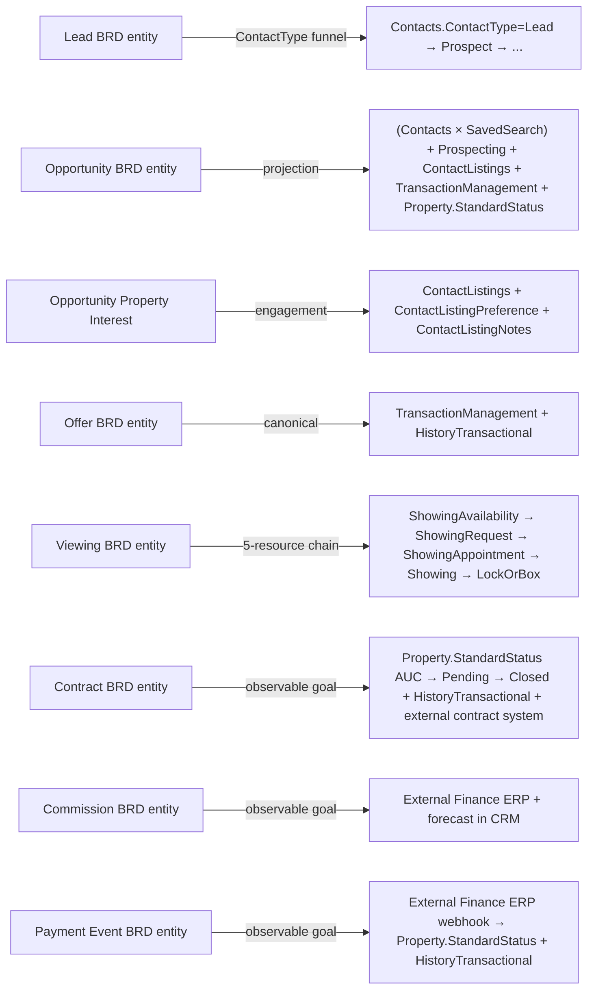

# Architecture — Storage, Identity, CDL access, RESO compliance

> Three Supabase projects (SSO + CDL + CRM app DB), the identity boundary between SSO and CDL Member roster, the access pattern that makes CRM a **client** of CDL via dedicated Edge Functions, the live CDL state (MCP-verified), what's planned for Phase 2+ migration, what stays app-private forever, and the eight RESO compliance gates + escape hatch that govern every implementation decision.

## TOC

- [#three-supabase](#three-supabase)
- [#identity-boundary](#identity-boundary)
- [#cdl-access-pattern](#cdl-access-pattern)
- [#live-cdl-state](#live-cdl-state)
- [#phase-2-migration](#phase-2-migration)
- [#app-private-state](#app-private-state)
- [#kb-sources-of-truth](#kb-sources-of-truth)
- [#compliance-gates](#compliance-gates)
- [#escape-hatch](#escape-hatch)
- [#resource-map](#resource-map)
- [#process-map](#process-map)
- [#crosswalk](#crosswalk)

## Three Supabase projects and ownership boundaries {#three-supabase}

| Project | ID | Owner | Managed from Lovable? | Purpose |
|---|---|---|---|---|
| **SSO** | `xgubaguglsnokjyudgvc` | `matrix-platform-foundation/supabase/` | No | Identity, JWT (ES256), roles, permissions, tenants, SSO admin EFs |
| **CDL** | `ofzcokolkeejgqfjaszq` | `matrix-platform-foundation/supabase-cdl/` | **No** | System-of-record for canonical RESO resources (shared business data) |
| **CRM app DB** | per-app (matrix-pipeline) | CRM team via Lovable | **Yes** | App-private state: workflow, drafts, UI cache, app-local lookups, `role_configurations` |

CDL and SSO are owned by the platform team and evolve via `matrix-platform-foundation`; CRM app DB is owned by the CRM team and evolves via Lovable. CRM **never** holds the CDL service-role key and **never** modifies the CDL schema — all CDL changes go through `matrix-platform-foundation/supabase-cdl/`.

Source: raw/context-v2.md §5a.1.

## Identity boundary {#identity-boundary}

- SSO issues all JWTs (ES256, ADR-011).
- CDL verifies SSO tokens via **Supabase Third-Party Auth** (JWKS URL + issuer from SSO; ADR-012).
- CRM app DB verifies the same SSO JWTs under ordinary RLS (`auth.jwt()` helpers).
- Single identity chain: user authenticates in SSO → gets SSO JWT → the same token is presented to all three projects.
- **Identity / permissions (SSO) vs. business roster (CDL) — two different concepts**:
  - **SSO** stores user identity (account, email, password), roles, groups, scope claims, permissions — everything that answers "can this user log in and what are they allowed to do?". CRM is an SSO client (see [wiki/overview.md#personas](overview.md#personas)).
  - **CDL** stores the canonical RESO business roster (`Member` / `Office` / `OUID` / `Teams` / `TeamMembers`) — who is a licensed broker, in which office / team / OUID — for canonical FK references (`OwnerMemberKey`, `ListAgentKey`, `BuyerAgentKey`). Answers "who is this user in the brokerage's business roster?".
  - **Mapping**: SSO `user_id` ↔ `Member.MemberKey` (either via canonical `Member.MemberAlternateId` as a mapping attribute, or an explicit mapping mechanism in the SSO Console). SSO group ↔ canonical `Teams.TeamKey` (mapping in SSO Console). No parallel org-tables (see [#compliance-gates](#compliance-gates) Roster gate).
  - CRM consumes both: SSO for permission gating and UI access control, CDL `Member` / `Teams` for canonical FK targets and business display (broker name, brokerage, team, office).

Source: raw/context-v2.md §5a.2.

## CRM as a CDL client — access pattern {#cdl-access-pattern}

CRM gets all rights and authority for CDL CRUD **as a client app** via canonical access mechanisms. CRM has no direct access to the CDL service-role key; instead:

- **`ssoClient`** (`xgubaguglsnokjyudgvc`) — auth, roles, permissions, tenants, SSO admin EFs.
- **`cdlClient`** (`ofzcokolkeejgqfjaszq`) — CDL reads under SSO JWT via Third-Party Auth; CDL writes through dedicated EFs invoked from this client.
- **`supabase`** (CRM app DB, Lovable-managed) — app-private data under ordinary RLS keyed off the SSO JWT.

**CDL reads** patterns:
- Filtered property listings → `cdlClient.functions.invoke('listings-search', …)`.
- Anonymous snapshot → `anon .from('properties_published').select(...)` under RLS.
- PII tables (`contacts`, `showings`) — only via CDL EFs with explicit scope check (service-role-only at the RLS layer).

**CDL writes** go through **dedicated EFs** deployed in `matrix-platform-foundation/supabase-cdl/functions/`. Each such EF: `verify_jwt = false`, verifies the SSO JWT itself, checks scope ∈ `SSO_ALLOWED_SCOPES`. A generic `cdl-write` EF in the platform template is not yet built; CRM-specific write-EFs are added per resource as needed.

**User display names**: only via the SSO `resolve-users` EF + React hook `useUserDisplay`. **Never** SQL-join CDL ↔ `sso_users`.

**`mls_sources.kind`** for `matrix-pipeline`: `internal` (`matrix-internal` — target state for all Sharp SIR markets).

Source: raw/context-v2.md §5a.3.

## CDL as-built (live state, MCP-verified 2026-05-18) {#live-cdl-state}

Canonical RESO resources and infrastructure tables already in CDL and available to CRM as a client.

### Canonical RESO resources (with live data)

| Canonical RESO resource | CDL table | Rows | RLS |
|---|---|---|---|
| Property | `public.properties` | 16 014 | ⚠️ disabled |
| Property media | `public.property_media` | 264 095 | ⚠️ disabled |
| Property (anon snapshot) | `public.properties_published` | 13 916 | ✓ enabled |
| PropertyRooms | `public.property_rooms` | 0 | ✓ enabled |
| PropertyUnitTypes | `public.property_unit_types` | 0 | ✓ enabled |
| Member | `public.members` | 129 | ✓ enabled |
| Office | `public.offices` | 59 | ✓ enabled |
| Contacts | `public.contacts` (PII) | 45 073 | ✓ enabled |
| ContactListings | `public.contact_listings` (junction Contacts × Property) | **24 979** | ✓ enabled (2026-05-29, service-role-only) |
| ContactListingNotes | `public.contact_listing_notes` | 0+ | ✓ enabled (2026-05-29, service-role-only) |
| HistoryTransactional | `public.history_transactional` (append-only) | 0 | ✓ enabled |
| OpenHouse | `public.open_houses` (excluded from CRM scope — see [#escape-hatch](#escape-hatch)) | 0 | ✓ enabled |
| ShowingAppointment | `public.showings` | 0 | ✓ enabled |
| InternetTracking | `public.internet_tracking_events` | 0 | ✓ enabled |
| SavedSearch | `public.saved_search` | 0 | ✓ enabled (2026-05-29) |
| Prospecting | `public.prospecting` (PII) | 0 | ✓ enabled (service-role-only) |
| ShowingAvailability | `public.showing_availability` | 0 | ✓ enabled (2026-05-29) |
| ShowingRequest | `public.showing_request` | 0 | ✓ enabled (2026-05-29) |
| Showing (recorded fact) | `public.showing` (≠ `public.showings`) | 0 | ✓ enabled (2026-05-29) |
| LockOrBox | `public.lock_or_box` | 0 | ✓ enabled (service-role-only) |
| Caravan / CaravanStop | `public.caravan` / `public.caravan_stop` | 0 | ✓ enabled (2026-05-29) |
| TransactionManagement | `public.transaction_management` (canonical 4 fields; economics app-private) | 0 | ✓ enabled (2026-05-29) |

### RESO DD metadata (served to FE for tooltips/dropdowns)

| Table | Purpose | Rows |
|---|---|---|
| `public.reso_field_descriptions` | RESO DD field descriptions, served to Atlas FE for help tooltips; seeded from official RESO DD CSV | 2 010 |
| `public.reso_lookup_value_descriptions` | RESO DD lookup values, served with field_descriptions for dropdowns / option-level tooltips | 3 683 |

### Stewardship / extensions

| Table | Purpose |
|---|---|
| `public.property_extension_kv` | RESO / OData extension values without jsonb on `properties`; populated via `cdl_property_kv_sync_from_json_text()` |
| `public.entity_field_locks` | Row-level field locks (companion to `locked_fields` jsonb during migration) |
| `public.property_field_overrides` | Per-field overrides at the record level |
| `public.property_lifecycle_events` | Append-only audit of `Property` lifecycle transitions |

### Control plane / ingestion

| Table | Purpose | Rows |
|---|---|---|
| `public.mls_sources` | Source registry (`internal` / `legacy-internal` / `brand-network` / `external`) | 3 |
| `public.mls_settings` | MLS sync settings | 1 |
| `public.mls_sync_jobs` | Sync job history | 50 |
| `public.mls_sync_state` | State per source | 6 |
| `public.mls_orchestrator_runs` | Orchestrator run history | 187 |
| `public.field_mappings` | Field mappings configuration | 0 |
| `public.ingest_audit` | Ingestion audit log | 548 |
| `cdl_staging.listings_raw` | Raw staging | 490 754 |
| `cdl_staging.listings_mapped` | Mapped staging | 254 916 |
| `cdl_staging.media_staging` | Media staging | 0 |

Source: live state via `user-supabase-cdl` MCP (`list_tables` + introspection 2026-05-18); `docs/data-models/cdl-schema.md`.

### KB drift (flagged for platform team)

> **Drift — Teams** ✅ RESOLVED 2026-05-29: `cdl-schema.md` now reflects the PR1.5 DROP of `public.teams`. Pipeline derives team identity from SSO groups (ADR-015 #5 Option B).

> **Drift — contact tables** ✅ RESOLVED 2026-05-29: `public.contact_listings` + `public.contact_listing_notes` are now documented in `cdl-schema.md` (Phase-2 expansion), adopted into the foundation repo (`20260529161000`), re-modeled to canonical RESO, and **RLS-enabled** (service-role-only). The gate violation is closed.

> **Security advisory** ✅ contact-engagement tables RESOLVED 2026-05-29: `public.contact_listings` (24 979 rows) and `public.contact_listing_notes` now have RLS **enabled** service-role-only (anon/authenticated access revoked); reads go through `cdl-contact-listings-read`, writes through `cdl-write`. The broader RLS-disabled set on ingestion-side tables (`public.properties`, `public.property_media`, `public.property_field_overrides`, `public.mls_*`, `public.ingest_audit`, `cdl_staging.*`) remains a known transitional posture tracked as **S1 backlog** for the platform team (Pattern B); the CDL EF scope check is the access-control mechanism for those in the interim. The EF gate remains the canonical access path even after Pattern-B RLS lands.

> **Naming drift advisory** ✅ RESOLVED 2026-05-29: `cdl-schema.md` now names the ShowingAppointment table `public.showings` (Phase-1) and documents the separate RESO `Showing` recorded-fact table as `public.showing` (Phase-2, `20260529160000`). The two are distinct CDL tables — `public.showings` = ShowingAppointment (booked slot), `public.showing` = Showing (recorded fact). Do not conflate.

## CDL migration status (Phase 2) {#phase-2-migration}

Canonical RESO resources and their CDL landing status. **9 of these landed in CDL on 2026-05-29** (migrations `20260529160000` + `20260529161000`, ADR-016). Each now writes through `cdl-write` and reads via PostgREST/EF; the CRM app DB keeps only the `*_pending` fallback + deal economics.

| Canonical RESO resource | CDL table | Status |
|---|---|---|
| SavedSearch | `public.saved_search` | ✅ landed 2026-05-29 |
| Prospecting | `public.prospecting` | ✅ landed 2026-05-29 (PII) |
| ShowingAvailability | `public.showing_availability` | ✅ landed 2026-05-29 |
| ShowingRequest | `public.showing_request` | ✅ landed 2026-05-29 |
| Showing (separate from ShowingAppointment) | `public.showing` | ✅ landed 2026-05-29 |
| LockOrBox | `public.lock_or_box` | ✅ landed 2026-05-29 |
| Caravan, CaravanStop | `public.caravan`, `public.caravan_stop` | ✅ landed 2026-05-29 |
| TransactionManagement | `public.transaction_management` | ✅ landed 2026-05-29 (canonical 4 fields; economics app-private) |
| Teams | — | Derived from SSO groups (ADR-015 #5 Option B) — not re-introduced to CDL |
| TeamMembers | — | Derived from SSO groups (Option B) |
| OUID | — | Deferred; derive from SSO/`offices` until a canonical need arises |

Source: migrations `20260529160000` + `20260529161000`; ADR-016. As FRs build against these, they target CDL directly (no semantic change).

## App-private state (always CRM app DB, never CDL) {#app-private-state}

Not canonical RESO and not cross-app:

- `Activity` (calls, tasks, follow-ups — CRM workflow state; extended markup for cost attribution — see [wiki/requirements.md#fr-act-activities](requirements.md#fr-act-activities) FR-ACT-10).
- `Document` references (document metadata; files live in external systems).
- Pipeline-state UI cache (5-stage funnel as UI/UX projection — see [wiki/overview.md#pipeline](overview.md#pipeline)).
- Drafts, app-specific lookup tables.
- Any UI preferences, view configs, caches.
- **Deal Commercialization, GCI, and Commission Engine state** ([wiki/commission-engine.md](commission-engine.md)) — operational deal costs, commission rates and rules, computed per-deal P&L and broker compensation. Detailed app-private data model (`DealCostEvent` / `CostRateCard` / `CommissionRule` / `DealPnL` / `BrokerCompensation`), formulas, and FRs are designed in Lovable; the project-flavour deviation is recorded in the [#escape-hatch](#escape-hatch).
- **`Referral`** ([wiki/entities.md#referral](entities.md#referral)) — referrer ↔ referee link with type, outcome, close date. Project-flavour entity outside canonical RESO DD 2.0 (see [#escape-hatch](#escape-hatch)). Stored app-private in CRM app DB; references canonical `Contacts.ContactKey` in CDL via a CRM-app-DB → CDL FK reference (a logical pointer, not a canonical relationship).
- **Exception**: `role_configurations` (CRM role → permission-keys mapping) is co-located with SSO permission keys in the SSO project, not the CRM app DB. CRM reads only, via `ssoClient`. See [#escape-hatch](#escape-hatch) ("role_configurations co-location" row) and [log.md](../log.md) [2026-05-26].

Source: raw/context-v2.md §5a.6.

## KB sources of truth {#kb-sources-of-truth}

- CDL schema: [`../../data-models/cdl-schema.md`](../../../data-models/cdl-schema.md)
- Three-project architecture + EF contracts: [`../../platform/app-template.md`](../../../platform/app-template.md)
- RLS / identity / Third-Party Auth: [`../../platform/security-model.md`](../../../platform/security-model.md)
- ADRs: ADR-011 (ES256), ADR-012 (CDL Third-Party Auth), ADR-013 (CDL/SSO ownership; CDL not linked to Lovable), ADR-014 (CDL as-built vs original 18-table design), ADR-015 (CDL Pipeline EF surface — Proposed), ADR-016 (canonical-into-CDL acceleration — 9 tables + contact_listings re-model + `cdl-write` dispatcher — Accepted 2026-05-29).
- Stewardship / source taxonomy: [`../../architecture/data-distribution-and-stewardship.md`](../../../architecture/data-distribution-and-stewardship.md).
- Pipeline-specific CDL CRUD recipes (Lovable-facing): [`../cdl-crud-contract.md`](../cdl-crud-contract.md). Live reachability matrix iteration copy: `mem://infrastructure/cdl-coverage.md`.

Source: raw/context-v2.md §5a.7.

## RESO compliance gates {#compliance-gates}

- **Schema gate**: no CRM migration may introduce a table/field that doesn't match RESO DD 2.0 (canonical resource + canonical attribute). Any deviation requires an ADR in `matrix-platform-kb/docs/architecture/decisions/` and an explicit pin in [#escape-hatch](#escape-hatch).
- **Status gate**: no state machine in CRM may duplicate `Property.StandardStatus`, `ShowingAppointmentStatus`, `CaravanStatus`, `ContactType`, `ContactStatus`, `ContactListingPreference` with its own enum — only canonical RESO lookups.
- **Audit gate**: every state transition MUST emit a `HistoryTransactional` row (see [wiki/integration.md#history-emission](integration.md#history-emission)).
- **Roster gate**: business roster and org-model (canonical RESO `Member` / `Office` / `OUID` / `Teams` / `TeamMembers`) are sourced **only from CDL**; no parallel org-tables in CRM app DB. User identity (SSO account, roles, groups, scope claims, permissions) is a **separate domain in SSO** (`xgubaguglsnokjyudgvc`), not duplicating the canonical roster: SSO answers "can this user log in and what are they allowed to do?", CDL answers "who is this user in the brokerage's business roster?" (canonical FK targets `OwnerMemberKey` / `ListAgentKey` / `BuyerAgentKey` etc.). Mapping: SSO `user_id` ↔ `Member.MemberKey` via canonical `Member.MemberAlternateId` or an explicit mapping in the SSO Console; SSO group ↔ `Teams.TeamKey` (mapping in SSO Console). See [#identity-boundary](#identity-boundary).
- **Integration gate**: contracts and **actual** payments / commission ledger are **not** first-class CRM data entities. External systems (contract management + Finance ERP) are the sole source of truth for legally significant records; CRM observes them via webhooks and mirrors via `Property.StandardStatus` + `HistoryTransactional`. Permitted deviation: forecast GCI, commission rule engine, per-deal P&L are stored in CRM app-private tables of the [wiki/commission-engine.md](commission-engine.md) subsystem as an advisory tool for the sales broker, with an explicit reconciliation pattern against the actual ledger in external Finance ERP. See [#escape-hatch](#escape-hatch).
- **AI gate**: AI features read and update exclusively canonical resources. Introducing "AI-only" fields not mapped to RESO DD 2.0 is forbidden.
- **CDL access gate**: for any CDL table with RLS disabled, CRM **MUST** go through dedicated CDL EFs with SSO JWT scope check — not via direct anon/authenticated PostgREST. Until table-level RLS is enabled per Pattern B (`security-model.md`), the CDL EF is the only access-control mechanism. Direct PostgREST access from the CRM app layer is forbidden. **2026-05-29:** `public.contact_listings` + `public.contact_listing_notes` are now RLS-enabled (service-role-only) and reached via `cdl-contact-listings-read` / `cdl-write` — the engagement-data violation is closed. The gate still applies to the remaining RLS-disabled ingestion-side tables: `public.properties`, `public.property_media`, `public.property_field_overrides`, `public.mls_*`, `public.ingest_audit`, `cdl_staging.*` (S1 backlog, Pattern B).
- **Pipeline gate**: the 5-stage pipeline is **not** stored as a table. The stage is derived from canonical state ([wiki/overview.md#pipeline](overview.md#pipeline)). Any implementation that materializes `pipeline_stages` as a stand-alone table violates compliance.

Source: raw/context-v2.md §11.5.

## Allowed deviations (escape hatch) {#escape-hatch}

Five explicit deviations from canonical RESO DD 2.0 (three structural + one cosmetic + one storage-location) are accepted at this BRD release:

| Deviation | Canonical alternative | Reason | Status |
|---|---|---|---|
| **`OpenHouse` excluded from CRM scope** | Canonical `OpenHouse` (RESO DD 2.0) | Public open-house format is not used in agency practice; invitation-only showings via the Showing chain (optionally grouped in `Caravan`) | Accepted (see [wiki/entities.md#showing-chain](entities.md#showing-chain), [wiki/entities.md#caravan](entities.md#caravan)) |
| **CRM-internal ERP-lite subsystem Deal Commercialization, GCI, and Commission Engine** — app-private state in CRM app DB for forecast GCI, cost attribution, and broker compensation | Canonical `TransactionManagement` + `HistoryTransactional` + external Finance ERP ([wiki/integration.md#finance-erp-commission](integration.md#finance-erp-commission), [wiki/integration.md#finance-erp-payments](integration.md#finance-erp-payments)) | Canonical RESO has no deal-level P&L / commission ledger resources (transaction-lifecycle Non-goals); `matrix-fm` is entity-level; external Finance ERP remains system of record for actual money flow. The subsystem ([wiki/commission-engine.md](commission-engine.md)) is a forecast + rule engine advisory tool for the sales broker | Accepted. Deliverable: ADR `ADR-XXX: CRM Internal Commission Engine for Sales Brokers` (status TODO) |
| **`Referral` as a self-standing CRM entity** ([wiki/entities.md#referral](entities.md#referral)) — referrer ↔ referee `Contacts` link + `OwnerMemberKey` + referral type + outcome + close date | Canonical RESO DD 2.0 has no `Referral` resource. Alternative via `Contacts ↔ Contacts` + `Contacts.LeadSource=Referral` considered and rejected | Luxury referral economy in HNWI/UHNWI requires structured tracking (referral type, outcome, close date, commission attribution to the referrer) — impossible through only the `LeadSource` lookup or `Contacts ↔ Contacts` relationships which carry no typed fields for attribution / outcome tracking | Accepted. Deliverable: ADR `ADR-XXX: CRM Referral Entity for Luxury Segment` (status TODO); the [wiki/overview.md#reso-policy](overview.md#reso-policy) policy explicitly exempts `Referral` from the no-custom-entities rule |
| **Branding divergence: UI string "Matrix Pipeline 2.0"** | Canonical product identifier `matrix-pipeline` | Product-owner branding decision; canonical identifier preserved everywhere except user-facing UI strings (sidebar, page titles, login screen). No effect on data model, RESO compliance, scope, three-Supabase boundaries, or KB ↔ implementation joins. | Accepted ([log.md](../log.md) 2026-05-26). No ADR required (cosmetic, reversible by single PR). |
| **`role_configurations` co-located with SSO permission keys (SSO project)** | Per [#app-private-state](#app-private-state), app-private state lives in CRM app DB only | SSO Console is the write authority for permission keys + role mappings; mirroring into CRM app DB would create a two-source-of-truth problem. CRM reads only, via `ssoClient` under SSO JWT. | Accepted ([log.md](../log.md) 2026-05-26). No ADR required (read-only consumer pattern; behaviorally indistinguishable from a CRM-app-DB mirror). |

If new deviations arise later (e.g. an attribute absent from RESO DD 2.0 but critical for luxury), they must be:

1. Justified by an ADR in `matrix-platform-kb/docs/architecture/decisions/`.
2. Recorded in `matrix-platform-kb/docs/data-models/platform-extensions.md` (with `x_sm_` prefix and reason).
3. Listed here with a reference to the ADR.
4. Accompanied by a roll-back plan (for when/if RESO DD adds the corresponding canonical attribute).

Source: raw/context-v2.md §11.6.

## Resource map — canonical RESO → wiki section {#resource-map}

| Canonical RESO resource | KB doc | Used in this wiki |
|---|---|---|
| `Contacts` | [`reso-dd-kb/.../contacts.md`](../../../data-models/reso-dd-kb/wiki/agent-docs/resources/contacts.md) | [wiki/entities.md#contacts](entities.md#contacts), [wiki/requirements.md#fr-con-contacts](requirements.md#fr-con-contacts), [wiki/processes.md#contact-funnel](processes.md#contact-funnel) |
| `ContactListings` | [`reso-dd-kb/.../contact_listings.md`](../../../data-models/reso-dd-kb/wiki/agent-docs/resources/contact_listings.md) | [wiki/entities.md#contact-listings](entities.md#contact-listings), [wiki/requirements.md#fr-cl-contact-listings](requirements.md#fr-cl-contact-listings) |
| `ContactListingNotes` | [`reso-dd-kb/.../contact_listing_notes.md`](../../../data-models/reso-dd-kb/wiki/agent-docs/resources/contact_listing_notes.md) | [wiki/entities.md#contact-listing-notes](entities.md#contact-listing-notes) |
| `SavedSearch` | [`reso-dd-kb/.../saved_search.md`](../../../data-models/reso-dd-kb/wiki/agent-docs/resources/saved_search.md) | [wiki/entities.md#saved-search](entities.md#saved-search), [wiki/requirements.md#fr-pros-prospecting](requirements.md#fr-pros-prospecting) |
| `Prospecting` | [`reso-dd-kb/.../prospecting.md`](../../../data-models/reso-dd-kb/wiki/agent-docs/resources/prospecting.md) | [wiki/entities.md#prospecting](entities.md#prospecting), [wiki/requirements.md#fr-pros-prospecting](requirements.md#fr-pros-prospecting) |
| `Member` / `Office` / `OUID` / `Teams` / `TeamMembers` | [`reso-dd-kb/.../`](../../../data-models/reso-dd-kb/wiki/agent-docs/resources/) | [wiki/entities.md#member-office-team](entities.md#member-office-team) |
| `ShowingAvailability` / `ShowingRequest` / `ShowingAppointment` / `Showing` / `LockOrBox` | [`reso-dd-kb/.../showing.md`](../../../data-models/reso-dd-kb/wiki/agent-docs/resources/showing.md) | [wiki/entities.md#showing-chain](entities.md#showing-chain), [wiki/requirements.md#fr-show-showings](requirements.md#fr-show-showings) |
| `Caravan` / `CaravanStop` | [`reso-dd-kb/.../caravan.md`](../../../data-models/reso-dd-kb/wiki/agent-docs/resources/caravan.md) | [wiki/entities.md#caravan](entities.md#caravan), [wiki/requirements.md#fr-cara-caravan](requirements.md#fr-cara-caravan) |
| `TransactionManagement` | [`reso-dd-kb/.../transaction_management.md`](../../../data-models/reso-dd-kb/wiki/agent-docs/resources/transaction_management.md) | [wiki/entities.md#transaction-management](entities.md#transaction-management), [wiki/requirements.md#fr-tm-transactions](requirements.md#fr-tm-transactions) |
| `HistoryTransactional` | [`reso-dd-kb/.../history_transactional.md`](../../../data-models/reso-dd-kb/wiki/agent-docs/resources/history_transactional.md) | [wiki/entities.md#history-transactional](entities.md#history-transactional), [wiki/integration.md#history-emission](integration.md#history-emission) |
| `Property` | [`reso-dd-kb/.../property.md`](../../../data-models/reso-dd-kb/wiki/agent-docs/resources/property.md) | [wiki/entities.md#property](entities.md#property), [wiki/integration.md#listing-module](integration.md#listing-module) |

Source: raw/context-v2.md §11.2.

## Process map — canonical RESO processes → wiki section {#process-map}

| Canonical process | KB doc | Used in this wiki |
|---|---|---|
| Listing lifecycle | [`canonical-processes/processes/listing-lifecycle.md`](../../../business-processes/canonical-processes/processes/listing-lifecycle.md) | [wiki/processes.md#offer-to-closing](processes.md#offer-to-closing), [wiki/overview.md#pipeline](overview.md#pipeline), [wiki/integration.md](integration.md) |
| Showing lifecycle | [`canonical-processes/processes/showing-lifecycle.md`](../../../business-processes/canonical-processes/processes/showing-lifecycle.md) | [wiki/processes.md#showing-process](processes.md#showing-process), [wiki/requirements.md#fr-show-showings](requirements.md#fr-show-showings) |
| Caravan lifecycle | [`canonical-processes/processes/caravan-lifecycle.md`](../../../business-processes/canonical-processes/processes/caravan-lifecycle.md) | [wiki/requirements.md#fr-cara-caravan](requirements.md#fr-cara-caravan) |
| Lead → Contact lifecycle | [`canonical-processes/processes/lead-contact-lifecycle.md`](../../../business-processes/canonical-processes/processes/lead-contact-lifecycle.md) | [wiki/processes.md#contact-funnel](processes.md#contact-funnel) |
| Prospecting + SavedSearch delivery | [`canonical-processes/processes/prospecting-and-saved-search-delivery.md`](../../../business-processes/canonical-processes/processes/prospecting-and-saved-search-delivery.md) | [wiki/processes.md#property-matching](processes.md#property-matching), [wiki/requirements.md#fr-pros-prospecting](requirements.md#fr-pros-prospecting) |
| Transaction lifecycle | [`canonical-processes/processes/transaction-lifecycle.md`](../../../business-processes/canonical-processes/processes/transaction-lifecycle.md) | [wiki/processes.md#offer-to-closing](processes.md#offer-to-closing), [wiki/requirements.md#fr-tm-transactions](requirements.md#fr-tm-transactions), [wiki/integration.md#contract-system](integration.md#contract-system), [wiki/integration.md#finance-erp-commission](integration.md#finance-erp-commission), [wiki/integration.md#finance-erp-payments](integration.md#finance-erp-payments) |
| History & Audit log | [`canonical-processes/processes/history-and-audit-log.md`](../../../business-processes/canonical-processes/processes/history-and-audit-log.md) | [wiki/integration.md#history-emission](integration.md#history-emission), [wiki/overview.md#pipeline](overview.md#pipeline) |

Source: raw/context-v2.md §11.3.

## Crosswalk — previous BRD model → canonical RESO {#crosswalk}

Source: raw/context-v2.md §11.4.
