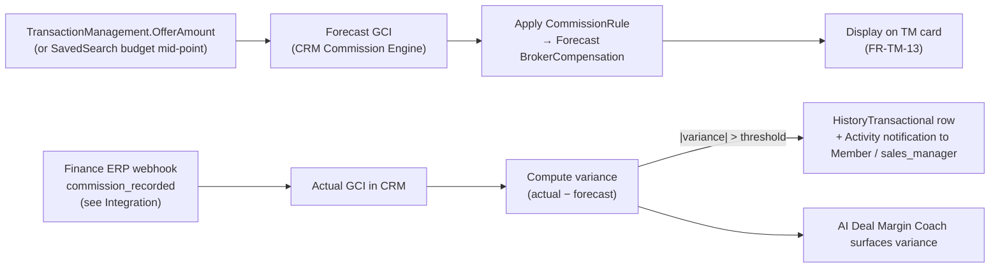

> **As-built (2026-06-10).** This subsystem is now **implemented** in `matrix-pipeline` Week 5 — see [ADR-028](../../../architecture/decisions/ADR-028.md#implementation-status-as-built) for the shipped artefacts. The design below is preserved as the originating BRD; where it says "designed in Lovable during Phase 5", the **as-built** shape is: app-private tables `commission_estimate` (per **listing/sales-contract**, not per-`transaction_key` — replaces the conceptual `DealPnL`), `broker_compensation`, **country-scoped date-versioned `commission_rule`**, `deal_cost_event`, `cost_rate_card`. The first published jurisdiction is **Hungary**, computed by `src/lib/commission/compute.ts` to match `raw/Deal_Hungary_PL FalkMiksa.xlsx` exactly; Cyprus + Kazakhstan are drafts. Reconciliation runs through the `finance-erp-webhook` + `finance-erp-reconcile` EFs ([#reconciliation](#reconciliation)). Reports live at `/reports/forecast` + `/reports/variance`.

# Commission Engine — CRM-internal ERP-lite for sales-broker P&L

> The sales broker must, at every funnel stage, (a) understand the structure of their commission payouts, (b) forecast deal-level GCI, and (c) see deal-level P&L (revenue − attributed costs) to decide "pursue / drop / escalate". This is a **CRM-internal ERP-lite subsystem**. It is an **explicit project-flavour deviation** from canonical RESO DD 2.0 ([wiki/architecture.md#escape-hatch](architecture.md#escape-hatch)). State lives in **CRM app DB** (Lovable-managed), never in CDL or SSO. Reconciliation with the external Finance ERP (legal source of truth for actual money) is via the pattern in [#reconciliation](#reconciliation).

## TOC

- [#overview](#overview)
- [#scope](#scope)
- [#data-model-stub](#data-model-stub)
- [#capabilities](#capabilities)
- [#reconciliation](#reconciliation)
- [#deviation](#deviation)

## Overview {#overview}

**Business problem.** The sales broker pursues a deal across legal support, marketing, conferences, showings, negotiation. To compensate the broker correctly the agency must (i) capture per-deal operational costs, (ii) project GCI and net margin at every funnel stage, (iii) translate that into an explainable broker compensation under published commission rules.

**Architectural positioning.** This is a CRM-internal ERP-lite subsystem inside `matrix-pipeline`. Subsystem state lives **app-private in CRM app DB** (Lovable-managed) — not in CDL, not in SSO. The subsystem **does not** duplicate:

- `matrix-fm` (the platform Financial Management) — `matrix-fm` operates at entity level (legal entity, BU, annual plan, CORE allocation), not deal level.
- The external Finance ERP ([wiki/integration.md#finance-erp-commission](integration.md#finance-erp-commission), [wiki/integration.md#finance-erp-payments](integration.md#finance-erp-payments)) — the Finance ERP is the **system of record for actual money flow** (legally significant ledger of commissions and payments). The Commission Engine is an **operational advisory tool** for the broker.
- Canonical RESO — the subsystem **does not introduce new first-class data entities** in the RESO domain; it operates on app-private state that references canonical RESO keys (`TransactionManagementKey`, `MemberKey`, `Property.ListPrice` etc.) in CDL.

Source: raw/context-v2.md §9.15.

## Scope — inside vs outside {#scope}

| Concern | Inside CRM (Commission Engine, app-private) | Outside CRM (external Finance ERP) |
|---|---|---|
| Per-deal **forecast** GCI / costs / net margin | ✓ | — |
| Per-broker **forecast** compensation via rule engine | ✓ | — |
| Per-deal **actual** GCI / commission split | — | ✓ (legal ledger) |
| Invoicing, taxes, currency conversion, bank reconciliation | — | ✓ |
| Variance computation forecast vs actual | ✓ (computed on Finance-ERP webhook) | (source of actual) |
| Rule engine + admin UI to publish commission rules | ✓ | — |
| Sales-broker advisory ("pursue / drop / escalate") | ✓ via FR-AI-MAR | — |

## Data model {#data-model-stub}

**As-built** app-private tables in the Pipeline App DB (`kzvhqgpedapzqmwgikrw`), Pattern B RLS, authored by Lovable (Prompts 2 + 2b). The conceptual BRD names map as follows:

| Table (as-built) | BRD concept | Role |
|---|---|---|
| `deal_cost_event` | `DealCostEvent` | A single attributed operational cost; `cost_category` enum (legal / marketing / conference / showing / negotiation / client_care / research / other + the Prompt-2b additions); manual or auto-derived from a tagged `Activity` (FR-ACT-10); keyed by `listing_key` (+ optional `transaction_key`) |
| `cost_rate_card` | `CostRateCard` | Reference rates (optionally `country_code`-scoped) applied when a cost event carries no custom amount |
| `commission_rule` | `CommissionRule` | **Country-scoped, date-versioned** rule: `country_code` (CY/HU/KZ), `rule_type`, `params jsonb` (jurisdiction formula — agency-fee %, VAT, statutory/referral/royalty/corporate-tax, tiers, splits), optional `office_id`/`property_type`, `effective_from`/`effective_to`, `priority`, `published_yn`. Admin UI = `CommissionRuleAdminPanel` gated by the `commission:admin` action key |
| `commission_estimate` | `DealPnL` (generalized) | Per **listing/sales-contract** estimate (subject = `listing_key`; optional `transaction_key`/`contact_key`): resolved `country_code` + rule, `base_amount`/`base_source`, full waterfall (`gross_commission` → `net_commission` → referral → royalty → costs → gross profit → broker fees → PBT → corporate tax → net profit), `computation jsonb`, dual-currency FX, narrative + overrides; plus `actual_gci`/`variance` written server-side on reconciliation |
| `broker_compensation` | `BrokerCompensation` | Per-`member_key` payout breakdown (net + gross) on the listing/deal |

All references to canonical RESO keys (`listing_key`, `transaction_key`, `member_key`, `contact_key`) are **logical pointers across projects**, not DB foreign keys to CDL; CDL is **read-only** to the engine (broker-scope read EFs). A **rule resolver** picks the applicable `commission_rule` by `country_code` (derived from the listing's CDL attributes), optional `property_type`/`office_id`, today within `[effective_from, effective_to)`, highest `priority`, `published_yn`. The first published jurisdiction is **Hungary** (`compute.ts` ≡ `raw/Deal_Hungary_PL FalkMiksa.xlsx`); CY + KZ are drafts.

Source: raw/context-v2.md §9.15; [ADR-028](../../../architecture/decisions/ADR-028.md).

## High-level capabilities {#capabilities}

(Implementation details designed in Lovable during Phase 5. The BRD records the capabilities only.)

- **Capture operational deal costs** (legal / marketing / conferences / showings / negotiation / client-care / research / other) via `Activity` tagging (FR-ACT-10) and/or manual entry.
- **Forecast GCI per funnel stage** based on `ListPrice` or `OfferAmount` × commission rate × stage probability (FR-FNL-12 precedence: `OfferAmount` (a) > `SavedSearch` budget mid-point (b); switching emits `HistoryTransactional` row).
- **Configurable broker compensation rule engine** — % of GCI, tiers, split by contribution, base + bonus, team override, composite. Rule types, formulas, scope, priority defined in Lovable.
- **Per-deal P&L and forecast broker compensation** visible to the broker and the manager on the TM card (FR-TM-13).
- **Reconciliation at close**: actual GCI / payment → recompute compensation → variance alert ([#reconciliation](#reconciliation)).
- **AI Deal Margin Coach** ([wiki/ai.md#deal-margin-coach](ai.md#deal-margin-coach)) — natural-language explanation + anomaly detection + "pursue / drop / escalate" suggestions on top of the subsystem.

Source: raw/context-v2.md §9.15.

## Reconciliation with external Finance ERP {#reconciliation}

**Pattern**:

1. CRM forecasts GCI + broker compensation at each funnel stage; stores results in app-private computed views (`DealPnL`, `BrokerCompensation`).
2. On `OfferAmount` change (offer, counter-offer, amended offer), the subsystem recomputes; emits `HistoryTransactional` (`MajorChangeType = Forecast base change` per FR-FNL-12, or `MajorChangeType = Forecast recompute`).
3. At close, the external Finance ERP pushes a webhook (e.g. `commission_recorded`) with actual GCI + final split — see [wiki/integration.md#finance-erp-commission](integration.md#finance-erp-commission).
4. CRM ingests the actual into the subsystem; reruns the compensation derivation; computes variance forecast vs actual.
5. If `|variance| > threshold` (configured in admin UI), CRM emits a `HistoryTransactional` row and an `Activity` notification for the responsible `Member` / sales manager.
6. The AI Deal Margin Coach ([wiki/ai.md#deal-margin-coach](ai.md#deal-margin-coach)) surfaces the variance and proposes a root-cause analysis.

**Closed Won gating** ([wiki/overview.md#pipeline](overview.md#pipeline)): `Property.StandardStatus = Closed` + full-payment webhook from ERP ([wiki/integration.md#finance-erp-payments](integration.md#finance-erp-payments)) + an existing `TransactionManagement` row + reconciliation in this subsystem completed.

**What CRM does NOT do**:

- Maintain a legally significant ledger.
- Issue invoices.
- Pay out money.
- Generate AI-modified commission rules or cost rates (FR-AI-MAR-03).

Forecast and compensation derivation are an **operational advisory tool**, not a legal record.

Source: raw/context-v2.md §9.15, §10.9, §10.10.

## Why this is in CRM (escape hatch) {#deviation}

Canonical RESO DD 2.0 has no deal-level P&L or commission-ledger resources — the canonical [`canonical-processes/processes/transaction-lifecycle.md`](../../../business-processes/canonical-processes/processes/transaction-lifecycle.md) explicitly says under Non-goals: *"No commission ledger; project flavours encode that. No escrow milestones; project flavours encode them."*

`matrix-fm` covers entity-level (legal entity, BU, annual plan) — not deal level.

The external Finance ERP holds the legal ledger of actual money — not the operational advisory forecast a sales broker needs at every funnel stage.

Therefore the BRD accepts an **explicit project-flavour deviation**, scoped to CRM app DB, with a published escape-hatch entry — see [wiki/architecture.md#escape-hatch](architecture.md#escape-hatch).

**Deliverable** (done): [ADR-028](../../../architecture/decisions/ADR-028.md) — *CRM-internal Commission Engine (ERP-lite); app-private, per-country rules, role-config + JWT-scope authz, Finance-ERP reconciliation* — **Accepted + implemented** (2026-06-10).

Source: raw/context-v2.md §11.6.
