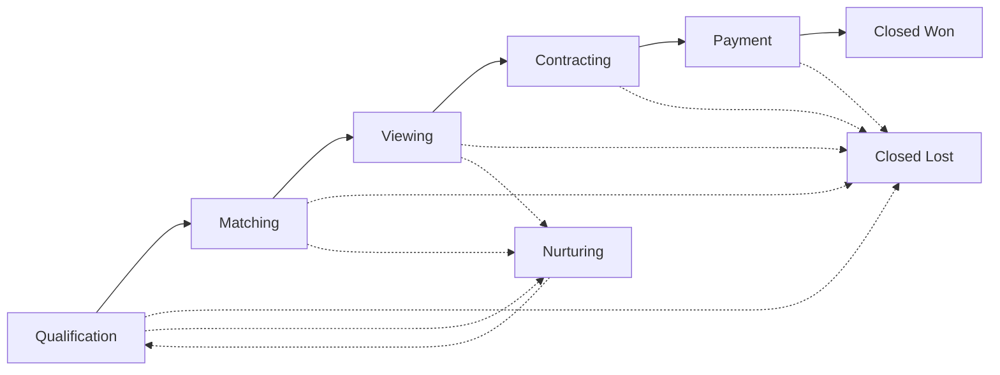

# Overview — `matrix-pipeline` CRM

> The Sharp Matrix CRM is the luxury-real-estate sales pipeline for Sharp SIR in Cyprus, Hungary, and Kazakhstan. It is built **strictly on canonical RESO DD 2.0** (no `x_*` extensions) with two documented project-flavour exceptions: a self-standing `Referral` entity and an internal ERP-lite Commission Engine. Canonical RESO resources live in the **CDL** (platform-managed Supabase project `ofzcokolkeejgqfjaszq`); CRM is a CDL **client** via dedicated CDL Edge Functions under SSO JWT scope.

## TOC

- [#foundation](#foundation)
- [#scope](#scope)
- [#principles](#principles)
- [#personas](#personas)
- [#kpis](#kpis)
- [#pipeline](#pipeline)
- [#reso-policy](#reso-policy)

## Canonical foundation {#foundation}

CRM is built strictly on canonical RESO DD 2.0 without project extensions. All business entities are canonical RESO resources. Concepts not present in canonical RESO (contracts, commissions, payments) are realized through `Property.StandardStatus` transitions, `HistoryTransactional` events, and external system integrations — they are **not** stored in CRM as first-class data model entities.

Canonical RESO resources are physically stored in the **Matrix CDL (Common Data Layer)** — a separate Supabase project `ofzcokolkeejgqfjaszq`, system-of-record for shared business data of the Sharp Matrix platform, managed by the platform engineer (`matrix-platform-foundation/supabase-cdl/`). CDL is **not** managed from Lovable. The CRM `matrix-pipeline` is built in **Lovable**, which manages its own Supabase project (app DB) for app-private state (drafts, workflow, UI cache). CRM acts as a **client** of the CDL with full CRUD rights on canonical data via canonical access mechanisms (`cdlClient` + dedicated CDL Edge Functions under SSO JWT with scope check). For details on the as-built CDL state, three-project architecture, RLS, and identity, see [wiki/architecture.md](architecture.md) and the KB (`docs/data-models/cdl-schema.md`, `docs/platform/app-template.md`, `docs/platform/security-model.md`, ADR-012 / ADR-013 / ADR-014).

For deal processing and sales-broker commission calculation, CRM contains its own **ERP-lite subsystem** — Deal Commercialization, GCI, and Commission Engine ([wiki/commission-engine.md](commission-engine.md)). It handles per-deal cost attribution, GCI forecasting, and broker commission rule engine; its data lives in the **CRM app DB** as app-private tables (`deal_cost_event` / `cost_rate_card` / `commission_rule` / `commission_estimate` / `broker_compensation`; as-built per [ADR-028](../../../architecture/decisions/ADR-028.md)), outside canonical RESO. This is an **explicit project-flavour deviation** from RESO DD 2.0, documented in the escape hatch ([wiki/architecture.md#escape-hatch](architecture.md#escape-hatch)); justification: canonical RESO has no deal-level P&L / commission ledger resources (see transaction-lifecycle Non-goals), and `matrix-fm` covers entity-level reporting rather than deal-level forecast. **Actual money flow** (the legally significant ledger of commissions and payment events) stays with an external Finance ERP ([wiki/integration.md#finance-erp-commission](integration.md#finance-erp-commission), [wiki/integration.md#finance-erp-payments](integration.md#finance-erp-payments)); CRM and the external ERP are connected via a reconciliation pattern ([wiki/commission-engine.md#reconciliation](commission-engine.md#reconciliation)).

Source: raw/context-v2.md §1.

## Scope {#scope}

### In scope

All sales- and contact-management capabilities below are built on canonical RESO DD 2.0:

- `Contacts` management (identity + personal preferences + `ContactType` funnel).
- Organizational model: `Member`, `Office`, `OUID`, `Teams`, `TeamMembers`.
- Contact funnel: `Contacts.ContactType` graduation (Lead → Prospect → Ready to Buy → Buyer / Seller / …).
- Commercial intent management: `SavedSearch` + `Prospecting` (multiple parallel intents per Contact).
- **5-stage funnel** (Qualification / Matching / Viewing / Contracting / Payment) as a UI/UX projection of canonical state (see [#pipeline](#pipeline)).
- Activity, task, and follow-up management (`Activity`).
- Showing management via the canonical **5-resource Showing chain** (`ShowingAvailability` → `ShowingRequest` → `ShowingAppointment` → `Showing` → `LockOrBox`).
- `Caravan` + `CaravanStop` for luxury curated tours and invitation-only showings.
- Client engagement with properties via `ContactListings` + `ContactListingPreference` + `ContactListingNotes`.
- Offer and transaction management via canonical `TransactionManagement` + `HistoryTransactional`.
- **Deal Commercialization, GCI, and Commission Engine subsystem** ([wiki/commission-engine.md](commission-engine.md)): per-deal cost attribution via Activity tagging, GCI forecasting at every funnel stage, broker commission rule engine (PercentOfGCI / TierBased / SplitBased / BaseAndBonus / TeamOverride / Composite), and per-deal P&L for sales-broker "pursue / drop / escalate" decisions. App-private storage in CRM app DB; reconciliation with the external Finance ERP — see [wiki/integration.md#finance-erp-commission](integration.md#finance-erp-commission) and [wiki/integration.md#finance-erp-payments](integration.md#finance-erp-payments).
- Communications management.
- Basic sales-document storage (`Document`).
- Reports and dashboards on canonical state.
- Roles, access rights, confidentiality.
- Integration with the Listing Management Module (`Property` + `Property.StandardStatus` + push events, see [wiki/integration.md#listing-module](integration.md#listing-module)).
- Integration with external systems: contract management, Finance ERP (see [wiki/integration.md](integration.md)).
- Integration with website, email, calendar, WhatsApp, marketing tools.
- Data import and export.
- Audit log via `HistoryTransactional` ([wiki/integration.md#history-emission](integration.md#history-emission)) for all key state transitions.

### Out of scope (lives in Listing Management Module)

- Creating and editing properties.
- Managing full listing cards.
- Managing photos, videos, floor plans, and media library.
- Managing technical characteristics.
- Managing listing descriptions for the website and portals (SEO copy included).
- Managing listing publication and publication status.
- Managing full listing legal documentation as master data.
- Managing listing price as master data.
- Managing the property owner as part of the listing.

### CRM ↔ Listing Module boundary

| Listing Module owns | CRM owns |
|---|---|
| What a property is — price, description, media, characteristics, availability, publication, listing status | What happens to the property in the process of selling it to a client — offered, sent via WhatsApp, shown, liked, dismissed, offer made, negotiations |

Source: raw/context-v2.md §3.1, §3.2, §3.3.

## Design principles {#principles}

- **CRM sells. The Listing Module manages properties.** CRM uses listing data but never edits property master data.
- **Every active client must have a next step.** For active leads and deals the system must require a next action and a due date.
- **The relationship history matters more than the single transaction.** Store not only deals but also interests, communications, preferences, and long-term potential.
- **Confidentiality is part of the product.** Luxury requires private clients, off-market deals, NDAs, restricted access, audit log.
- **Data must drive sales management.** Reports on pipeline, broker activity, lead sources, showings, offers, lost reasons, and commission forecast.

Source: raw/context-v2.md §2.

## Users and roles {#personas}

Roles, permissions, and groups are **managed in SSO** (the platform project `xgubaguglsnokjyudgvc`). CRM `matrix-pipeline` is a **client** of SSO: it receives an authenticated user via an SSO JWT (ES256), reads `roles` / `groups` / `scope` claims, and applies them for UI gating + RLS on CRM app DB / CDL access. CRM **does not** define roles, permissions, or group membership — the platform administrator does that through the SSO Console. The table below is a **functional taxonomy** of roles the product expects to see in SSO claims; the concrete `SSO group → CRM role` mapping is configured in platform admin-config (`role_configurations` on the CRM app DB side + SSO Console on the SSO side).

| Role | Primary tasks in the system |
|---|---|
| Broker / Agent | Manage clients, leads, deals, activities, showings, offers, follow-ups |
| Senior Broker / Team Lead | Oversee team deals, assist with negotiations, control data quality |
| Head of Sales / Sales Manager | Manage pipeline, commission forecast, broker activity, SLAs |
| Marketing Manager | Analyze lead sources, client segments, campaigns, nurturing |
| Listing Manager | Manages listings in a separate Listing Module; integrates with CRM |
| Operations / Admin | Manage data, access rights, reference data, import/export |
| Managing Partner / Owner | Strategic analytics, revenue, commission forecast, team performance |
| Client Service / Concierge | VIP service, relocation, lifestyle requests, client support |
| Compliance / Legal | KYC/AML, documents, contracts, legal deal stages, audit trail |

Source: raw/context-v2.md §4. See also: [wiki/architecture.md#identity-boundary](architecture.md#identity-boundary).

## Measurable outcomes (KPIs) {#kpis}

Each KPI below is framed as an observable outcome to which a metric can be attached.

### Contact funnel and lead reaction

- Increase lead-to-deal conversion (`Contacts.ContactType` graduation Lead → Prospect → Buyer / Seller).
- Reduce lead loss due to missing follow-up (Stale Funnels report — see [wiki/requirements.md#fr-rep-reporting](requirements.md#fr-rep-reporting)).
- Improve broker reaction speed to inbound leads (SLA on Lead-state `Contacts`).

### Pipeline and forecast

- Transparent pipeline for agency leadership built on a UI/UX projection of canonical state ([#pipeline](#pipeline)).
- Improved commission income forecasting (forecast commission = base × rate × probability — see [wiki/requirements.md#fr-fnl-funnel-canonical](requirements.md#fr-fnl-funnel-canonical) FR-FNL-12).
- Per-deal GCI forecasting at every funnel stage and transparency of commission structure for each sales broker (see [wiki/commission-engine.md](commission-engine.md): forecast GCI, forecast net margin, forecast `BrokerCompensation` on the TM card).
- Reduce variance between forecast and actual GCI to a target level via reconciliation with the external Finance ERP (see [wiki/commission-engine.md#reconciliation](commission-engine.md#reconciliation), [wiki/integration.md#finance-erp-commission](integration.md#finance-erp-commission)).
- 100% of deals have an explicit calculation against a published `CommissionRule` (PercentOfGCI / TierBased / SplitBased / BaseAndBonus / TeamOverride / Composite), no hidden manual overrides.

### Contracts, commissions, payments

- Automate contract-lifecycle support via webhook integration with the external contract system and automatic `Activity` reminders on key dates.
- Reduce manual labour in commission calculation, accrual, and reconciliation: forecasted commission lives in CRM, actual ledger is mirrored from external Finance ERP.
- Near-real-time payment notifications (`deposit_received` / `partial_payment` / `full_payment` / `refund`) with automatic `Property.StandardStatus` updates and `HistoryTransactional` emission.

### Client service and privacy

- Higher quality of work with VIP / private / HNWI / UHNWI clients (privacy level on `Contacts`, RLS, NDA levels on `Document`).
- Client base integrity across team changes (canonical `OwnerMemberKey → Member`, unified history via `HistoryTransactional`).
- Unified management of showings, offers, and negotiations via the canonical Showing chain and `TransactionManagement`.

### Analytics and platform capabilities

- A single standard for managing `Contacts`, `SavedSearch`, `ContactListings`, and related canonical resources.
- Improved analytics on `Contacts.LeadSource`, broker activity, showings, offers, lost reasons.
- Foundation for automation, AI matching, the AI Broker Co-Pilot, and predictive models (see [wiki/ai.md](ai.md)).

Source: raw/context-v2.md §3.4.

## Pipeline as canonical-state projection {#pipeline}

As of [ADR-034](../../../architecture/decisions/ADR-034.md) (2026-06-17), refined by [ADR-035](../../../architecture/decisions/ADR-035.md) (2026-06-18), the CRM has a **stored `Opportunity` super-resource** (`opportunity` + `opportunity_link` in the **App DB**, Lovable-owned — see [opportunity-model.md](../../../data-models/opportunity-model.md)) that is the **explicit subject** of the pipeline, aggregating the contact, saved searches, contact listings, the Showing chain, caravans, referrals, and the offer `TransactionManagement`. **The pipeline *stage* is still NOT stored** — there is no `stage` column and no `pipeline_stages` table; the 5-stage funnel position is a **calculated projection** of the linked sub-resources' canonical lifecycles (`deriveOpportunityStage`, reusing the ADR-029 rules below), so it cannot drift from canonical state. The Pipeline gate is preserved: a stored *anchor* is allowed, a stored *stage* is not.

> **History note.** Before ADR-034 the pipeline subject was the implicit pair `(Contacts × SavedSearch)` + related `Prospecting` / `ContactListings` / Showing chain / `TransactionManagement` / target `Property.StandardStatus`, with no stored anchor at all. The stage-derivation rules are unchanged; only the subject became an explicit stored Opportunity. One Contact can still have **multiple parallel intents** — now modelled as multiple Opportunities (or multiple linked `SavedSearch` rows on one Opportunity), each with its own calculated stage.

### Stage derivation (canonical-state rules)

A stage is a **derived state**, not a stored field.

| Stage | Derivation from canonical RESO state |
|---|---|
| **Qualification** | `Contacts.ContactType ∈ {Lead, Prospect}` AND no active `SavedSearch+Prospecting` for that intent. |
| **Matching** | One of two conditions per `SavedSearch` direction: **(a)** ≥1 `SavedSearch` with `Prospecting.ActiveYN=true` AND ≥1 `ContactListings.ListingSentTimestamp`; **(b)** ≥1 `ContactListings.ListingSentTimestamp` for properties related to this `SavedSearch` without an active `Prospecting` (manual broker send). `ContactListings ↔ SavedSearch` link uses (i) an explicit `SavedSearchKey` on `ContactListings` if present, else (ii) a heuristic match — `ContactListings.Property` falls within the `SavedSearch.SearchQuery` filter result as of `ListingSentTimestamp`. Method (i) preferred; (ii) is a fallback. Condition (b) without active `Prospecting` triggers a soft prompt to the broker to create a `Prospecting` row for the `(Contacts, SavedSearch)` pair (FR-PROS-13, non-blocking). |
| **Viewing** | ≥1 `ShowingAppointment` (Pending / Confirmed) or a recorded `Showing` for one of the contact's `ContactListings`. |
| **Contracting** | A `TransactionManagement` row exists (TransactionType: PurchaseOffer / LeaseOffer) for the contact against the target property AND/OR `Property.StandardStatus = Active Under Contract` for the target property. |
| **Payment** | `Property.StandardStatus = Pending` for the target property (contract signed, awaiting full payment). |
| **Closed Won** | `Property.StandardStatus = Closed` for the target property + the corresponding `HistoryTransactional` row (`ChangeType = Closed`). |
| **Closed Lost** | Terminal refusal: `Prospecting.ActiveYN=false` AND no active transition to Contracting/Payment AND reason recorded in `ContactListingNotes` or `HistoryTransactional`. |
| **Nurturing** | `Prospecting.ActiveYN=false` AND `Contacts.ContactStatus=Active` AND `Contacts.ContactType ∈ {Prospect, Past Client, …}` AND no active funnel in Contracting/Payment. |

Sub-statuses within a stage (e.g. in Matching: Searching / Shortlist Sent / Reviewed; in Contracting: Offer Preparation / Submitted / Countered / Accepted / Signed) are likewise derived from combinations of `ContactListings.*Timestamp`, `ContactListingPreference`, the presence of `HistoryTransactional` rows on the linked `TransactionManagement`, and `Property.StandardStatus`.

### Mandatory funnel rules

- Every active `Contacts` with `ContactType ∈ {Lead, Prospect, Ready to Buy, Buyer, Seller, ...}` must have `OwnerMemberKey → Member`.
- Every active `(Contacts × SavedSearch)` combination must have a next action — implemented as an open `Activity` (task) with `DueDate`.
- Matching condition (b) (manual send without `Prospecting`) MUST trigger an `Activity` reminder for `OwnerMemberKey → Member` proposing `Prospecting` activation (see FR-PROS-13).
- Every stage transition MUST emit a `HistoryTransactional` row (`ResourceName`, `ResourceRecordKey`, `MajorChangeType` = new stage, `ChangeType` = sub-status, `EntityEventSequence`).
- Closed Lost requires a recorded reason (`HistoryTransactional.ChangeType = Closed Lost` + reason text or a `ContactListingNotes` entry).
- **Closed Won** requires **all three** canonical conditions simultaneously: `Property.StandardStatus = Closed`, an existing `TransactionManagement` row, and a webhook-confirmed full payment from the external Finance ERP (see [wiki/integration.md#finance-erp-payments](integration.md#finance-erp-payments)) → `HistoryTransactional` row with `ChangeType = Closed`.
- **Payment** stage requires `Property.StandardStatus = Pending`, which itself requires a "contract signed" webhook from the external contract system (see [wiki/integration.md#contract-system](integration.md#contract-system)).
- `Offer Submitted` sub-status in Contracting requires at least one `TransactionManagement` row with `TransactionType = PurchaseOffer` or `LeaseOffer` and a `HistoryTransactional` row (`ChangeType = Submitted`).
- A contact with no activity (no new `Activity`, `ContactListings`, `HistoryTransactional` rows) for a configured period falls into the Stale Contacts / Stale Funnels report.
- Nurturing is excluded from pipeline forecast and SLA metrics but participates in long-term relationship reports.
- One Contact can have multiple parallel `SavedSearch` rows (parallel intents), each with its own projected stage. Metrics and forecast are aggregated by `(Contacts × SavedSearch)` pairs, not by Contact.

Source: raw/context-v2.md §7.

## RESO DD 2.0 compliance policy {#reso-policy}

- CRM uses **only** canonical RESO resources and canonical RESO lookups for canonical domains (contacts, listings, showings, offers, histories). No project extensions with `x_*` prefix, no rich custom enums, no custom entities duplicating the canonical model.
- Business concepts absent from canonical RESO as first-class entities (`Lead`, `Opportunity`, `Opportunity Property Interest`, `Offer` as standalone, `Contract`, `Payment Event`) are realized:
  - **Either** through combinations of canonical resources and lookups (Lead → `Contacts.ContactType=Lead`; Opportunity → stored app-DB `opportunity` anchor + `opportunity_link` with a **calculated** stage projection, ADR-035; Offer → `TransactionManagement`; OPI → `ContactListings` + preference);
  - **Or** through `Property.StandardStatus` + `HistoryTransactional` + integration with external systems (Contract → contract management system; Payment → Finance ERP).
- The canonical 5-resource Showing chain is mandatory; any "simplified" `Viewing` entity is forbidden.
- `Caravan` + `CaravanStop` are first-class canonical entities for luxury curated tours and invitation-only showings. `OpenHouse` is excluded from scope (public open houses are not used in agency practice).
- `HistoryTransactional` is mandatory for all state transitions relevant to the canonical model.
- **Explicit project-flavour exception 1: Deal Commercialization, GCI, and Commission Engine** ([wiki/commission-engine.md](commission-engine.md)). Internal ERP-lite with app-private tables (`deal_cost_event`, `cost_rate_card`, `commission_rule`, `commission_estimate`, `broker_compensation`; as-built per [ADR-028](../../../architecture/decisions/ADR-028.md)) is required for sales-broker commission transparency; canonical RESO does not cover this use case (see transaction-lifecycle Non-goals), `matrix-fm` remains entity-level. Reconciliation with external Finance ERP — see [wiki/commission-engine.md#reconciliation](commission-engine.md#reconciliation). Rationale — see [wiki/architecture.md#escape-hatch](architecture.md#escape-hatch).
- **Explicit project-flavour exception 2: `Referral` as a self-standing CRM entity** ([wiki/entities.md#referral](entities.md#referral)). Canonical RESO DD 2.0 does not contain a `Referral` resource; luxury referral economy in HNWI/UHNWI requires structured tracking (type, outcome, date, broker attribution) impossible through `Contacts.LeadSource=Referral` or canonical `Contacts ↔ Contacts` relationships alone. Rationale — see [wiki/architecture.md#escape-hatch](architecture.md#escape-hatch).

Permitted "divergence" from RESO is documented explicitly in [wiki/architecture.md#escape-hatch](architecture.md#escape-hatch); hidden divergence is prohibited.

Source: raw/context-v2.md §11.1.

## Cross-refs

- Architecture, storage, and compliance gates: [wiki/architecture.md](architecture.md)
- Entities, FRs, processes: [wiki/entities.md](entities.md), [wiki/requirements.md](requirements.md), [wiki/processes.md](processes.md)
- 8-week build plan: [phases.md](../phases.md)
