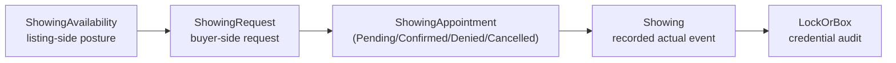
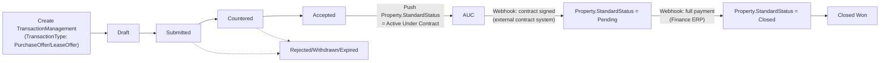
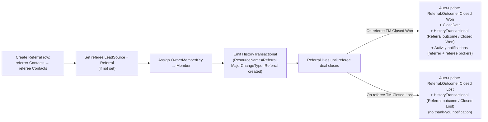

# Business processes

> Six top-level business processes, all built on canonical RESO DD 2.0 resources. `Lead`, `Opportunity`, `Offer`, `Contract`, `Commission`, `Payment Event` are **not** CRM data-model entities — they are either dissolved into the canonical model or realized through canonical `Property.StandardStatus` + `HistoryTransactional` + external integrations (see [wiki/integration.md](integration.md)).

## TOC

- [#contact-funnel](#contact-funnel)
- [#contact-relationship](#contact-relationship)
- [#property-matching](#property-matching)
- [#showing-process](#showing-process)
- [#offer-to-closing](#offer-to-closing)
- [#referral-lifecycle](#referral-lifecycle)

## Contact funnel — from inquiry to closing {#contact-funnel}

```mermaid
flowchart LR
  IN[Inbound: site / referral / campaign / event / partner / manual] --> CR[Create or find Contacts]
  CR -->|"Set ContactType=Lead<br/>LeadSource, OwnerMemberKey,<br/>ContactStatus=Active"| SLA[Start SLA timer]
  SLA --> DISC[Broker discovery]
  DISC -->|Qualified| GRAD["Graduate ContactType:<br/>Lead → Prospect → Ready to Buy → Buyer/Seller/..."]
  GRAD --> SS[Create N x SavedSearch + optional Prospecting]
  SS --> MATCH[Property matching → ContactListings]
  MATCH --> SHOW[Showing chain]
  SHOW --> TM[TransactionManagement: PurchaseOffer/LeaseOffer]
  TM --> CTR[External contract system → Property.StandardStatus AUC → Pending]
  CTR --> PAY[Finance ERP webhook → Property.StandardStatus Closed]
  PAY --> CWON[Closed Won]
```

- Inbound inquiry from the website, referral, campaign, event, partner, or manually.
- The system creates a `Contacts` record (or finds an existing one by email/phone/name) and sets:
  - `Contacts.ContactType = Lead` (multi-value RESO lookup);
  - `Contacts.LeadSource` (canonical RESO lookup);
  - `Contacts.OwnerMemberKey → Member` (responsible broker);
  - `Contacts.ContactStatus = Active`.
- SLA timer starts on first contact under the rule: `Contacts.ContactType = Lead AND no active SavedSearch+Prospecting`.
- Broker contacts the client and runs discovery.
- On qualification:
  - `Contacts.ContactType` graduates: Lead → Prospect → Ready to Buy → Buyer / Seller / Landlord / Tenant;
  - One or more `SavedSearch` rows are created with commercial parameters (budget / goal / target locations / type / timeline) as `SearchQuery` (OData filter) + `SearchQueryHumanReadable`;
  - Optionally `Prospecting` is activated (the auto-delivery + broker reminder schedule).
- Property matching and sending — see [#property-matching](#property-matching).
- Showings — canonical 5-resource Showing chain (see [#showing-process](#showing-process)); optionally grouped in a `Caravan`.
- Offer is recorded as `TransactionManagement` (`TransactionType`: PurchaseOffer / LeaseOffer); its lifecycle is expressed via `HistoryTransactional` rows and `Property.StandardStatus` transitions.
- Contract — external system (see [wiki/integration.md#contract-system](integration.md#contract-system)); CRM reacts to webhook → `Property.StandardStatus` (Active Under Contract → Pending → Closed) + `HistoryTransactional`.
- Payments — external Finance ERP (see [wiki/integration.md#finance-erp-payments](integration.md#finance-erp-payments)); CRM reacts to webhook → `Property.StandardStatus = Closed` + `HistoryTransactional`.
- **Closed Won** = `Property.StandardStatus = Closed` + an existing related `TransactionManagement` row + a fully completed payment cycle.
- **Closed Lost** = terminal refusal: `Prospecting.ActiveYN=false` for all of the contact's SavedSearches; reason recorded in `ContactListingNotes` or `HistoryTransactional`.
- **Nurturing** = `Prospecting.ActiveYN=false` but `Contacts.ContactStatus=Active`; long-term re-engagement.

Source: raw/context-v2.md §6.1, §9.4. KB process: [`canonical-processes/processes/lead-contact-lifecycle.md`](../../../business-processes/canonical-processes/processes/lead-contact-lifecycle.md).

## Contact relationship process {#contact-relationship}

- A `Contacts` record is created from an inbound inquiry, manually, or by import.
- `Contacts` carries only personal data and preferences: name, contacts, language, `PreferredCommunicationMethod`, lifestyle interests, family profile, privacy level, decision-maker role, tags, links to other `Contacts` (spouse, advisor, family office, assistant).
- Commercial parameters of the intent (budget, goal, target locations, type, timeline, decision criteria) are **not** stored on `Contacts` — they belong on `SavedSearch`.
- All communications and activities are attached to `Contacts` and, where commercial context applies, to the specific `SavedSearch` or `ContactListings`.
- One Contact can have multiple parallel active `SavedSearch` rows (residence + investment + relocation) — these are the "multiple parallel intents".
- After an active intent closes (`Property.StandardStatus = Closed` for the target property), the Contact continues to live as a long-term relationship: post-transaction follow-up, repeat deals, referrals.

Source: raw/context-v2.md §6.2.

## Property matching process {#property-matching}

- The broker opens a specific `SavedSearch` for the contact (not the Contact in general).
- CRM uses the parameters of `SavedSearch.SearchQuery` (budget / goal / target locations / type / bedrooms / timeline / decision criteria), enriched with lifestyle / family preferences from `Contacts`.
- CRM requests relevant properties from the Listing Module via an OData filter with access-rights enforcement (including off-market / private).
- The shortlist is persisted as a set of `ContactListings` rows:
  - broker shortlist → `ContactListingPreference = Possibility` (or none, waiting for client reaction);
  - client marks favorite → `ContactListingPreference = Favorite`;
  - client rejects → `ContactListingPreference = Discard`.
- Sending the shortlist to the client is recorded via `ContactListings.ListingSentTimestamp` + channel (email / WhatsApp / portal); optionally `Prospecting` is started for automatic periodic delivery.
- `Prospecting` runs on schedule (`NextSendTimestamp` + `ScheduleType`) and produces **two parallel effects**:
  1. If new / updated listings match `SavedSearch.SearchQuery` — a shortlist is assembled and `ContactListings` rows emitted; per `ConciergeYN`, auto-sent to client or reviewed by the broker first.
  2. **Independently of new listings** — an `Activity` row is created for `OwnerMemberKey → Member` (broker) as a touchpoint reminder to maintain regular contact-rhythm with the purchaser (relationship maintenance). See [wiki/requirements.md#fr-pros-prospecting](requirements.md#fr-pros-prospecting) FR-PROS-09..13, and [wiki/requirements.md#fr-act-activities](requirements.md#fr-act-activities) FR-ACT-11.
- Client opens a property online → `ContactListings.ListingViewedYN = true` + `PortalLastVisitedTimestamp`.
- Broker / client notes on the property — `ContactListingNotes`.

Source: raw/context-v2.md §6.3, §9.5a. KB process: [`canonical-processes/processes/prospecting-and-saved-search-delivery.md`](../../../business-processes/canonical-processes/processes/prospecting-and-saved-search-delivery.md).

## Showing process (5-resource chain) {#showing-process}

Canonical sequence of 5 resources:

1. **ShowingAvailability** — listing-side posture: the owner / listing agent publishes available slots and rules.
2. **ShowingRequest** — buyer-side request: a `Member` (showing agent) or a `Contacts` requests a showing.
3. **ShowingAppointment** — scheduled meeting with `ShowingAppointmentStatus` (Pending / Confirmed / Denied / Cancelled), `ShowingAgentKey → Member`.
4. **Showing** — recorded actual showing event after the meeting. `ShowingStartTimestamp`, `ShowingEndTimestamp`, `ShowingAgentKey`, `ListingKey → Property`.
5. **LockOrBox** — credential audit: lockbox / smart-key usage at the showing.

Gating: `Property.ShowingStatus` (Accepting Requests / On Hold / No Showings / Restricted Showings) and `Property.StandardStatus` (showing typically allowed only when Active / Active Under Contract, per policy).

Optional grouping: showings can be part of a `Caravan` (curated multi-property tour; see [wiki/entities.md#caravan](entities.md#caravan)).

After the showing: client feedback goes into `ContactListingNotes` for the relevant Contact × Listing pair; preference is updated (Favorite / Possibility / Discard). At high interest, a `TransactionManagement` row is created (PurchaseOffer / LeaseOffer).

Source: raw/context-v2.md §6.4. KB process: [`canonical-processes/processes/showing-lifecycle.md`](../../../business-processes/canonical-processes/processes/showing-lifecycle.md).

## Offer-to-Closing process {#offer-to-closing}

- Broker creates a `TransactionManagement` row with `TransactionType = PurchaseOffer` (or `LeaseOffer`), linked to `Contacts` and the target `Property`.
- Offer amount, currency, terms (deposit, payment terms, contingencies, validity period) are recorded on `TransactionManagement` + linked `Document` rows.
- Offer lifecycle is expressed via a sequence of `HistoryTransactional` rows on the TM record: Draft → Submitted → Countered → Accepted / Rejected / Withdrawn / Expired.
- When the offer is Accepted, CRM pushes to the Listing Module: `Property.StandardStatus = Active Under Contract` (see [wiki/integration.md#listing-module](integration.md#listing-module)).
- The contract is prepared and signed in the external contract system (see [wiki/integration.md#contract-system](integration.md#contract-system)). On the "signed" webhook → `Property.StandardStatus = Pending` + `HistoryTransactional` (`ChangeType = Pending`).
- Payment events arrive via webhook from Finance ERP (see [wiki/integration.md#finance-erp-payments](integration.md#finance-erp-payments)) → `Property.StandardStatus` transitions (deposit / partial → Pending; full → Closed) + `HistoryTransactional`.
- **Closed Won** = `Property.StandardStatus = Closed`, `CloseDate`, `ClosePrice`, `HistoryTransactional` (`ChangeType = Closed`).
- **Closed Lost** is possible at any stage — `HistoryTransactional` rows record the reason (lost reason); `Property.StandardStatus` returns to Active or transitions to Withdrawn depending on the situation.

Source: raw/context-v2.md §6.5. KB process: [`canonical-processes/processes/transaction-lifecycle.md`](../../../business-processes/canonical-processes/processes/transaction-lifecycle.md).

## Referral lifecycle {#referral-lifecycle}

`Referral` is a project-flavour entity (see [wiki/entities.md#referral](entities.md#referral)) capturing the act of one Contact recommending another.

- Creation: a `Referral` row links `Contacts` (referrer — who recommended) with `Contacts` (referee — who was recommended), with date and `ReferralType` (Client / Partner / Broker / Internal). `OwnerMemberKey → Member` is the broker who received the referral.
- On creation, the system auto-sets `Contacts.LeadSource = Referral` on the referee if not already set, and emits a `HistoryTransactional` row (`ResourceName = Referral`, `ResourceRecordKey = <ReferralKey>`, `MajorChangeType = Referral created`, `ChangeType = <ReferralType>`).
- Visibility: the referrer's contact card shows outgoing referrals (who and when they recommended, current referee `ContactType` graduation); the referee's contact card shows the source of the referral (who recommended, through which broker).
- **Closed Won propagation** (FR-REF-08): when a `HistoryTransactional` row with `MajorChangeType = Stage transition` / `ChangeType = Closed Won` is emitted for a `TransactionManagement` whose buyer/tenant `Contacts` is the referee of a `Referral`, the system MUST automatically:
  1. Update `Referral.Outcome = Closed Won` and `Referral.CloseDate = <ChangeTimestamp>`.
  2. Emit a `HistoryTransactional` row on `Referral` (`MajorChangeType = Referral outcome`, `ChangeType = Closed Won`).
  3. Create an `Activity` notification for `OwnerMemberKey` of the referrer-`Contacts` (for possible thank-you / referral-fee follow-up) and for `OwnerMemberKey` of the referee-`Contacts` (the broker who received the referral).
- **Closed Lost propagation**: symmetric, but no thank-you notification — used in referral-source analytics (FR-REF-06).

FRs: [wiki/requirements.md#fr-ref-referral](requirements.md#fr-ref-referral).

Source: raw/context-v2.md §9.11a, §11.6.
